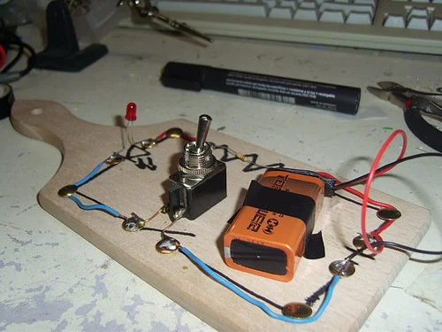
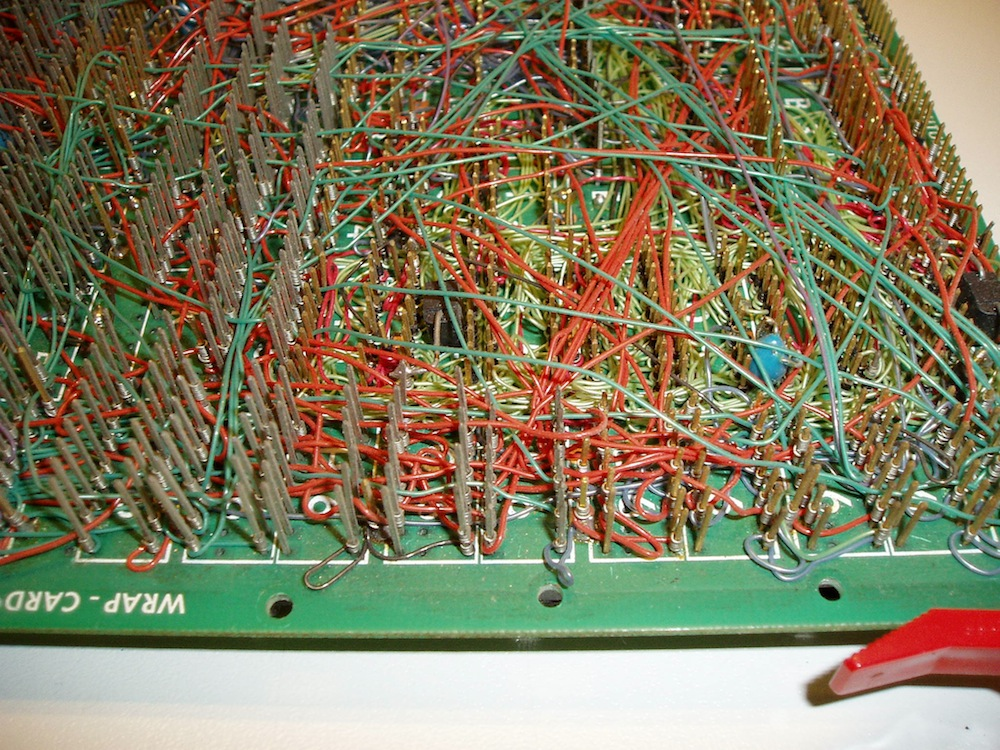
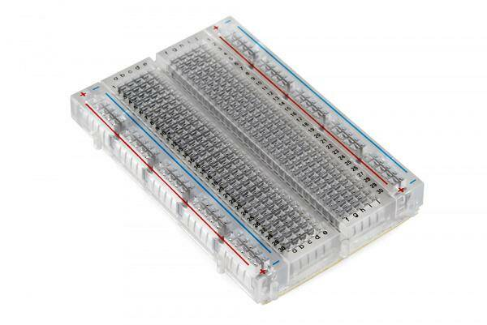

# Макетная плата перед пайкой
 
Когда схема придумана, прежде, чем паять, хочется проверить - как будет она работать или будет ли она работать вообще?

Да и часто хочется проверить не схему конечную целиком, а, просто, новую купленную деталь.

Cуществует понятие прототипирования электронной схемы - это когда моделируется, пробуется задуманная электронная схема, приводится к работающему варианту без окончательной пайки элементов.

Ранее (да и сейчас можно, как вариант) существовал способ предварительной сборки схемы на разделочной (или хлебной) доске: в неё молотком заколачивались гвозди или кнопки, к которым припаивались провода и элементы схемы.

"В древности", как мог бы сказать мой внук, а я видел своими глазами, когда только учился программированию "в кодах", как приходилось мучительно наматывать провода на установленные токопроводящие стержни и зажимать их винтами.

А сейчас для малоточных схем ... к которым относятся и наши схемы с ардуино существуют, я бы сказал: "ну, очень удобные" макетные платы ...

[здесь картинка макетной платы]

Такие макетные платы производятся следующим образом (состоят из следующих элементов)

Binding Posts – связующие стержни (клеммы)
DIP Support – разделительная дорожка (углубление, которое изолирует две стороны макетной доски) для электронных компонентов в дип-корпусах с расстоянием между ножками 2.54 мм (https://www.chipdip.ru/info/dip-package-import-integrated-circuits)
Terminal Strips - клеммные колодки (металлические вкладыши с пятью зажимами (клипсами)
Power Rails – направляющие (рельсы) питания

Зажимы клеммных колодок прячутся под пластиковыми отверстиями. Расстояния между отверстиями и, соответственно, зажимами составляет стандартный шаг 0,1 дюйма (2,54 мм). Эти зажимы позволяют вставлять провода или ножки электронных компонентов в открытые отверстия на макетной плате, которые затем и удерживают их на месте.

Для таких макетных плат может быть указан диапазон использования до напряжения 300 В и токов 3-5А. Можно в это не верить, но ясно, что наш диапазон до 12 В с токами до 500 мА - 1А будет годится совершенно точно. 

 
Макетные платы позволяют быстро и эффективно создать прототипы электронных компьютерных схем. На них размещены стандартные отверстия, которые позволяют интегральным схемам и другим компонентам плотно прилегать к плате. Для соединения размещенных компонентов используются соединительные провода. Эти так называемые “макетные платы без пайки”, или для краткости просто “макетные платы”, значительно упрощают создание прототипов схем.

Если взять полупрозрачную макетную плату, то видно, как она начинена множеством клеммных колодок с пятью зажимами.
Соединенные последовательно по краям платы колодки создают две рельсы для "+" контактов питания и две рельсы для "-" контактов. Эти направляющие обеспечивают легкий доступ к источнику питания в любом месте схемы, где бы это не понадобилось. Обычно они помечаются знаками "+" и "-" и имеют красную или синюю полосы, указывающую на "питание" или "землю", что очень удобно - можно спокойно ставить детали на плату, а потом подключить питание.

 Остальные колодки позволяют монтировать на них провода или контакты деталей с шагом 2.54 мм.

