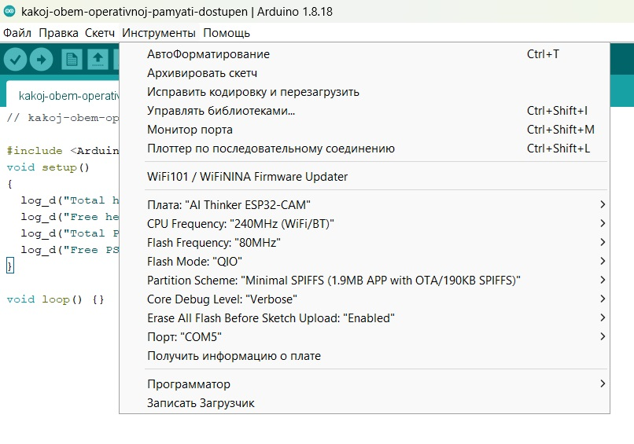

## [04-ESP32 Как узнать и как использовать PSRAM](https://thingpulse.com/esp32-how-to-use-psram/)

> **PSRAM расшифровывается как псевдостатическая оперативная память.**

### [Настрoйка таблицы разделов FLASH-памяти для ESP32](#%D0%BD%D0%B0%D1%81%D1%82%D1%80%D0%BE%D0%B9%D0%BA%D0%B0-%D1%82%D0%B0%D0%B1%D0%BB%D0%B8%D1%86%D1%8B-%D1%80%D0%B0%D0%B7%D0%B4%D0%B5%D0%BB%D0%BE%D0%B2-flash-%D0%BF%D0%B0%D0%BC%D1%8F%D1%82%D0%B8-%D0%B4%D0%BB%D1%8F-esp32)

### 2024-07-12

У ESP32 намного больше встроенной оперативной памяти, чем у ESP8266. Вы можете расширить ее еще больше, обратившись к 4 МБ внешней памяти SPI RAM. В этой статье вы узнаете, как использовать PSRAM в своих проектах.

Особенно при работе с графическими приложениями у вас никогда не бывает достаточно рабочей памяти. Например, наша библиотека [Minigrafx](https://github.com/ThingPulse/minigrafx) сначала выделяет буфер кадров в оперативной памяти. Тогда все операции рисования будут выполняться только в этой памяти. После того, как приложение закончит рисовать рамку, оно сообщает библиотеке записать полное содержимое буфера кадров на дисплей. Для дисплея с разрешением 320 × 240 пикселей и 16 бит информации о цвете на пиксель это составляет 150 КБ только для буфера кадров.

Оперативной памяти ESP8266 явно недостаточно для хранения такого объема информации в оперативной памяти. Вот почему мы использовали старый трюк, известный с первых домашних компьютеров, чтобы уменьшить количество информации о цвете на пиксель. Вместо 16-битного “True Color” мы используем палитру определенных цветов. Прежде чем библиотека запишет буфер кадров на дисплей, она ищет значение реального цвета и заменяет индекс палитры этим значением. При палитре из 4 цветов нам нужно всего 2 бита на пиксель (2 ^ 2) или примерно 19 КБ!

### ESP-WROVER-B: 8 МБ PSRAM?

Espressif, производитель ESP32, продает модуль под названием ESP-WROVER-B, и он часто рекламируется с 8 МБ PSRAM. Возможно, модуль и правда поставляется с внешним чипом PSRAM объемом 8 МБ, но на самом деле вы можете (в настоящее время?) использовать в своих приложениях только меньший объем 4 МБ. 

Не поймите меня неправильно, 4 МБ ОЗУ - это все еще много для микроконтроллера, но реклама размером 8 МБ немного вводит в заблуждение.

Если верить описанию внешней PSRAM от Espressif, то ограничение в 4 МБ скорее основано на ограничениях кремния, чем на ограничениях фреймворка ESP-IDF. На странице указано “Ввода-вывода этого может быть недостаточно для некоторых целей, поэтому ESP32 также может использовать до 4 МБ внешней памяти SPI RAM”. Это больше похоже на жесткое ограничение, а не на то, которое вскоре будет устранено в ходе дальнейшей работы над SDK.

### Какой объем оперативной памяти доступен?

Итак, как вы используете это внешнее ОЗУ? Прежде чем мы перейдем к этому, давайте убедимся, что наш модуль ESP32 имеет это внешнее PSRAM и что оно адресуемо из нашего кода. Платформа ESP32 / Arduino предоставляет несколько методов, позволяющих узнать, сколько у вас всего оперативной памяти и сколько вы можете использовать.

Обратите внимание, что я использую [макрос ведения журнала, log_d(..)](https://thingpulse.com/esp32-logging/) который позволяет нам позже отключить вывод журнала. Если мы запустим этот код в Arduino IDE со следующими настройками в меню инструментов. Особенно убедитесь, что ***для основного уровня отладки установлено значение Verbose***.



Запуск кода c ***ESP32-CAM*** показывает нам следующие строки на последовательном мониторе:

```
ets Jun  8 2016 00:22:57

rst:0x1 (POWERON_RESET),boot:0x13 (SPI_FAST_FLASH_BOOT)
configsip: 0, SPIWP:0xee
clk_drv:0x00,q_drv:0x00,d_drv:0x00,cs0_drv:0x00,hd_drv:0x00,wp_drv:0x00
mode:DIO, clock div:1
load:0x3fff0030,len:1448
load:0x40078000,len:14844
ho 0 tail 12 room 4
load:0x40080400,len:4
load:0x40080404,len:3356
entry 0x4008059c
[     1][V][esp32-hal-periman.c:235] perimanSetBusDeinit(): Deinit function for type UART_RX (2) successfully set to 0x400d3a88
[    12][V][esp32-hal-periman.c:235] perimanSetBusDeinit(): Deinit function for type UART_TX (3) successfully set to 0x400d3a58
[    26][V][esp32-hal-periman.c:235] perimanSetBusDeinit(): Deinit function for type UART_CTS (4) successfully set to 0x400d3a28
[    39][V][esp32-hal-periman.c:235] perimanSetBusDeinit(): Deinit function for type UART_RTS (5) successfully set to 0x400d39f8
[    53][V][esp32-hal-periman.c:235] perimanSetBusDeinit(): Deinit function for type UART_RX (2) successfully set to 0x400d3a88
[    66][V][esp32-hal-periman.c:235] perimanSetBusDeinit(): Deinit function for type UART_TX (3) successfully set to 0x400d3a58
[    79][V][esp32-hal-periman.c:235] perimanSetBusDeinit(): Deinit function for type UART_CTS (4) successfully set to 0x400d3a28
[    93][V][esp32-hal-periman.c:235] perimanSetBusDeinit(): Deinit function for type UART_RTS (5) successfully set to 0x400d39f8
[   106][V][esp32-hal-periman.c:235] perimanSetBusDeinit(): Deinit function for type UART_RX (2) successfully set to 0x400d3a88
[   120][V][esp32-hal-periman.c:235] perimanSetBusDeinit(): Deinit function for type UART_TX (3) successfully set to 0x400d3a58
[   133][V][esp32-hal-periman.c:235] perimanSetBusDeinit(): Deinit function for type UART_CTS (4) successfully set to 0x400d3a28
[   147][V][esp32-hal-periman.c:235] perimanSetBusDeinit(): Deinit function for type UART_RTS (5) successfully set to 0x400d39f8
[   162][D][esp32-hal-cpu.c:264] setCpuFrequencyMhz(): PLL: 480 / 2 = 240 Mhz, APB: 80000000 Hz
[   614][I][esp32-hal-psram.c:90] psramInit(): PSRAM enabled
[   637][V][esp32-hal-periman.c:160] perimanSetPinBus(): Pin 3 successfully set to type UART_RX (2) with bus 0x3ffbdb60
[   648][V][esp32-hal-periman.c:160] perimanSetPinBus(): Pin 1 successfully set to type UART_TX (3) with bus 0x3ffbdb60
=========== Before Setup Start ===========
Chip Info:
------------------------------------------
  Model             : ESP32
  Package           : D0WD-Q5
  Revision          : 100
  Cores             : 2
  Frequency         : 240 MHz
  Embedded Flash    : No
  Embedded PSRAM    : No
  2.4GHz WiFi       : Yes
  Classic BT        : Yes
  BT Low Energy     : Yes
  IEEE 802.15.4     : No
------------------------------------------
INTERNAL Memory Info:
------------------------------------------
  Total Size        :   386756 B ( 377.7 KB)
  Free Bytes        :   356672 B ( 348.3 KB)
  Allocated Bytes   :    23016 B (  22.5 KB)
  Minimum Free Bytes:   351020 B ( 342.8 KB)
  Largest Free Block:   118772 B ( 116.0 KB)
------------------------------------------
SPIRAM Memory Info:
------------------------------------------
  Total Size        :  4194304 B (4096.0 KB)
  Free Bytes        :  4192124 B (4093.9 KB)
  Allocated Bytes   :        0 B (   0.0 KB)
  Minimum Free Bytes:  4192124 B (4093.9 KB)
  Largest Free Block:  4128756 B (4032.0 KB)
  Bus Mode          : QSPI
------------------------------------------
Flash Info:
------------------------------------------
  Chip Size         :  4194304 B (4 MB)
  Block Size        :    65536 B (  64.0 KB)
  Sector Size       :     4096 B (   4.0 KB)
  Page Size         :      256 B (   0.2 KB)
  Bus Speed         : 80 MHz
  Bus Mode          : QIO
------------------------------------------
Partitions Info:
------------------------------------------
                nvs : addr: 0x00009000, size:    20.0 KB, type: DATA, subtype: NVS
            otadata : addr: 0x0000E000, size:     8.0 KB, type: DATA, subtype: OTA
               app0 : addr: 0x00010000, size:  1920.0 KB, type:  APP, subtype: OTA_0
               app1 : addr: 0x001F0000, size:  1920.0 KB, type:  APP, subtype: OTA_1
             spiffs : addr: 0x003D0000, size:   128.0 KB, type: DATA, subtype: SPIFFS
           coredump : addr: 0x003F0000, size:    64.0 KB, type: DATA, subtype: COREDUMP
------------------------------------------
Software Info:
------------------------------------------
  Compile Date/Time : Jul 12 2024 13:49:08
  Compile Host OS   : windows
  ESP-IDF Version   : v5.1.4-51-g442a798083-dirty
  Arduino Version   : 3.0.1
------------------------------------------
Board Info:
------------------------------------------
  Arduino Board     : ESP32_DEV
  Arduino Variant   : esp32
  Arduino FQBN      : esp32:esp32:esp32cam:
  
        CPUFreq=240,
        FlashMode=qio,
        PartitionScheme=min_spiffs,
        FlashFreq=80,
        DebugLevel=verbose,
        EraseFlash=all
        
============ Before Setup End ============
[  1195][D][kakoj-...-dostupen.ino:6] setup(): Total heap:   386756
[  1203][D][kakoj-...-dostupen.ino:7] setup(): Free heap:    356320
[  1213][D][kakoj-...-dostupen.ino:8] setup(): Total PSRAM: 4194304
[  1223][D][kakoj-...-dostupen.ino:9] setup(): Free PSRAM:  4192124
=========== After Setup Start ============
INTERNAL Memory Info:
------------------------------------------
  Total Size        :   386756 B ( 377.7 KB)
  Free Bytes        :   356320 B ( 348.0 KB)
  Allocated Bytes   :    23272 B (  22.7 KB)
  Minimum Free Bytes:   350648 B ( 342.4 KB)
  Largest Free Block:   118772 B ( 116.0 KB)
------------------------------------------
SPIRAM Memory Info:
------------------------------------------
  Total Size        :  4194304 B (4096.0 KB)
  Free Bytes        :  4192124 B (4093.9 KB)
  Allocated Bytes   :        0 B (   0.0 KB)
  Minimum Free Bytes:  4192124 B (4093.9 KB)
  Largest Free Block:  4128756 B (4032.0 KB)
------------------------------------------
GPIO Info:
------------------------------------------
  GPIO : BUS_TYPE[bus/unit][chan]
  --------------------------------------  
     1 : UART_TX[0]
     3 : UART_RX[0]
============ After Setup End =============
```
Отлично! Вывод журнала сообщает нам, что PSRAM включен и что у нас доступно 4 МБ PSRAM. 

### [Настройка таблицы разделов FLASH-памяти для ESP32](https://kotyara12.ru/iot/esp32_flash/)

> Что делать после перезагрузки или выключения и включения устройства? Где хранить последние установленные значения на ESP?
> 
> Нужно воспользоваться свободным пространством на встроенном в модуль ESP разделе flash-памяти - NVS.


