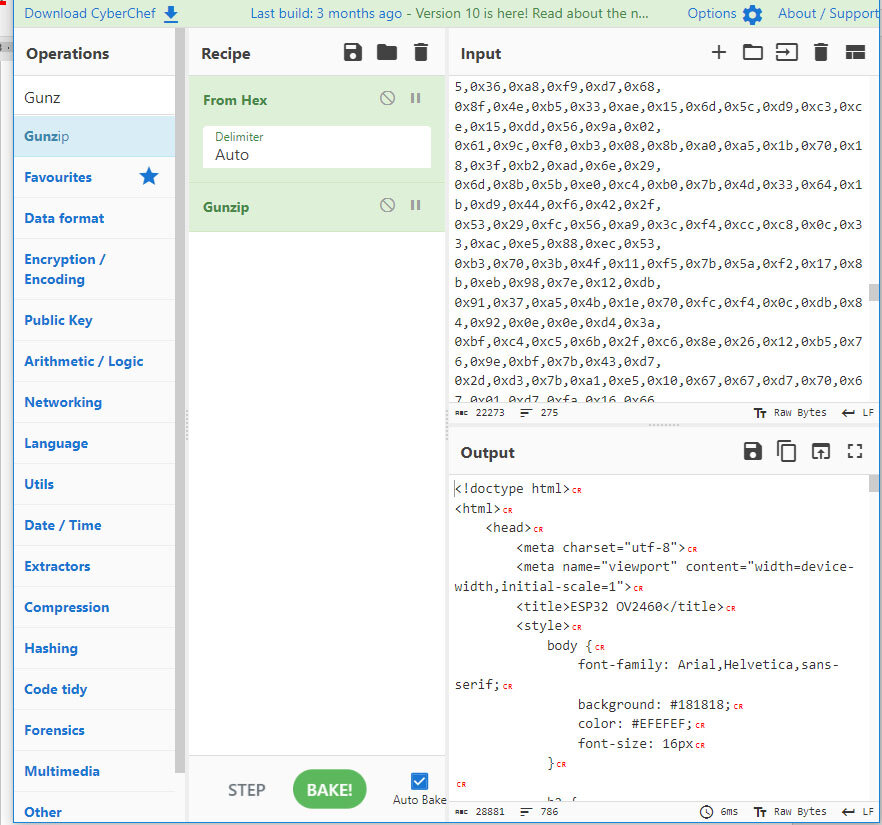
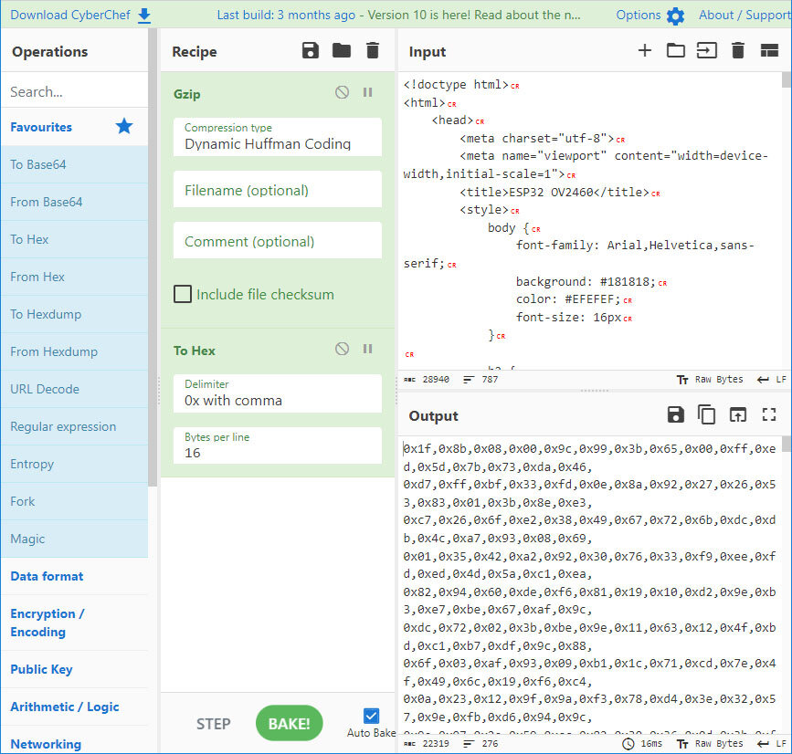
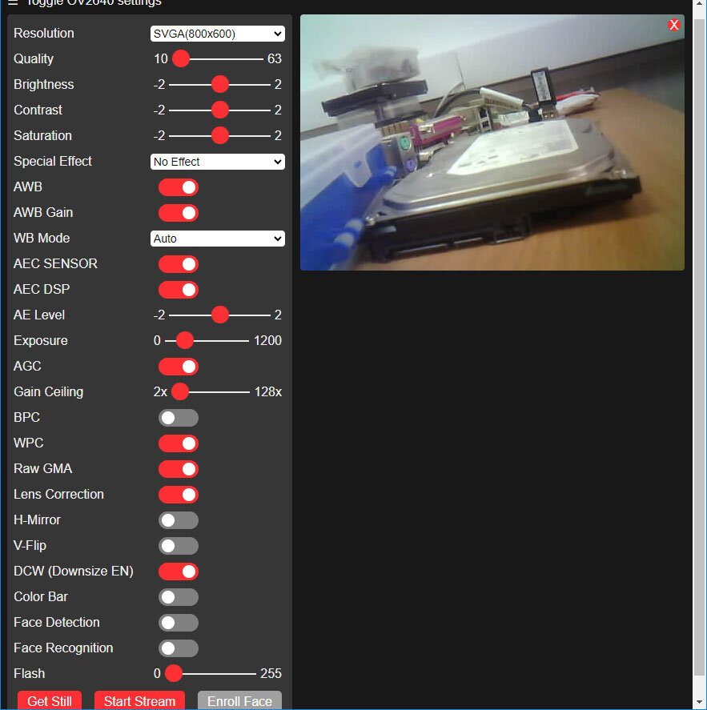

## [Как изменить яркость вспышки на 4 пине esp32-cam](#)

### Управление светодиодом в CameraDachServer

#### HTML:
```
<div class="input-group" id="led-group">
<label for="led_intensity">LED4 Intensity</label>
  <div class="range-min">0</div>
  <input type="range" id="led_intensity" min="0" max="255" value="0" class="default-action">
  <div class="range-max">255</div>
</div>
```
#### CSS:
```

```

#### JS

```

```


### [Рекомендации для приложения камеры ESP32](https://docs.espressif.com/projects/esp-faq/en/latest/application-solution/camera-application.html)

### [5 экспериментов с WiFi на ESP32](https://habr.com/ru/articles/504514/)

### [ESP32-CAM. Регулировка яркости светодиода](https://dzen.ru/a/ZTug1nOlQxoHeEGK)

Рассмотрим, как в стандартный пример CameraWebServer добавить ползунок для управления яркостью светодиода - вспышки.

В примере нам нужно поправить два файла.

app_httpd.cpp – это сама программа управления платой

camera_index.h – хранит HTML файл страницы управления камерой через браузер.

Сначала на HTML страницу добавляем ползунок для управления яркостью светодиода.

Приводим к читаемому виду значения из массива index_ov2640_html_gz[] через сайт [https://gchq.github.io/CyberChef/](https://gchq.github.io/CyberChef/) или скачанный локальный сайт.

В окно Input копируем значения массива. В окно Recipe добавляем команды:

From_Hex('Auto')

Gunzip()

В окне Output результат:



Добавляем объект-ползунок с название flash:


Добавляем объект-ползунок с название flash:

Конвертируем обратно полученный результат с помощью команд:

Gzip('Dynamic Huffman Coding','','',false)

To_Hex('0x with comma',16)



Из окна Output копируем обратно в массив index_ov2640_html_gz[]

Изменяем строчку:

```
#define index_ov2640_html_gz_len 4400
```

Заменяем число на количество элементов в нашем массиве. Сохраняем файл camera_index.h

Теперь нужно добавить обработку изменений ползунка flash.

Изменяем файл app_httpd.cpp

1. В заголовке задаем значения по умолчанию

```
// номер вывода светодиода
#define LED_BUILTIN 4

// номер канала управления яркостью
const int ledChannel = 15;

// текущее состояние ползунка
static int8_t flash_enabled = 0;
```

2. В функцию esp_err_t status_handler(httpd_req_t *req) добавляем текущее состояние ползунка:

```
p+=sprintf(p, "\"flash\":%u,", flash_enabled);
```

3. В функцию startCameraServer() добавляем инициализацию портов:

```
ledcSetup(ledChannel, 5000, 8);
ledcAttachPin(LED_BUILTIN, ledChannel);
```

4. В функцию esp_err_t cmd_handler(httpd_req_t *req) добавляем обработчик события изменения состояния ползунка:

```
else if(!strcmp(variable, "flash")) 
{
  flash_enabled = val;
  // светим с заданной яркостью
  ledcWrite(ledChannel, val);
}

```
Сохраняем. Заливаем прошивку на плату.

Результат:



Появился ползунок для управления яркостью светодиода.

---

2026-02-25 Выполнялась модификация CameraWebServer на основании статьи, успешно.

Скачан zip-файл программы CyberChef:

"CyberChef полностью работает в вашем браузере без использования серверных компонентов. Это означает, что ваши входные данные и конфигурация рецепта никуда не передаются, независимо от того, используете ли вы официальную версию CyberChef или загруженную автономную версию (при условии, что она не подвергалась изменениям).

Есть три операции, которые вызывают внешние службы, это операция "Показать на карте", которая загружает фрагменты карты из wikimedia.org , операция "DNS через HTTPS", которая разрешает DNS-запросы с использованием сервисов Google или Cloudflare, и операция "HTTP-запрос", которая обращается к введенному вами настроенному URL-адресу. Вы можете подтвердить, какая сеть rвыполнены настройки, используя консоль разработчика вашего браузера (F12) и просматривая вкладку Сеть.

Если вы хотите загрузить автономную копию CyberChef для работы в изолированной сети или в условиях ограниченного доступа к интернету или его отсутствия, вы можете скачать ZIP-файл со всем веб-приложением по ссылке ниже. Его можно запустить локально или разместить на веб-сервере без какой-либо настройки.

Имейте в виду, что автономная версия никогда не обновляется автоматически, то есть не получает исправления ошибок и новые функции, пока вы не загрузите новые версии вручную.

CyberChef v10.22.1
Время сборки: 24.02.2026, 09:05:50 UTC
Список изменений в этой версии можно посмотреть здесь
© Crown Copyright 2016-2026
Распространяется по лицензии Apache, версия 2.0
Хэш SHA256: 8a84bb2b5929212bbb9ce0b5d85ecc0514e83a41d9a3ea4ff546c524b44276bb

#### [Использование широтно-импульсной модуляции (ШИМ) в ESP32](https://microkontroller.ru/esp32-projects/ispolzovanie-shirotno-impulsnoj-modulyaczii-shim-v-esp32/)

#### [Change ESP32-CAM OV2640 Camera Settings: Brightness, Resolution, Quality, Contrast, and More](https://randomnerdtutorials.com/esp32-cam-ov2640-camera-settings/)


