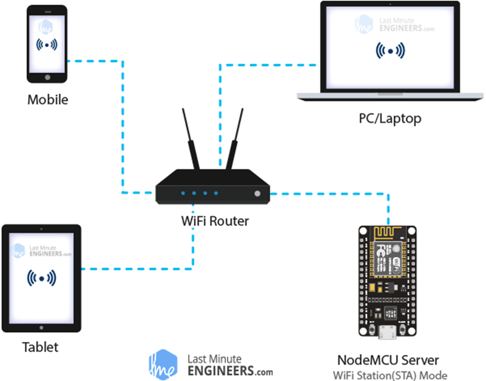
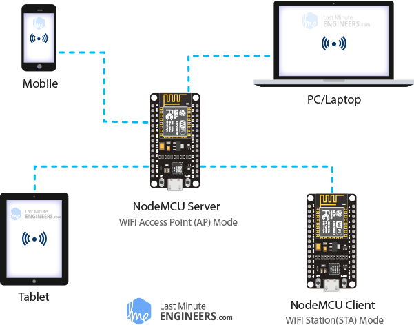

## [Поиск "Передача данных с ESP32 на сайт"](#)

#### [https://esp32io.com/tutorials/esp32-http-request](https://esp32io.com/tutorials/esp32-http-request)

#### [HTTP запросы на ESP8266 и ESP32](https://dzen.ru/a/Y4ZPGDd2yFJPETUZ)

## [Поиск "Парсим сайты с помощью ESP32"](#)

### [ESP32: Веб-клиент](https://developer.alexanderklimov.ru/arduino/esp32/webclient.php)

[GET-запрос к странице сайта](get-zapros-k-stranice-sajta/get-zapros-k-stranice-sajta.ino)

Плата ESP32 может работать как веб-клиент и подключаться к указанным веб-адресам. Таким образом мы получаем своеобразный текстовый браузер. В скетче не подключал библиотеку WiFi.h, однако код компилировался. Но лучше добавить библиотеку, чтобы быть уверенным в коде.

Открываем Serial Monitor и смотрим содержимое указанной страницы.
В примере использовался простой GET-запрос.

### [Веб-сервер ESP32 (ESP8266) в среде Arduino IDE](https://arduino-tex.ru/news/15/urok-1-veb-server-esp32-esp8266-v-srede-arduino-ide.html)

Веб-сервер - это место, где хранятся, обрабатываются и отсылаются веб-страницы веб-клиентам. Веб-клиент - это не что иное, как веб-браузер на наших ноутбуках и смартфонах. Связь между клиентом и сервером происходит с использованием специального протокола, называемого протоколом передачи гипертекста (HTTP).

В этом протоколе клиент инициирует связь, отправляя запрос на конкретную веб-страницу с помощью HTTP, а сервер отдает содержимое этой веб-страницы, или сообщение об ошибке, если не может этого сделать (например: страница не найдена, ошибка 404). Страницы, которые отдает сервер, в основном представляют собой HTML-документы.

#### Режимы работы ESP32.

Одна из особенностей ESP32 заключается в том, что он может не только подключаться к существующей сети Wi-Fi и действовать как веб-сервер, но также может настраивать собственную сеть, позволяя другим устройствам напрямую подключаться к ней и получать доступ к веб-страницам. Это возможно, потому что ESP32 работает в трех разных режимах: режим станции (STA), режим точки доступа (AP) и оба режима одновременно.

В режиме станции (STA) ESP32 (ESP8266) подключается к существующей сети Wi-Fi, созданной вашим беспроводным маршрутизатором. 

ESP32 (ESP8266) получает IP от маршрутизатора, к которому он подключен. С этим IP-адресом он может настроить веб-сервер и отдавать веб-страницы на все подключенные устройства в существующей сети Wi-Fi.
 
 
 
#### Принцип управления устройствами через веб-сервер ESP32.
 
Когда вводите URL-адрес в веб-браузере и нажимаете ENTER, браузер отправляет HTTP-запрос (также известный как запрос GET) на веб-сервер. Задача веб-сервера - обработать этот запрос, сделав что-нибудь. Возможно, вы уже догадались, что мы собираемся контролировать устройство, обращаясь к определенному URL-адресу. Например, предположим, что мы ввели URL-адрес типа ***http://192.168.1.1/ledon*** в браузере. Затем браузер отправляет HTTP-запрос в ESP32 для обработки этого запроса. Когда ESP32 читает этот запрос, он знает, что пользователь хочет включить светодиод. Таким образом, он включает светодиод и отдает динамическую веб-страницу в браузер, показывая состояние светодиода: ВКЛ. Не так все это и сложно!

[ESP32: лампочки в собственной сети WiFi](esp32-sobstvennaya-set-wi-fi/esp32-sobstvennaya-set-wi-fi.ino)

### [Получаем курс валют на ESP32 с сайта Центробанка России](https://dzen.ru/a/X5hGTVFCSW3RgxDN)

#### [ESP32 HTTP GET with Arduino IDE (OpenWeatherMap.org and ThingSpeak)](https://randomnerdtutorials.com/esp32-http-get-open-weather-map-thingspeak-arduino/)

#### [HabraTab — девайс для хаброзависимых](https://habr.com/ru/articles/712114/)

#### [Хостинг веб-страницы с помощью ESP32 и SD-карты](http://digitrode.ru/computing-devices/mcu_cpu/2565-hosting-veb-stranicy-s-pomoschyu-esp32-i-sd-karty.html)

#### [ESP32 Web Server with Arduino IDE – Full Guide with Examples](https://electropeak.com/learn/create-a-web-server-w-esp32/)
