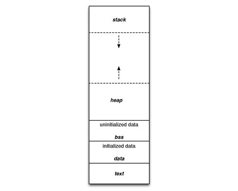

## [Разные системные API для ESP32](#)

---

### [Miscellaneоus System APIs - разные системные API-интерфейсы](#miscellaneous-system-apis)

### [Распределениe памяти в ESP32](#%D1%80%D0%B0%D1%81%D0%BF%D1%80%D0%B5%D0%B4%D0%B5%D0%BB%D0%B5%D0%BD%D0%B8%D0%B5-%D0%BF%D0%B0%D0%BC%D1%8F%D1%82%D0%B8-%D0%B2-esp32)


---

### [Miscellaneous System APIs](https://docs.espressif.com/projects/esp-idf/en/latest/esp32/api-reference/system/misc_system_api.html#_CPPv411esp_restartv)

#### Сброс программного обеспечения

Для выполнения программного сброса чипа предусмотрена функция ***esp_restart()***. При вызове функции выполнение программы останавливается, оба процессора сбрасываются, приложение загружается загрузчиком и снова начинает выполнение.

Кроме того, ***esp_register_shutdown_handler()*** функция может зарегистрировать процедуру, которая будет автоматически вызываться перед перезапуском (который запускается esp_restart()). 

[void esp_restart(void)]()

Перезапустить процессоры PRO и APP.

> *PRO и APP - так называются два ядра: core 0 - PRO, core 1 - APP.*
> 
> *Это устаревшие названия. Первоначальный дизайн ESP32 предусматривал асимметричную многопроцессорную настройку, при которой в CPU0 запускался весь код обработки протокола, в то время как приложение работало бы на CPU1. Позже мы изменили это на симметричную многопроцессорную настройку, и на данный момент два процессора (за очень немногими небольшими исключениями) полностью взаимозаменяемы.*
> 
> *Опции, которые вы можете использовать для перемещения различных системных задач между двумя ядрами:*
> 
> *CONFIG_BTDM_CONTROLLER_PINNED_TO_CORE_CHOICE*
> 
> *CONFIG_BLUEDROID_PINNED_TO_CORE_CHOICE*
> 
> *CONFIG_TCPIP_TASK_AFFINITY*
> 
> *CONFIG_ESP32_WIFI_TASK_CORE_ID*
>

Эта функция может вызываться как с процессоров PRO, так и с процессоров APP. После успешного перезапуска причиной сброса процессора будет SW_CPU_RESET. Периферийные устройства (за исключением Wi-Fi, BT, UART0, SPI1 и устаревших таймеров) не сбрасываются. Значение функцией не возвращается.

[esp_reset_reason_t esp_reset_reason(void)]()

Получить причину последнего сброса. Возвращается ***esp_reset_reason_t***:

```
enumerator ESP_RST_UNKNOWN
Невозможно определить причину сброса.

enumerator ESP_RST_POWERON
Сброс из-за события включения питания.

enumerator ESP_RST_EXT
Сброс с помощью внешнего PIN-кода (не применимо для ESP32)

enumerator ESP_RST_SW
Сброс программного обеспечения через esp_restart.

enumerator ESP_RST_PANIC
Сброс программного обеспечения из-за исключения / паники.

enumerator ESP_RST_INT_WDT
Сброс (программный или аппаратный) из-за сторожевого таймера прерывания.

enumerator ESP_RST_TASK_WDT
Сброс из-за диспетчера задач.

enumerator ESP_RST_WDT
Сброс из-за других сторожевых псов.

enumerator ESP_RST_DEEPSLEEP
Сброс после выхода из режима глубокого сна.

enumerator ESP_RST_BROWNOUT
Сброс отключения (программный или аппаратный)

enumerator ESP_RST_SDIO
Сброс через SDIO.

enumerator ESP_RST_USB
Сброс с помощью периферийного устройства USB.

enumerator ESP_RST_JTAG
Сброс с помощью JTAG.

enumerator ESP_RST_EFUSE
Сброс из-за ошибки efuse.

enumerator ESP_RST_PWR_GLITCH
Сброс из-за обнаруженного сбоя питания.

enumerator ESP_RST_CPU_LOCKUP
Сброс из-за блокировки процессора.

```
###### [в начало](#%D1%80%D0%B0%D0%B7%D0%BD%D1%8B%D0%B5-%D1%81%D0%B8%D1%81%D1%82%D0%B5%D0%BC%D0%BD%D1%8B%D0%B5-api-%D0%B4%D0%BB%D1%8F-esp32)

---

### [Распределение памяти в ESP32](https://kotyara12.ru/iot/esp32_memory/)

Приложения ESP32 используют общие шаблоны компьютерной архитектуры:

***стек*** – динамическая память, автоматически выделяемая потоком управления программой,

***heap или куча*** – динамическая память, выделяемая вызовами функций malloc и calloc,

***статическая память*** – память, выделяемая под переменные во время компиляции.

При этом сам микроконтроллер ESP32 имеет на борту несколько типов оперативной памяти ( RAM ):

***DRAM (ОЗУ данных)*** — это память, которая подключена к шине данных ЦП и используется для хранения данных. Это наиболее распространенный вид памяти, доступ к которому осуществляется в виде кучи и стека. При запуске куча DRAM содержит всю память данных, которая не выделена приложением статически. Уменьшение статически выделяемых буферов увеличивает объем доступной свободной кучи и наоборот.

***IRAM (ОЗУ инструкций)*** — это память, которая подключена к шине инструкций ЦП и обычно содержит только исполняемые данные (т. е. инструкции, или скомпилированная программа). Важно понимать: в этой части оперативной памяти находится не вся ваша программа, а только отдельные функции, помещенные атрибутом IRAM_ATTR, а весь остальной код находится во flash-памяти и вызывается прямо оттуда. Однако её в некоторых случаях можно использовать и в качестве обычной памяти. Если доступ к IRAM осуществляется как доступ к общей памяти, все обращения должны быть в  32-битных единицах. 

D/IRAM — это ОЗУ, которое подключено к шине данных ЦП и шине инструкций, поэтому может использоваться как ОЗУ инструкций, так и ОЗУ данных. 

Также к ESP32 можно подключить внешнюю SPI RAM. Внешняя оперативная память интегрирована в карту памяти ESP32 через кеш в DRAM, и доступ к ней осуществляется аналогично DRAM. Такая память установлена в модулях серии ESP32-WROVER и на плате ESP32-CAM.

Если обратиться к спецификациям на ESP32, то можно увидеть, что данный микроконтроллер имеет несколько разных типов оперативной памяти ( RAM ). Например для модуля ESP32-WROOM-32D/U ( ESP32-D0WD-V3 ) это выглядит примерно так:

```
520 КБ встроенной SRAM для данных и инструкций

8 КБ SRAM в RTC, которая называется RTC FAST Memory и может использоваться основным процессором во время загрузки RTC из режима глубокого сна

8 КБ SRAM в RTC, которая называется RTC SLOW Memory и может быть доступна только сопроцессору ULP в режиме глубокого сна

1 Кбит eFuse: 
256 бит используются для системы (MAC-адрес и конфигурация чипа), 
768 бит зарезервированы для клиентских приложений, включая флэш-шифрование и идентификатор чипа
```
> Для большинства приложений, мы можем использовать только первый тип RAM – ***520 КБ встроенной SRAM***. 
> 
> ***Это именно общий размер памяти MEMORY_CAP_DEFAULT (тип памяти при вызове malloc(), calloc())***, в том числе выделяемый и для нужд FreeRTOS. Куда делись около 200 КБ памяти!!!??? Дело в том, что общий блок памяти 520 КБ делится на два:
> 
***IRAM 192 КБ*** – Instruction RAM (сегмент кода, также называемый текстовым сегментом, в котором скомпилированная программа находится в памяти)

> ***DRAM 328 КБ*** – Data RAM (используется для BSS, данных, кучи)

***То есть на самом деле для размещения данных доступно только 328 КБ. DRAM распределяется следующим образом:***
> 
```
Первые 8 КБ используются в качестве памяти данных для некоторых функций ПЗУ

Затем компоновщик помещает инициализированный сегмент данных после этой первой памяти объемом 8 КБ

Далее следуют сегмент BSS («block started by symbol», также называемый сегментом неинициализированных данных, где хранятся глобальные и статические переменные с нулевой инициализацией)

Сегмент данных (также называемый сегментом инициализированных данных, где хранятся инициализированные глобальные и статические переменные)

Память, оставшаяся после выделения данных и сегментов BSS, настроена на использование в виде кучи. Вот где обычно происходит динамическое распределение памяти

Стек вызовов, в котором хранятся параметры функций, локальные переменные и другая информация, относящаяся к функциям
```



#### А что с PROGMEM?

На Arduino макросы препроцессора PROGMEM, PSTR и F заставляют компоновщик изменять место хранения переменной в программе. Например PROGMEM помещает переменную во FLASH память. А что с ними на ESP32?

> А на ESP32 макросы PROGMEM, PSTR и F отсутствуют!

В avr-gcc все данные (в том числе и static const) по умолчанию размещаются в SRAM. А так как размер RAM в avr очень маленький, то использовался атрибут PROGMEM, который позволял разместить static const данные во flash (но при этом при непосредственном использовании все равно происходило копирование в SRAM – pgm_read….).

В ESP32 весь код по умолчанию размещается уже в external flash, кроме того в external flash размещаются все static const данные (при этом обращение к этим данным происходит непосредственно без всяких pgm_read), и таким образом атрибут PROGMEM становится ненужным.

Однако возникает противоположная проблема – в определенных режимах (например в обработчиках прерываний и т.д.) external flash недоступен, поэтому код, который работает в таких режимах должен быть размещен в SRAM (конкретно в IRAM). Для этого используется атрибут IRAM_ATTR. Код функций помеченный этим аттрибутом, будет размещен в IRAM. 

Однако размещение кода в IRAM не гарантирует также и размещение данных в RAM, т.е. например если внутри функции помеченной атрибутом IRAM_ATTR у нас будет static const массив, то этот массив компилятор все равно сможет разместить в external flash. Для того чтобы этого избежать и явно указать компилятору что static const данные нужно тоже размещать в RAM (конкретно в DRAM) используется атрибут DRAM_ATTR.

> ***Все доступные для ESP32 атрибуты размещены в файле esp_attr.h***


###### [в начало](#%D1%80%D0%B0%D0%B7%D0%BD%D1%8B%D0%B5-%D1%81%D0%B8%D1%81%D1%82%D0%B5%D0%BC%D0%BD%D1%8B%D0%B5-api-%D0%B4%D0%BB%D1%8F-esp32)

---

### [ICMP Echo - последняя стабильная версия на 2024-07-29](https://docs.espressif.com/projects/esp-idf/en/v5.3/esp32/api-reference/protocols/icmp_echo.html)


### [ESP32Ping](https://github.com/marian-craciunescu/ESP32Ping)

