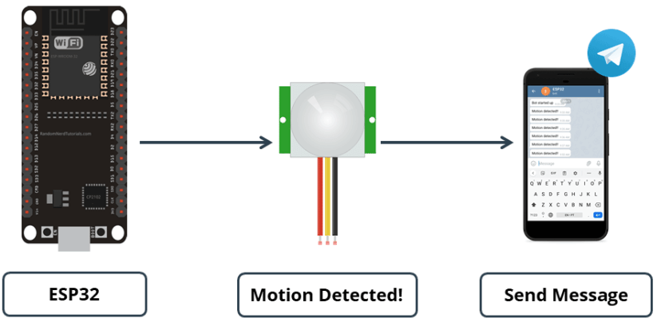
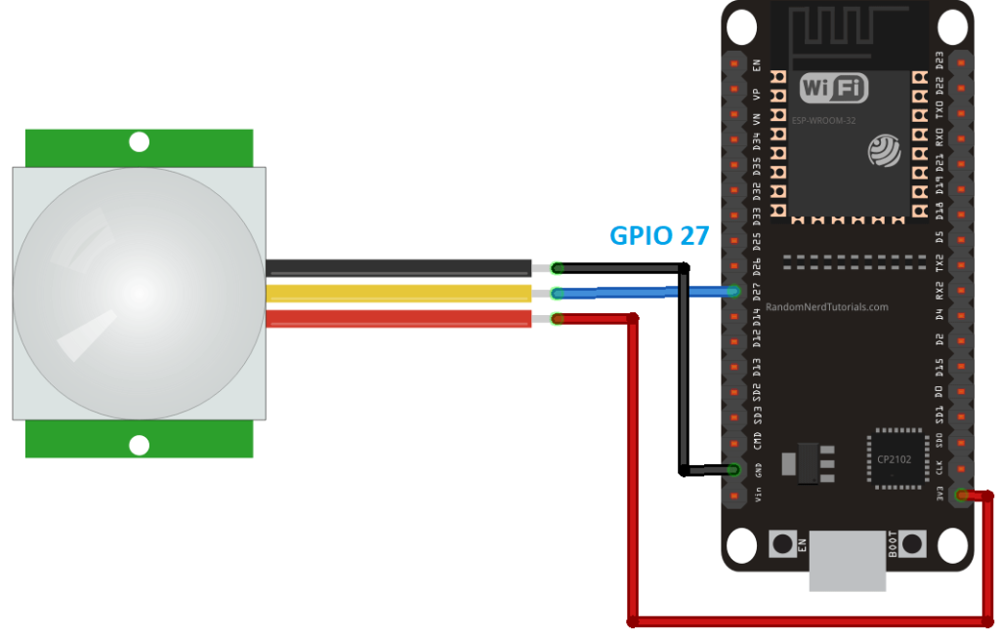
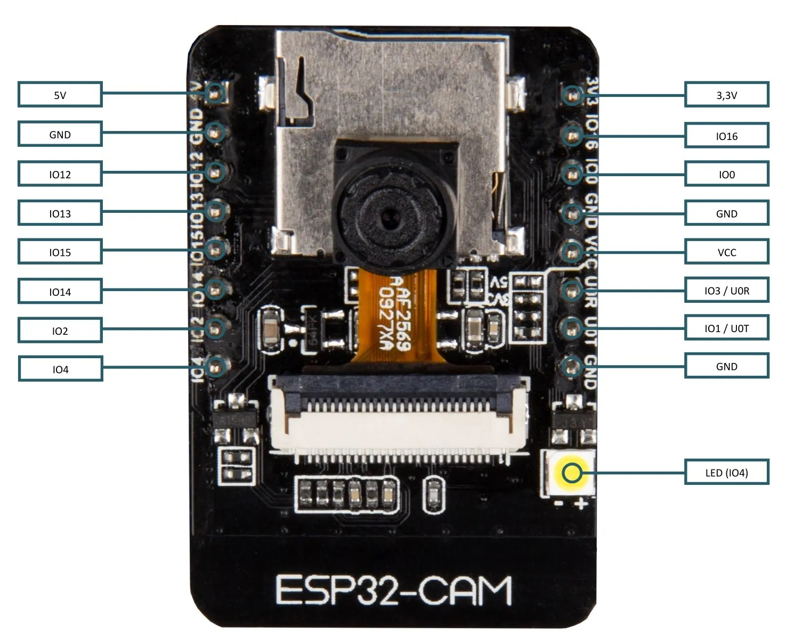

## [Обнаружение движения на даче и регистрация в telegram](https://randomnerdtutorials.com/telegram-esp32-motion-detection-arduino/)

***2024-06-22***  - Здесь представлен нестрогий перевод статьи "[Telegram: ESP32 Motion Detection with Notifications (Arduino IDE)](https://randomnerdtutorials.com/telegram-esp32-motion-detection-arduino/)".

В этом руководстве показано, как отправлять уведомления в вашу учетную запись Telegram, когда ESP32 обнаруживает движение. Пока у вас есть доступ к Интернету на вашем смартфоне, вы будете получать уведомления независимо от того, где вы находитесь. Плата ESP будет запрограммирована с помощью Arduino IDE.

**Как работает проект:**

Вы создаёте Telegram-бота для своего ESP32, ESP32 подключаете к датчику движения PIR. Когда датчик обнаруживает движение, ESP32 отправляет предупреждающее сообщение в вашу учетную запись telegram.

Таким образом, вы будете получать уведомления в своей учетной записи telegram всякий раз, когда будет обнаружено движение.

Для этого проекта вам необходимо подключить датчик движения PIR к вашей плате ESP32. Здесь, сигнальный вывод датчика движения PIR (HC-SR501) подключается к GPIO 27. Можно использовать любой другой подходящий пин ESP32.

