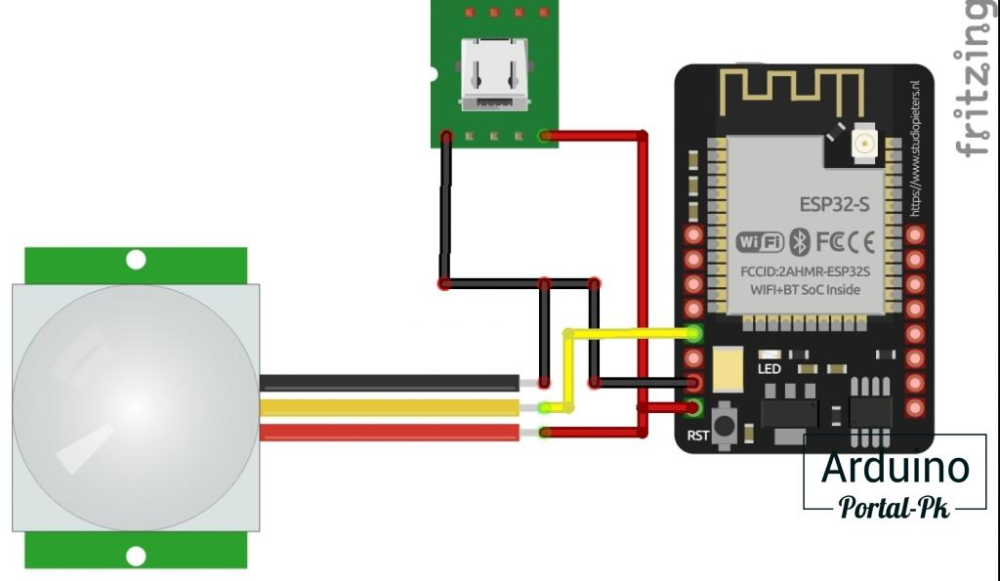
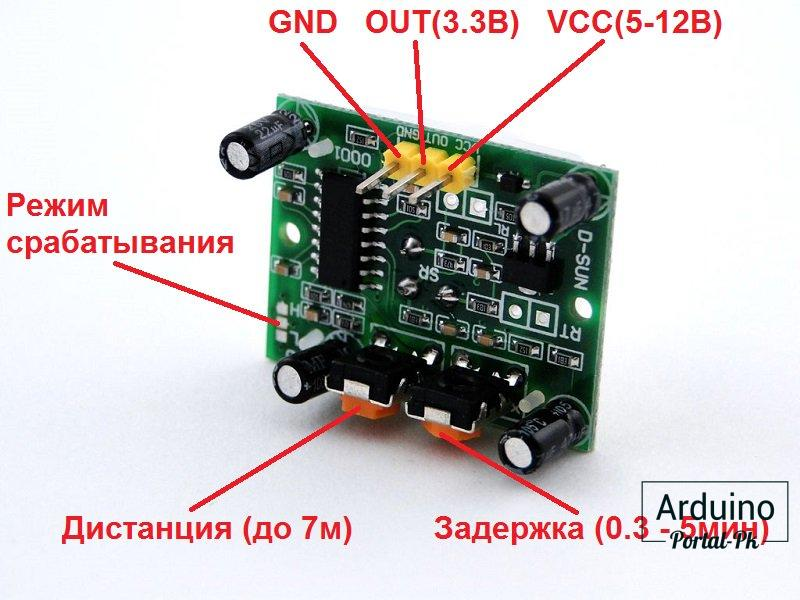

## [ESP32-CAM сохраняем фотографии на флешку при движении](https://portal-pk.ru/news/245-esp32-cam--sohranyaem--fotografii-na-fleshku-pri-dvizhenii.html)

В этом проекте на ESP32 научим ESP32-CAM модуль делать фотографии при движении объекта и сохранять фотографии на флешку. Название кадра будет содержать дату и время, когда было сделано фото.

У PIR датчика HC-SR501 на выходе 3,3в, что позволяет нам подключить датчик движения к ESP32 без дополнительных преобразователей.



Настроить время срабатывания и дистанцию PIR датчика HC-SR501. Время срабатывания максимум секунд 30, этого достаточно для проекта. Если время срабатывания датчика настроить 5 сек или меньше, то у модуля esp32 cam получается очередь, так как время на фотографирование и сохранение в память занимает больше 5 секунд. И пока не закончиться очередь, он будет фотографировать, если даже в поле срабатывания никто не двигается.



Модуль камеры ov2640 снимает с качеством 2МРх. 

Первый минус - время для имени файлов берется из интернета, поэтому нужно подключение к интернету. Можно обойтись и без времени, но тогда мы не будем знать, когда сделано фото.

Второй минус - это запрет на многие символы в названии файлов, поэтому время и дата выводятся не совсем в привычном формате, но все равно понятном.


### Протокол компиляции скетча

```
C:\Program Files (x86)\Arduino\arduino-builder -dump-prefs -logger=machine -hardware C:\Program Files (x86)\Arduino\hardware -hardware C:\Users\Евгеньевич\AppData\Local\Arduino15\packages -tools C:\Program Files (x86)\Arduino\tools-builder -tools C:\Program Files (x86)\Arduino\hardware\tools\avr -tools C:\Users\Евгеньевич\AppData\Local\Arduino15\packages -built-in-libraries C:\Program Files (x86)\Arduino\libraries -libraries C:\Users\Евгеньевич\Documents\Arduino\libraries -fqbn=esp32:esp32:esp32cam:CPUFreq=240,FlashMode=qio,PartitionScheme=min_spiffs,FlashFreq=80,DebugLevel=none,EraseFlash=all -vid-pid=0403_6015 -ide-version=10818 -build-path C:\Users\615A~1\AppData\Local\Temp\arduino_build_818491 -warnings=none -build-cache C:\Users\615A~1\AppData\Local\Temp\arduino_cache_396129 -prefs=build.warn_data_percentage=75 -prefs=runtime.tools.esp-xs3.path=C:\Users\Евгеньевич\AppData\Local\Arduino15\packages\esp32\tools\esp-xs3\2302 -prefs=runtime.tools.esp-xs3-2302.path=C:\Users\Евгеньевич\AppData\Local\Arduino15\packages\esp32\tools\esp-xs3\2302 -prefs=runtime.tools.openocd-esp32.path=C:\Users\Евгеньевич\AppData\Local\Arduino15\packages\esp32\tools\openocd-esp32\v0.12.0-esp32-20240318 -prefs=runtime.tools.openocd-esp32-v0.12.0-esp32-20240318.path=C:\Users\Евгеньевич\AppData\Local\Arduino15\packages\esp32\tools\openocd-esp32\v0.12.0-esp32-20240318 -prefs=runtime.tools.esp-rv32.path=C:\Users\Евгеньевич\AppData\Local\Arduino15\packages\esp32\tools\esp-rv32\2302 -prefs=runtime.tools.esp-rv32-2302.path=C:\Users\Евгеньевич\AppData\Local\Arduino15\packages\esp32\tools\esp-rv32\2302 -prefs=runtime.tools.esptool_py.path=C:\Users\Евгеньевич\AppData\Local\Arduino15\packages\esp32\tools\esptool_py\4.6 -prefs=runtime.tools.esptool_py-4.6.path=C:\Users\Евгеньевич\AppData\Local\Arduino15\packages\esp32\tools\esptool_py\4.6 -prefs=runtime.tools.esp32-arduino-libs.path=C:\Users\Евгеньевич\AppData\Local\Arduino15\packages\esp32\tools\esp32-arduino-libs\idf-release_v5.1-dc859c1e67 -prefs=runtime.tools.esp32-arduino-libs-idf-release_v5.1-dc859c1e67.path=C:\Users\Евгеньевич\AppData\Local\Arduino15\packages\esp32\tools\esp32-arduino-libs\idf-release_v5.1-dc859c1e67 -prefs=runtime.tools.riscv32-esp-elf-gdb.path=C:\Users\Евгеньевич\AppData\Local\Arduino15\packages\esp32\tools\riscv32-esp-elf-gdb\12.1_20231023 -prefs=runtime.tools.riscv32-esp-elf-gdb-12.1_20231023.path=C:\Users\Евгеньевич\AppData\Local\Arduino15\packages\esp32\tools\riscv32-esp-elf-gdb\12.1_20231023 -prefs=runtime.tools.mkspiffs.path=C:\Users\Евгеньевич\AppData\Local\Arduino15\packages\esp32\tools\mkspiffs\0.2.3 -prefs=runtime.tools.mkspiffs-0.2.3.path=C:\Users\Евгеньевич\AppData\Local\Arduino15\packages\esp32\tools\mkspiffs\0.2.3 -prefs=runtime.tools.esp-xs2.path=C:\Users\Евгеньевич\AppData\Local\Arduino15\packages\esp32\tools\esp-xs2\2302 -prefs=runtime.tools.esp-xs2-2302.path=C:\Users\Евгеньевич\AppData\Local\Arduino15\packages\esp32\tools\esp-xs2\2302 -prefs=runtime.tools.mklittlefs.path=C:\Users\Евгеньевич\AppData\Local\Arduino15\packages\esp32\tools\mklittlefs\3.0.0-gnu12-dc7f933 -prefs=runtime.tools.mklittlefs-3.0.0-gnu12-dc7f933.path=C:\Users\Евгеньевич\AppData\Local\Arduino15\packages\esp32\tools\mklittlefs\3.0.0-gnu12-dc7f933 -prefs=runtime.tools.dfu-util.path=C:\Users\Евгеньевич\AppData\Local\Arduino15\packages\arduino\tools\dfu-util\0.11.0-arduino5 -prefs=runtime.tools.dfu-util-0.11.0-arduino5.path=C:\Users\Евгеньевич\AppData\Local\Arduino15\packages\arduino\tools\dfu-util\0.11.0-arduino5 -prefs=runtime.tools.xtensa-esp-elf-gdb.path=C:\Users\Евгеньевич\AppData\Local\Arduino15\packages\esp32\tools\xtensa-esp-elf-gdb\12.1_20231023 -prefs=runtime.tools.xtensa-esp-elf-gdb-12.1_20231023.path=C:\Users\Евгеньевич\AppData\Local\Arduino15\packages\esp32\tools\xtensa-esp-elf-gdb\12.1_20231023 -prefs=runtime.tools.esp-x32.path=C:\Users\Евгеньевич\AppData\Local\Arduino15\packages\esp32\tools\esp-x32\2302 -prefs=runtime.tools.esp-x32-2302.path=C:\Users\Евгеньевич\AppData\Local\Arduino15\packages\esp32\tools\esp-x32\2302 -verbose C:\ittve-ESP32-CAM\09-sohranyaem-fotografii-na-flehshku-pri-dvizhenii\sohranyaem-fotografii-na-flehshku-pri-dvizhenii\sohranyaem-fotografii-na-flehshku-pri-dvizhenii\sohranyaem-fotografii-na-flehshku-pri-dvizhenii.ino
C:\Program Files (x86)\Arduino\arduino-builder -compile -logger=machine -hardware C:\Program Files (x86)\Arduino\hardware -hardware C:\Users\Евгеньевич\AppData\Local\Arduino15\packages -tools C:\Program Files (x86)\Arduino\tools-builder -tools C:\Program Files (x86)\Arduino\hardware\tools\avr -tools C:\Users\Евгеньевич\AppData\Local\Arduino15\packages -built-in-libraries C:\Program Files (x86)\Arduino\libraries -libraries C:\Users\Евгеньевич\Documents\Arduino\libraries -fqbn=esp32:esp32:esp32cam:CPUFreq=240,FlashMode=qio,PartitionScheme=min_spiffs,FlashFreq=80,DebugLevel=none,EraseFlash=all -vid-pid=0403_6015 -ide-version=10818 -build-path C:\Users\615A~1\AppData\Local\Temp\arduino_build_818491 -warnings=none -build-cache C:\Users\615A~1\AppData\Local\Temp\arduino_cache_396129 -prefs=build.warn_data_percentage=75 -prefs=runtime.tools.esp-xs3.path=C:\Users\Евгеньевич\AppData\Local\Arduino15\packages\esp32\tools\esp-xs3\2302 -prefs=runtime.tools.esp-xs3-2302.path=C:\Users\Евгеньевич\AppData\Local\Arduino15\packages\esp32\tools\esp-xs3\2302 -prefs=runtime.tools.openocd-esp32.path=C:\Users\Евгеньевич\AppData\Local\Arduino15\packages\esp32\tools\openocd-esp32\v0.12.0-esp32-20240318 -prefs=runtime.tools.openocd-esp32-v0.12.0-esp32-20240318.path=C:\Users\Евгеньевич\AppData\Local\Arduino15\packages\esp32\tools\openocd-esp32\v0.12.0-esp32-20240318 -prefs=runtime.tools.esp-rv32.path=C:\Users\Евгеньевич\AppData\Local\Arduino15\packages\esp32\tools\esp-rv32\2302 -prefs=runtime.tools.esp-rv32-2302.path=C:\Users\Евгеньевич\AppData\Local\Arduino15\packages\esp32\tools\esp-rv32\2302 -prefs=runtime.tools.esptool_py.path=C:\Users\Евгеньевич\AppData\Local\Arduino15\packages\esp32\tools\esptool_py\4.6 -prefs=runtime.tools.esptool_py-4.6.path=C:\Users\Евгеньевич\AppData\Local\Arduino15\packages\esp32\tools\esptool_py\4.6 -prefs=runtime.tools.esp32-arduino-libs.path=C:\Users\Евгеньевич\AppData\Local\Arduino15\packages\esp32\tools\esp32-arduino-libs\idf-release_v5.1-dc859c1e67 -prefs=runtime.tools.esp32-arduino-libs-idf-release_v5.1-dc859c1e67.path=C:\Users\Евгеньевич\AppData\Local\Arduino15\packages\esp32\tools\esp32-arduino-libs\idf-release_v5.1-dc859c1e67 -prefs=runtime.tools.riscv32-esp-elf-gdb.path=C:\Users\Евгеньевич\AppData\Local\Arduino15\packages\esp32\tools\riscv32-esp-elf-gdb\12.1_20231023 -prefs=runtime.tools.riscv32-esp-elf-gdb-12.1_20231023.path=C:\Users\Евгеньевич\AppData\Local\Arduino15\packages\esp32\tools\riscv32-esp-elf-gdb\12.1_20231023 -prefs=runtime.tools.mkspiffs.path=C:\Users\Евгеньевич\AppData\Local\Arduino15\packages\esp32\tools\mkspiffs\0.2.3 -prefs=runtime.tools.mkspiffs-0.2.3.path=C:\Users\Евгеньевич\AppData\Local\Arduino15\packages\esp32\tools\mkspiffs\0.2.3 -prefs=runtime.tools.esp-xs2.path=C:\Users\Евгеньевич\AppData\Local\Arduino15\packages\esp32\tools\esp-xs2\2302 -prefs=runtime.tools.esp-xs2-2302.path=C:\Users\Евгеньевич\AppData\Local\Arduino15\packages\esp32\tools\esp-xs2\2302 -prefs=runtime.tools.mklittlefs.path=C:\Users\Евгеньевич\AppData\Local\Arduino15\packages\esp32\tools\mklittlefs\3.0.0-gnu12-dc7f933 -prefs=runtime.tools.mklittlefs-3.0.0-gnu12-dc7f933.path=C:\Users\Евгеньевич\AppData\Local\Arduino15\packages\esp32\tools\mklittlefs\3.0.0-gnu12-dc7f933 -prefs=runtime.tools.dfu-util.path=C:\Users\Евгеньевич\AppData\Local\Arduino15\packages\arduino\tools\dfu-util\0.11.0-arduino5 -prefs=runtime.tools.dfu-util-0.11.0-arduino5.path=C:\Users\Евгеньевич\AppData\Local\Arduino15\packages\arduino\tools\dfu-util\0.11.0-arduino5 -prefs=runtime.tools.xtensa-esp-elf-gdb.path=C:\Users\Евгеньевич\AppData\Local\Arduino15\packages\esp32\tools\xtensa-esp-elf-gdb\12.1_20231023 -prefs=runtime.tools.xtensa-esp-elf-gdb-12.1_20231023.path=C:\Users\Евгеньевич\AppData\Local\Arduino15\packages\esp32\tools\xtensa-esp-elf-gdb\12.1_20231023 -prefs=runtime.tools.esp-x32.path=C:\Users\Евгеньевич\AppData\Local\Arduino15\packages\esp32\tools\esp-x32\2302 -prefs=runtime.tools.esp-x32-2302.path=C:\Users\Евгеньевич\AppData\Local\Arduino15\packages\esp32\tools\esp-x32\2302 -verbose C:\ittve-ESP32-CAM\09-sohranyaem-fotografii-na-flehshku-pri-dvizhenii\sohranyaem-fotografii-na-flehshku-pri-dvizhenii\sohranyaem-fotografii-na-flehshku-pri-dvizhenii\sohranyaem-fotografii-na-flehshku-pri-dvizhenii.ino
Using board 'esp32cam' from platform in folder: C:\Users\Евгеньевич\AppData\Local\Arduino15\packages\esp32\hardware\esp32\3.0.3
Using core 'esp32' from platform in folder: C:\Users\Евгеньевич\AppData\Local\Arduino15\packages\esp32\hardware\esp32\3.0.3
cmd /c if exist "C:\\ittve-ESP32-CAM\\09-sohranyaem-fotografii-na-flehshku-pri-dvizhenii\\sohranyaem-fotografii-na-flehshku-pri-dvizhenii\\sohranyaem-fotografii-na-flehshku-pri-dvizhenii\\partitions.csv" COPY /y "C:\\ittve-ESP32-CAM\\09-sohranyaem-fotografii-na-flehshku-pri-dvizhenii\\sohranyaem-fotografii-na-flehshku-pri-dvizhenii\\sohranyaem-fotografii-na-flehshku-pri-dvizhenii\\partitions.csv" "C:\\Users\\615A~1\\AppData\\Local\\Temp\\arduino_build_818491\\partitions.csv"
cmd /c if not exist "C:\\Users\\615A~1\\AppData\\Local\\Temp\\arduino_build_818491\\partitions.csv" if exist "C:\\Users\\Евгеньевич\\AppData\\Local\\Arduino15\\packages\\esp32\\hardware\\esp32\\3.0.3\\variants\\esp32\\partitions.csv" COPY "C:\\Users\\Евгеньевич\\AppData\\Local\\Arduino15\\packages\\esp32\\hardware\\esp32\\3.0.3\\variants\\esp32\\partitions.csv" "C:\\Users\\615A~1\\AppData\\Local\\Temp\\arduino_build_818491\\partitions.csv"
cmd /c if not exist "C:\\Users\\615A~1\\AppData\\Local\\Temp\\arduino_build_818491\\partitions.csv" COPY "C:\\Users\\Евгеньевич\\AppData\\Local\\Arduino15\\packages\\esp32\\hardware\\esp32\\3.0.3\\tools\\partitions\\min_spiffs.csv" "C:\\Users\\615A~1\\AppData\\Local\\Temp\\arduino_build_818491\\partitions.csv"
cmd /c IF EXIST "C:\\ittve-ESP32-CAM\\09-sohranyaem-fotografii-na-flehshku-pri-dvizhenii\\sohranyaem-fotografii-na-flehshku-pri-dvizhenii\\sohranyaem-fotografii-na-flehshku-pri-dvizhenii\\bootloader.bin" ( COPY /y "C:\\ittve-ESP32-CAM\\09-sohranyaem-fotografii-na-flehshku-pri-dvizhenii\\sohranyaem-fotografii-na-flehshku-pri-dvizhenii\\sohranyaem-fotografii-na-flehshku-pri-dvizhenii\\bootloader.bin" "C:\\Users\\615A~1\\AppData\\Local\\Temp\\arduino_build_818491\\sohranyaem-fotografii-na-flehshku-pri-dvizhenii.ino.bootloader.bin" ) ELSE ( IF EXIST "C:\\Users\\Евгеньевич\\AppData\\Local\\Arduino15\\packages\\esp32\\hardware\\esp32\\3.0.3\\variants\\esp32\\bootloader.bin" ( COPY "C:\\Users\\Евгеньевич\\AppData\\Local\\Arduino15\\packages\\esp32\\hardware\\esp32\\3.0.3\\variants\\esp32\\bootloader.bin" "C:\\Users\\615A~1\\AppData\\Local\\Temp\\arduino_build_818491\\sohranyaem-fotografii-na-flehshku-pri-dvizhenii.ino.bootloader.bin" ) ELSE ( "C:\\Users\\Евгеньевич\\AppData\\Local\\Arduino15\\packages\\esp32\\tools\\esptool_py\\4.6\\esptool.exe" --chip esp32 elf2image --flash_mode dio --flash_freq 80m --flash_size 4MB -o "C:\\Users\\615A~1\\AppData\\Local\\Temp\\arduino_build_818491\\sohranyaem-fotografii-na-flehshku-pri-dvizhenii.ino.bootloader.bin" "C:\\Users\\Евгеньевич\\AppData\\Local\\Arduino15\\packages\\esp32\\tools\\esp32-arduino-libs\\idf-release_v5.1-dc859c1e67\\esp32\\bin\\bootloader_qio_80m.elf" ) )
esptool.py v4.6
Creating esp32 image...
Merged 1 ELF section
Successfully created esp32 image.
cmd /c if exist "C:\\ittve-ESP32-CAM\\09-sohranyaem-fotografii-na-flehshku-pri-dvizhenii\\sohranyaem-fotografii-na-flehshku-pri-dvizhenii\\sohranyaem-fotografii-na-flehshku-pri-dvizhenii\\build_opt.h" COPY /y "C:\\ittve-ESP32-CAM\\09-sohranyaem-fotografii-na-flehshku-pri-dvizhenii\\sohranyaem-fotografii-na-flehshku-pri-dvizhenii\\sohranyaem-fotografii-na-flehshku-pri-dvizhenii\\build_opt.h" "C:\\Users\\615A~1\\AppData\\Local\\Temp\\arduino_build_818491\\build_opt.h"
cmd /c if not exist "C:\\Users\\615A~1\\AppData\\Local\\Temp\\arduino_build_818491\\build_opt.h" type nul > "C:\\Users\\615A~1\\AppData\\Local\\Temp\\arduino_build_818491\\build_opt.h"
cmd /c type nul > "C:\\Users\\615A~1\\AppData\\Local\\Temp\\arduino_build_818491/file_opts"
Detecting libraries used...
"C:\\Users\\Евгеньевич\\AppData\\Local\\Arduino15\\packages\\esp32\\tools\\esp-x32\\2302/bin/xtensa-esp32-elf-g++" -c "@C:\\Users\\Евгеньевич\\AppData\\Local\\Arduino15\\packages\\esp32\\tools\\esp32-arduino-libs\\idf-release_v5.1-dc859c1e67\\esp32/flags/cpp_flags" -w -Os -w -x c++ -E -CC -DF_CPU=240000000L -DARDUINO=10818 -DARDUINO_ESP32_DEV -DARDUINO_ARCH_ESP32 "-DARDUINO_BOARD=\"ESP32_DEV\"" "-DARDUINO_VARIANT=\"esp32\"" -DARDUINO_PARTITION_min_spiffs "-DARDUINO_HOST_OS=\"windows\"" "-DARDUINO_FQBN=\"esp32:esp32:esp32cam:CPUFreq=240,FlashMode=qio,PartitionScheme=min_spiffs,FlashFreq=80,DebugLevel=none,EraseFlash=all\"" -DESP32 -DCORE_DEBUG_LEVEL=0 -DBOARD_HAS_PSRAM -mfix-esp32-psram-cache-issue -mfix-esp32-psram-cache-strategy=memw -DARDUINO_USB_CDC_ON_BOOT=0 "@C:\\Users\\Евгеньевич\\AppData\\Local\\Arduino15\\packages\\esp32\\tools\\esp32-arduino-libs\\idf-release_v5.1-dc859c1e67\\esp32/flags/defines" "-IC:\\ittve-ESP32-CAM\\09-sohranyaem-fotografii-na-flehshku-pri-dvizhenii\\sohranyaem-fotografii-na-flehshku-pri-dvizhenii\\sohranyaem-fotografii-na-flehshku-pri-dvizhenii" -iprefix "C:\\Users\\Евгеньевич\\AppData\\Local\\Arduino15\\packages\\esp32\\tools\\esp32-arduino-libs\\idf-release_v5.1-dc859c1e67\\esp32/include/" "@C:\\Users\\Евгеньевич\\AppData\\Local\\Arduino15\\packages\\esp32\\tools\\esp32-arduino-libs\\idf-release_v5.1-dc859c1e67\\esp32/flags/includes" "-IC:\\Users\\Евгеньевич\\AppData\\Local\\Arduino15\\packages\\esp32\\tools\\esp32-arduino-libs\\idf-release_v5.1-dc859c1e67\\esp32/qio_qspi/include" "-IC:\\Users\\Евгеньевич\\AppData\\Local\\Arduino15\\packages\\esp32\\hardware\\esp32\\3.0.3\\cores\\esp32" "-IC:\\Users\\Евгеньевич\\AppData\\Local\\Arduino15\\packages\\esp32\\hardware\\esp32\\3.0.3\\variants\\esp32" "@C:\\Users\\615A~1\\AppData\\Local\\Temp\\arduino_build_818491/build_opt.h" "@C:\\Users\\615A~1\\AppData\\Local\\Temp\\arduino_build_818491/file_opts" "C:\\Users\\615A~1\\AppData\\Local\\Temp\\arduino_build_818491\\sketch\\sohranyaem-fotografii-na-flehshku-pri-dvizhenii.ino.cpp" -o nul
Alternatives for WiFi.h: [WiFi@1.2.7 WiFi@3.0.3]
ResolveLibrary(WiFi.h)
  -> candidates: [WiFi@1.2.7 WiFi@3.0.3]
"C:\\Users\\Евгеньевич\\AppData\\Local\\Arduino15\\packages\\esp32\\tools\\esp-x32\\2302/bin/xtensa-esp32-elf-g++" -c "@C:\\Users\\Евгеньевич\\AppData\\Local\\Arduino15\\packages\\esp32\\tools\\esp32-arduino-libs\\idf-release_v5.1-dc859c1e67\\esp32/flags/cpp_flags" -w -Os -w -x c++ -E -CC -DF_CPU=240000000L -DARDUINO=10818 -DARDUINO_ESP32_DEV -DARDUINO_ARCH_ESP32 "-DARDUINO_BOARD=\"ESP32_DEV\"" "-DARDUINO_VARIANT=\"esp32\"" -DARDUINO_PARTITION_min_spiffs "-DARDUINO_HOST_OS=\"windows\"" "-DARDUINO_FQBN=\"esp32:esp32:esp32cam:CPUFreq=240,FlashMode=qio,PartitionScheme=min_spiffs,FlashFreq=80,DebugLevel=none,EraseFlash=all\"" -DESP32 -DCORE_DEBUG_LEVEL=0 -DBOARD_HAS_PSRAM -mfix-esp32-psram-cache-issue -mfix-esp32-psram-cache-strategy=memw -DARDUINO_USB_CDC_ON_BOOT=0 "@C:\\Users\\Евгеньевич\\AppData\\Local\\Arduino15\\packages\\esp32\\tools\\esp32-arduino-libs\\idf-release_v5.1-dc859c1e67\\esp32/flags/defines" "-IC:\\ittve-ESP32-CAM\\09-sohranyaem-fotografii-na-flehshku-pri-dvizhenii\\sohranyaem-fotografii-na-flehshku-pri-dvizhenii\\sohranyaem-fotografii-na-flehshku-pri-dvizhenii" -iprefix "C:\\Users\\Евгеньевич\\AppData\\Local\\Arduino15\\packages\\esp32\\tools\\esp32-arduino-libs\\idf-release_v5.1-dc859c1e67\\esp32/include/" "@C:\\Users\\Евгеньевич\\AppData\\Local\\Arduino15\\packages\\esp32\\tools\\esp32-arduino-libs\\idf-release_v5.1-dc859c1e67\\esp32/flags/includes" "-IC:\\Users\\Евгеньевич\\AppData\\Local\\Arduino15\\packages\\esp32\\tools\\esp32-arduino-libs\\idf-release_v5.1-dc859c1e67\\esp32/qio_qspi/include" "-IC:\\Users\\Евгеньевич\\AppData\\Local\\Arduino15\\packages\\esp32\\hardware\\esp32\\3.0.3\\cores\\esp32" "-IC:\\Users\\Евгеньевич\\AppData\\Local\\Arduino15\\packages\\esp32\\hardware\\esp32\\3.0.3\\variants\\esp32" "-IC:\\Users\\Евгеньевич\\AppData\\Local\\Arduino15\\packages\\esp32\\hardware\\esp32\\3.0.3\\libraries\\WiFi\\src" "@C:\\Users\\615A~1\\AppData\\Local\\Temp\\arduino_build_818491/build_opt.h" "@C:\\Users\\615A~1\\AppData\\Local\\Temp\\arduino_build_818491/file_opts" "C:\\Users\\615A~1\\AppData\\Local\\Temp\\arduino_build_818491\\sketch\\sohranyaem-fotografii-na-flehshku-pri-dvizhenii.ino.cpp" -o nul
Alternatives for Network.h: [Network@3.0.3]
ResolveLibrary(Network.h)
  -> candidates: [Network@3.0.3]
"C:\\Users\\Евгеньевич\\AppData\\Local\\Arduino15\\packages\\esp32\\tools\\esp-x32\\2302/bin/xtensa-esp32-elf-g++" -c "@C:\\Users\\Евгеньевич\\AppData\\Local\\Arduino15\\packages\\esp32\\tools\\esp32-arduino-libs\\idf-release_v5.1-dc859c1e67\\esp32/flags/cpp_flags" -w -Os -w -x c++ -E -CC -DF_CPU=240000000L -DARDUINO=10818 -DARDUINO_ESP32_DEV -DARDUINO_ARCH_ESP32 "-DARDUINO_BOARD=\"ESP32_DEV\"" "-DARDUINO_VARIANT=\"esp32\"" -DARDUINO_PARTITION_min_spiffs "-DARDUINO_HOST_OS=\"windows\"" "-DARDUINO_FQBN=\"esp32:esp32:esp32cam:CPUFreq=240,FlashMode=qio,PartitionScheme=min_spiffs,FlashFreq=80,DebugLevel=none,EraseFlash=all\"" -DESP32 -DCORE_DEBUG_LEVEL=0 -DBOARD_HAS_PSRAM -mfix-esp32-psram-cache-issue -mfix-esp32-psram-cache-strategy=memw -DARDUINO_USB_CDC_ON_BOOT=0 "@C:\\Users\\Евгеньевич\\AppData\\Local\\Arduino15\\packages\\esp32\\tools\\esp32-arduino-libs\\idf-release_v5.1-dc859c1e67\\esp32/flags/defines" "-IC:\\ittve-ESP32-CAM\\09-sohranyaem-fotografii-na-flehshku-pri-dvizhenii\\sohranyaem-fotografii-na-flehshku-pri-dvizhenii\\sohranyaem-fotografii-na-flehshku-pri-dvizhenii" -iprefix "C:\\Users\\Евгеньевич\\AppData\\Local\\Arduino15\\packages\\esp32\\tools\\esp32-arduino-libs\\idf-release_v5.1-dc859c1e67\\esp32/include/" "@C:\\Users\\Евгеньевич\\AppData\\Local\\Arduino15\\packages\\esp32\\tools\\esp32-arduino-libs\\idf-release_v5.1-dc859c1e67\\esp32/flags/includes" "-IC:\\Users\\Евгеньевич\\AppData\\Local\\Arduino15\\packages\\esp32\\tools\\esp32-arduino-libs\\idf-release_v5.1-dc859c1e67\\esp32/qio_qspi/include" "-IC:\\Users\\Евгеньевич\\AppData\\Local\\Arduino15\\packages\\esp32\\hardware\\esp32\\3.0.3\\cores\\esp32" "-IC:\\Users\\Евгеньевич\\AppData\\Local\\Arduino15\\packages\\esp32\\hardware\\esp32\\3.0.3\\variants\\esp32" "-IC:\\Users\\Евгеньевич\\AppData\\Local\\Arduino15\\packages\\esp32\\hardware\\esp32\\3.0.3\\libraries\\WiFi\\src" "-IC:\\Users\\Евгеньевич\\AppData\\Local\\Arduino15\\packages\\esp32\\hardware\\esp32\\3.0.3\\libraries\\Network\\src" "@C:\\Users\\615A~1\\AppData\\Local\\Temp\\arduino_build_818491/build_opt.h" "@C:\\Users\\615A~1\\AppData\\Local\\Temp\\arduino_build_818491/file_opts" "C:\\Users\\615A~1\\AppData\\Local\\Temp\\arduino_build_818491\\sketch\\sohranyaem-fotografii-na-flehshku-pri-dvizhenii.ino.cpp" -o nul
Alternatives for WebServer.h: [WebServer@3.0.3]
ResolveLibrary(WebServer.h)
  -> candidates: [WebServer@3.0.3]
"C:\\Users\\Евгеньевич\\AppData\\Local\\Arduino15\\packages\\esp32\\tools\\esp-x32\\2302/bin/xtensa-esp32-elf-g++" -c "@C:\\Users\\Евгеньевич\\AppData\\Local\\Arduino15\\packages\\esp32\\tools\\esp32-arduino-libs\\idf-release_v5.1-dc859c1e67\\esp32/flags/cpp_flags" -w -Os -w -x c++ -E -CC -DF_CPU=240000000L -DARDUINO=10818 -DARDUINO_ESP32_DEV -DARDUINO_ARCH_ESP32 "-DARDUINO_BOARD=\"ESP32_DEV\"" "-DARDUINO_VARIANT=\"esp32\"" -DARDUINO_PARTITION_min_spiffs "-DARDUINO_HOST_OS=\"windows\"" "-DARDUINO_FQBN=\"esp32:esp32:esp32cam:CPUFreq=240,FlashMode=qio,PartitionScheme=min_spiffs,FlashFreq=80,DebugLevel=none,EraseFlash=all\"" -DESP32 -DCORE_DEBUG_LEVEL=0 -DBOARD_HAS_PSRAM -mfix-esp32-psram-cache-issue -mfix-esp32-psram-cache-strategy=memw -DARDUINO_USB_CDC_ON_BOOT=0 "@C:\\Users\\Евгеньевич\\AppData\\Local\\Arduino15\\packages\\esp32\\tools\\esp32-arduino-libs\\idf-release_v5.1-dc859c1e67\\esp32/flags/defines" "-IC:\\ittve-ESP32-CAM\\09-sohranyaem-fotografii-na-flehshku-pri-dvizhenii\\sohranyaem-fotografii-na-flehshku-pri-dvizhenii\\sohranyaem-fotografii-na-flehshku-pri-dvizhenii" -iprefix "C:\\Users\\Евгеньевич\\AppData\\Local\\Arduino15\\packages\\esp32\\tools\\esp32-arduino-libs\\idf-release_v5.1-dc859c1e67\\esp32/include/" "@C:\\Users\\Евгеньевич\\AppData\\Local\\Arduino15\\packages\\esp32\\tools\\esp32-arduino-libs\\idf-release_v5.1-dc859c1e67\\esp32/flags/includes" "-IC:\\Users\\Евгеньевич\\AppData\\Local\\Arduino15\\packages\\esp32\\tools\\esp32-arduino-libs\\idf-release_v5.1-dc859c1e67\\esp32/qio_qspi/include" "-IC:\\Users\\Евгеньевич\\AppData\\Local\\Arduino15\\packages\\esp32\\hardware\\esp32\\3.0.3\\cores\\esp32" "-IC:\\Users\\Евгеньевич\\AppData\\Local\\Arduino15\\packages\\esp32\\hardware\\esp32\\3.0.3\\variants\\esp32" "-IC:\\Users\\Евгеньевич\\AppData\\Local\\Arduino15\\packages\\esp32\\hardware\\esp32\\3.0.3\\libraries\\WiFi\\src" "-IC:\\Users\\Евгеньевич\\AppData\\Local\\Arduino15\\packages\\esp32\\hardware\\esp32\\3.0.3\\libraries\\Network\\src" "-IC:\\Users\\Евгеньевич\\AppData\\Local\\Arduino15\\packages\\esp32\\hardware\\esp32\\3.0.3\\libraries\\WebServer\\src" "@C:\\Users\\615A~1\\AppData\\Local\\Temp\\arduino_build_818491/build_opt.h" "@C:\\Users\\615A~1\\AppData\\Local\\Temp\\arduino_build_818491/file_opts" "C:\\Users\\615A~1\\AppData\\Local\\Temp\\arduino_build_818491\\sketch\\sohranyaem-fotografii-na-flehshku-pri-dvizhenii.ino.cpp" -o nul
Alternatives for FS.h: [FS@3.0.3]
ResolveLibrary(FS.h)
  -> candidates: [FS@3.0.3]
"C:\\Users\\Евгеньевич\\AppData\\Local\\Arduino15\\packages\\esp32\\tools\\esp-x32\\2302/bin/xtensa-esp32-elf-g++" -c "@C:\\Users\\Евгеньевич\\AppData\\Local\\Arduino15\\packages\\esp32\\tools\\esp32-arduino-libs\\idf-release_v5.1-dc859c1e67\\esp32/flags/cpp_flags" -w -Os -w -x c++ -E -CC -DF_CPU=240000000L -DARDUINO=10818 -DARDUINO_ESP32_DEV -DARDUINO_ARCH_ESP32 "-DARDUINO_BOARD=\"ESP32_DEV\"" "-DARDUINO_VARIANT=\"esp32\"" -DARDUINO_PARTITION_min_spiffs "-DARDUINO_HOST_OS=\"windows\"" "-DARDUINO_FQBN=\"esp32:esp32:esp32cam:CPUFreq=240,FlashMode=qio,PartitionScheme=min_spiffs,FlashFreq=80,DebugLevel=none,EraseFlash=all\"" -DESP32 -DCORE_DEBUG_LEVEL=0 -DBOARD_HAS_PSRAM -mfix-esp32-psram-cache-issue -mfix-esp32-psram-cache-strategy=memw -DARDUINO_USB_CDC_ON_BOOT=0 "@C:\\Users\\Евгеньевич\\AppData\\Local\\Arduino15\\packages\\esp32\\tools\\esp32-arduino-libs\\idf-release_v5.1-dc859c1e67\\esp32/flags/defines" "-IC:\\ittve-ESP32-CAM\\09-sohranyaem-fotografii-na-flehshku-pri-dvizhenii\\sohranyaem-fotografii-na-flehshku-pri-dvizhenii\\sohranyaem-fotografii-na-flehshku-pri-dvizhenii" -iprefix "C:\\Users\\Евгеньевич\\AppData\\Local\\Arduino15\\packages\\esp32\\tools\\esp32-arduino-libs\\idf-release_v5.1-dc859c1e67\\esp32/include/" "@C:\\Users\\Евгеньевич\\AppData\\Local\\Arduino15\\packages\\esp32\\tools\\esp32-arduino-libs\\idf-release_v5.1-dc859c1e67\\esp32/flags/includes" "-IC:\\Users\\Евгеньевич\\AppData\\Local\\Arduino15\\packages\\esp32\\tools\\esp32-arduino-libs\\idf-release_v5.1-dc859c1e67\\esp32/qio_qspi/include" "-IC:\\Users\\Евгеньевич\\AppData\\Local\\Arduino15\\packages\\esp32\\hardware\\esp32\\3.0.3\\cores\\esp32" "-IC:\\Users\\Евгеньевич\\AppData\\Local\\Arduino15\\packages\\esp32\\hardware\\esp32\\3.0.3\\variants\\esp32" "-IC:\\Users\\Евгеньевич\\AppData\\Local\\Arduino15\\packages\\esp32\\hardware\\esp32\\3.0.3\\libraries\\WiFi\\src" "-IC:\\Users\\Евгеньевич\\AppData\\Local\\Arduino15\\packages\\esp32\\hardware\\esp32\\3.0.3\\libraries\\Network\\src" "-IC:\\Users\\Евгеньевич\\AppData\\Local\\Arduino15\\packages\\esp32\\hardware\\esp32\\3.0.3\\libraries\\WebServer\\src" "-IC:\\Users\\Евгеньевич\\AppData\\Local\\Arduino15\\packages\\esp32\\hardware\\esp32\\3.0.3\\libraries\\FS\\src" "@C:\\Users\\615A~1\\AppData\\Local\\Temp\\arduino_build_818491/build_opt.h" "@C:\\Users\\615A~1\\AppData\\Local\\Temp\\arduino_build_818491/file_opts" "C:\\Users\\615A~1\\AppData\\Local\\Temp\\arduino_build_818491\\sketch\\sohranyaem-fotografii-na-flehshku-pri-dvizhenii.ino.cpp" -o nul
Alternatives for SD_MMC.h: [SD_MMC@3.0.3]
ResolveLibrary(SD_MMC.h)
  -> candidates: [SD_MMC@3.0.3]
"C:\\Users\\Евгеньевич\\AppData\\Local\\Arduino15\\packages\\esp32\\tools\\esp-x32\\2302/bin/xtensa-esp32-elf-g++" -c "@C:\\Users\\Евгеньевич\\AppData\\Local\\Arduino15\\packages\\esp32\\tools\\esp32-arduino-libs\\idf-release_v5.1-dc859c1e67\\esp32/flags/cpp_flags" -w -Os -w -x c++ -E -CC -DF_CPU=240000000L -DARDUINO=10818 -DARDUINO_ESP32_DEV -DARDUINO_ARCH_ESP32 "-DARDUINO_BOARD=\"ESP32_DEV\"" "-DARDUINO_VARIANT=\"esp32\"" -DARDUINO_PARTITION_min_spiffs "-DARDUINO_HOST_OS=\"windows\"" "-DARDUINO_FQBN=\"esp32:esp32:esp32cam:CPUFreq=240,FlashMode=qio,PartitionScheme=min_spiffs,FlashFreq=80,DebugLevel=none,EraseFlash=all\"" -DESP32 -DCORE_DEBUG_LEVEL=0 -DBOARD_HAS_PSRAM -mfix-esp32-psram-cache-issue -mfix-esp32-psram-cache-strategy=memw -DARDUINO_USB_CDC_ON_BOOT=0 "@C:\\Users\\Евгеньевич\\AppData\\Local\\Arduino15\\packages\\esp32\\tools\\esp32-arduino-libs\\idf-release_v5.1-dc859c1e67\\esp32/flags/defines" "-IC:\\ittve-ESP32-CAM\\09-sohranyaem-fotografii-na-flehshku-pri-dvizhenii\\sohranyaem-fotografii-na-flehshku-pri-dvizhenii\\sohranyaem-fotografii-na-flehshku-pri-dvizhenii" -iprefix "C:\\Users\\Евгеньевич\\AppData\\Local\\Arduino15\\packages\\esp32\\tools\\esp32-arduino-libs\\idf-release_v5.1-dc859c1e67\\esp32/include/" "@C:\\Users\\Евгеньевич\\AppData\\Local\\Arduino15\\packages\\esp32\\tools\\esp32-arduino-libs\\idf-release_v5.1-dc859c1e67\\esp32/flags/includes" "-IC:\\Users\\Евгеньевич\\AppData\\Local\\Arduino15\\packages\\esp32\\tools\\esp32-arduino-libs\\idf-release_v5.1-dc859c1e67\\esp32/qio_qspi/include" "-IC:\\Users\\Евгеньевич\\AppData\\Local\\Arduino15\\packages\\esp32\\hardware\\esp32\\3.0.3\\cores\\esp32" "-IC:\\Users\\Евгеньевич\\AppData\\Local\\Arduino15\\packages\\esp32\\hardware\\esp32\\3.0.3\\variants\\esp32" "-IC:\\Users\\Евгеньевич\\AppData\\Local\\Arduino15\\packages\\esp32\\hardware\\esp32\\3.0.3\\libraries\\WiFi\\src" "-IC:\\Users\\Евгеньевич\\AppData\\Local\\Arduino15\\packages\\esp32\\hardware\\esp32\\3.0.3\\libraries\\Network\\src" "-IC:\\Users\\Евгеньевич\\AppData\\Local\\Arduino15\\packages\\esp32\\hardware\\esp32\\3.0.3\\libraries\\WebServer\\src" "-IC:\\Users\\Евгеньевич\\AppData\\Local\\Arduino15\\packages\\esp32\\hardware\\esp32\\3.0.3\\libraries\\FS\\src" "-IC:\\Users\\Евгеньевич\\AppData\\Local\\Arduino15\\packages\\esp32\\hardware\\esp32\\3.0.3\\libraries\\SD_MMC\\src" "@C:\\Users\\615A~1\\AppData\\Local\\Temp\\arduino_build_818491/build_opt.h" "@C:\\Users\\615A~1\\AppData\\Local\\Temp\\arduino_build_818491/file_opts" "C:\\Users\\615A~1\\AppData\\Local\\Temp\\arduino_build_818491\\sketch\\sohranyaem-fotografii-na-flehshku-pri-dvizhenii.ino.cpp" -o nul
Alternatives for EEPROM.h: [EEPROM@3.0.3]
ResolveLibrary(EEPROM.h)
  -> candidates: [EEPROM@3.0.3]
"C:\\Users\\Евгеньевич\\AppData\\Local\\Arduino15\\packages\\esp32\\tools\\esp-x32\\2302/bin/xtensa-esp32-elf-g++" -c "@C:\\Users\\Евгеньевич\\AppData\\Local\\Arduino15\\packages\\esp32\\tools\\esp32-arduino-libs\\idf-release_v5.1-dc859c1e67\\esp32/flags/cpp_flags" -w -Os -w -x c++ -E -CC -DF_CPU=240000000L -DARDUINO=10818 -DARDUINO_ESP32_DEV -DARDUINO_ARCH_ESP32 "-DARDUINO_BOARD=\"ESP32_DEV\"" "-DARDUINO_VARIANT=\"esp32\"" -DARDUINO_PARTITION_min_spiffs "-DARDUINO_HOST_OS=\"windows\"" "-DARDUINO_FQBN=\"esp32:esp32:esp32cam:CPUFreq=240,FlashMode=qio,PartitionScheme=min_spiffs,FlashFreq=80,DebugLevel=none,EraseFlash=all\"" -DESP32 -DCORE_DEBUG_LEVEL=0 -DBOARD_HAS_PSRAM -mfix-esp32-psram-cache-issue -mfix-esp32-psram-cache-strategy=memw -DARDUINO_USB_CDC_ON_BOOT=0 "@C:\\Users\\Евгеньевич\\AppData\\Local\\Arduino15\\packages\\esp32\\tools\\esp32-arduino-libs\\idf-release_v5.1-dc859c1e67\\esp32/flags/defines" "-IC:\\ittve-ESP32-CAM\\09-sohranyaem-fotografii-na-flehshku-pri-dvizhenii\\sohranyaem-fotografii-na-flehshku-pri-dvizhenii\\sohranyaem-fotografii-na-flehshku-pri-dvizhenii" -iprefix "C:\\Users\\Евгеньевич\\AppData\\Local\\Arduino15\\packages\\esp32\\tools\\esp32-arduino-libs\\idf-release_v5.1-dc859c1e67\\esp32/include/" "@C:\\Users\\Евгеньевич\\AppData\\Local\\Arduino15\\packages\\esp32\\tools\\esp32-arduino-libs\\idf-release_v5.1-dc859c1e67\\esp32/flags/includes" "-IC:\\Users\\Евгеньевич\\AppData\\Local\\Arduino15\\packages\\esp32\\tools\\esp32-arduino-libs\\idf-release_v5.1-dc859c1e67\\esp32/qio_qspi/include" "-IC:\\Users\\Евгеньевич\\AppData\\Local\\Arduino15\\packages\\esp32\\hardware\\esp32\\3.0.3\\cores\\esp32" "-IC:\\Users\\Евгеньевич\\AppData\\Local\\Arduino15\\packages\\esp32\\hardware\\esp32\\3.0.3\\variants\\esp32" "-IC:\\Users\\Евгеньевич\\AppData\\Local\\Arduino15\\packages\\esp32\\hardware\\esp32\\3.0.3\\libraries\\WiFi\\src" "-IC:\\Users\\Евгеньевич\\AppData\\Local\\Arduino15\\packages\\esp32\\hardware\\esp32\\3.0.3\\libraries\\Network\\src" "-IC:\\Users\\Евгеньевич\\AppData\\Local\\Arduino15\\packages\\esp32\\hardware\\esp32\\3.0.3\\libraries\\WebServer\\src" "-IC:\\Users\\Евгеньевич\\AppData\\Local\\Arduino15\\packages\\esp32\\hardware\\esp32\\3.0.3\\libraries\\FS\\src" "-IC:\\Users\\Евгеньевич\\AppData\\Local\\Arduino15\\packages\\esp32\\hardware\\esp32\\3.0.3\\libraries\\SD_MMC\\src" "-IC:\\Users\\Евгеньевич\\AppData\\Local\\Arduino15\\packages\\esp32\\hardware\\esp32\\3.0.3\\libraries\\EEPROM\\src" "@C:\\Users\\615A~1\\AppData\\Local\\Temp\\arduino_build_818491/build_opt.h" "@C:\\Users\\615A~1\\AppData\\Local\\Temp\\arduino_build_818491/file_opts" "C:\\Users\\615A~1\\AppData\\Local\\Temp\\arduino_build_818491\\sketch\\sohranyaem-fotografii-na-flehshku-pri-dvizhenii.ino.cpp" -o nul
"C:\\Users\\Евгеньевич\\AppData\\Local\\Arduino15\\packages\\esp32\\tools\\esp-x32\\2302/bin/xtensa-esp32-elf-g++" -c "@C:\\Users\\Евгеньевич\\AppData\\Local\\Arduino15\\packages\\esp32\\tools\\esp32-arduino-libs\\idf-release_v5.1-dc859c1e67\\esp32/flags/cpp_flags" -w -Os -w -x c++ -E -CC -DF_CPU=240000000L -DARDUINO=10818 -DARDUINO_ESP32_DEV -DARDUINO_ARCH_ESP32 "-DARDUINO_BOARD=\"ESP32_DEV\"" "-DARDUINO_VARIANT=\"esp32\"" -DARDUINO_PARTITION_min_spiffs "-DARDUINO_HOST_OS=\"windows\"" "-DARDUINO_FQBN=\"esp32:esp32:esp32cam:CPUFreq=240,FlashMode=qio,PartitionScheme=min_spiffs,FlashFreq=80,DebugLevel=none,EraseFlash=all\"" -DESP32 -DCORE_DEBUG_LEVEL=0 -DBOARD_HAS_PSRAM -mfix-esp32-psram-cache-issue -mfix-esp32-psram-cache-strategy=memw -DARDUINO_USB_CDC_ON_BOOT=0 "@C:\\Users\\Евгеньевич\\AppData\\Local\\Arduino15\\packages\\esp32\\tools\\esp32-arduino-libs\\idf-release_v5.1-dc859c1e67\\esp32/flags/defines" "-IC:\\ittve-ESP32-CAM\\09-sohranyaem-fotografii-na-flehshku-pri-dvizhenii\\sohranyaem-fotografii-na-flehshku-pri-dvizhenii\\sohranyaem-fotografii-na-flehshku-pri-dvizhenii" -iprefix "C:\\Users\\Евгеньевич\\AppData\\Local\\Arduino15\\packages\\esp32\\tools\\esp32-arduino-libs\\idf-release_v5.1-dc859c1e67\\esp32/include/" "@C:\\Users\\Евгеньевич\\AppData\\Local\\Arduino15\\packages\\esp32\\tools\\esp32-arduino-libs\\idf-release_v5.1-dc859c1e67\\esp32/flags/includes" "-IC:\\Users\\Евгеньевич\\AppData\\Local\\Arduino15\\packages\\esp32\\tools\\esp32-arduino-libs\\idf-release_v5.1-dc859c1e67\\esp32/qio_qspi/include" "-IC:\\Users\\Евгеньевич\\AppData\\Local\\Arduino15\\packages\\esp32\\hardware\\esp32\\3.0.3\\cores\\esp32" "-IC:\\Users\\Евгеньевич\\AppData\\Local\\Arduino15\\packages\\esp32\\hardware\\esp32\\3.0.3\\variants\\esp32" "-IC:\\Users\\Евгеньевич\\AppData\\Local\\Arduino15\\packages\\esp32\\hardware\\esp32\\3.0.3\\libraries\\WiFi\\src" "-IC:\\Users\\Евгеньевич\\AppData\\Local\\Arduino15\\packages\\esp32\\hardware\\esp32\\3.0.3\\libraries\\Network\\src" "-IC:\\Users\\Евгеньевич\\AppData\\Local\\Arduino15\\packages\\esp32\\hardware\\esp32\\3.0.3\\libraries\\WebServer\\src" "-IC:\\Users\\Евгеньевич\\AppData\\Local\\Arduino15\\packages\\esp32\\hardware\\esp32\\3.0.3\\libraries\\FS\\src" "-IC:\\Users\\Евгеньевич\\AppData\\Local\\Arduino15\\packages\\esp32\\hardware\\esp32\\3.0.3\\libraries\\SD_MMC\\src" "-IC:\\Users\\Евгеньевич\\AppData\\Local\\Arduino15\\packages\\esp32\\hardware\\esp32\\3.0.3\\libraries\\EEPROM\\src" "@C:\\Users\\615A~1\\AppData\\Local\\Temp\\arduino_build_818491/build_opt.h" "@C:\\Users\\615A~1\\AppData\\Local\\Temp\\arduino_build_818491/file_opts" "C:\\Users\\Евгеньевич\\AppData\\Local\\Arduino15\\packages\\esp32\\hardware\\esp32\\3.0.3\\libraries\\WiFi\\src\\AP.cpp" -o nul
"C:\\Users\\Евгеньевич\\AppData\\Local\\Arduino15\\packages\\esp32\\tools\\esp-x32\\2302/bin/xtensa-esp32-elf-g++" -c "@C:\\Users\\Евгеньевич\\AppData\\Local\\Arduino15\\packages\\esp32\\tools\\esp32-arduino-libs\\idf-release_v5.1-dc859c1e67\\esp32/flags/cpp_flags" -w -Os -w -x c++ -E -CC -DF_CPU=240000000L -DARDUINO=10818 -DARDUINO_ESP32_DEV -DARDUINO_ARCH_ESP32 "-DARDUINO_BOARD=\"ESP32_DEV\"" "-DARDUINO_VARIANT=\"esp32\"" -DARDUINO_PARTITION_min_spiffs "-DARDUINO_HOST_OS=\"windows\"" "-DARDUINO_FQBN=\"esp32:esp32:esp32cam:CPUFreq=240,FlashMode=qio,PartitionScheme=min_spiffs,FlashFreq=80,DebugLevel=none,EraseFlash=all\"" -DESP32 -DCORE_DEBUG_LEVEL=0 -DBOARD_HAS_PSRAM -mfix-esp32-psram-cache-issue -mfix-esp32-psram-cache-strategy=memw -DARDUINO_USB_CDC_ON_BOOT=0 "@C:\\Users\\Евгеньевич\\AppData\\Local\\Arduino15\\packages\\esp32\\tools\\esp32-arduino-libs\\idf-release_v5.1-dc859c1e67\\esp32/flags/defines" "-IC:\\ittve-ESP32-CAM\\09-sohranyaem-fotografii-na-flehshku-pri-dvizhenii\\sohranyaem-fotografii-na-flehshku-pri-dvizhenii\\sohranyaem-fotografii-na-flehshku-pri-dvizhenii" -iprefix "C:\\Users\\Евгеньевич\\AppData\\Local\\Arduino15\\packages\\esp32\\tools\\esp32-arduino-libs\\idf-release_v5.1-dc859c1e67\\esp32/include/" "@C:\\Users\\Евгеньевич\\AppData\\Local\\Arduino15\\packages\\esp32\\tools\\esp32-arduino-libs\\idf-release_v5.1-dc859c1e67\\esp32/flags/includes" "-IC:\\Users\\Евгеньевич\\AppData\\Local\\Arduino15\\packages\\esp32\\tools\\esp32-arduino-libs\\idf-release_v5.1-dc859c1e67\\esp32/qio_qspi/include" "-IC:\\Users\\Евгеньевич\\AppData\\Local\\Arduino15\\packages\\esp32\\hardware\\esp32\\3.0.3\\cores\\esp32" "-IC:\\Users\\Евгеньевич\\AppData\\Local\\Arduino15\\packages\\esp32\\hardware\\esp32\\3.0.3\\variants\\esp32" "-IC:\\Users\\Евгеньевич\\AppData\\Local\\Arduino15\\packages\\esp32\\hardware\\esp32\\3.0.3\\libraries\\WiFi\\src" "-IC:\\Users\\Евгеньевич\\AppData\\Local\\Arduino15\\packages\\esp32\\hardware\\esp32\\3.0.3\\libraries\\Network\\src" "-IC:\\Users\\Евгеньевич\\AppData\\Local\\Arduino15\\packages\\esp32\\hardware\\esp32\\3.0.3\\libraries\\WebServer\\src" "-IC:\\Users\\Евгеньевич\\AppData\\Local\\Arduino15\\packages\\esp32\\hardware\\esp32\\3.0.3\\libraries\\FS\\src" "-IC:\\Users\\Евгеньевич\\AppData\\Local\\Arduino15\\packages\\esp32\\hardware\\esp32\\3.0.3\\libraries\\SD_MMC\\src" "-IC:\\Users\\Евгеньевич\\AppData\\Local\\Arduino15\\packages\\esp32\\hardware\\esp32\\3.0.3\\libraries\\EEPROM\\src" "@C:\\Users\\615A~1\\AppData\\Local\\Temp\\arduino_build_818491/build_opt.h" "@C:\\Users\\615A~1\\AppData\\Local\\Temp\\arduino_build_818491/file_opts" "C:\\Users\\Евгеньевич\\AppData\\Local\\Arduino15\\packages\\esp32\\hardware\\esp32\\3.0.3\\libraries\\WiFi\\src\\STA.cpp" -o nul
"C:\\Users\\Евгеньевич\\AppData\\Local\\Arduino15\\packages\\esp32\\tools\\esp-x32\\2302/bin/xtensa-esp32-elf-g++" -c "@C:\\Users\\Евгеньевич\\AppData\\Local\\Arduino15\\packages\\esp32\\tools\\esp32-arduino-libs\\idf-release_v5.1-dc859c1e67\\esp32/flags/cpp_flags" -w -Os -w -x c++ -E -CC -DF_CPU=240000000L -DARDUINO=10818 -DARDUINO_ESP32_DEV -DARDUINO_ARCH_ESP32 "-DARDUINO_BOARD=\"ESP32_DEV\"" "-DARDUINO_VARIANT=\"esp32\"" -DARDUINO_PARTITION_min_spiffs "-DARDUINO_HOST_OS=\"windows\"" "-DARDUINO_FQBN=\"esp32:esp32:esp32cam:CPUFreq=240,FlashMode=qio,PartitionScheme=min_spiffs,FlashFreq=80,DebugLevel=none,EraseFlash=all\"" -DESP32 -DCORE_DEBUG_LEVEL=0 -DBOARD_HAS_PSRAM -mfix-esp32-psram-cache-issue -mfix-esp32-psram-cache-strategy=memw -DARDUINO_USB_CDC_ON_BOOT=0 "@C:\\Users\\Евгеньевич\\AppData\\Local\\Arduino15\\packages\\esp32\\tools\\esp32-arduino-libs\\idf-release_v5.1-dc859c1e67\\esp32/flags/defines" "-IC:\\ittve-ESP32-CAM\\09-sohranyaem-fotografii-na-flehshku-pri-dvizhenii\\sohranyaem-fotografii-na-flehshku-pri-dvizhenii\\sohranyaem-fotografii-na-flehshku-pri-dvizhenii" -iprefix "C:\\Users\\Евгеньевич\\AppData\\Local\\Arduino15\\packages\\esp32\\tools\\esp32-arduino-libs\\idf-release_v5.1-dc859c1e67\\esp32/include/" "@C:\\Users\\Евгеньевич\\AppData\\Local\\Arduino15\\packages\\esp32\\tools\\esp32-arduino-libs\\idf-release_v5.1-dc859c1e67\\esp32/flags/includes" "-IC:\\Users\\Евгеньевич\\AppData\\Local\\Arduino15\\packages\\esp32\\tools\\esp32-arduino-libs\\idf-release_v5.1-dc859c1e67\\esp32/qio_qspi/include" "-IC:\\Users\\Евгеньевич\\AppData\\Local\\Arduino15\\packages\\esp32\\hardware\\esp32\\3.0.3\\cores\\esp32" "-IC:\\Users\\Евгеньевич\\AppData\\Local\\Arduino15\\packages\\esp32\\hardware\\esp32\\3.0.3\\variants\\esp32" "-IC:\\Users\\Евгеньевич\\AppData\\Local\\Arduino15\\packages\\esp32\\hardware\\esp32\\3.0.3\\libraries\\WiFi\\src" "-IC:\\Users\\Евгеньевич\\AppData\\Local\\Arduino15\\packages\\esp32\\hardware\\esp32\\3.0.3\\libraries\\Network\\src" "-IC:\\Users\\Евгеньевич\\AppData\\Local\\Arduino15\\packages\\esp32\\hardware\\esp32\\3.0.3\\libraries\\WebServer\\src" "-IC:\\Users\\Евгеньевич\\AppData\\Local\\Arduino15\\packages\\esp32\\hardware\\esp32\\3.0.3\\libraries\\FS\\src" "-IC:\\Users\\Евгеньевич\\AppData\\Local\\Arduino15\\packages\\esp32\\hardware\\esp32\\3.0.3\\libraries\\SD_MMC\\src" "-IC:\\Users\\Евгеньевич\\AppData\\Local\\Arduino15\\packages\\esp32\\hardware\\esp32\\3.0.3\\libraries\\EEPROM\\src" "@C:\\Users\\615A~1\\AppData\\Local\\Temp\\arduino_build_818491/build_opt.h" "@C:\\Users\\615A~1\\AppData\\Local\\Temp\\arduino_build_818491/file_opts" "C:\\Users\\Евгеньевич\\AppData\\Local\\Arduino15\\packages\\esp32\\hardware\\esp32\\3.0.3\\libraries\\WiFi\\src\\WiFi.cpp" -o nul
"C:\\Users\\Евгеньевич\\AppData\\Local\\Arduino15\\packages\\esp32\\tools\\esp-x32\\2302/bin/xtensa-esp32-elf-g++" -c "@C:\\Users\\Евгеньевич\\AppData\\Local\\Arduino15\\packages\\esp32\\tools\\esp32-arduino-libs\\idf-release_v5.1-dc859c1e67\\esp32/flags/cpp_flags" -w -Os -w -x c++ -E -CC -DF_CPU=240000000L -DARDUINO=10818 -DARDUINO_ESP32_DEV -DARDUINO_ARCH_ESP32 "-DARDUINO_BOARD=\"ESP32_DEV\"" "-DARDUINO_VARIANT=\"esp32\"" -DARDUINO_PARTITION_min_spiffs "-DARDUINO_HOST_OS=\"windows\"" "-DARDUINO_FQBN=\"esp32:esp32:esp32cam:CPUFreq=240,FlashMode=qio,PartitionScheme=min_spiffs,FlashFreq=80,DebugLevel=none,EraseFlash=all\"" -DESP32 -DCORE_DEBUG_LEVEL=0 -DBOARD_HAS_PSRAM -mfix-esp32-psram-cache-issue -mfix-esp32-psram-cache-strategy=memw -DARDUINO_USB_CDC_ON_BOOT=0 "@C:\\Users\\Евгеньевич\\AppData\\Local\\Arduino15\\packages\\esp32\\tools\\esp32-arduino-libs\\idf-release_v5.1-dc859c1e67\\esp32/flags/defines" "-IC:\\ittve-ESP32-CAM\\09-sohranyaem-fotografii-na-flehshku-pri-dvizhenii\\sohranyaem-fotografii-na-flehshku-pri-dvizhenii\\sohranyaem-fotografii-na-flehshku-pri-dvizhenii" -iprefix "C:\\Users\\Евгеньевич\\AppData\\Local\\Arduino15\\packages\\esp32\\tools\\esp32-arduino-libs\\idf-release_v5.1-dc859c1e67\\esp32/include/" "@C:\\Users\\Евгеньевич\\AppData\\Local\\Arduino15\\packages\\esp32\\tools\\esp32-arduino-libs\\idf-release_v5.1-dc859c1e67\\esp32/flags/includes" "-IC:\\Users\\Евгеньевич\\AppData\\Local\\Arduino15\\packages\\esp32\\tools\\esp32-arduino-libs\\idf-release_v5.1-dc859c1e67\\esp32/qio_qspi/include" "-IC:\\Users\\Евгеньевич\\AppData\\Local\\Arduino15\\packages\\esp32\\hardware\\esp32\\3.0.3\\cores\\esp32" "-IC:\\Users\\Евгеньевич\\AppData\\Local\\Arduino15\\packages\\esp32\\hardware\\esp32\\3.0.3\\variants\\esp32" "-IC:\\Users\\Евгеньевич\\AppData\\Local\\Arduino15\\packages\\esp32\\hardware\\esp32\\3.0.3\\libraries\\WiFi\\src" "-IC:\\Users\\Евгеньевич\\AppData\\Local\\Arduino15\\packages\\esp32\\hardware\\esp32\\3.0.3\\libraries\\Network\\src" "-IC:\\Users\\Евгеньевич\\AppData\\Local\\Arduino15\\packages\\esp32\\hardware\\esp32\\3.0.3\\libraries\\WebServer\\src" "-IC:\\Users\\Евгеньевич\\AppData\\Local\\Arduino15\\packages\\esp32\\hardware\\esp32\\3.0.3\\libraries\\FS\\src" "-IC:\\Users\\Евгеньевич\\AppData\\Local\\Arduino15\\packages\\esp32\\hardware\\esp32\\3.0.3\\libraries\\SD_MMC\\src" "-IC:\\Users\\Евгеньевич\\AppData\\Local\\Arduino15\\packages\\esp32\\hardware\\esp32\\3.0.3\\libraries\\EEPROM\\src" "@C:\\Users\\615A~1\\AppData\\Local\\Temp\\arduino_build_818491/build_opt.h" "@C:\\Users\\615A~1\\AppData\\Local\\Temp\\arduino_build_818491/file_opts" "C:\\Users\\Евгеньевич\\AppData\\Local\\Arduino15\\packages\\esp32\\hardware\\esp32\\3.0.3\\libraries\\WiFi\\src\\WiFiAP.cpp" -o nul
"C:\\Users\\Евгеньевич\\AppData\\Local\\Arduino15\\packages\\esp32\\tools\\esp-x32\\2302/bin/xtensa-esp32-elf-g++" -c "@C:\\Users\\Евгеньевич\\AppData\\Local\\Arduino15\\packages\\esp32\\tools\\esp32-arduino-libs\\idf-release_v5.1-dc859c1e67\\esp32/flags/cpp_flags" -w -Os -w -x c++ -E -CC -DF_CPU=240000000L -DARDUINO=10818 -DARDUINO_ESP32_DEV -DARDUINO_ARCH_ESP32 "-DARDUINO_BOARD=\"ESP32_DEV\"" "-DARDUINO_VARIANT=\"esp32\"" -DARDUINO_PARTITION_min_spiffs "-DARDUINO_HOST_OS=\"windows\"" "-DARDUINO_FQBN=\"esp32:esp32:esp32cam:CPUFreq=240,FlashMode=qio,PartitionScheme=min_spiffs,FlashFreq=80,DebugLevel=none,EraseFlash=all\"" -DESP32 -DCORE_DEBUG_LEVEL=0 -DBOARD_HAS_PSRAM -mfix-esp32-psram-cache-issue -mfix-esp32-psram-cache-strategy=memw -DARDUINO_USB_CDC_ON_BOOT=0 "@C:\\Users\\Евгеньевич\\AppData\\Local\\Arduino15\\packages\\esp32\\tools\\esp32-arduino-libs\\idf-release_v5.1-dc859c1e67\\esp32/flags/defines" "-IC:\\ittve-ESP32-CAM\\09-sohranyaem-fotografii-na-flehshku-pri-dvizhenii\\sohranyaem-fotografii-na-flehshku-pri-dvizhenii\\sohranyaem-fotografii-na-flehshku-pri-dvizhenii" -iprefix "C:\\Users\\Евгеньевич\\AppData\\Local\\Arduino15\\packages\\esp32\\tools\\esp32-arduino-libs\\idf-release_v5.1-dc859c1e67\\esp32/include/" "@C:\\Users\\Евгеньевич\\AppData\\Local\\Arduino15\\packages\\esp32\\tools\\esp32-arduino-libs\\idf-release_v5.1-dc859c1e67\\esp32/flags/includes" "-IC:\\Users\\Евгеньевич\\AppData\\Local\\Arduino15\\packages\\esp32\\tools\\esp32-arduino-libs\\idf-release_v5.1-dc859c1e67\\esp32/qio_qspi/include" "-IC:\\Users\\Евгеньевич\\AppData\\Local\\Arduino15\\packages\\esp32\\hardware\\esp32\\3.0.3\\cores\\esp32" "-IC:\\Users\\Евгеньевич\\AppData\\Local\\Arduino15\\packages\\esp32\\hardware\\esp32\\3.0.3\\variants\\esp32" "-IC:\\Users\\Евгеньевич\\AppData\\Local\\Arduino15\\packages\\esp32\\hardware\\esp32\\3.0.3\\libraries\\WiFi\\src" "-IC:\\Users\\Евгеньевич\\AppData\\Local\\Arduino15\\packages\\esp32\\hardware\\esp32\\3.0.3\\libraries\\Network\\src" "-IC:\\Users\\Евгеньевич\\AppData\\Local\\Arduino15\\packages\\esp32\\hardware\\esp32\\3.0.3\\libraries\\WebServer\\src" "-IC:\\Users\\Евгеньевич\\AppData\\Local\\Arduino15\\packages\\esp32\\hardware\\esp32\\3.0.3\\libraries\\FS\\src" "-IC:\\Users\\Евгеньевич\\AppData\\Local\\Arduino15\\packages\\esp32\\hardware\\esp32\\3.0.3\\libraries\\SD_MMC\\src" "-IC:\\Users\\Евгеньевич\\AppData\\Local\\Arduino15\\packages\\esp32\\hardware\\esp32\\3.0.3\\libraries\\EEPROM\\src" "@C:\\Users\\615A~1\\AppData\\Local\\Temp\\arduino_build_818491/build_opt.h" "@C:\\Users\\615A~1\\AppData\\Local\\Temp\\arduino_build_818491/file_opts" "C:\\Users\\Евгеньевич\\AppData\\Local\\Arduino15\\packages\\esp32\\hardware\\esp32\\3.0.3\\libraries\\WiFi\\src\\WiFiGeneric.cpp" -o nul
"C:\\Users\\Евгеньевич\\AppData\\Local\\Arduino15\\packages\\esp32\\tools\\esp-x32\\2302/bin/xtensa-esp32-elf-g++" -c "@C:\\Users\\Евгеньевич\\AppData\\Local\\Arduino15\\packages\\esp32\\tools\\esp32-arduino-libs\\idf-release_v5.1-dc859c1e67\\esp32/flags/cpp_flags" -w -Os -w -x c++ -E -CC -DF_CPU=240000000L -DARDUINO=10818 -DARDUINO_ESP32_DEV -DARDUINO_ARCH_ESP32 "-DARDUINO_BOARD=\"ESP32_DEV\"" "-DARDUINO_VARIANT=\"esp32\"" -DARDUINO_PARTITION_min_spiffs "-DARDUINO_HOST_OS=\"windows\"" "-DARDUINO_FQBN=\"esp32:esp32:esp32cam:CPUFreq=240,FlashMode=qio,PartitionScheme=min_spiffs,FlashFreq=80,DebugLevel=none,EraseFlash=all\"" -DESP32 -DCORE_DEBUG_LEVEL=0 -DBOARD_HAS_PSRAM -mfix-esp32-psram-cache-issue -mfix-esp32-psram-cache-strategy=memw -DARDUINO_USB_CDC_ON_BOOT=0 "@C:\\Users\\Евгеньевич\\AppData\\Local\\Arduino15\\packages\\esp32\\tools\\esp32-arduino-libs\\idf-release_v5.1-dc859c1e67\\esp32/flags/defines" "-IC:\\ittve-ESP32-CAM\\09-sohranyaem-fotografii-na-flehshku-pri-dvizhenii\\sohranyaem-fotografii-na-flehshku-pri-dvizhenii\\sohranyaem-fotografii-na-flehshku-pri-dvizhenii" -iprefix "C:\\Users\\Евгеньевич\\AppData\\Local\\Arduino15\\packages\\esp32\\tools\\esp32-arduino-libs\\idf-release_v5.1-dc859c1e67\\esp32/include/" "@C:\\Users\\Евгеньевич\\AppData\\Local\\Arduino15\\packages\\esp32\\tools\\esp32-arduino-libs\\idf-release_v5.1-dc859c1e67\\esp32/flags/includes" "-IC:\\Users\\Евгеньевич\\AppData\\Local\\Arduino15\\packages\\esp32\\tools\\esp32-arduino-libs\\idf-release_v5.1-dc859c1e67\\esp32/qio_qspi/include" "-IC:\\Users\\Евгеньевич\\AppData\\Local\\Arduino15\\packages\\esp32\\hardware\\esp32\\3.0.3\\cores\\esp32" "-IC:\\Users\\Евгеньевич\\AppData\\Local\\Arduino15\\packages\\esp32\\hardware\\esp32\\3.0.3\\variants\\esp32" "-IC:\\Users\\Евгеньевич\\AppData\\Local\\Arduino15\\packages\\esp32\\hardware\\esp32\\3.0.3\\libraries\\WiFi\\src" "-IC:\\Users\\Евгеньевич\\AppData\\Local\\Arduino15\\packages\\esp32\\hardware\\esp32\\3.0.3\\libraries\\Network\\src" "-IC:\\Users\\Евгеньевич\\AppData\\Local\\Arduino15\\packages\\esp32\\hardware\\esp32\\3.0.3\\libraries\\WebServer\\src" "-IC:\\Users\\Евгеньевич\\AppData\\Local\\Arduino15\\packages\\esp32\\hardware\\esp32\\3.0.3\\libraries\\FS\\src" "-IC:\\Users\\Евгеньевич\\AppData\\Local\\Arduino15\\packages\\esp32\\hardware\\esp32\\3.0.3\\libraries\\SD_MMC\\src" "-IC:\\Users\\Евгеньевич\\AppData\\Local\\Arduino15\\packages\\esp32\\hardware\\esp32\\3.0.3\\libraries\\EEPROM\\src" "@C:\\Users\\615A~1\\AppData\\Local\\Temp\\arduino_build_818491/build_opt.h" "@C:\\Users\\615A~1\\AppData\\Local\\Temp\\arduino_build_818491/file_opts" "C:\\Users\\Евгеньевич\\AppData\\Local\\Arduino15\\packages\\esp32\\hardware\\esp32\\3.0.3\\libraries\\WiFi\\src\\WiFiMulti.cpp" -o nul
"C:\\Users\\Евгеньевич\\AppData\\Local\\Arduino15\\packages\\esp32\\tools\\esp-x32\\2302/bin/xtensa-esp32-elf-g++" -c "@C:\\Users\\Евгеньевич\\AppData\\Local\\Arduino15\\packages\\esp32\\tools\\esp32-arduino-libs\\idf-release_v5.1-dc859c1e67\\esp32/flags/cpp_flags" -w -Os -w -x c++ -E -CC -DF_CPU=240000000L -DARDUINO=10818 -DARDUINO_ESP32_DEV -DARDUINO_ARCH_ESP32 "-DARDUINO_BOARD=\"ESP32_DEV\"" "-DARDUINO_VARIANT=\"esp32\"" -DARDUINO_PARTITION_min_spiffs "-DARDUINO_HOST_OS=\"windows\"" "-DARDUINO_FQBN=\"esp32:esp32:esp32cam:CPUFreq=240,FlashMode=qio,PartitionScheme=min_spiffs,FlashFreq=80,DebugLevel=none,EraseFlash=all\"" -DESP32 -DCORE_DEBUG_LEVEL=0 -DBOARD_HAS_PSRAM -mfix-esp32-psram-cache-issue -mfix-esp32-psram-cache-strategy=memw -DARDUINO_USB_CDC_ON_BOOT=0 "@C:\\Users\\Евгеньевич\\AppData\\Local\\Arduino15\\packages\\esp32\\tools\\esp32-arduino-libs\\idf-release_v5.1-dc859c1e67\\esp32/flags/defines" "-IC:\\ittve-ESP32-CAM\\09-sohranyaem-fotografii-na-flehshku-pri-dvizhenii\\sohranyaem-fotografii-na-flehshku-pri-dvizhenii\\sohranyaem-fotografii-na-flehshku-pri-dvizhenii" -iprefix "C:\\Users\\Евгеньевич\\AppData\\Local\\Arduino15\\packages\\esp32\\tools\\esp32-arduino-libs\\idf-release_v5.1-dc859c1e67\\esp32/include/" "@C:\\Users\\Евгеньевич\\AppData\\Local\\Arduino15\\packages\\esp32\\tools\\esp32-arduino-libs\\idf-release_v5.1-dc859c1e67\\esp32/flags/includes" "-IC:\\Users\\Евгеньевич\\AppData\\Local\\Arduino15\\packages\\esp32\\tools\\esp32-arduino-libs\\idf-release_v5.1-dc859c1e67\\esp32/qio_qspi/include" "-IC:\\Users\\Евгеньевич\\AppData\\Local\\Arduino15\\packages\\esp32\\hardware\\esp32\\3.0.3\\cores\\esp32" "-IC:\\Users\\Евгеньевич\\AppData\\Local\\Arduino15\\packages\\esp32\\hardware\\esp32\\3.0.3\\variants\\esp32" "-IC:\\Users\\Евгеньевич\\AppData\\Local\\Arduino15\\packages\\esp32\\hardware\\esp32\\3.0.3\\libraries\\WiFi\\src" "-IC:\\Users\\Евгеньевич\\AppData\\Local\\Arduino15\\packages\\esp32\\hardware\\esp32\\3.0.3\\libraries\\Network\\src" "-IC:\\Users\\Евгеньевич\\AppData\\Local\\Arduino15\\packages\\esp32\\hardware\\esp32\\3.0.3\\libraries\\WebServer\\src" "-IC:\\Users\\Евгеньевич\\AppData\\Local\\Arduino15\\packages\\esp32\\hardware\\esp32\\3.0.3\\libraries\\FS\\src" "-IC:\\Users\\Евгеньевич\\AppData\\Local\\Arduino15\\packages\\esp32\\hardware\\esp32\\3.0.3\\libraries\\SD_MMC\\src" "-IC:\\Users\\Евгеньевич\\AppData\\Local\\Arduino15\\packages\\esp32\\hardware\\esp32\\3.0.3\\libraries\\EEPROM\\src" "@C:\\Users\\615A~1\\AppData\\Local\\Temp\\arduino_build_818491/build_opt.h" "@C:\\Users\\615A~1\\AppData\\Local\\Temp\\arduino_build_818491/file_opts" "C:\\Users\\Евгеньевич\\AppData\\Local\\Arduino15\\packages\\esp32\\hardware\\esp32\\3.0.3\\libraries\\WiFi\\src\\WiFiSTA.cpp" -o nul
"C:\\Users\\Евгеньевич\\AppData\\Local\\Arduino15\\packages\\esp32\\tools\\esp-x32\\2302/bin/xtensa-esp32-elf-g++" -c "@C:\\Users\\Евгеньевич\\AppData\\Local\\Arduino15\\packages\\esp32\\tools\\esp32-arduino-libs\\idf-release_v5.1-dc859c1e67\\esp32/flags/cpp_flags" -w -Os -w -x c++ -E -CC -DF_CPU=240000000L -DARDUINO=10818 -DARDUINO_ESP32_DEV -DARDUINO_ARCH_ESP32 "-DARDUINO_BOARD=\"ESP32_DEV\"" "-DARDUINO_VARIANT=\"esp32\"" -DARDUINO_PARTITION_min_spiffs "-DARDUINO_HOST_OS=\"windows\"" "-DARDUINO_FQBN=\"esp32:esp32:esp32cam:CPUFreq=240,FlashMode=qio,PartitionScheme=min_spiffs,FlashFreq=80,DebugLevel=none,EraseFlash=all\"" -DESP32 -DCORE_DEBUG_LEVEL=0 -DBOARD_HAS_PSRAM -mfix-esp32-psram-cache-issue -mfix-esp32-psram-cache-strategy=memw -DARDUINO_USB_CDC_ON_BOOT=0 "@C:\\Users\\Евгеньевич\\AppData\\Local\\Arduino15\\packages\\esp32\\tools\\esp32-arduino-libs\\idf-release_v5.1-dc859c1e67\\esp32/flags/defines" "-IC:\\ittve-ESP32-CAM\\09-sohranyaem-fotografii-na-flehshku-pri-dvizhenii\\sohranyaem-fotografii-na-flehshku-pri-dvizhenii\\sohranyaem-fotografii-na-flehshku-pri-dvizhenii" -iprefix "C:\\Users\\Евгеньевич\\AppData\\Local\\Arduino15\\packages\\esp32\\tools\\esp32-arduino-libs\\idf-release_v5.1-dc859c1e67\\esp32/include/" "@C:\\Users\\Евгеньевич\\AppData\\Local\\Arduino15\\packages\\esp32\\tools\\esp32-arduino-libs\\idf-release_v5.1-dc859c1e67\\esp32/flags/includes" "-IC:\\Users\\Евгеньевич\\AppData\\Local\\Arduino15\\packages\\esp32\\tools\\esp32-arduino-libs\\idf-release_v5.1-dc859c1e67\\esp32/qio_qspi/include" "-IC:\\Users\\Евгеньевич\\AppData\\Local\\Arduino15\\packages\\esp32\\hardware\\esp32\\3.0.3\\cores\\esp32" "-IC:\\Users\\Евгеньевич\\AppData\\Local\\Arduino15\\packages\\esp32\\hardware\\esp32\\3.0.3\\variants\\esp32" "-IC:\\Users\\Евгеньевич\\AppData\\Local\\Arduino15\\packages\\esp32\\hardware\\esp32\\3.0.3\\libraries\\WiFi\\src" "-IC:\\Users\\Евгеньевич\\AppData\\Local\\Arduino15\\packages\\esp32\\hardware\\esp32\\3.0.3\\libraries\\Network\\src" "-IC:\\Users\\Евгеньевич\\AppData\\Local\\Arduino15\\packages\\esp32\\hardware\\esp32\\3.0.3\\libraries\\WebServer\\src" "-IC:\\Users\\Евгеньевич\\AppData\\Local\\Arduino15\\packages\\esp32\\hardware\\esp32\\3.0.3\\libraries\\FS\\src" "-IC:\\Users\\Евгеньевич\\AppData\\Local\\Arduino15\\packages\\esp32\\hardware\\esp32\\3.0.3\\libraries\\SD_MMC\\src" "-IC:\\Users\\Евгеньевич\\AppData\\Local\\Arduino15\\packages\\esp32\\hardware\\esp32\\3.0.3\\libraries\\EEPROM\\src" "@C:\\Users\\615A~1\\AppData\\Local\\Temp\\arduino_build_818491/build_opt.h" "@C:\\Users\\615A~1\\AppData\\Local\\Temp\\arduino_build_818491/file_opts" "C:\\Users\\Евгеньевич\\AppData\\Local\\Arduino15\\packages\\esp32\\hardware\\esp32\\3.0.3\\libraries\\WiFi\\src\\WiFiScan.cpp" -o nul
"C:\\Users\\Евгеньевич\\AppData\\Local\\Arduino15\\packages\\esp32\\tools\\esp-x32\\2302/bin/xtensa-esp32-elf-g++" -c "@C:\\Users\\Евгеньевич\\AppData\\Local\\Arduino15\\packages\\esp32\\tools\\esp32-arduino-libs\\idf-release_v5.1-dc859c1e67\\esp32/flags/cpp_flags" -w -Os -w -x c++ -E -CC -DF_CPU=240000000L -DARDUINO=10818 -DARDUINO_ESP32_DEV -DARDUINO_ARCH_ESP32 "-DARDUINO_BOARD=\"ESP32_DEV\"" "-DARDUINO_VARIANT=\"esp32\"" -DARDUINO_PARTITION_min_spiffs "-DARDUINO_HOST_OS=\"windows\"" "-DARDUINO_FQBN=\"esp32:esp32:esp32cam:CPUFreq=240,FlashMode=qio,PartitionScheme=min_spiffs,FlashFreq=80,DebugLevel=none,EraseFlash=all\"" -DESP32 -DCORE_DEBUG_LEVEL=0 -DBOARD_HAS_PSRAM -mfix-esp32-psram-cache-issue -mfix-esp32-psram-cache-strategy=memw -DARDUINO_USB_CDC_ON_BOOT=0 "@C:\\Users\\Евгеньевич\\AppData\\Local\\Arduino15\\packages\\esp32\\tools\\esp32-arduino-libs\\idf-release_v5.1-dc859c1e67\\esp32/flags/defines" "-IC:\\ittve-ESP32-CAM\\09-sohranyaem-fotografii-na-flehshku-pri-dvizhenii\\sohranyaem-fotografii-na-flehshku-pri-dvizhenii\\sohranyaem-fotografii-na-flehshku-pri-dvizhenii" -iprefix "C:\\Users\\Евгеньевич\\AppData\\Local\\Arduino15\\packages\\esp32\\tools\\esp32-arduino-libs\\idf-release_v5.1-dc859c1e67\\esp32/include/" "@C:\\Users\\Евгеньевич\\AppData\\Local\\Arduino15\\packages\\esp32\\tools\\esp32-arduino-libs\\idf-release_v5.1-dc859c1e67\\esp32/flags/includes" "-IC:\\Users\\Евгеньевич\\AppData\\Local\\Arduino15\\packages\\esp32\\tools\\esp32-arduino-libs\\idf-release_v5.1-dc859c1e67\\esp32/qio_qspi/include" "-IC:\\Users\\Евгеньевич\\AppData\\Local\\Arduino15\\packages\\esp32\\hardware\\esp32\\3.0.3\\cores\\esp32" "-IC:\\Users\\Евгеньевич\\AppData\\Local\\Arduino15\\packages\\esp32\\hardware\\esp32\\3.0.3\\variants\\esp32" "-IC:\\Users\\Евгеньевич\\AppData\\Local\\Arduino15\\packages\\esp32\\hardware\\esp32\\3.0.3\\libraries\\WiFi\\src" "-IC:\\Users\\Евгеньевич\\AppData\\Local\\Arduino15\\packages\\esp32\\hardware\\esp32\\3.0.3\\libraries\\Network\\src" "-IC:\\Users\\Евгеньевич\\AppData\\Local\\Arduino15\\packages\\esp32\\hardware\\esp32\\3.0.3\\libraries\\WebServer\\src" "-IC:\\Users\\Евгеньевич\\AppData\\Local\\Arduino15\\packages\\esp32\\hardware\\esp32\\3.0.3\\libraries\\FS\\src" "-IC:\\Users\\Евгеньевич\\AppData\\Local\\Arduino15\\packages\\esp32\\hardware\\esp32\\3.0.3\\libraries\\SD_MMC\\src" "-IC:\\Users\\Евгеньевич\\AppData\\Local\\Arduino15\\packages\\esp32\\hardware\\esp32\\3.0.3\\libraries\\EEPROM\\src" "@C:\\Users\\615A~1\\AppData\\Local\\Temp\\arduino_build_818491/build_opt.h" "@C:\\Users\\615A~1\\AppData\\Local\\Temp\\arduino_build_818491/file_opts" "C:\\Users\\Евгеньевич\\AppData\\Local\\Arduino15\\packages\\esp32\\hardware\\esp32\\3.0.3\\libraries\\Network\\src\\NetworkClient.cpp" -o nul
"C:\\Users\\Евгеньевич\\AppData\\Local\\Arduino15\\packages\\esp32\\tools\\esp-x32\\2302/bin/xtensa-esp32-elf-g++" -c "@C:\\Users\\Евгеньевич\\AppData\\Local\\Arduino15\\packages\\esp32\\tools\\esp32-arduino-libs\\idf-release_v5.1-dc859c1e67\\esp32/flags/cpp_flags" -w -Os -w -x c++ -E -CC -DF_CPU=240000000L -DARDUINO=10818 -DARDUINO_ESP32_DEV -DARDUINO_ARCH_ESP32 "-DARDUINO_BOARD=\"ESP32_DEV\"" "-DARDUINO_VARIANT=\"esp32\"" -DARDUINO_PARTITION_min_spiffs "-DARDUINO_HOST_OS=\"windows\"" "-DARDUINO_FQBN=\"esp32:esp32:esp32cam:CPUFreq=240,FlashMode=qio,PartitionScheme=min_spiffs,FlashFreq=80,DebugLevel=none,EraseFlash=all\"" -DESP32 -DCORE_DEBUG_LEVEL=0 -DBOARD_HAS_PSRAM -mfix-esp32-psram-cache-issue -mfix-esp32-psram-cache-strategy=memw -DARDUINO_USB_CDC_ON_BOOT=0 "@C:\\Users\\Евгеньевич\\AppData\\Local\\Arduino15\\packages\\esp32\\tools\\esp32-arduino-libs\\idf-release_v5.1-dc859c1e67\\esp32/flags/defines" "-IC:\\ittve-ESP32-CAM\\09-sohranyaem-fotografii-na-flehshku-pri-dvizhenii\\sohranyaem-fotografii-na-flehshku-pri-dvizhenii\\sohranyaem-fotografii-na-flehshku-pri-dvizhenii" -iprefix "C:\\Users\\Евгеньевич\\AppData\\Local\\Arduino15\\packages\\esp32\\tools\\esp32-arduino-libs\\idf-release_v5.1-dc859c1e67\\esp32/include/" "@C:\\Users\\Евгеньевич\\AppData\\Local\\Arduino15\\packages\\esp32\\tools\\esp32-arduino-libs\\idf-release_v5.1-dc859c1e67\\esp32/flags/includes" "-IC:\\Users\\Евгеньевич\\AppData\\Local\\Arduino15\\packages\\esp32\\tools\\esp32-arduino-libs\\idf-release_v5.1-dc859c1e67\\esp32/qio_qspi/include" "-IC:\\Users\\Евгеньевич\\AppData\\Local\\Arduino15\\packages\\esp32\\hardware\\esp32\\3.0.3\\cores\\esp32" "-IC:\\Users\\Евгеньевич\\AppData\\Local\\Arduino15\\packages\\esp32\\hardware\\esp32\\3.0.3\\variants\\esp32" "-IC:\\Users\\Евгеньевич\\AppData\\Local\\Arduino15\\packages\\esp32\\hardware\\esp32\\3.0.3\\libraries\\WiFi\\src" "-IC:\\Users\\Евгеньевич\\AppData\\Local\\Arduino15\\packages\\esp32\\hardware\\esp32\\3.0.3\\libraries\\Network\\src" "-IC:\\Users\\Евгеньевич\\AppData\\Local\\Arduino15\\packages\\esp32\\hardware\\esp32\\3.0.3\\libraries\\WebServer\\src" "-IC:\\Users\\Евгеньевич\\AppData\\Local\\Arduino15\\packages\\esp32\\hardware\\esp32\\3.0.3\\libraries\\FS\\src" "-IC:\\Users\\Евгеньевич\\AppData\\Local\\Arduino15\\packages\\esp32\\hardware\\esp32\\3.0.3\\libraries\\SD_MMC\\src" "-IC:\\Users\\Евгеньевич\\AppData\\Local\\Arduino15\\packages\\esp32\\hardware\\esp32\\3.0.3\\libraries\\EEPROM\\src" "@C:\\Users\\615A~1\\AppData\\Local\\Temp\\arduino_build_818491/build_opt.h" "@C:\\Users\\615A~1\\AppData\\Local\\Temp\\arduino_build_818491/file_opts" "C:\\Users\\Евгеньевич\\AppData\\Local\\Arduino15\\packages\\esp32\\hardware\\esp32\\3.0.3\\libraries\\Network\\src\\NetworkEvents.cpp" -o nul
"C:\\Users\\Евгеньевич\\AppData\\Local\\Arduino15\\packages\\esp32\\tools\\esp-x32\\2302/bin/xtensa-esp32-elf-g++" -c "@C:\\Users\\Евгеньевич\\AppData\\Local\\Arduino15\\packages\\esp32\\tools\\esp32-arduino-libs\\idf-release_v5.1-dc859c1e67\\esp32/flags/cpp_flags" -w -Os -w -x c++ -E -CC -DF_CPU=240000000L -DARDUINO=10818 -DARDUINO_ESP32_DEV -DARDUINO_ARCH_ESP32 "-DARDUINO_BOARD=\"ESP32_DEV\"" "-DARDUINO_VARIANT=\"esp32\"" -DARDUINO_PARTITION_min_spiffs "-DARDUINO_HOST_OS=\"windows\"" "-DARDUINO_FQBN=\"esp32:esp32:esp32cam:CPUFreq=240,FlashMode=qio,PartitionScheme=min_spiffs,FlashFreq=80,DebugLevel=none,EraseFlash=all\"" -DESP32 -DCORE_DEBUG_LEVEL=0 -DBOARD_HAS_PSRAM -mfix-esp32-psram-cache-issue -mfix-esp32-psram-cache-strategy=memw -DARDUINO_USB_CDC_ON_BOOT=0 "@C:\\Users\\Евгеньевич\\AppData\\Local\\Arduino15\\packages\\esp32\\tools\\esp32-arduino-libs\\idf-release_v5.1-dc859c1e67\\esp32/flags/defines" "-IC:\\ittve-ESP32-CAM\\09-sohranyaem-fotografii-na-flehshku-pri-dvizhenii\\sohranyaem-fotografii-na-flehshku-pri-dvizhenii\\sohranyaem-fotografii-na-flehshku-pri-dvizhenii" -iprefix "C:\\Users\\Евгеньевич\\AppData\\Local\\Arduino15\\packages\\esp32\\tools\\esp32-arduino-libs\\idf-release_v5.1-dc859c1e67\\esp32/include/" "@C:\\Users\\Евгеньевич\\AppData\\Local\\Arduino15\\packages\\esp32\\tools\\esp32-arduino-libs\\idf-release_v5.1-dc859c1e67\\esp32/flags/includes" "-IC:\\Users\\Евгеньевич\\AppData\\Local\\Arduino15\\packages\\esp32\\tools\\esp32-arduino-libs\\idf-release_v5.1-dc859c1e67\\esp32/qio_qspi/include" "-IC:\\Users\\Евгеньевич\\AppData\\Local\\Arduino15\\packages\\esp32\\hardware\\esp32\\3.0.3\\cores\\esp32" "-IC:\\Users\\Евгеньевич\\AppData\\Local\\Arduino15\\packages\\esp32\\hardware\\esp32\\3.0.3\\variants\\esp32" "-IC:\\Users\\Евгеньевич\\AppData\\Local\\Arduino15\\packages\\esp32\\hardware\\esp32\\3.0.3\\libraries\\WiFi\\src" "-IC:\\Users\\Евгеньевич\\AppData\\Local\\Arduino15\\packages\\esp32\\hardware\\esp32\\3.0.3\\libraries\\Network\\src" "-IC:\\Users\\Евгеньевич\\AppData\\Local\\Arduino15\\packages\\esp32\\hardware\\esp32\\3.0.3\\libraries\\WebServer\\src" "-IC:\\Users\\Евгеньевич\\AppData\\Local\\Arduino15\\packages\\esp32\\hardware\\esp32\\3.0.3\\libraries\\FS\\src" "-IC:\\Users\\Евгеньевич\\AppData\\Local\\Arduino15\\packages\\esp32\\hardware\\esp32\\3.0.3\\libraries\\SD_MMC\\src" "-IC:\\Users\\Евгеньевич\\AppData\\Local\\Arduino15\\packages\\esp32\\hardware\\esp32\\3.0.3\\libraries\\EEPROM\\src" "@C:\\Users\\615A~1\\AppData\\Local\\Temp\\arduino_build_818491/build_opt.h" "@C:\\Users\\615A~1\\AppData\\Local\\Temp\\arduino_build_818491/file_opts" "C:\\Users\\Евгеньевич\\AppData\\Local\\Arduino15\\packages\\esp32\\hardware\\esp32\\3.0.3\\libraries\\Network\\src\\NetworkInterface.cpp" -o nul
"C:\\Users\\Евгеньевич\\AppData\\Local\\Arduino15\\packages\\esp32\\tools\\esp-x32\\2302/bin/xtensa-esp32-elf-g++" -c "@C:\\Users\\Евгеньевич\\AppData\\Local\\Arduino15\\packages\\esp32\\tools\\esp32-arduino-libs\\idf-release_v5.1-dc859c1e67\\esp32/flags/cpp_flags" -w -Os -w -x c++ -E -CC -DF_CPU=240000000L -DARDUINO=10818 -DARDUINO_ESP32_DEV -DARDUINO_ARCH_ESP32 "-DARDUINO_BOARD=\"ESP32_DEV\"" "-DARDUINO_VARIANT=\"esp32\"" -DARDUINO_PARTITION_min_spiffs "-DARDUINO_HOST_OS=\"windows\"" "-DARDUINO_FQBN=\"esp32:esp32:esp32cam:CPUFreq=240,FlashMode=qio,PartitionScheme=min_spiffs,FlashFreq=80,DebugLevel=none,EraseFlash=all\"" -DESP32 -DCORE_DEBUG_LEVEL=0 -DBOARD_HAS_PSRAM -mfix-esp32-psram-cache-issue -mfix-esp32-psram-cache-strategy=memw -DARDUINO_USB_CDC_ON_BOOT=0 "@C:\\Users\\Евгеньевич\\AppData\\Local\\Arduino15\\packages\\esp32\\tools\\esp32-arduino-libs\\idf-release_v5.1-dc859c1e67\\esp32/flags/defines" "-IC:\\ittve-ESP32-CAM\\09-sohranyaem-fotografii-na-flehshku-pri-dvizhenii\\sohranyaem-fotografii-na-flehshku-pri-dvizhenii\\sohranyaem-fotografii-na-flehshku-pri-dvizhenii" -iprefix "C:\\Users\\Евгеньевич\\AppData\\Local\\Arduino15\\packages\\esp32\\tools\\esp32-arduino-libs\\idf-release_v5.1-dc859c1e67\\esp32/include/" "@C:\\Users\\Евгеньевич\\AppData\\Local\\Arduino15\\packages\\esp32\\tools\\esp32-arduino-libs\\idf-release_v5.1-dc859c1e67\\esp32/flags/includes" "-IC:\\Users\\Евгеньевич\\AppData\\Local\\Arduino15\\packages\\esp32\\tools\\esp32-arduino-libs\\idf-release_v5.1-dc859c1e67\\esp32/qio_qspi/include" "-IC:\\Users\\Евгеньевич\\AppData\\Local\\Arduino15\\packages\\esp32\\hardware\\esp32\\3.0.3\\cores\\esp32" "-IC:\\Users\\Евгеньевич\\AppData\\Local\\Arduino15\\packages\\esp32\\hardware\\esp32\\3.0.3\\variants\\esp32" "-IC:\\Users\\Евгеньевич\\AppData\\Local\\Arduino15\\packages\\esp32\\hardware\\esp32\\3.0.3\\libraries\\WiFi\\src" "-IC:\\Users\\Евгеньевич\\AppData\\Local\\Arduino15\\packages\\esp32\\hardware\\esp32\\3.0.3\\libraries\\Network\\src" "-IC:\\Users\\Евгеньевич\\AppData\\Local\\Arduino15\\packages\\esp32\\hardware\\esp32\\3.0.3\\libraries\\WebServer\\src" "-IC:\\Users\\Евгеньевич\\AppData\\Local\\Arduino15\\packages\\esp32\\hardware\\esp32\\3.0.3\\libraries\\FS\\src" "-IC:\\Users\\Евгеньевич\\AppData\\Local\\Arduino15\\packages\\esp32\\hardware\\esp32\\3.0.3\\libraries\\SD_MMC\\src" "-IC:\\Users\\Евгеньевич\\AppData\\Local\\Arduino15\\packages\\esp32\\hardware\\esp32\\3.0.3\\libraries\\EEPROM\\src" "@C:\\Users\\615A~1\\AppData\\Local\\Temp\\arduino_build_818491/build_opt.h" "@C:\\Users\\615A~1\\AppData\\Local\\Temp\\arduino_build_818491/file_opts" "C:\\Users\\Евгеньевич\\AppData\\Local\\Arduino15\\packages\\esp32\\hardware\\esp32\\3.0.3\\libraries\\Network\\src\\NetworkManager.cpp" -o nul
"C:\\Users\\Евгеньевич\\AppData\\Local\\Arduino15\\packages\\esp32\\tools\\esp-x32\\2302/bin/xtensa-esp32-elf-g++" -c "@C:\\Users\\Евгеньевич\\AppData\\Local\\Arduino15\\packages\\esp32\\tools\\esp32-arduino-libs\\idf-release_v5.1-dc859c1e67\\esp32/flags/cpp_flags" -w -Os -w -x c++ -E -CC -DF_CPU=240000000L -DARDUINO=10818 -DARDUINO_ESP32_DEV -DARDUINO_ARCH_ESP32 "-DARDUINO_BOARD=\"ESP32_DEV\"" "-DARDUINO_VARIANT=\"esp32\"" -DARDUINO_PARTITION_min_spiffs "-DARDUINO_HOST_OS=\"windows\"" "-DARDUINO_FQBN=\"esp32:esp32:esp32cam:CPUFreq=240,FlashMode=qio,PartitionScheme=min_spiffs,FlashFreq=80,DebugLevel=none,EraseFlash=all\"" -DESP32 -DCORE_DEBUG_LEVEL=0 -DBOARD_HAS_PSRAM -mfix-esp32-psram-cache-issue -mfix-esp32-psram-cache-strategy=memw -DARDUINO_USB_CDC_ON_BOOT=0 "@C:\\Users\\Евгеньевич\\AppData\\Local\\Arduino15\\packages\\esp32\\tools\\esp32-arduino-libs\\idf-release_v5.1-dc859c1e67\\esp32/flags/defines" "-IC:\\ittve-ESP32-CAM\\09-sohranyaem-fotografii-na-flehshku-pri-dvizhenii\\sohranyaem-fotografii-na-flehshku-pri-dvizhenii\\sohranyaem-fotografii-na-flehshku-pri-dvizhenii" -iprefix "C:\\Users\\Евгеньевич\\AppData\\Local\\Arduino15\\packages\\esp32\\tools\\esp32-arduino-libs\\idf-release_v5.1-dc859c1e67\\esp32/include/" "@C:\\Users\\Евгеньевич\\AppData\\Local\\Arduino15\\packages\\esp32\\tools\\esp32-arduino-libs\\idf-release_v5.1-dc859c1e67\\esp32/flags/includes" "-IC:\\Users\\Евгеньевич\\AppData\\Local\\Arduino15\\packages\\esp32\\tools\\esp32-arduino-libs\\idf-release_v5.1-dc859c1e67\\esp32/qio_qspi/include" "-IC:\\Users\\Евгеньевич\\AppData\\Local\\Arduino15\\packages\\esp32\\hardware\\esp32\\3.0.3\\cores\\esp32" "-IC:\\Users\\Евгеньевич\\AppData\\Local\\Arduino15\\packages\\esp32\\hardware\\esp32\\3.0.3\\variants\\esp32" "-IC:\\Users\\Евгеньевич\\AppData\\Local\\Arduino15\\packages\\esp32\\hardware\\esp32\\3.0.3\\libraries\\WiFi\\src" "-IC:\\Users\\Евгеньевич\\AppData\\Local\\Arduino15\\packages\\esp32\\hardware\\esp32\\3.0.3\\libraries\\Network\\src" "-IC:\\Users\\Евгеньевич\\AppData\\Local\\Arduino15\\packages\\esp32\\hardware\\esp32\\3.0.3\\libraries\\WebServer\\src" "-IC:\\Users\\Евгеньевич\\AppData\\Local\\Arduino15\\packages\\esp32\\hardware\\esp32\\3.0.3\\libraries\\FS\\src" "-IC:\\Users\\Евгеньевич\\AppData\\Local\\Arduino15\\packages\\esp32\\hardware\\esp32\\3.0.3\\libraries\\SD_MMC\\src" "-IC:\\Users\\Евгеньевич\\AppData\\Local\\Arduino15\\packages\\esp32\\hardware\\esp32\\3.0.3\\libraries\\EEPROM\\src" "@C:\\Users\\615A~1\\AppData\\Local\\Temp\\arduino_build_818491/build_opt.h" "@C:\\Users\\615A~1\\AppData\\Local\\Temp\\arduino_build_818491/file_opts" "C:\\Users\\Евгеньевич\\AppData\\Local\\Arduino15\\packages\\esp32\\hardware\\esp32\\3.0.3\\libraries\\Network\\src\\NetworkServer.cpp" -o nul
"C:\\Users\\Евгеньевич\\AppData\\Local\\Arduino15\\packages\\esp32\\tools\\esp-x32\\2302/bin/xtensa-esp32-elf-g++" -c "@C:\\Users\\Евгеньевич\\AppData\\Local\\Arduino15\\packages\\esp32\\tools\\esp32-arduino-libs\\idf-release_v5.1-dc859c1e67\\esp32/flags/cpp_flags" -w -Os -w -x c++ -E -CC -DF_CPU=240000000L -DARDUINO=10818 -DARDUINO_ESP32_DEV -DARDUINO_ARCH_ESP32 "-DARDUINO_BOARD=\"ESP32_DEV\"" "-DARDUINO_VARIANT=\"esp32\"" -DARDUINO_PARTITION_min_spiffs "-DARDUINO_HOST_OS=\"windows\"" "-DARDUINO_FQBN=\"esp32:esp32:esp32cam:CPUFreq=240,FlashMode=qio,PartitionScheme=min_spiffs,FlashFreq=80,DebugLevel=none,EraseFlash=all\"" -DESP32 -DCORE_DEBUG_LEVEL=0 -DBOARD_HAS_PSRAM -mfix-esp32-psram-cache-issue -mfix-esp32-psram-cache-strategy=memw -DARDUINO_USB_CDC_ON_BOOT=0 "@C:\\Users\\Евгеньевич\\AppData\\Local\\Arduino15\\packages\\esp32\\tools\\esp32-arduino-libs\\idf-release_v5.1-dc859c1e67\\esp32/flags/defines" "-IC:\\ittve-ESP32-CAM\\09-sohranyaem-fotografii-na-flehshku-pri-dvizhenii\\sohranyaem-fotografii-na-flehshku-pri-dvizhenii\\sohranyaem-fotografii-na-flehshku-pri-dvizhenii" -iprefix "C:\\Users\\Евгеньевич\\AppData\\Local\\Arduino15\\packages\\esp32\\tools\\esp32-arduino-libs\\idf-release_v5.1-dc859c1e67\\esp32/include/" "@C:\\Users\\Евгеньевич\\AppData\\Local\\Arduino15\\packages\\esp32\\tools\\esp32-arduino-libs\\idf-release_v5.1-dc859c1e67\\esp32/flags/includes" "-IC:\\Users\\Евгеньевич\\AppData\\Local\\Arduino15\\packages\\esp32\\tools\\esp32-arduino-libs\\idf-release_v5.1-dc859c1e67\\esp32/qio_qspi/include" "-IC:\\Users\\Евгеньевич\\AppData\\Local\\Arduino15\\packages\\esp32\\hardware\\esp32\\3.0.3\\cores\\esp32" "-IC:\\Users\\Евгеньевич\\AppData\\Local\\Arduino15\\packages\\esp32\\hardware\\esp32\\3.0.3\\variants\\esp32" "-IC:\\Users\\Евгеньевич\\AppData\\Local\\Arduino15\\packages\\esp32\\hardware\\esp32\\3.0.3\\libraries\\WiFi\\src" "-IC:\\Users\\Евгеньевич\\AppData\\Local\\Arduino15\\packages\\esp32\\hardware\\esp32\\3.0.3\\libraries\\Network\\src" "-IC:\\Users\\Евгеньевич\\AppData\\Local\\Arduino15\\packages\\esp32\\hardware\\esp32\\3.0.3\\libraries\\WebServer\\src" "-IC:\\Users\\Евгеньевич\\AppData\\Local\\Arduino15\\packages\\esp32\\hardware\\esp32\\3.0.3\\libraries\\FS\\src" "-IC:\\Users\\Евгеньевич\\AppData\\Local\\Arduino15\\packages\\esp32\\hardware\\esp32\\3.0.3\\libraries\\SD_MMC\\src" "-IC:\\Users\\Евгеньевич\\AppData\\Local\\Arduino15\\packages\\esp32\\hardware\\esp32\\3.0.3\\libraries\\EEPROM\\src" "@C:\\Users\\615A~1\\AppData\\Local\\Temp\\arduino_build_818491/build_opt.h" "@C:\\Users\\615A~1\\AppData\\Local\\Temp\\arduino_build_818491/file_opts" "C:\\Users\\Евгеньевич\\AppData\\Local\\Arduino15\\packages\\esp32\\hardware\\esp32\\3.0.3\\libraries\\Network\\src\\NetworkUdp.cpp" -o nul
"C:\\Users\\Евгеньевич\\AppData\\Local\\Arduino15\\packages\\esp32\\tools\\esp-x32\\2302/bin/xtensa-esp32-elf-g++" -c "@C:\\Users\\Евгеньевич\\AppData\\Local\\Arduino15\\packages\\esp32\\tools\\esp32-arduino-libs\\idf-release_v5.1-dc859c1e67\\esp32/flags/cpp_flags" -w -Os -w -x c++ -E -CC -DF_CPU=240000000L -DARDUINO=10818 -DARDUINO_ESP32_DEV -DARDUINO_ARCH_ESP32 "-DARDUINO_BOARD=\"ESP32_DEV\"" "-DARDUINO_VARIANT=\"esp32\"" -DARDUINO_PARTITION_min_spiffs "-DARDUINO_HOST_OS=\"windows\"" "-DARDUINO_FQBN=\"esp32:esp32:esp32cam:CPUFreq=240,FlashMode=qio,PartitionScheme=min_spiffs,FlashFreq=80,DebugLevel=none,EraseFlash=all\"" -DESP32 -DCORE_DEBUG_LEVEL=0 -DBOARD_HAS_PSRAM -mfix-esp32-psram-cache-issue -mfix-esp32-psram-cache-strategy=memw -DARDUINO_USB_CDC_ON_BOOT=0 "@C:\\Users\\Евгеньевич\\AppData\\Local\\Arduino15\\packages\\esp32\\tools\\esp32-arduino-libs\\idf-release_v5.1-dc859c1e67\\esp32/flags/defines" "-IC:\\ittve-ESP32-CAM\\09-sohranyaem-fotografii-na-flehshku-pri-dvizhenii\\sohranyaem-fotografii-na-flehshku-pri-dvizhenii\\sohranyaem-fotografii-na-flehshku-pri-dvizhenii" -iprefix "C:\\Users\\Евгеньевич\\AppData\\Local\\Arduino15\\packages\\esp32\\tools\\esp32-arduino-libs\\idf-release_v5.1-dc859c1e67\\esp32/include/" "@C:\\Users\\Евгеньевич\\AppData\\Local\\Arduino15\\packages\\esp32\\tools\\esp32-arduino-libs\\idf-release_v5.1-dc859c1e67\\esp32/flags/includes" "-IC:\\Users\\Евгеньевич\\AppData\\Local\\Arduino15\\packages\\esp32\\tools\\esp32-arduino-libs\\idf-release_v5.1-dc859c1e67\\esp32/qio_qspi/include" "-IC:\\Users\\Евгеньевич\\AppData\\Local\\Arduino15\\packages\\esp32\\hardware\\esp32\\3.0.3\\cores\\esp32" "-IC:\\Users\\Евгеньевич\\AppData\\Local\\Arduino15\\packages\\esp32\\hardware\\esp32\\3.0.3\\variants\\esp32" "-IC:\\Users\\Евгеньевич\\AppData\\Local\\Arduino15\\packages\\esp32\\hardware\\esp32\\3.0.3\\libraries\\WiFi\\src" "-IC:\\Users\\Евгеньевич\\AppData\\Local\\Arduino15\\packages\\esp32\\hardware\\esp32\\3.0.3\\libraries\\Network\\src" "-IC:\\Users\\Евгеньевич\\AppData\\Local\\Arduino15\\packages\\esp32\\hardware\\esp32\\3.0.3\\libraries\\WebServer\\src" "-IC:\\Users\\Евгеньевич\\AppData\\Local\\Arduino15\\packages\\esp32\\hardware\\esp32\\3.0.3\\libraries\\FS\\src" "-IC:\\Users\\Евгеньевич\\AppData\\Local\\Arduino15\\packages\\esp32\\hardware\\esp32\\3.0.3\\libraries\\SD_MMC\\src" "-IC:\\Users\\Евгеньевич\\AppData\\Local\\Arduino15\\packages\\esp32\\hardware\\esp32\\3.0.3\\libraries\\EEPROM\\src" "@C:\\Users\\615A~1\\AppData\\Local\\Temp\\arduino_build_818491/build_opt.h" "@C:\\Users\\615A~1\\AppData\\Local\\Temp\\arduino_build_818491/file_opts" "C:\\Users\\Евгеньевич\\AppData\\Local\\Arduino15\\packages\\esp32\\hardware\\esp32\\3.0.3\\libraries\\WebServer\\src\\Parsing.cpp" -o nul
"C:\\Users\\Евгеньевич\\AppData\\Local\\Arduino15\\packages\\esp32\\tools\\esp-x32\\2302/bin/xtensa-esp32-elf-g++" -c "@C:\\Users\\Евгеньевич\\AppData\\Local\\Arduino15\\packages\\esp32\\tools\\esp32-arduino-libs\\idf-release_v5.1-dc859c1e67\\esp32/flags/cpp_flags" -w -Os -w -x c++ -E -CC -DF_CPU=240000000L -DARDUINO=10818 -DARDUINO_ESP32_DEV -DARDUINO_ARCH_ESP32 "-DARDUINO_BOARD=\"ESP32_DEV\"" "-DARDUINO_VARIANT=\"esp32\"" -DARDUINO_PARTITION_min_spiffs "-DARDUINO_HOST_OS=\"windows\"" "-DARDUINO_FQBN=\"esp32:esp32:esp32cam:CPUFreq=240,FlashMode=qio,PartitionScheme=min_spiffs,FlashFreq=80,DebugLevel=none,EraseFlash=all\"" -DESP32 -DCORE_DEBUG_LEVEL=0 -DBOARD_HAS_PSRAM -mfix-esp32-psram-cache-issue -mfix-esp32-psram-cache-strategy=memw -DARDUINO_USB_CDC_ON_BOOT=0 "@C:\\Users\\Евгеньевич\\AppData\\Local\\Arduino15\\packages\\esp32\\tools\\esp32-arduino-libs\\idf-release_v5.1-dc859c1e67\\esp32/flags/defines" "-IC:\\ittve-ESP32-CAM\\09-sohranyaem-fotografii-na-flehshku-pri-dvizhenii\\sohranyaem-fotografii-na-flehshku-pri-dvizhenii\\sohranyaem-fotografii-na-flehshku-pri-dvizhenii" -iprefix "C:\\Users\\Евгеньевич\\AppData\\Local\\Arduino15\\packages\\esp32\\tools\\esp32-arduino-libs\\idf-release_v5.1-dc859c1e67\\esp32/include/" "@C:\\Users\\Евгеньевич\\AppData\\Local\\Arduino15\\packages\\esp32\\tools\\esp32-arduino-libs\\idf-release_v5.1-dc859c1e67\\esp32/flags/includes" "-IC:\\Users\\Евгеньевич\\AppData\\Local\\Arduino15\\packages\\esp32\\tools\\esp32-arduino-libs\\idf-release_v5.1-dc859c1e67\\esp32/qio_qspi/include" "-IC:\\Users\\Евгеньевич\\AppData\\Local\\Arduino15\\packages\\esp32\\hardware\\esp32\\3.0.3\\cores\\esp32" "-IC:\\Users\\Евгеньевич\\AppData\\Local\\Arduino15\\packages\\esp32\\hardware\\esp32\\3.0.3\\variants\\esp32" "-IC:\\Users\\Евгеньевич\\AppData\\Local\\Arduino15\\packages\\esp32\\hardware\\esp32\\3.0.3\\libraries\\WiFi\\src" "-IC:\\Users\\Евгеньевич\\AppData\\Local\\Arduino15\\packages\\esp32\\hardware\\esp32\\3.0.3\\libraries\\Network\\src" "-IC:\\Users\\Евгеньевич\\AppData\\Local\\Arduino15\\packages\\esp32\\hardware\\esp32\\3.0.3\\libraries\\WebServer\\src" "-IC:\\Users\\Евгеньевич\\AppData\\Local\\Arduino15\\packages\\esp32\\hardware\\esp32\\3.0.3\\libraries\\FS\\src" "-IC:\\Users\\Евгеньевич\\AppData\\Local\\Arduino15\\packages\\esp32\\hardware\\esp32\\3.0.3\\libraries\\SD_MMC\\src" "-IC:\\Users\\Евгеньевич\\AppData\\Local\\Arduino15\\packages\\esp32\\hardware\\esp32\\3.0.3\\libraries\\EEPROM\\src" "@C:\\Users\\615A~1\\AppData\\Local\\Temp\\arduino_build_818491/build_opt.h" "@C:\\Users\\615A~1\\AppData\\Local\\Temp\\arduino_build_818491/file_opts" "C:\\Users\\Евгеньевич\\AppData\\Local\\Arduino15\\packages\\esp32\\hardware\\esp32\\3.0.3\\libraries\\WebServer\\src\\WebServer.cpp" -o nul
"C:\\Users\\Евгеньевич\\AppData\\Local\\Arduino15\\packages\\esp32\\tools\\esp-x32\\2302/bin/xtensa-esp32-elf-g++" -c "@C:\\Users\\Евгеньевич\\AppData\\Local\\Arduino15\\packages\\esp32\\tools\\esp32-arduino-libs\\idf-release_v5.1-dc859c1e67\\esp32/flags/cpp_flags" -w -Os -w -x c++ -E -CC -DF_CPU=240000000L -DARDUINO=10818 -DARDUINO_ESP32_DEV -DARDUINO_ARCH_ESP32 "-DARDUINO_BOARD=\"ESP32_DEV\"" "-DARDUINO_VARIANT=\"esp32\"" -DARDUINO_PARTITION_min_spiffs "-DARDUINO_HOST_OS=\"windows\"" "-DARDUINO_FQBN=\"esp32:esp32:esp32cam:CPUFreq=240,FlashMode=qio,PartitionScheme=min_spiffs,FlashFreq=80,DebugLevel=none,EraseFlash=all\"" -DESP32 -DCORE_DEBUG_LEVEL=0 -DBOARD_HAS_PSRAM -mfix-esp32-psram-cache-issue -mfix-esp32-psram-cache-strategy=memw -DARDUINO_USB_CDC_ON_BOOT=0 "@C:\\Users\\Евгеньевич\\AppData\\Local\\Arduino15\\packages\\esp32\\tools\\esp32-arduino-libs\\idf-release_v5.1-dc859c1e67\\esp32/flags/defines" "-IC:\\ittve-ESP32-CAM\\09-sohranyaem-fotografii-na-flehshku-pri-dvizhenii\\sohranyaem-fotografii-na-flehshku-pri-dvizhenii\\sohranyaem-fotografii-na-flehshku-pri-dvizhenii" -iprefix "C:\\Users\\Евгеньевич\\AppData\\Local\\Arduino15\\packages\\esp32\\tools\\esp32-arduino-libs\\idf-release_v5.1-dc859c1e67\\esp32/include/" "@C:\\Users\\Евгеньевич\\AppData\\Local\\Arduino15\\packages\\esp32\\tools\\esp32-arduino-libs\\idf-release_v5.1-dc859c1e67\\esp32/flags/includes" "-IC:\\Users\\Евгеньевич\\AppData\\Local\\Arduino15\\packages\\esp32\\tools\\esp32-arduino-libs\\idf-release_v5.1-dc859c1e67\\esp32/qio_qspi/include" "-IC:\\Users\\Евгеньевич\\AppData\\Local\\Arduino15\\packages\\esp32\\hardware\\esp32\\3.0.3\\cores\\esp32" "-IC:\\Users\\Евгеньевич\\AppData\\Local\\Arduino15\\packages\\esp32\\hardware\\esp32\\3.0.3\\variants\\esp32" "-IC:\\Users\\Евгеньевич\\AppData\\Local\\Arduino15\\packages\\esp32\\hardware\\esp32\\3.0.3\\libraries\\WiFi\\src" "-IC:\\Users\\Евгеньевич\\AppData\\Local\\Arduino15\\packages\\esp32\\hardware\\esp32\\3.0.3\\libraries\\Network\\src" "-IC:\\Users\\Евгеньевич\\AppData\\Local\\Arduino15\\packages\\esp32\\hardware\\esp32\\3.0.3\\libraries\\WebServer\\src" "-IC:\\Users\\Евгеньевич\\AppData\\Local\\Arduino15\\packages\\esp32\\hardware\\esp32\\3.0.3\\libraries\\FS\\src" "-IC:\\Users\\Евгеньевич\\AppData\\Local\\Arduino15\\packages\\esp32\\hardware\\esp32\\3.0.3\\libraries\\SD_MMC\\src" "-IC:\\Users\\Евгеньевич\\AppData\\Local\\Arduino15\\packages\\esp32\\hardware\\esp32\\3.0.3\\libraries\\EEPROM\\src" "@C:\\Users\\615A~1\\AppData\\Local\\Temp\\arduino_build_818491/build_opt.h" "@C:\\Users\\615A~1\\AppData\\Local\\Temp\\arduino_build_818491/file_opts" "C:\\Users\\Евгеньевич\\AppData\\Local\\Arduino15\\packages\\esp32\\hardware\\esp32\\3.0.3\\libraries\\WebServer\\src\\detail\\mimetable.cpp" -o nul
"C:\\Users\\Евгеньевич\\AppData\\Local\\Arduino15\\packages\\esp32\\tools\\esp-x32\\2302/bin/xtensa-esp32-elf-g++" -c "@C:\\Users\\Евгеньевич\\AppData\\Local\\Arduino15\\packages\\esp32\\tools\\esp32-arduino-libs\\idf-release_v5.1-dc859c1e67\\esp32/flags/cpp_flags" -w -Os -w -x c++ -E -CC -DF_CPU=240000000L -DARDUINO=10818 -DARDUINO_ESP32_DEV -DARDUINO_ARCH_ESP32 "-DARDUINO_BOARD=\"ESP32_DEV\"" "-DARDUINO_VARIANT=\"esp32\"" -DARDUINO_PARTITION_min_spiffs "-DARDUINO_HOST_OS=\"windows\"" "-DARDUINO_FQBN=\"esp32:esp32:esp32cam:CPUFreq=240,FlashMode=qio,PartitionScheme=min_spiffs,FlashFreq=80,DebugLevel=none,EraseFlash=all\"" -DESP32 -DCORE_DEBUG_LEVEL=0 -DBOARD_HAS_PSRAM -mfix-esp32-psram-cache-issue -mfix-esp32-psram-cache-strategy=memw -DARDUINO_USB_CDC_ON_BOOT=0 "@C:\\Users\\Евгеньевич\\AppData\\Local\\Arduino15\\packages\\esp32\\tools\\esp32-arduino-libs\\idf-release_v5.1-dc859c1e67\\esp32/flags/defines" "-IC:\\ittve-ESP32-CAM\\09-sohranyaem-fotografii-na-flehshku-pri-dvizhenii\\sohranyaem-fotografii-na-flehshku-pri-dvizhenii\\sohranyaem-fotografii-na-flehshku-pri-dvizhenii" -iprefix "C:\\Users\\Евгеньевич\\AppData\\Local\\Arduino15\\packages\\esp32\\tools\\esp32-arduino-libs\\idf-release_v5.1-dc859c1e67\\esp32/include/" "@C:\\Users\\Евгеньевич\\AppData\\Local\\Arduino15\\packages\\esp32\\tools\\esp32-arduino-libs\\idf-release_v5.1-dc859c1e67\\esp32/flags/includes" "-IC:\\Users\\Евгеньевич\\AppData\\Local\\Arduino15\\packages\\esp32\\tools\\esp32-arduino-libs\\idf-release_v5.1-dc859c1e67\\esp32/qio_qspi/include" "-IC:\\Users\\Евгеньевич\\AppData\\Local\\Arduino15\\packages\\esp32\\hardware\\esp32\\3.0.3\\cores\\esp32" "-IC:\\Users\\Евгеньевич\\AppData\\Local\\Arduino15\\packages\\esp32\\hardware\\esp32\\3.0.3\\variants\\esp32" "-IC:\\Users\\Евгеньевич\\AppData\\Local\\Arduino15\\packages\\esp32\\hardware\\esp32\\3.0.3\\libraries\\WiFi\\src" "-IC:\\Users\\Евгеньевич\\AppData\\Local\\Arduino15\\packages\\esp32\\hardware\\esp32\\3.0.3\\libraries\\Network\\src" "-IC:\\Users\\Евгеньевич\\AppData\\Local\\Arduino15\\packages\\esp32\\hardware\\esp32\\3.0.3\\libraries\\WebServer\\src" "-IC:\\Users\\Евгеньевич\\AppData\\Local\\Arduino15\\packages\\esp32\\hardware\\esp32\\3.0.3\\libraries\\FS\\src" "-IC:\\Users\\Евгеньевич\\AppData\\Local\\Arduino15\\packages\\esp32\\hardware\\esp32\\3.0.3\\libraries\\SD_MMC\\src" "-IC:\\Users\\Евгеньевич\\AppData\\Local\\Arduino15\\packages\\esp32\\hardware\\esp32\\3.0.3\\libraries\\EEPROM\\src" "@C:\\Users\\615A~1\\AppData\\Local\\Temp\\arduino_build_818491/build_opt.h" "@C:\\Users\\615A~1\\AppData\\Local\\Temp\\arduino_build_818491/file_opts" "C:\\Users\\Евгеньевич\\AppData\\Local\\Arduino15\\packages\\esp32\\hardware\\esp32\\3.0.3\\libraries\\FS\\src\\FS.cpp" -o nul
"C:\\Users\\Евгеньевич\\AppData\\Local\\Arduino15\\packages\\esp32\\tools\\esp-x32\\2302/bin/xtensa-esp32-elf-g++" -c "@C:\\Users\\Евгеньевич\\AppData\\Local\\Arduino15\\packages\\esp32\\tools\\esp32-arduino-libs\\idf-release_v5.1-dc859c1e67\\esp32/flags/cpp_flags" -w -Os -w -x c++ -E -CC -DF_CPU=240000000L -DARDUINO=10818 -DARDUINO_ESP32_DEV -DARDUINO_ARCH_ESP32 "-DARDUINO_BOARD=\"ESP32_DEV\"" "-DARDUINO_VARIANT=\"esp32\"" -DARDUINO_PARTITION_min_spiffs "-DARDUINO_HOST_OS=\"windows\"" "-DARDUINO_FQBN=\"esp32:esp32:esp32cam:CPUFreq=240,FlashMode=qio,PartitionScheme=min_spiffs,FlashFreq=80,DebugLevel=none,EraseFlash=all\"" -DESP32 -DCORE_DEBUG_LEVEL=0 -DBOARD_HAS_PSRAM -mfix-esp32-psram-cache-issue -mfix-esp32-psram-cache-strategy=memw -DARDUINO_USB_CDC_ON_BOOT=0 "@C:\\Users\\Евгеньевич\\AppData\\Local\\Arduino15\\packages\\esp32\\tools\\esp32-arduino-libs\\idf-release_v5.1-dc859c1e67\\esp32/flags/defines" "-IC:\\ittve-ESP32-CAM\\09-sohranyaem-fotografii-na-flehshku-pri-dvizhenii\\sohranyaem-fotografii-na-flehshku-pri-dvizhenii\\sohranyaem-fotografii-na-flehshku-pri-dvizhenii" -iprefix "C:\\Users\\Евгеньевич\\AppData\\Local\\Arduino15\\packages\\esp32\\tools\\esp32-arduino-libs\\idf-release_v5.1-dc859c1e67\\esp32/include/" "@C:\\Users\\Евгеньевич\\AppData\\Local\\Arduino15\\packages\\esp32\\tools\\esp32-arduino-libs\\idf-release_v5.1-dc859c1e67\\esp32/flags/includes" "-IC:\\Users\\Евгеньевич\\AppData\\Local\\Arduino15\\packages\\esp32\\tools\\esp32-arduino-libs\\idf-release_v5.1-dc859c1e67\\esp32/qio_qspi/include" "-IC:\\Users\\Евгеньевич\\AppData\\Local\\Arduino15\\packages\\esp32\\hardware\\esp32\\3.0.3\\cores\\esp32" "-IC:\\Users\\Евгеньевич\\AppData\\Local\\Arduino15\\packages\\esp32\\hardware\\esp32\\3.0.3\\variants\\esp32" "-IC:\\Users\\Евгеньевич\\AppData\\Local\\Arduino15\\packages\\esp32\\hardware\\esp32\\3.0.3\\libraries\\WiFi\\src" "-IC:\\Users\\Евгеньевич\\AppData\\Local\\Arduino15\\packages\\esp32\\hardware\\esp32\\3.0.3\\libraries\\Network\\src" "-IC:\\Users\\Евгеньевич\\AppData\\Local\\Arduino15\\packages\\esp32\\hardware\\esp32\\3.0.3\\libraries\\WebServer\\src" "-IC:\\Users\\Евгеньевич\\AppData\\Local\\Arduino15\\packages\\esp32\\hardware\\esp32\\3.0.3\\libraries\\FS\\src" "-IC:\\Users\\Евгеньевич\\AppData\\Local\\Arduino15\\packages\\esp32\\hardware\\esp32\\3.0.3\\libraries\\SD_MMC\\src" "-IC:\\Users\\Евгеньевич\\AppData\\Local\\Arduino15\\packages\\esp32\\hardware\\esp32\\3.0.3\\libraries\\EEPROM\\src" "@C:\\Users\\615A~1\\AppData\\Local\\Temp\\arduino_build_818491/build_opt.h" "@C:\\Users\\615A~1\\AppData\\Local\\Temp\\arduino_build_818491/file_opts" "C:\\Users\\Евгеньевич\\AppData\\Local\\Arduino15\\packages\\esp32\\hardware\\esp32\\3.0.3\\libraries\\FS\\src\\vfs_api.cpp" -o nul
"C:\\Users\\Евгеньевич\\AppData\\Local\\Arduino15\\packages\\esp32\\tools\\esp-x32\\2302/bin/xtensa-esp32-elf-g++" -c "@C:\\Users\\Евгеньевич\\AppData\\Local\\Arduino15\\packages\\esp32\\tools\\esp32-arduino-libs\\idf-release_v5.1-dc859c1e67\\esp32/flags/cpp_flags" -w -Os -w -x c++ -E -CC -DF_CPU=240000000L -DARDUINO=10818 -DARDUINO_ESP32_DEV -DARDUINO_ARCH_ESP32 "-DARDUINO_BOARD=\"ESP32_DEV\"" "-DARDUINO_VARIANT=\"esp32\"" -DARDUINO_PARTITION_min_spiffs "-DARDUINO_HOST_OS=\"windows\"" "-DARDUINO_FQBN=\"esp32:esp32:esp32cam:CPUFreq=240,FlashMode=qio,PartitionScheme=min_spiffs,FlashFreq=80,DebugLevel=none,EraseFlash=all\"" -DESP32 -DCORE_DEBUG_LEVEL=0 -DBOARD_HAS_PSRAM -mfix-esp32-psram-cache-issue -mfix-esp32-psram-cache-strategy=memw -DARDUINO_USB_CDC_ON_BOOT=0 "@C:\\Users\\Евгеньевич\\AppData\\Local\\Arduino15\\packages\\esp32\\tools\\esp32-arduino-libs\\idf-release_v5.1-dc859c1e67\\esp32/flags/defines" "-IC:\\ittve-ESP32-CAM\\09-sohranyaem-fotografii-na-flehshku-pri-dvizhenii\\sohranyaem-fotografii-na-flehshku-pri-dvizhenii\\sohranyaem-fotografii-na-flehshku-pri-dvizhenii" -iprefix "C:\\Users\\Евгеньевич\\AppData\\Local\\Arduino15\\packages\\esp32\\tools\\esp32-arduino-libs\\idf-release_v5.1-dc859c1e67\\esp32/include/" "@C:\\Users\\Евгеньевич\\AppData\\Local\\Arduino15\\packages\\esp32\\tools\\esp32-arduino-libs\\idf-release_v5.1-dc859c1e67\\esp32/flags/includes" "-IC:\\Users\\Евгеньевич\\AppData\\Local\\Arduino15\\packages\\esp32\\tools\\esp32-arduino-libs\\idf-release_v5.1-dc859c1e67\\esp32/qio_qspi/include" "-IC:\\Users\\Евгеньевич\\AppData\\Local\\Arduino15\\packages\\esp32\\hardware\\esp32\\3.0.3\\cores\\esp32" "-IC:\\Users\\Евгеньевич\\AppData\\Local\\Arduino15\\packages\\esp32\\hardware\\esp32\\3.0.3\\variants\\esp32" "-IC:\\Users\\Евгеньевич\\AppData\\Local\\Arduino15\\packages\\esp32\\hardware\\esp32\\3.0.3\\libraries\\WiFi\\src" "-IC:\\Users\\Евгеньевич\\AppData\\Local\\Arduino15\\packages\\esp32\\hardware\\esp32\\3.0.3\\libraries\\Network\\src" "-IC:\\Users\\Евгеньевич\\AppData\\Local\\Arduino15\\packages\\esp32\\hardware\\esp32\\3.0.3\\libraries\\WebServer\\src" "-IC:\\Users\\Евгеньевич\\AppData\\Local\\Arduino15\\packages\\esp32\\hardware\\esp32\\3.0.3\\libraries\\FS\\src" "-IC:\\Users\\Евгеньевич\\AppData\\Local\\Arduino15\\packages\\esp32\\hardware\\esp32\\3.0.3\\libraries\\SD_MMC\\src" "-IC:\\Users\\Евгеньевич\\AppData\\Local\\Arduino15\\packages\\esp32\\hardware\\esp32\\3.0.3\\libraries\\EEPROM\\src" "@C:\\Users\\615A~1\\AppData\\Local\\Temp\\arduino_build_818491/build_opt.h" "@C:\\Users\\615A~1\\AppData\\Local\\Temp\\arduino_build_818491/file_opts" "C:\\Users\\Евгеньевич\\AppData\\Local\\Arduino15\\packages\\esp32\\hardware\\esp32\\3.0.3\\libraries\\SD_MMC\\src\\SD_MMC.cpp" -o nul
"C:\\Users\\Евгеньевич\\AppData\\Local\\Arduino15\\packages\\esp32\\tools\\esp-x32\\2302/bin/xtensa-esp32-elf-g++" -c "@C:\\Users\\Евгеньевич\\AppData\\Local\\Arduino15\\packages\\esp32\\tools\\esp32-arduino-libs\\idf-release_v5.1-dc859c1e67\\esp32/flags/cpp_flags" -w -Os -w -x c++ -E -CC -DF_CPU=240000000L -DARDUINO=10818 -DARDUINO_ESP32_DEV -DARDUINO_ARCH_ESP32 "-DARDUINO_BOARD=\"ESP32_DEV\"" "-DARDUINO_VARIANT=\"esp32\"" -DARDUINO_PARTITION_min_spiffs "-DARDUINO_HOST_OS=\"windows\"" "-DARDUINO_FQBN=\"esp32:esp32:esp32cam:CPUFreq=240,FlashMode=qio,PartitionScheme=min_spiffs,FlashFreq=80,DebugLevel=none,EraseFlash=all\"" -DESP32 -DCORE_DEBUG_LEVEL=0 -DBOARD_HAS_PSRAM -mfix-esp32-psram-cache-issue -mfix-esp32-psram-cache-strategy=memw -DARDUINO_USB_CDC_ON_BOOT=0 "@C:\\Users\\Евгеньевич\\AppData\\Local\\Arduino15\\packages\\esp32\\tools\\esp32-arduino-libs\\idf-release_v5.1-dc859c1e67\\esp32/flags/defines" "-IC:\\ittve-ESP32-CAM\\09-sohranyaem-fotografii-na-flehshku-pri-dvizhenii\\sohranyaem-fotografii-na-flehshku-pri-dvizhenii\\sohranyaem-fotografii-na-flehshku-pri-dvizhenii" -iprefix "C:\\Users\\Евгеньевич\\AppData\\Local\\Arduino15\\packages\\esp32\\tools\\esp32-arduino-libs\\idf-release_v5.1-dc859c1e67\\esp32/include/" "@C:\\Users\\Евгеньевич\\AppData\\Local\\Arduino15\\packages\\esp32\\tools\\esp32-arduino-libs\\idf-release_v5.1-dc859c1e67\\esp32/flags/includes" "-IC:\\Users\\Евгеньевич\\AppData\\Local\\Arduino15\\packages\\esp32\\tools\\esp32-arduino-libs\\idf-release_v5.1-dc859c1e67\\esp32/qio_qspi/include" "-IC:\\Users\\Евгеньевич\\AppData\\Local\\Arduino15\\packages\\esp32\\hardware\\esp32\\3.0.3\\cores\\esp32" "-IC:\\Users\\Евгеньевич\\AppData\\Local\\Arduino15\\packages\\esp32\\hardware\\esp32\\3.0.3\\variants\\esp32" "-IC:\\Users\\Евгеньевич\\AppData\\Local\\Arduino15\\packages\\esp32\\hardware\\esp32\\3.0.3\\libraries\\WiFi\\src" "-IC:\\Users\\Евгеньевич\\AppData\\Local\\Arduino15\\packages\\esp32\\hardware\\esp32\\3.0.3\\libraries\\Network\\src" "-IC:\\Users\\Евгеньевич\\AppData\\Local\\Arduino15\\packages\\esp32\\hardware\\esp32\\3.0.3\\libraries\\WebServer\\src" "-IC:\\Users\\Евгеньевич\\AppData\\Local\\Arduino15\\packages\\esp32\\hardware\\esp32\\3.0.3\\libraries\\FS\\src" "-IC:\\Users\\Евгеньевич\\AppData\\Local\\Arduino15\\packages\\esp32\\hardware\\esp32\\3.0.3\\libraries\\SD_MMC\\src" "-IC:\\Users\\Евгеньевич\\AppData\\Local\\Arduino15\\packages\\esp32\\hardware\\esp32\\3.0.3\\libraries\\EEPROM\\src" "@C:\\Users\\615A~1\\AppData\\Local\\Temp\\arduino_build_818491/build_opt.h" "@C:\\Users\\615A~1\\AppData\\Local\\Temp\\arduino_build_818491/file_opts" "C:\\Users\\Евгеньевич\\AppData\\Local\\Arduino15\\packages\\esp32\\hardware\\esp32\\3.0.3\\libraries\\EEPROM\\src\\EEPROM.cpp" -o nul
Generating function prototypes...
"C:\\Users\\Евгеньевич\\AppData\\Local\\Arduino15\\packages\\esp32\\tools\\esp-x32\\2302/bin/xtensa-esp32-elf-g++" -c "@C:\\Users\\Евгеньевич\\AppData\\Local\\Arduino15\\packages\\esp32\\tools\\esp32-arduino-libs\\idf-release_v5.1-dc859c1e67\\esp32/flags/cpp_flags" -w -Os -w -x c++ -E -CC -DF_CPU=240000000L -DARDUINO=10818 -DARDUINO_ESP32_DEV -DARDUINO_ARCH_ESP32 "-DARDUINO_BOARD=\"ESP32_DEV\"" "-DARDUINO_VARIANT=\"esp32\"" -DARDUINO_PARTITION_min_spiffs "-DARDUINO_HOST_OS=\"windows\"" "-DARDUINO_FQBN=\"esp32:esp32:esp32cam:CPUFreq=240,FlashMode=qio,PartitionScheme=min_spiffs,FlashFreq=80,DebugLevel=none,EraseFlash=all\"" -DESP32 -DCORE_DEBUG_LEVEL=0 -DBOARD_HAS_PSRAM -mfix-esp32-psram-cache-issue -mfix-esp32-psram-cache-strategy=memw -DARDUINO_USB_CDC_ON_BOOT=0 "@C:\\Users\\Евгеньевич\\AppData\\Local\\Arduino15\\packages\\esp32\\tools\\esp32-arduino-libs\\idf-release_v5.1-dc859c1e67\\esp32/flags/defines" "-IC:\\ittve-ESP32-CAM\\09-sohranyaem-fotografii-na-flehshku-pri-dvizhenii\\sohranyaem-fotografii-na-flehshku-pri-dvizhenii\\sohranyaem-fotografii-na-flehshku-pri-dvizhenii" -iprefix "C:\\Users\\Евгеньевич\\AppData\\Local\\Arduino15\\packages\\esp32\\tools\\esp32-arduino-libs\\idf-release_v5.1-dc859c1e67\\esp32/include/" "@C:\\Users\\Евгеньевич\\AppData\\Local\\Arduino15\\packages\\esp32\\tools\\esp32-arduino-libs\\idf-release_v5.1-dc859c1e67\\esp32/flags/includes" "-IC:\\Users\\Евгеньевич\\AppData\\Local\\Arduino15\\packages\\esp32\\tools\\esp32-arduino-libs\\idf-release_v5.1-dc859c1e67\\esp32/qio_qspi/include" "-IC:\\Users\\Евгеньевич\\AppData\\Local\\Arduino15\\packages\\esp32\\hardware\\esp32\\3.0.3\\cores\\esp32" "-IC:\\Users\\Евгеньевич\\AppData\\Local\\Arduino15\\packages\\esp32\\hardware\\esp32\\3.0.3\\variants\\esp32" "-IC:\\Users\\Евгеньевич\\AppData\\Local\\Arduino15\\packages\\esp32\\hardware\\esp32\\3.0.3\\libraries\\WiFi\\src" "-IC:\\Users\\Евгеньевич\\AppData\\Local\\Arduino15\\packages\\esp32\\hardware\\esp32\\3.0.3\\libraries\\Network\\src" "-IC:\\Users\\Евгеньевич\\AppData\\Local\\Arduino15\\packages\\esp32\\hardware\\esp32\\3.0.3\\libraries\\WebServer\\src" "-IC:\\Users\\Евгеньевич\\AppData\\Local\\Arduino15\\packages\\esp32\\hardware\\esp32\\3.0.3\\libraries\\FS\\src" "-IC:\\Users\\Евгеньевич\\AppData\\Local\\Arduino15\\packages\\esp32\\hardware\\esp32\\3.0.3\\libraries\\SD_MMC\\src" "-IC:\\Users\\Евгеньевич\\AppData\\Local\\Arduino15\\packages\\esp32\\hardware\\esp32\\3.0.3\\libraries\\EEPROM\\src" "@C:\\Users\\615A~1\\AppData\\Local\\Temp\\arduino_build_818491/build_opt.h" "@C:\\Users\\615A~1\\AppData\\Local\\Temp\\arduino_build_818491/file_opts" "C:\\Users\\615A~1\\AppData\\Local\\Temp\\arduino_build_818491\\sketch\\sohranyaem-fotografii-na-flehshku-pri-dvizhenii.ino.cpp" -o "C:\\Users\\615A~1\\AppData\\Local\\Temp\\arduino_build_818491\\preproc\\ctags_target_for_gcc_minus_e.cpp"
"C:\\Users\\Евгеньевич\\AppData\\Local\\Arduino15\\packages\\builtin\\tools\\ctags\\5.8-arduino11/ctags" -u --language-force=c++ -f - --c++-kinds=svpf --fields=KSTtzns --line-directives "C:\\Users\\615A~1\\AppData\\Local\\Temp\\arduino_build_818491\\preproc\\ctags_target_for_gcc_minus_e.cpp"
Компиляция скетча...
"C:\\Users\\Евгеньевич\\AppData\\Local\\Arduino15\\packages\\esp32\\tools\\esp-x32\\2302/bin/xtensa-esp32-elf-g++" -MMD -c "@C:\\Users\\Евгеньевич\\AppData\\Local\\Arduino15\\packages\\esp32\\tools\\esp32-arduino-libs\\idf-release_v5.1-dc859c1e67\\esp32/flags/cpp_flags" -w -Os -DF_CPU=240000000L -DARDUINO=10818 -DARDUINO_ESP32_DEV -DARDUINO_ARCH_ESP32 "-DARDUINO_BOARD=\"ESP32_DEV\"" "-DARDUINO_VARIANT=\"esp32\"" -DARDUINO_PARTITION_min_spiffs "-DARDUINO_HOST_OS=\"windows\"" "-DARDUINO_FQBN=\"esp32:esp32:esp32cam:CPUFreq=240,FlashMode=qio,PartitionScheme=min_spiffs,FlashFreq=80,DebugLevel=none,EraseFlash=all\"" -DESP32 -DCORE_DEBUG_LEVEL=0 -DBOARD_HAS_PSRAM -mfix-esp32-psram-cache-issue -mfix-esp32-psram-cache-strategy=memw -DARDUINO_USB_CDC_ON_BOOT=0 "@C:\\Users\\Евгеньевич\\AppData\\Local\\Arduino15\\packages\\esp32\\tools\\esp32-arduino-libs\\idf-release_v5.1-dc859c1e67\\esp32/flags/defines" "-IC:\\ittve-ESP32-CAM\\09-sohranyaem-fotografii-na-flehshku-pri-dvizhenii\\sohranyaem-fotografii-na-flehshku-pri-dvizhenii\\sohranyaem-fotografii-na-flehshku-pri-dvizhenii" -iprefix "C:\\Users\\Евгеньевич\\AppData\\Local\\Arduino15\\packages\\esp32\\tools\\esp32-arduino-libs\\idf-release_v5.1-dc859c1e67\\esp32/include/" "@C:\\Users\\Евгеньевич\\AppData\\Local\\Arduino15\\packages\\esp32\\tools\\esp32-arduino-libs\\idf-release_v5.1-dc859c1e67\\esp32/flags/includes" "-IC:\\Users\\Евгеньевич\\AppData\\Local\\Arduino15\\packages\\esp32\\tools\\esp32-arduino-libs\\idf-release_v5.1-dc859c1e67\\esp32/qio_qspi/include" "-IC:\\Users\\Евгеньевич\\AppData\\Local\\Arduino15\\packages\\esp32\\hardware\\esp32\\3.0.3\\cores\\esp32" "-IC:\\Users\\Евгеньевич\\AppData\\Local\\Arduino15\\packages\\esp32\\hardware\\esp32\\3.0.3\\variants\\esp32" "-IC:\\Users\\Евгеньевич\\AppData\\Local\\Arduino15\\packages\\esp32\\hardware\\esp32\\3.0.3\\libraries\\WiFi\\src" "-IC:\\Users\\Евгеньевич\\AppData\\Local\\Arduino15\\packages\\esp32\\hardware\\esp32\\3.0.3\\libraries\\Network\\src" "-IC:\\Users\\Евгеньевич\\AppData\\Local\\Arduino15\\packages\\esp32\\hardware\\esp32\\3.0.3\\libraries\\WebServer\\src" "-IC:\\Users\\Евгеньевич\\AppData\\Local\\Arduino15\\packages\\esp32\\hardware\\esp32\\3.0.3\\libraries\\FS\\src" "-IC:\\Users\\Евгеньевич\\AppData\\Local\\Arduino15\\packages\\esp32\\hardware\\esp32\\3.0.3\\libraries\\SD_MMC\\src" "-IC:\\Users\\Евгеньевич\\AppData\\Local\\Arduino15\\packages\\esp32\\hardware\\esp32\\3.0.3\\libraries\\EEPROM\\src" "@C:\\Users\\615A~1\\AppData\\Local\\Temp\\arduino_build_818491/build_opt.h" "@C:\\Users\\615A~1\\AppData\\Local\\Temp\\arduino_build_818491/file_opts" "C:\\Users\\615A~1\\AppData\\Local\\Temp\\arduino_build_818491\\sketch\\sohranyaem-fotografii-na-flehshku-pri-dvizhenii.ino.cpp" -o "C:\\Users\\615A~1\\AppData\\Local\\Temp\\arduino_build_818491\\sketch\\sohranyaem-fotografii-na-flehshku-pri-dvizhenii.ino.cpp.o"
Compiling libraries...
Compiling library "WiFi"
"C:\\Users\\Евгеньевич\\AppData\\Local\\Arduino15\\packages\\esp32\\tools\\esp-x32\\2302/bin/xtensa-esp32-elf-g++" -MMD -c "@C:\\Users\\Евгеньевич\\AppData\\Local\\Arduino15\\packages\\esp32\\tools\\esp32-arduino-libs\\idf-release_v5.1-dc859c1e67\\esp32/flags/cpp_flags" -w -Os -DF_CPU=240000000L -DARDUINO=10818 -DARDUINO_ESP32_DEV -DARDUINO_ARCH_ESP32 "-DARDUINO_BOARD=\"ESP32_DEV\"" "-DARDUINO_VARIANT=\"esp32\"" -DARDUINO_PARTITION_min_spiffs "-DARDUINO_HOST_OS=\"windows\"" "-DARDUINO_FQBN=\"esp32:esp32:esp32cam:CPUFreq=240,FlashMode=qio,PartitionScheme=min_spiffs,FlashFreq=80,DebugLevel=none,EraseFlash=all\"" -DESP32 -DCORE_DEBUG_LEVEL=0 -DBOARD_HAS_PSRAM -mfix-esp32-psram-cache-issue -mfix-esp32-psram-cache-strategy=memw -DARDUINO_USB_CDC_ON_BOOT=0 "@C:\\Users\\Евгеньевич\\AppData\\Local\\Arduino15\\packages\\esp32\\tools\\esp32-arduino-libs\\idf-release_v5.1-dc859c1e67\\esp32/flags/defines" "-IC:\\ittve-ESP32-CAM\\09-sohranyaem-fotografii-na-flehshku-pri-dvizhenii\\sohranyaem-fotografii-na-flehshku-pri-dvizhenii\\sohranyaem-fotografii-na-flehshku-pri-dvizhenii" -iprefix "C:\\Users\\Евгеньевич\\AppData\\Local\\Arduino15\\packages\\esp32\\tools\\esp32-arduino-libs\\idf-release_v5.1-dc859c1e67\\esp32/include/" "@C:\\Users\\Евгеньевич\\AppData\\Local\\Arduino15\\packages\\esp32\\tools\\esp32-arduino-libs\\idf-release_v5.1-dc859c1e67\\esp32/flags/includes" "-IC:\\Users\\Евгеньевич\\AppData\\Local\\Arduino15\\packages\\esp32\\tools\\esp32-arduino-libs\\idf-release_v5.1-dc859c1e67\\esp32/qio_qspi/include" "-IC:\\Users\\Евгеньевич\\AppData\\Local\\Arduino15\\packages\\esp32\\hardware\\esp32\\3.0.3\\cores\\esp32" "-IC:\\Users\\Евгеньевич\\AppData\\Local\\Arduino15\\packages\\esp32\\hardware\\esp32\\3.0.3\\variants\\esp32" "-IC:\\Users\\Евгеньевич\\AppData\\Local\\Arduino15\\packages\\esp32\\hardware\\esp32\\3.0.3\\libraries\\WiFi\\src" "-IC:\\Users\\Евгеньевич\\AppData\\Local\\Arduino15\\packages\\esp32\\hardware\\esp32\\3.0.3\\libraries\\Network\\src" "-IC:\\Users\\Евгеньевич\\AppData\\Local\\Arduino15\\packages\\esp32\\hardware\\esp32\\3.0.3\\libraries\\WebServer\\src" "-IC:\\Users\\Евгеньевич\\AppData\\Local\\Arduino15\\packages\\esp32\\hardware\\esp32\\3.0.3\\libraries\\FS\\src" "-IC:\\Users\\Евгеньевич\\AppData\\Local\\Arduino15\\packages\\esp32\\hardware\\esp32\\3.0.3\\libraries\\SD_MMC\\src" "-IC:\\Users\\Евгеньевич\\AppData\\Local\\Arduino15\\packages\\esp32\\hardware\\esp32\\3.0.3\\libraries\\EEPROM\\src" "@C:\\Users\\615A~1\\AppData\\Local\\Temp\\arduino_build_818491/build_opt.h" "@C:\\Users\\615A~1\\AppData\\Local\\Temp\\arduino_build_818491/file_opts" "C:\\Users\\Евгеньевич\\AppData\\Local\\Arduino15\\packages\\esp32\\hardware\\esp32\\3.0.3\\libraries\\WiFi\\src\\AP.cpp" -o "C:\\Users\\615A~1\\AppData\\Local\\Temp\\arduino_build_818491\\libraries\\WiFi\\AP.cpp.o"
"C:\\Users\\Евгеньевич\\AppData\\Local\\Arduino15\\packages\\esp32\\tools\\esp-x32\\2302/bin/xtensa-esp32-elf-g++" -MMD -c "@C:\\Users\\Евгеньевич\\AppData\\Local\\Arduino15\\packages\\esp32\\tools\\esp32-arduino-libs\\idf-release_v5.1-dc859c1e67\\esp32/flags/cpp_flags" -w -Os -DF_CPU=240000000L -DARDUINO=10818 -DARDUINO_ESP32_DEV -DARDUINO_ARCH_ESP32 "-DARDUINO_BOARD=\"ESP32_DEV\"" "-DARDUINO_VARIANT=\"esp32\"" -DARDUINO_PARTITION_min_spiffs "-DARDUINO_HOST_OS=\"windows\"" "-DARDUINO_FQBN=\"esp32:esp32:esp32cam:CPUFreq=240,FlashMode=qio,PartitionScheme=min_spiffs,FlashFreq=80,DebugLevel=none,EraseFlash=all\"" -DESP32 -DCORE_DEBUG_LEVEL=0 -DBOARD_HAS_PSRAM -mfix-esp32-psram-cache-issue -mfix-esp32-psram-cache-strategy=memw -DARDUINO_USB_CDC_ON_BOOT=0 "@C:\\Users\\Евгеньевич\\AppData\\Local\\Arduino15\\packages\\esp32\\tools\\esp32-arduino-libs\\idf-release_v5.1-dc859c1e67\\esp32/flags/defines" "-IC:\\ittve-ESP32-CAM\\09-sohranyaem-fotografii-na-flehshku-pri-dvizhenii\\sohranyaem-fotografii-na-flehshku-pri-dvizhenii\\sohranyaem-fotografii-na-flehshku-pri-dvizhenii" -iprefix "C:\\Users\\Евгеньевич\\AppData\\Local\\Arduino15\\packages\\esp32\\tools\\esp32-arduino-libs\\idf-release_v5.1-dc859c1e67\\esp32/include/" "@C:\\Users\\Евгеньевич\\AppData\\Local\\Arduino15\\packages\\esp32\\tools\\esp32-arduino-libs\\idf-release_v5.1-dc859c1e67\\esp32/flags/includes" "-IC:\\Users\\Евгеньевич\\AppData\\Local\\Arduino15\\packages\\esp32\\tools\\esp32-arduino-libs\\idf-release_v5.1-dc859c1e67\\esp32/qio_qspi/include" "-IC:\\Users\\Евгеньевич\\AppData\\Local\\Arduino15\\packages\\esp32\\hardware\\esp32\\3.0.3\\cores\\esp32" "-IC:\\Users\\Евгеньевич\\AppData\\Local\\Arduino15\\packages\\esp32\\hardware\\esp32\\3.0.3\\variants\\esp32" "-IC:\\Users\\Евгеньевич\\AppData\\Local\\Arduino15\\packages\\esp32\\hardware\\esp32\\3.0.3\\libraries\\WiFi\\src" "-IC:\\Users\\Евгеньевич\\AppData\\Local\\Arduino15\\packages\\esp32\\hardware\\esp32\\3.0.3\\libraries\\Network\\src" "-IC:\\Users\\Евгеньевич\\AppData\\Local\\Arduino15\\packages\\esp32\\hardware\\esp32\\3.0.3\\libraries\\WebServer\\src" "-IC:\\Users\\Евгеньевич\\AppData\\Local\\Arduino15\\packages\\esp32\\hardware\\esp32\\3.0.3\\libraries\\FS\\src" "-IC:\\Users\\Евгеньевич\\AppData\\Local\\Arduino15\\packages\\esp32\\hardware\\esp32\\3.0.3\\libraries\\SD_MMC\\src" "-IC:\\Users\\Евгеньевич\\AppData\\Local\\Arduino15\\packages\\esp32\\hardware\\esp32\\3.0.3\\libraries\\EEPROM\\src" "@C:\\Users\\615A~1\\AppData\\Local\\Temp\\arduino_build_818491/build_opt.h" "@C:\\Users\\615A~1\\AppData\\Local\\Temp\\arduino_build_818491/file_opts" "C:\\Users\\Евгеньевич\\AppData\\Local\\Arduino15\\packages\\esp32\\hardware\\esp32\\3.0.3\\libraries\\WiFi\\src\\WiFi.cpp" -o "C:\\Users\\615A~1\\AppData\\Local\\Temp\\arduino_build_818491\\libraries\\WiFi\\WiFi.cpp.o"
"C:\\Users\\Евгеньевич\\AppData\\Local\\Arduino15\\packages\\esp32\\tools\\esp-x32\\2302/bin/xtensa-esp32-elf-g++" -MMD -c "@C:\\Users\\Евгеньевич\\AppData\\Local\\Arduino15\\packages\\esp32\\tools\\esp32-arduino-libs\\idf-release_v5.1-dc859c1e67\\esp32/flags/cpp_flags" -w -Os -DF_CPU=240000000L -DARDUINO=10818 -DARDUINO_ESP32_DEV -DARDUINO_ARCH_ESP32 "-DARDUINO_BOARD=\"ESP32_DEV\"" "-DARDUINO_VARIANT=\"esp32\"" -DARDUINO_PARTITION_min_spiffs "-DARDUINO_HOST_OS=\"windows\"" "-DARDUINO_FQBN=\"esp32:esp32:esp32cam:CPUFreq=240,FlashMode=qio,PartitionScheme=min_spiffs,FlashFreq=80,DebugLevel=none,EraseFlash=all\"" -DESP32 -DCORE_DEBUG_LEVEL=0 -DBOARD_HAS_PSRAM -mfix-esp32-psram-cache-issue -mfix-esp32-psram-cache-strategy=memw -DARDUINO_USB_CDC_ON_BOOT=0 "@C:\\Users\\Евгеньевич\\AppData\\Local\\Arduino15\\packages\\esp32\\tools\\esp32-arduino-libs\\idf-release_v5.1-dc859c1e67\\esp32/flags/defines" "-IC:\\ittve-ESP32-CAM\\09-sohranyaem-fotografii-na-flehshku-pri-dvizhenii\\sohranyaem-fotografii-na-flehshku-pri-dvizhenii\\sohranyaem-fotografii-na-flehshku-pri-dvizhenii" -iprefix "C:\\Users\\Евгеньевич\\AppData\\Local\\Arduino15\\packages\\esp32\\tools\\esp32-arduino-libs\\idf-release_v5.1-dc859c1e67\\esp32/include/" "@C:\\Users\\Евгеньевич\\AppData\\Local\\Arduino15\\packages\\esp32\\tools\\esp32-arduino-libs\\idf-release_v5.1-dc859c1e67\\esp32/flags/includes" "-IC:\\Users\\Евгеньевич\\AppData\\Local\\Arduino15\\packages\\esp32\\tools\\esp32-arduino-libs\\idf-release_v5.1-dc859c1e67\\esp32/qio_qspi/include" "-IC:\\Users\\Евгеньевич\\AppData\\Local\\Arduino15\\packages\\esp32\\hardware\\esp32\\3.0.3\\cores\\esp32" "-IC:\\Users\\Евгеньевич\\AppData\\Local\\Arduino15\\packages\\esp32\\hardware\\esp32\\3.0.3\\variants\\esp32" "-IC:\\Users\\Евгеньевич\\AppData\\Local\\Arduino15\\packages\\esp32\\hardware\\esp32\\3.0.3\\libraries\\WiFi\\src" "-IC:\\Users\\Евгеньевич\\AppData\\Local\\Arduino15\\packages\\esp32\\hardware\\esp32\\3.0.3\\libraries\\Network\\src" "-IC:\\Users\\Евгеньевич\\AppData\\Local\\Arduino15\\packages\\esp32\\hardware\\esp32\\3.0.3\\libraries\\WebServer\\src" "-IC:\\Users\\Евгеньевич\\AppData\\Local\\Arduino15\\packages\\esp32\\hardware\\esp32\\3.0.3\\libraries\\FS\\src" "-IC:\\Users\\Евгеньевич\\AppData\\Local\\Arduino15\\packages\\esp32\\hardware\\esp32\\3.0.3\\libraries\\SD_MMC\\src" "-IC:\\Users\\Евгеньевич\\AppData\\Local\\Arduino15\\packages\\esp32\\hardware\\esp32\\3.0.3\\libraries\\EEPROM\\src" "@C:\\Users\\615A~1\\AppData\\Local\\Temp\\arduino_build_818491/build_opt.h" "@C:\\Users\\615A~1\\AppData\\Local\\Temp\\arduino_build_818491/file_opts" "C:\\Users\\Евгеньевич\\AppData\\Local\\Arduino15\\packages\\esp32\\hardware\\esp32\\3.0.3\\libraries\\WiFi\\src\\WiFiAP.cpp" -o "C:\\Users\\615A~1\\AppData\\Local\\Temp\\arduino_build_818491\\libraries\\WiFi\\WiFiAP.cpp.o"
"C:\\Users\\Евгеньевич\\AppData\\Local\\Arduino15\\packages\\esp32\\tools\\esp-x32\\2302/bin/xtensa-esp32-elf-g++" -MMD -c "@C:\\Users\\Евгеньевич\\AppData\\Local\\Arduino15\\packages\\esp32\\tools\\esp32-arduino-libs\\idf-release_v5.1-dc859c1e67\\esp32/flags/cpp_flags" -w -Os -DF_CPU=240000000L -DARDUINO=10818 -DARDUINO_ESP32_DEV -DARDUINO_ARCH_ESP32 "-DARDUINO_BOARD=\"ESP32_DEV\"" "-DARDUINO_VARIANT=\"esp32\"" -DARDUINO_PARTITION_min_spiffs "-DARDUINO_HOST_OS=\"windows\"" "-DARDUINO_FQBN=\"esp32:esp32:esp32cam:CPUFreq=240,FlashMode=qio,PartitionScheme=min_spiffs,FlashFreq=80,DebugLevel=none,EraseFlash=all\"" -DESP32 -DCORE_DEBUG_LEVEL=0 -DBOARD_HAS_PSRAM -mfix-esp32-psram-cache-issue -mfix-esp32-psram-cache-strategy=memw -DARDUINO_USB_CDC_ON_BOOT=0 "@C:\\Users\\Евгеньевич\\AppData\\Local\\Arduino15\\packages\\esp32\\tools\\esp32-arduino-libs\\idf-release_v5.1-dc859c1e67\\esp32/flags/defines" "-IC:\\ittve-ESP32-CAM\\09-sohranyaem-fotografii-na-flehshku-pri-dvizhenii\\sohranyaem-fotografii-na-flehshku-pri-dvizhenii\\sohranyaem-fotografii-na-flehshku-pri-dvizhenii" -iprefix "C:\\Users\\Евгеньевич\\AppData\\Local\\Arduino15\\packages\\esp32\\tools\\esp32-arduino-libs\\idf-release_v5.1-dc859c1e67\\esp32/include/" "@C:\\Users\\Евгеньевич\\AppData\\Local\\Arduino15\\packages\\esp32\\tools\\esp32-arduino-libs\\idf-release_v5.1-dc859c1e67\\esp32/flags/includes" "-IC:\\Users\\Евгеньевич\\AppData\\Local\\Arduino15\\packages\\esp32\\tools\\esp32-arduino-libs\\idf-release_v5.1-dc859c1e67\\esp32/qio_qspi/include" "-IC:\\Users\\Евгеньевич\\AppData\\Local\\Arduino15\\packages\\esp32\\hardware\\esp32\\3.0.3\\cores\\esp32" "-IC:\\Users\\Евгеньевич\\AppData\\Local\\Arduino15\\packages\\esp32\\hardware\\esp32\\3.0.3\\variants\\esp32" "-IC:\\Users\\Евгеньевич\\AppData\\Local\\Arduino15\\packages\\esp32\\hardware\\esp32\\3.0.3\\libraries\\WiFi\\src" "-IC:\\Users\\Евгеньевич\\AppData\\Local\\Arduino15\\packages\\esp32\\hardware\\esp32\\3.0.3\\libraries\\Network\\src" "-IC:\\Users\\Евгеньевич\\AppData\\Local\\Arduino15\\packages\\esp32\\hardware\\esp32\\3.0.3\\libraries\\WebServer\\src" "-IC:\\Users\\Евгеньевич\\AppData\\Local\\Arduino15\\packages\\esp32\\hardware\\esp32\\3.0.3\\libraries\\FS\\src" "-IC:\\Users\\Евгеньевич\\AppData\\Local\\Arduino15\\packages\\esp32\\hardware\\esp32\\3.0.3\\libraries\\SD_MMC\\src" "-IC:\\Users\\Евгеньевич\\AppData\\Local\\Arduino15\\packages\\esp32\\hardware\\esp32\\3.0.3\\libraries\\EEPROM\\src" "@C:\\Users\\615A~1\\AppData\\Local\\Temp\\arduino_build_818491/build_opt.h" "@C:\\Users\\615A~1\\AppData\\Local\\Temp\\arduino_build_818491/file_opts" "C:\\Users\\Евгеньевич\\AppData\\Local\\Arduino15\\packages\\esp32\\hardware\\esp32\\3.0.3\\libraries\\WiFi\\src\\STA.cpp" -o "C:\\Users\\615A~1\\AppData\\Local\\Temp\\arduino_build_818491\\libraries\\WiFi\\STA.cpp.o"
"C:\\Users\\Евгеньевич\\AppData\\Local\\Arduino15\\packages\\esp32\\tools\\esp-x32\\2302/bin/xtensa-esp32-elf-g++" -MMD -c "@C:\\Users\\Евгеньевич\\AppData\\Local\\Arduino15\\packages\\esp32\\tools\\esp32-arduino-libs\\idf-release_v5.1-dc859c1e67\\esp32/flags/cpp_flags" -w -Os -DF_CPU=240000000L -DARDUINO=10818 -DARDUINO_ESP32_DEV -DARDUINO_ARCH_ESP32 "-DARDUINO_BOARD=\"ESP32_DEV\"" "-DARDUINO_VARIANT=\"esp32\"" -DARDUINO_PARTITION_min_spiffs "-DARDUINO_HOST_OS=\"windows\"" "-DARDUINO_FQBN=\"esp32:esp32:esp32cam:CPUFreq=240,FlashMode=qio,PartitionScheme=min_spiffs,FlashFreq=80,DebugLevel=none,EraseFlash=all\"" -DESP32 -DCORE_DEBUG_LEVEL=0 -DBOARD_HAS_PSRAM -mfix-esp32-psram-cache-issue -mfix-esp32-psram-cache-strategy=memw -DARDUINO_USB_CDC_ON_BOOT=0 "@C:\\Users\\Евгеньевич\\AppData\\Local\\Arduino15\\packages\\esp32\\tools\\esp32-arduino-libs\\idf-release_v5.1-dc859c1e67\\esp32/flags/defines" "-IC:\\ittve-ESP32-CAM\\09-sohranyaem-fotografii-na-flehshku-pri-dvizhenii\\sohranyaem-fotografii-na-flehshku-pri-dvizhenii\\sohranyaem-fotografii-na-flehshku-pri-dvizhenii" -iprefix "C:\\Users\\Евгеньевич\\AppData\\Local\\Arduino15\\packages\\esp32\\tools\\esp32-arduino-libs\\idf-release_v5.1-dc859c1e67\\esp32/include/" "@C:\\Users\\Евгеньевич\\AppData\\Local\\Arduino15\\packages\\esp32\\tools\\esp32-arduino-libs\\idf-release_v5.1-dc859c1e67\\esp32/flags/includes" "-IC:\\Users\\Евгеньевич\\AppData\\Local\\Arduino15\\packages\\esp32\\tools\\esp32-arduino-libs\\idf-release_v5.1-dc859c1e67\\esp32/qio_qspi/include" "-IC:\\Users\\Евгеньевич\\AppData\\Local\\Arduino15\\packages\\esp32\\hardware\\esp32\\3.0.3\\cores\\esp32" "-IC:\\Users\\Евгеньевич\\AppData\\Local\\Arduino15\\packages\\esp32\\hardware\\esp32\\3.0.3\\variants\\esp32" "-IC:\\Users\\Евгеньевич\\AppData\\Local\\Arduino15\\packages\\esp32\\hardware\\esp32\\3.0.3\\libraries\\WiFi\\src" "-IC:\\Users\\Евгеньевич\\AppData\\Local\\Arduino15\\packages\\esp32\\hardware\\esp32\\3.0.3\\libraries\\Network\\src" "-IC:\\Users\\Евгеньевич\\AppData\\Local\\Arduino15\\packages\\esp32\\hardware\\esp32\\3.0.3\\libraries\\WebServer\\src" "-IC:\\Users\\Евгеньевич\\AppData\\Local\\Arduino15\\packages\\esp32\\hardware\\esp32\\3.0.3\\libraries\\FS\\src" "-IC:\\Users\\Евгеньевич\\AppData\\Local\\Arduino15\\packages\\esp32\\hardware\\esp32\\3.0.3\\libraries\\SD_MMC\\src" "-IC:\\Users\\Евгеньевич\\AppData\\Local\\Arduino15\\packages\\esp32\\hardware\\esp32\\3.0.3\\libraries\\EEPROM\\src" "@C:\\Users\\615A~1\\AppData\\Local\\Temp\\arduino_build_818491/build_opt.h" "@C:\\Users\\615A~1\\AppData\\Local\\Temp\\arduino_build_818491/file_opts" "C:\\Users\\Евгеньевич\\AppData\\Local\\Arduino15\\packages\\esp32\\hardware\\esp32\\3.0.3\\libraries\\WiFi\\src\\WiFiGeneric.cpp" -o "C:\\Users\\615A~1\\AppData\\Local\\Temp\\arduino_build_818491\\libraries\\WiFi\\WiFiGeneric.cpp.o"
"C:\\Users\\Евгеньевич\\AppData\\Local\\Arduino15\\packages\\esp32\\tools\\esp-x32\\2302/bin/xtensa-esp32-elf-g++" -MMD -c "@C:\\Users\\Евгеньевич\\AppData\\Local\\Arduino15\\packages\\esp32\\tools\\esp32-arduino-libs\\idf-release_v5.1-dc859c1e67\\esp32/flags/cpp_flags" -w -Os -DF_CPU=240000000L -DARDUINO=10818 -DARDUINO_ESP32_DEV -DARDUINO_ARCH_ESP32 "-DARDUINO_BOARD=\"ESP32_DEV\"" "-DARDUINO_VARIANT=\"esp32\"" -DARDUINO_PARTITION_min_spiffs "-DARDUINO_HOST_OS=\"windows\"" "-DARDUINO_FQBN=\"esp32:esp32:esp32cam:CPUFreq=240,FlashMode=qio,PartitionScheme=min_spiffs,FlashFreq=80,DebugLevel=none,EraseFlash=all\"" -DESP32 -DCORE_DEBUG_LEVEL=0 -DBOARD_HAS_PSRAM -mfix-esp32-psram-cache-issue -mfix-esp32-psram-cache-strategy=memw -DARDUINO_USB_CDC_ON_BOOT=0 "@C:\\Users\\Евгеньевич\\AppData\\Local\\Arduino15\\packages\\esp32\\tools\\esp32-arduino-libs\\idf-release_v5.1-dc859c1e67\\esp32/flags/defines" "-IC:\\ittve-ESP32-CAM\\09-sohranyaem-fotografii-na-flehshku-pri-dvizhenii\\sohranyaem-fotografii-na-flehshku-pri-dvizhenii\\sohranyaem-fotografii-na-flehshku-pri-dvizhenii" -iprefix "C:\\Users\\Евгеньевич\\AppData\\Local\\Arduino15\\packages\\esp32\\tools\\esp32-arduino-libs\\idf-release_v5.1-dc859c1e67\\esp32/include/" "@C:\\Users\\Евгеньевич\\AppData\\Local\\Arduino15\\packages\\esp32\\tools\\esp32-arduino-libs\\idf-release_v5.1-dc859c1e67\\esp32/flags/includes" "-IC:\\Users\\Евгеньевич\\AppData\\Local\\Arduino15\\packages\\esp32\\tools\\esp32-arduino-libs\\idf-release_v5.1-dc859c1e67\\esp32/qio_qspi/include" "-IC:\\Users\\Евгеньевич\\AppData\\Local\\Arduino15\\packages\\esp32\\hardware\\esp32\\3.0.3\\cores\\esp32" "-IC:\\Users\\Евгеньевич\\AppData\\Local\\Arduino15\\packages\\esp32\\hardware\\esp32\\3.0.3\\variants\\esp32" "-IC:\\Users\\Евгеньевич\\AppData\\Local\\Arduino15\\packages\\esp32\\hardware\\esp32\\3.0.3\\libraries\\WiFi\\src" "-IC:\\Users\\Евгеньевич\\AppData\\Local\\Arduino15\\packages\\esp32\\hardware\\esp32\\3.0.3\\libraries\\Network\\src" "-IC:\\Users\\Евгеньевич\\AppData\\Local\\Arduino15\\packages\\esp32\\hardware\\esp32\\3.0.3\\libraries\\WebServer\\src" "-IC:\\Users\\Евгеньевич\\AppData\\Local\\Arduino15\\packages\\esp32\\hardware\\esp32\\3.0.3\\libraries\\FS\\src" "-IC:\\Users\\Евгеньевич\\AppData\\Local\\Arduino15\\packages\\esp32\\hardware\\esp32\\3.0.3\\libraries\\SD_MMC\\src" "-IC:\\Users\\Евгеньевич\\AppData\\Local\\Arduino15\\packages\\esp32\\hardware\\esp32\\3.0.3\\libraries\\EEPROM\\src" "@C:\\Users\\615A~1\\AppData\\Local\\Temp\\arduino_build_818491/build_opt.h" "@C:\\Users\\615A~1\\AppData\\Local\\Temp\\arduino_build_818491/file_opts" "C:\\Users\\Евгеньевич\\AppData\\Local\\Arduino15\\packages\\esp32\\hardware\\esp32\\3.0.3\\libraries\\WiFi\\src\\WiFiMulti.cpp" -o "C:\\Users\\615A~1\\AppData\\Local\\Temp\\arduino_build_818491\\libraries\\WiFi\\WiFiMulti.cpp.o"
"C:\\Users\\Евгеньевич\\AppData\\Local\\Arduino15\\packages\\esp32\\tools\\esp-x32\\2302/bin/xtensa-esp32-elf-g++" -MMD -c "@C:\\Users\\Евгеньевич\\AppData\\Local\\Arduino15\\packages\\esp32\\tools\\esp32-arduino-libs\\idf-release_v5.1-dc859c1e67\\esp32/flags/cpp_flags" -w -Os -DF_CPU=240000000L -DARDUINO=10818 -DARDUINO_ESP32_DEV -DARDUINO_ARCH_ESP32 "-DARDUINO_BOARD=\"ESP32_DEV\"" "-DARDUINO_VARIANT=\"esp32\"" -DARDUINO_PARTITION_min_spiffs "-DARDUINO_HOST_OS=\"windows\"" "-DARDUINO_FQBN=\"esp32:esp32:esp32cam:CPUFreq=240,FlashMode=qio,PartitionScheme=min_spiffs,FlashFreq=80,DebugLevel=none,EraseFlash=all\"" -DESP32 -DCORE_DEBUG_LEVEL=0 -DBOARD_HAS_PSRAM -mfix-esp32-psram-cache-issue -mfix-esp32-psram-cache-strategy=memw -DARDUINO_USB_CDC_ON_BOOT=0 "@C:\\Users\\Евгеньевич\\AppData\\Local\\Arduino15\\packages\\esp32\\tools\\esp32-arduino-libs\\idf-release_v5.1-dc859c1e67\\esp32/flags/defines" "-IC:\\ittve-ESP32-CAM\\09-sohranyaem-fotografii-na-flehshku-pri-dvizhenii\\sohranyaem-fotografii-na-flehshku-pri-dvizhenii\\sohranyaem-fotografii-na-flehshku-pri-dvizhenii" -iprefix "C:\\Users\\Евгеньевич\\AppData\\Local\\Arduino15\\packages\\esp32\\tools\\esp32-arduino-libs\\idf-release_v5.1-dc859c1e67\\esp32/include/" "@C:\\Users\\Евгеньевич\\AppData\\Local\\Arduino15\\packages\\esp32\\tools\\esp32-arduino-libs\\idf-release_v5.1-dc859c1e67\\esp32/flags/includes" "-IC:\\Users\\Евгеньевич\\AppData\\Local\\Arduino15\\packages\\esp32\\tools\\esp32-arduino-libs\\idf-release_v5.1-dc859c1e67\\esp32/qio_qspi/include" "-IC:\\Users\\Евгеньевич\\AppData\\Local\\Arduino15\\packages\\esp32\\hardware\\esp32\\3.0.3\\cores\\esp32" "-IC:\\Users\\Евгеньевич\\AppData\\Local\\Arduino15\\packages\\esp32\\hardware\\esp32\\3.0.3\\variants\\esp32" "-IC:\\Users\\Евгеньевич\\AppData\\Local\\Arduino15\\packages\\esp32\\hardware\\esp32\\3.0.3\\libraries\\WiFi\\src" "-IC:\\Users\\Евгеньевич\\AppData\\Local\\Arduino15\\packages\\esp32\\hardware\\esp32\\3.0.3\\libraries\\Network\\src" "-IC:\\Users\\Евгеньевич\\AppData\\Local\\Arduino15\\packages\\esp32\\hardware\\esp32\\3.0.3\\libraries\\WebServer\\src" "-IC:\\Users\\Евгеньевич\\AppData\\Local\\Arduino15\\packages\\esp32\\hardware\\esp32\\3.0.3\\libraries\\FS\\src" "-IC:\\Users\\Евгеньевич\\AppData\\Local\\Arduino15\\packages\\esp32\\hardware\\esp32\\3.0.3\\libraries\\SD_MMC\\src" "-IC:\\Users\\Евгеньевич\\AppData\\Local\\Arduino15\\packages\\esp32\\hardware\\esp32\\3.0.3\\libraries\\EEPROM\\src" "@C:\\Users\\615A~1\\AppData\\Local\\Temp\\arduino_build_818491/build_opt.h" "@C:\\Users\\615A~1\\AppData\\Local\\Temp\\arduino_build_818491/file_opts" "C:\\Users\\Евгеньевич\\AppData\\Local\\Arduino15\\packages\\esp32\\hardware\\esp32\\3.0.3\\libraries\\WiFi\\src\\WiFiSTA.cpp" -o "C:\\Users\\615A~1\\AppData\\Local\\Temp\\arduino_build_818491\\libraries\\WiFi\\WiFiSTA.cpp.o"
"C:\\Users\\Евгеньевич\\AppData\\Local\\Arduino15\\packages\\esp32\\tools\\esp-x32\\2302/bin/xtensa-esp32-elf-g++" -MMD -c "@C:\\Users\\Евгеньевич\\AppData\\Local\\Arduino15\\packages\\esp32\\tools\\esp32-arduino-libs\\idf-release_v5.1-dc859c1e67\\esp32/flags/cpp_flags" -w -Os -DF_CPU=240000000L -DARDUINO=10818 -DARDUINO_ESP32_DEV -DARDUINO_ARCH_ESP32 "-DARDUINO_BOARD=\"ESP32_DEV\"" "-DARDUINO_VARIANT=\"esp32\"" -DARDUINO_PARTITION_min_spiffs "-DARDUINO_HOST_OS=\"windows\"" "-DARDUINO_FQBN=\"esp32:esp32:esp32cam:CPUFreq=240,FlashMode=qio,PartitionScheme=min_spiffs,FlashFreq=80,DebugLevel=none,EraseFlash=all\"" -DESP32 -DCORE_DEBUG_LEVEL=0 -DBOARD_HAS_PSRAM -mfix-esp32-psram-cache-issue -mfix-esp32-psram-cache-strategy=memw -DARDUINO_USB_CDC_ON_BOOT=0 "@C:\\Users\\Евгеньевич\\AppData\\Local\\Arduino15\\packages\\esp32\\tools\\esp32-arduino-libs\\idf-release_v5.1-dc859c1e67\\esp32/flags/defines" "-IC:\\ittve-ESP32-CAM\\09-sohranyaem-fotografii-na-flehshku-pri-dvizhenii\\sohranyaem-fotografii-na-flehshku-pri-dvizhenii\\sohranyaem-fotografii-na-flehshku-pri-dvizhenii" -iprefix "C:\\Users\\Евгеньевич\\AppData\\Local\\Arduino15\\packages\\esp32\\tools\\esp32-arduino-libs\\idf-release_v5.1-dc859c1e67\\esp32/include/" "@C:\\Users\\Евгеньевич\\AppData\\Local\\Arduino15\\packages\\esp32\\tools\\esp32-arduino-libs\\idf-release_v5.1-dc859c1e67\\esp32/flags/includes" "-IC:\\Users\\Евгеньевич\\AppData\\Local\\Arduino15\\packages\\esp32\\tools\\esp32-arduino-libs\\idf-release_v5.1-dc859c1e67\\esp32/qio_qspi/include" "-IC:\\Users\\Евгеньевич\\AppData\\Local\\Arduino15\\packages\\esp32\\hardware\\esp32\\3.0.3\\cores\\esp32" "-IC:\\Users\\Евгеньевич\\AppData\\Local\\Arduino15\\packages\\esp32\\hardware\\esp32\\3.0.3\\variants\\esp32" "-IC:\\Users\\Евгеньевич\\AppData\\Local\\Arduino15\\packages\\esp32\\hardware\\esp32\\3.0.3\\libraries\\WiFi\\src" "-IC:\\Users\\Евгеньевич\\AppData\\Local\\Arduino15\\packages\\esp32\\hardware\\esp32\\3.0.3\\libraries\\Network\\src" "-IC:\\Users\\Евгеньевич\\AppData\\Local\\Arduino15\\packages\\esp32\\hardware\\esp32\\3.0.3\\libraries\\WebServer\\src" "-IC:\\Users\\Евгеньевич\\AppData\\Local\\Arduino15\\packages\\esp32\\hardware\\esp32\\3.0.3\\libraries\\FS\\src" "-IC:\\Users\\Евгеньевич\\AppData\\Local\\Arduino15\\packages\\esp32\\hardware\\esp32\\3.0.3\\libraries\\SD_MMC\\src" "-IC:\\Users\\Евгеньевич\\AppData\\Local\\Arduino15\\packages\\esp32\\hardware\\esp32\\3.0.3\\libraries\\EEPROM\\src" "@C:\\Users\\615A~1\\AppData\\Local\\Temp\\arduino_build_818491/build_opt.h" "@C:\\Users\\615A~1\\AppData\\Local\\Temp\\arduino_build_818491/file_opts" "C:\\Users\\Евгеньевич\\AppData\\Local\\Arduino15\\packages\\esp32\\hardware\\esp32\\3.0.3\\libraries\\WiFi\\src\\WiFiScan.cpp" -o "C:\\Users\\615A~1\\AppData\\Local\\Temp\\arduino_build_818491\\libraries\\WiFi\\WiFiScan.cpp.o"
Compiling library "Network"
"C:\\Users\\Евгеньевич\\AppData\\Local\\Arduino15\\packages\\esp32\\tools\\esp-x32\\2302/bin/xtensa-esp32-elf-g++" -MMD -c "@C:\\Users\\Евгеньевич\\AppData\\Local\\Arduino15\\packages\\esp32\\tools\\esp32-arduino-libs\\idf-release_v5.1-dc859c1e67\\esp32/flags/cpp_flags" -w -Os -DF_CPU=240000000L -DARDUINO=10818 -DARDUINO_ESP32_DEV -DARDUINO_ARCH_ESP32 "-DARDUINO_BOARD=\"ESP32_DEV\"" "-DARDUINO_VARIANT=\"esp32\"" -DARDUINO_PARTITION_min_spiffs "-DARDUINO_HOST_OS=\"windows\"" "-DARDUINO_FQBN=\"esp32:esp32:esp32cam:CPUFreq=240,FlashMode=qio,PartitionScheme=min_spiffs,FlashFreq=80,DebugLevel=none,EraseFlash=all\"" -DESP32 -DCORE_DEBUG_LEVEL=0 -DBOARD_HAS_PSRAM -mfix-esp32-psram-cache-issue -mfix-esp32-psram-cache-strategy=memw -DARDUINO_USB_CDC_ON_BOOT=0 "@C:\\Users\\Евгеньевич\\AppData\\Local\\Arduino15\\packages\\esp32\\tools\\esp32-arduino-libs\\idf-release_v5.1-dc859c1e67\\esp32/flags/defines" "-IC:\\ittve-ESP32-CAM\\09-sohranyaem-fotografii-na-flehshku-pri-dvizhenii\\sohranyaem-fotografii-na-flehshku-pri-dvizhenii\\sohranyaem-fotografii-na-flehshku-pri-dvizhenii" -iprefix "C:\\Users\\Евгеньевич\\AppData\\Local\\Arduino15\\packages\\esp32\\tools\\esp32-arduino-libs\\idf-release_v5.1-dc859c1e67\\esp32/include/" "@C:\\Users\\Евгеньевич\\AppData\\Local\\Arduino15\\packages\\esp32\\tools\\esp32-arduino-libs\\idf-release_v5.1-dc859c1e67\\esp32/flags/includes" "-IC:\\Users\\Евгеньевич\\AppData\\Local\\Arduino15\\packages\\esp32\\tools\\esp32-arduino-libs\\idf-release_v5.1-dc859c1e67\\esp32/qio_qspi/include" "-IC:\\Users\\Евгеньевич\\AppData\\Local\\Arduino15\\packages\\esp32\\hardware\\esp32\\3.0.3\\cores\\esp32" "-IC:\\Users\\Евгеньевич\\AppData\\Local\\Arduino15\\packages\\esp32\\hardware\\esp32\\3.0.3\\variants\\esp32" "-IC:\\Users\\Евгеньевич\\AppData\\Local\\Arduino15\\packages\\esp32\\hardware\\esp32\\3.0.3\\libraries\\WiFi\\src" "-IC:\\Users\\Евгеньевич\\AppData\\Local\\Arduino15\\packages\\esp32\\hardware\\esp32\\3.0.3\\libraries\\Network\\src" "-IC:\\Users\\Евгеньевич\\AppData\\Local\\Arduino15\\packages\\esp32\\hardware\\esp32\\3.0.3\\libraries\\WebServer\\src" "-IC:\\Users\\Евгеньевич\\AppData\\Local\\Arduino15\\packages\\esp32\\hardware\\esp32\\3.0.3\\libraries\\FS\\src" "-IC:\\Users\\Евгеньевич\\AppData\\Local\\Arduino15\\packages\\esp32\\hardware\\esp32\\3.0.3\\libraries\\SD_MMC\\src" "-IC:\\Users\\Евгеньевич\\AppData\\Local\\Arduino15\\packages\\esp32\\hardware\\esp32\\3.0.3\\libraries\\EEPROM\\src" "@C:\\Users\\615A~1\\AppData\\Local\\Temp\\arduino_build_818491/build_opt.h" "@C:\\Users\\615A~1\\AppData\\Local\\Temp\\arduino_build_818491/file_opts" "C:\\Users\\Евгеньевич\\AppData\\Local\\Arduino15\\packages\\esp32\\hardware\\esp32\\3.0.3\\libraries\\Network\\src\\NetworkManager.cpp" -o "C:\\Users\\615A~1\\AppData\\Local\\Temp\\arduino_build_818491\\libraries\\Network\\NetworkManager.cpp.o"
"C:\\Users\\Евгеньевич\\AppData\\Local\\Arduino15\\packages\\esp32\\tools\\esp-x32\\2302/bin/xtensa-esp32-elf-g++" -MMD -c "@C:\\Users\\Евгеньевич\\AppData\\Local\\Arduino15\\packages\\esp32\\tools\\esp32-arduino-libs\\idf-release_v5.1-dc859c1e67\\esp32/flags/cpp_flags" -w -Os -DF_CPU=240000000L -DARDUINO=10818 -DARDUINO_ESP32_DEV -DARDUINO_ARCH_ESP32 "-DARDUINO_BOARD=\"ESP32_DEV\"" "-DARDUINO_VARIANT=\"esp32\"" -DARDUINO_PARTITION_min_spiffs "-DARDUINO_HOST_OS=\"windows\"" "-DARDUINO_FQBN=\"esp32:esp32:esp32cam:CPUFreq=240,FlashMode=qio,PartitionScheme=min_spiffs,FlashFreq=80,DebugLevel=none,EraseFlash=all\"" -DESP32 -DCORE_DEBUG_LEVEL=0 -DBOARD_HAS_PSRAM -mfix-esp32-psram-cache-issue -mfix-esp32-psram-cache-strategy=memw -DARDUINO_USB_CDC_ON_BOOT=0 "@C:\\Users\\Евгеньевич\\AppData\\Local\\Arduino15\\packages\\esp32\\tools\\esp32-arduino-libs\\idf-release_v5.1-dc859c1e67\\esp32/flags/defines" "-IC:\\ittve-ESP32-CAM\\09-sohranyaem-fotografii-na-flehshku-pri-dvizhenii\\sohranyaem-fotografii-na-flehshku-pri-dvizhenii\\sohranyaem-fotografii-na-flehshku-pri-dvizhenii" -iprefix "C:\\Users\\Евгеньевич\\AppData\\Local\\Arduino15\\packages\\esp32\\tools\\esp32-arduino-libs\\idf-release_v5.1-dc859c1e67\\esp32/include/" "@C:\\Users\\Евгеньевич\\AppData\\Local\\Arduino15\\packages\\esp32\\tools\\esp32-arduino-libs\\idf-release_v5.1-dc859c1e67\\esp32/flags/includes" "-IC:\\Users\\Евгеньевич\\AppData\\Local\\Arduino15\\packages\\esp32\\tools\\esp32-arduino-libs\\idf-release_v5.1-dc859c1e67\\esp32/qio_qspi/include" "-IC:\\Users\\Евгеньевич\\AppData\\Local\\Arduino15\\packages\\esp32\\hardware\\esp32\\3.0.3\\cores\\esp32" "-IC:\\Users\\Евгеньевич\\AppData\\Local\\Arduino15\\packages\\esp32\\hardware\\esp32\\3.0.3\\variants\\esp32" "-IC:\\Users\\Евгеньевич\\AppData\\Local\\Arduino15\\packages\\esp32\\hardware\\esp32\\3.0.3\\libraries\\WiFi\\src" "-IC:\\Users\\Евгеньевич\\AppData\\Local\\Arduino15\\packages\\esp32\\hardware\\esp32\\3.0.3\\libraries\\Network\\src" "-IC:\\Users\\Евгеньевич\\AppData\\Local\\Arduino15\\packages\\esp32\\hardware\\esp32\\3.0.3\\libraries\\WebServer\\src" "-IC:\\Users\\Евгеньевич\\AppData\\Local\\Arduino15\\packages\\esp32\\hardware\\esp32\\3.0.3\\libraries\\FS\\src" "-IC:\\Users\\Евгеньевич\\AppData\\Local\\Arduino15\\packages\\esp32\\hardware\\esp32\\3.0.3\\libraries\\SD_MMC\\src" "-IC:\\Users\\Евгеньевич\\AppData\\Local\\Arduino15\\packages\\esp32\\hardware\\esp32\\3.0.3\\libraries\\EEPROM\\src" "@C:\\Users\\615A~1\\AppData\\Local\\Temp\\arduino_build_818491/build_opt.h" "@C:\\Users\\615A~1\\AppData\\Local\\Temp\\arduino_build_818491/file_opts" "C:\\Users\\Евгеньевич\\AppData\\Local\\Arduino15\\packages\\esp32\\hardware\\esp32\\3.0.3\\libraries\\Network\\src\\NetworkClient.cpp" -o "C:\\Users\\615A~1\\AppData\\Local\\Temp\\arduino_build_818491\\libraries\\Network\\NetworkClient.cpp.o"
"C:\\Users\\Евгеньевич\\AppData\\Local\\Arduino15\\packages\\esp32\\tools\\esp-x32\\2302/bin/xtensa-esp32-elf-g++" -MMD -c "@C:\\Users\\Евгеньевич\\AppData\\Local\\Arduino15\\packages\\esp32\\tools\\esp32-arduino-libs\\idf-release_v5.1-dc859c1e67\\esp32/flags/cpp_flags" -w -Os -DF_CPU=240000000L -DARDUINO=10818 -DARDUINO_ESP32_DEV -DARDUINO_ARCH_ESP32 "-DARDUINO_BOARD=\"ESP32_DEV\"" "-DARDUINO_VARIANT=\"esp32\"" -DARDUINO_PARTITION_min_spiffs "-DARDUINO_HOST_OS=\"windows\"" "-DARDUINO_FQBN=\"esp32:esp32:esp32cam:CPUFreq=240,FlashMode=qio,PartitionScheme=min_spiffs,FlashFreq=80,DebugLevel=none,EraseFlash=all\"" -DESP32 -DCORE_DEBUG_LEVEL=0 -DBOARD_HAS_PSRAM -mfix-esp32-psram-cache-issue -mfix-esp32-psram-cache-strategy=memw -DARDUINO_USB_CDC_ON_BOOT=0 "@C:\\Users\\Евгеньевич\\AppData\\Local\\Arduino15\\packages\\esp32\\tools\\esp32-arduino-libs\\idf-release_v5.1-dc859c1e67\\esp32/flags/defines" "-IC:\\ittve-ESP32-CAM\\09-sohranyaem-fotografii-na-flehshku-pri-dvizhenii\\sohranyaem-fotografii-na-flehshku-pri-dvizhenii\\sohranyaem-fotografii-na-flehshku-pri-dvizhenii" -iprefix "C:\\Users\\Евгеньевич\\AppData\\Local\\Arduino15\\packages\\esp32\\tools\\esp32-arduino-libs\\idf-release_v5.1-dc859c1e67\\esp32/include/" "@C:\\Users\\Евгеньевич\\AppData\\Local\\Arduino15\\packages\\esp32\\tools\\esp32-arduino-libs\\idf-release_v5.1-dc859c1e67\\esp32/flags/includes" "-IC:\\Users\\Евгеньевич\\AppData\\Local\\Arduino15\\packages\\esp32\\tools\\esp32-arduino-libs\\idf-release_v5.1-dc859c1e67\\esp32/qio_qspi/include" "-IC:\\Users\\Евгеньевич\\AppData\\Local\\Arduino15\\packages\\esp32\\hardware\\esp32\\3.0.3\\cores\\esp32" "-IC:\\Users\\Евгеньевич\\AppData\\Local\\Arduino15\\packages\\esp32\\hardware\\esp32\\3.0.3\\variants\\esp32" "-IC:\\Users\\Евгеньевич\\AppData\\Local\\Arduino15\\packages\\esp32\\hardware\\esp32\\3.0.3\\libraries\\WiFi\\src" "-IC:\\Users\\Евгеньевич\\AppData\\Local\\Arduino15\\packages\\esp32\\hardware\\esp32\\3.0.3\\libraries\\Network\\src" "-IC:\\Users\\Евгеньевич\\AppData\\Local\\Arduino15\\packages\\esp32\\hardware\\esp32\\3.0.3\\libraries\\WebServer\\src" "-IC:\\Users\\Евгеньевич\\AppData\\Local\\Arduino15\\packages\\esp32\\hardware\\esp32\\3.0.3\\libraries\\FS\\src" "-IC:\\Users\\Евгеньевич\\AppData\\Local\\Arduino15\\packages\\esp32\\hardware\\esp32\\3.0.3\\libraries\\SD_MMC\\src" "-IC:\\Users\\Евгеньевич\\AppData\\Local\\Arduino15\\packages\\esp32\\hardware\\esp32\\3.0.3\\libraries\\EEPROM\\src" "@C:\\Users\\615A~1\\AppData\\Local\\Temp\\arduino_build_818491/build_opt.h" "@C:\\Users\\615A~1\\AppData\\Local\\Temp\\arduino_build_818491/file_opts" "C:\\Users\\Евгеньевич\\AppData\\Local\\Arduino15\\packages\\esp32\\hardware\\esp32\\3.0.3\\libraries\\Network\\src\\NetworkInterface.cpp" -o "C:\\Users\\615A~1\\AppData\\Local\\Temp\\arduino_build_818491\\libraries\\Network\\NetworkInterface.cpp.o"
"C:\\Users\\Евгеньевич\\AppData\\Local\\Arduino15\\packages\\esp32\\tools\\esp-x32\\2302/bin/xtensa-esp32-elf-g++" -MMD -c "@C:\\Users\\Евгеньевич\\AppData\\Local\\Arduino15\\packages\\esp32\\tools\\esp32-arduino-libs\\idf-release_v5.1-dc859c1e67\\esp32/flags/cpp_flags" -w -Os -DF_CPU=240000000L -DARDUINO=10818 -DARDUINO_ESP32_DEV -DARDUINO_ARCH_ESP32 "-DARDUINO_BOARD=\"ESP32_DEV\"" "-DARDUINO_VARIANT=\"esp32\"" -DARDUINO_PARTITION_min_spiffs "-DARDUINO_HOST_OS=\"windows\"" "-DARDUINO_FQBN=\"esp32:esp32:esp32cam:CPUFreq=240,FlashMode=qio,PartitionScheme=min_spiffs,FlashFreq=80,DebugLevel=none,EraseFlash=all\"" -DESP32 -DCORE_DEBUG_LEVEL=0 -DBOARD_HAS_PSRAM -mfix-esp32-psram-cache-issue -mfix-esp32-psram-cache-strategy=memw -DARDUINO_USB_CDC_ON_BOOT=0 "@C:\\Users\\Евгеньевич\\AppData\\Local\\Arduino15\\packages\\esp32\\tools\\esp32-arduino-libs\\idf-release_v5.1-dc859c1e67\\esp32/flags/defines" "-IC:\\ittve-ESP32-CAM\\09-sohranyaem-fotografii-na-flehshku-pri-dvizhenii\\sohranyaem-fotografii-na-flehshku-pri-dvizhenii\\sohranyaem-fotografii-na-flehshku-pri-dvizhenii" -iprefix "C:\\Users\\Евгеньевич\\AppData\\Local\\Arduino15\\packages\\esp32\\tools\\esp32-arduino-libs\\idf-release_v5.1-dc859c1e67\\esp32/include/" "@C:\\Users\\Евгеньевич\\AppData\\Local\\Arduino15\\packages\\esp32\\tools\\esp32-arduino-libs\\idf-release_v5.1-dc859c1e67\\esp32/flags/includes" "-IC:\\Users\\Евгеньевич\\AppData\\Local\\Arduino15\\packages\\esp32\\tools\\esp32-arduino-libs\\idf-release_v5.1-dc859c1e67\\esp32/qio_qspi/include" "-IC:\\Users\\Евгеньевич\\AppData\\Local\\Arduino15\\packages\\esp32\\hardware\\esp32\\3.0.3\\cores\\esp32" "-IC:\\Users\\Евгеньевич\\AppData\\Local\\Arduino15\\packages\\esp32\\hardware\\esp32\\3.0.3\\variants\\esp32" "-IC:\\Users\\Евгеньевич\\AppData\\Local\\Arduino15\\packages\\esp32\\hardware\\esp32\\3.0.3\\libraries\\WiFi\\src" "-IC:\\Users\\Евгеньевич\\AppData\\Local\\Arduino15\\packages\\esp32\\hardware\\esp32\\3.0.3\\libraries\\Network\\src" "-IC:\\Users\\Евгеньевич\\AppData\\Local\\Arduino15\\packages\\esp32\\hardware\\esp32\\3.0.3\\libraries\\WebServer\\src" "-IC:\\Users\\Евгеньевич\\AppData\\Local\\Arduino15\\packages\\esp32\\hardware\\esp32\\3.0.3\\libraries\\FS\\src" "-IC:\\Users\\Евгеньевич\\AppData\\Local\\Arduino15\\packages\\esp32\\hardware\\esp32\\3.0.3\\libraries\\SD_MMC\\src" "-IC:\\Users\\Евгеньевич\\AppData\\Local\\Arduino15\\packages\\esp32\\hardware\\esp32\\3.0.3\\libraries\\EEPROM\\src" "@C:\\Users\\615A~1\\AppData\\Local\\Temp\\arduino_build_818491/build_opt.h" "@C:\\Users\\615A~1\\AppData\\Local\\Temp\\arduino_build_818491/file_opts" "C:\\Users\\Евгеньевич\\AppData\\Local\\Arduino15\\packages\\esp32\\hardware\\esp32\\3.0.3\\libraries\\Network\\src\\NetworkEvents.cpp" -o "C:\\Users\\615A~1\\AppData\\Local\\Temp\\arduino_build_818491\\libraries\\Network\\NetworkEvents.cpp.o"
"C:\\Users\\Евгеньевич\\AppData\\Local\\Arduino15\\packages\\esp32\\tools\\esp-x32\\2302/bin/xtensa-esp32-elf-g++" -MMD -c "@C:\\Users\\Евгеньевич\\AppData\\Local\\Arduino15\\packages\\esp32\\tools\\esp32-arduino-libs\\idf-release_v5.1-dc859c1e67\\esp32/flags/cpp_flags" -w -Os -DF_CPU=240000000L -DARDUINO=10818 -DARDUINO_ESP32_DEV -DARDUINO_ARCH_ESP32 "-DARDUINO_BOARD=\"ESP32_DEV\"" "-DARDUINO_VARIANT=\"esp32\"" -DARDUINO_PARTITION_min_spiffs "-DARDUINO_HOST_OS=\"windows\"" "-DARDUINO_FQBN=\"esp32:esp32:esp32cam:CPUFreq=240,FlashMode=qio,PartitionScheme=min_spiffs,FlashFreq=80,DebugLevel=none,EraseFlash=all\"" -DESP32 -DCORE_DEBUG_LEVEL=0 -DBOARD_HAS_PSRAM -mfix-esp32-psram-cache-issue -mfix-esp32-psram-cache-strategy=memw -DARDUINO_USB_CDC_ON_BOOT=0 "@C:\\Users\\Евгеньевич\\AppData\\Local\\Arduino15\\packages\\esp32\\tools\\esp32-arduino-libs\\idf-release_v5.1-dc859c1e67\\esp32/flags/defines" "-IC:\\ittve-ESP32-CAM\\09-sohranyaem-fotografii-na-flehshku-pri-dvizhenii\\sohranyaem-fotografii-na-flehshku-pri-dvizhenii\\sohranyaem-fotografii-na-flehshku-pri-dvizhenii" -iprefix "C:\\Users\\Евгеньевич\\AppData\\Local\\Arduino15\\packages\\esp32\\tools\\esp32-arduino-libs\\idf-release_v5.1-dc859c1e67\\esp32/include/" "@C:\\Users\\Евгеньевич\\AppData\\Local\\Arduino15\\packages\\esp32\\tools\\esp32-arduino-libs\\idf-release_v5.1-dc859c1e67\\esp32/flags/includes" "-IC:\\Users\\Евгеньевич\\AppData\\Local\\Arduino15\\packages\\esp32\\tools\\esp32-arduino-libs\\idf-release_v5.1-dc859c1e67\\esp32/qio_qspi/include" "-IC:\\Users\\Евгеньевич\\AppData\\Local\\Arduino15\\packages\\esp32\\hardware\\esp32\\3.0.3\\cores\\esp32" "-IC:\\Users\\Евгеньевич\\AppData\\Local\\Arduino15\\packages\\esp32\\hardware\\esp32\\3.0.3\\variants\\esp32" "-IC:\\Users\\Евгеньевич\\AppData\\Local\\Arduino15\\packages\\esp32\\hardware\\esp32\\3.0.3\\libraries\\WiFi\\src" "-IC:\\Users\\Евгеньевич\\AppData\\Local\\Arduino15\\packages\\esp32\\hardware\\esp32\\3.0.3\\libraries\\Network\\src" "-IC:\\Users\\Евгеньевич\\AppData\\Local\\Arduino15\\packages\\esp32\\hardware\\esp32\\3.0.3\\libraries\\WebServer\\src" "-IC:\\Users\\Евгеньевич\\AppData\\Local\\Arduino15\\packages\\esp32\\hardware\\esp32\\3.0.3\\libraries\\FS\\src" "-IC:\\Users\\Евгеньевич\\AppData\\Local\\Arduino15\\packages\\esp32\\hardware\\esp32\\3.0.3\\libraries\\SD_MMC\\src" "-IC:\\Users\\Евгеньевич\\AppData\\Local\\Arduino15\\packages\\esp32\\hardware\\esp32\\3.0.3\\libraries\\EEPROM\\src" "@C:\\Users\\615A~1\\AppData\\Local\\Temp\\arduino_build_818491/build_opt.h" "@C:\\Users\\615A~1\\AppData\\Local\\Temp\\arduino_build_818491/file_opts" "C:\\Users\\Евгеньевич\\AppData\\Local\\Arduino15\\packages\\esp32\\hardware\\esp32\\3.0.3\\libraries\\Network\\src\\NetworkServer.cpp" -o "C:\\Users\\615A~1\\AppData\\Local\\Temp\\arduino_build_818491\\libraries\\Network\\NetworkServer.cpp.o"
"C:\\Users\\Евгеньевич\\AppData\\Local\\Arduino15\\packages\\esp32\\tools\\esp-x32\\2302/bin/xtensa-esp32-elf-g++" -MMD -c "@C:\\Users\\Евгеньевич\\AppData\\Local\\Arduino15\\packages\\esp32\\tools\\esp32-arduino-libs\\idf-release_v5.1-dc859c1e67\\esp32/flags/cpp_flags" -w -Os -DF_CPU=240000000L -DARDUINO=10818 -DARDUINO_ESP32_DEV -DARDUINO_ARCH_ESP32 "-DARDUINO_BOARD=\"ESP32_DEV\"" "-DARDUINO_VARIANT=\"esp32\"" -DARDUINO_PARTITION_min_spiffs "-DARDUINO_HOST_OS=\"windows\"" "-DARDUINO_FQBN=\"esp32:esp32:esp32cam:CPUFreq=240,FlashMode=qio,PartitionScheme=min_spiffs,FlashFreq=80,DebugLevel=none,EraseFlash=all\"" -DESP32 -DCORE_DEBUG_LEVEL=0 -DBOARD_HAS_PSRAM -mfix-esp32-psram-cache-issue -mfix-esp32-psram-cache-strategy=memw -DARDUINO_USB_CDC_ON_BOOT=0 "@C:\\Users\\Евгеньевич\\AppData\\Local\\Arduino15\\packages\\esp32\\tools\\esp32-arduino-libs\\idf-release_v5.1-dc859c1e67\\esp32/flags/defines" "-IC:\\ittve-ESP32-CAM\\09-sohranyaem-fotografii-na-flehshku-pri-dvizhenii\\sohranyaem-fotografii-na-flehshku-pri-dvizhenii\\sohranyaem-fotografii-na-flehshku-pri-dvizhenii" -iprefix "C:\\Users\\Евгеньевич\\AppData\\Local\\Arduino15\\packages\\esp32\\tools\\esp32-arduino-libs\\idf-release_v5.1-dc859c1e67\\esp32/include/" "@C:\\Users\\Евгеньевич\\AppData\\Local\\Arduino15\\packages\\esp32\\tools\\esp32-arduino-libs\\idf-release_v5.1-dc859c1e67\\esp32/flags/includes" "-IC:\\Users\\Евгеньевич\\AppData\\Local\\Arduino15\\packages\\esp32\\tools\\esp32-arduino-libs\\idf-release_v5.1-dc859c1e67\\esp32/qio_qspi/include" "-IC:\\Users\\Евгеньевич\\AppData\\Local\\Arduino15\\packages\\esp32\\hardware\\esp32\\3.0.3\\cores\\esp32" "-IC:\\Users\\Евгеньевич\\AppData\\Local\\Arduino15\\packages\\esp32\\hardware\\esp32\\3.0.3\\variants\\esp32" "-IC:\\Users\\Евгеньевич\\AppData\\Local\\Arduino15\\packages\\esp32\\hardware\\esp32\\3.0.3\\libraries\\WiFi\\src" "-IC:\\Users\\Евгеньевич\\AppData\\Local\\Arduino15\\packages\\esp32\\hardware\\esp32\\3.0.3\\libraries\\Network\\src" "-IC:\\Users\\Евгеньевич\\AppData\\Local\\Arduino15\\packages\\esp32\\hardware\\esp32\\3.0.3\\libraries\\WebServer\\src" "-IC:\\Users\\Евгеньевич\\AppData\\Local\\Arduino15\\packages\\esp32\\hardware\\esp32\\3.0.3\\libraries\\FS\\src" "-IC:\\Users\\Евгеньевич\\AppData\\Local\\Arduino15\\packages\\esp32\\hardware\\esp32\\3.0.3\\libraries\\SD_MMC\\src" "-IC:\\Users\\Евгеньевич\\AppData\\Local\\Arduino15\\packages\\esp32\\hardware\\esp32\\3.0.3\\libraries\\EEPROM\\src" "@C:\\Users\\615A~1\\AppData\\Local\\Temp\\arduino_build_818491/build_opt.h" "@C:\\Users\\615A~1\\AppData\\Local\\Temp\\arduino_build_818491/file_opts" "C:\\Users\\Евгеньевич\\AppData\\Local\\Arduino15\\packages\\esp32\\hardware\\esp32\\3.0.3\\libraries\\Network\\src\\NetworkUdp.cpp" -o "C:\\Users\\615A~1\\AppData\\Local\\Temp\\arduino_build_818491\\libraries\\Network\\NetworkUdp.cpp.o"
Compiling library "WebServer"
"C:\\Users\\Евгеньевич\\AppData\\Local\\Arduino15\\packages\\esp32\\tools\\esp-x32\\2302/bin/xtensa-esp32-elf-g++" -MMD -c "@C:\\Users\\Евгеньевич\\AppData\\Local\\Arduino15\\packages\\esp32\\tools\\esp32-arduino-libs\\idf-release_v5.1-dc859c1e67\\esp32/flags/cpp_flags" -w -Os -DF_CPU=240000000L -DARDUINO=10818 -DARDUINO_ESP32_DEV -DARDUINO_ARCH_ESP32 "-DARDUINO_BOARD=\"ESP32_DEV\"" "-DARDUINO_VARIANT=\"esp32\"" -DARDUINO_PARTITION_min_spiffs "-DARDUINO_HOST_OS=\"windows\"" "-DARDUINO_FQBN=\"esp32:esp32:esp32cam:CPUFreq=240,FlashMode=qio,PartitionScheme=min_spiffs,FlashFreq=80,DebugLevel=none,EraseFlash=all\"" -DESP32 -DCORE_DEBUG_LEVEL=0 -DBOARD_HAS_PSRAM -mfix-esp32-psram-cache-issue -mfix-esp32-psram-cache-strategy=memw -DARDUINO_USB_CDC_ON_BOOT=0 "@C:\\Users\\Евгеньевич\\AppData\\Local\\Arduino15\\packages\\esp32\\tools\\esp32-arduino-libs\\idf-release_v5.1-dc859c1e67\\esp32/flags/defines" "-IC:\\ittve-ESP32-CAM\\09-sohranyaem-fotografii-na-flehshku-pri-dvizhenii\\sohranyaem-fotografii-na-flehshku-pri-dvizhenii\\sohranyaem-fotografii-na-flehshku-pri-dvizhenii" -iprefix "C:\\Users\\Евгеньевич\\AppData\\Local\\Arduino15\\packages\\esp32\\tools\\esp32-arduino-libs\\idf-release_v5.1-dc859c1e67\\esp32/include/" "@C:\\Users\\Евгеньевич\\AppData\\Local\\Arduino15\\packages\\esp32\\tools\\esp32-arduino-libs\\idf-release_v5.1-dc859c1e67\\esp32/flags/includes" "-IC:\\Users\\Евгеньевич\\AppData\\Local\\Arduino15\\packages\\esp32\\tools\\esp32-arduino-libs\\idf-release_v5.1-dc859c1e67\\esp32/qio_qspi/include" "-IC:\\Users\\Евгеньевич\\AppData\\Local\\Arduino15\\packages\\esp32\\hardware\\esp32\\3.0.3\\cores\\esp32" "-IC:\\Users\\Евгеньевич\\AppData\\Local\\Arduino15\\packages\\esp32\\hardware\\esp32\\3.0.3\\variants\\esp32" "-IC:\\Users\\Евгеньевич\\AppData\\Local\\Arduino15\\packages\\esp32\\hardware\\esp32\\3.0.3\\libraries\\WiFi\\src" "-IC:\\Users\\Евгеньевич\\AppData\\Local\\Arduino15\\packages\\esp32\\hardware\\esp32\\3.0.3\\libraries\\Network\\src" "-IC:\\Users\\Евгеньевич\\AppData\\Local\\Arduino15\\packages\\esp32\\hardware\\esp32\\3.0.3\\libraries\\WebServer\\src" "-IC:\\Users\\Евгеньевич\\AppData\\Local\\Arduino15\\packages\\esp32\\hardware\\esp32\\3.0.3\\libraries\\FS\\src" "-IC:\\Users\\Евгеньевич\\AppData\\Local\\Arduino15\\packages\\esp32\\hardware\\esp32\\3.0.3\\libraries\\SD_MMC\\src" "-IC:\\Users\\Евгеньевич\\AppData\\Local\\Arduino15\\packages\\esp32\\hardware\\esp32\\3.0.3\\libraries\\EEPROM\\src" "@C:\\Users\\615A~1\\AppData\\Local\\Temp\\arduino_build_818491/build_opt.h" "@C:\\Users\\615A~1\\AppData\\Local\\Temp\\arduino_build_818491/file_opts" "C:\\Users\\Евгеньевич\\AppData\\Local\\Arduino15\\packages\\esp32\\hardware\\esp32\\3.0.3\\libraries\\WebServer\\src\\WebServer.cpp" -o "C:\\Users\\615A~1\\AppData\\Local\\Temp\\arduino_build_818491\\libraries\\WebServer\\WebServer.cpp.o"
"C:\\Users\\Евгеньевич\\AppData\\Local\\Arduino15\\packages\\esp32\\tools\\esp-x32\\2302/bin/xtensa-esp32-elf-g++" -MMD -c "@C:\\Users\\Евгеньевич\\AppData\\Local\\Arduino15\\packages\\esp32\\tools\\esp32-arduino-libs\\idf-release_v5.1-dc859c1e67\\esp32/flags/cpp_flags" -w -Os -DF_CPU=240000000L -DARDUINO=10818 -DARDUINO_ESP32_DEV -DARDUINO_ARCH_ESP32 "-DARDUINO_BOARD=\"ESP32_DEV\"" "-DARDUINO_VARIANT=\"esp32\"" -DARDUINO_PARTITION_min_spiffs "-DARDUINO_HOST_OS=\"windows\"" "-DARDUINO_FQBN=\"esp32:esp32:esp32cam:CPUFreq=240,FlashMode=qio,PartitionScheme=min_spiffs,FlashFreq=80,DebugLevel=none,EraseFlash=all\"" -DESP32 -DCORE_DEBUG_LEVEL=0 -DBOARD_HAS_PSRAM -mfix-esp32-psram-cache-issue -mfix-esp32-psram-cache-strategy=memw -DARDUINO_USB_CDC_ON_BOOT=0 "@C:\\Users\\Евгеньевич\\AppData\\Local\\Arduino15\\packages\\esp32\\tools\\esp32-arduino-libs\\idf-release_v5.1-dc859c1e67\\esp32/flags/defines" "-IC:\\ittve-ESP32-CAM\\09-sohranyaem-fotografii-na-flehshku-pri-dvizhenii\\sohranyaem-fotografii-na-flehshku-pri-dvizhenii\\sohranyaem-fotografii-na-flehshku-pri-dvizhenii" -iprefix "C:\\Users\\Евгеньевич\\AppData\\Local\\Arduino15\\packages\\esp32\\tools\\esp32-arduino-libs\\idf-release_v5.1-dc859c1e67\\esp32/include/" "@C:\\Users\\Евгеньевич\\AppData\\Local\\Arduino15\\packages\\esp32\\tools\\esp32-arduino-libs\\idf-release_v5.1-dc859c1e67\\esp32/flags/includes" "-IC:\\Users\\Евгеньевич\\AppData\\Local\\Arduino15\\packages\\esp32\\tools\\esp32-arduino-libs\\idf-release_v5.1-dc859c1e67\\esp32/qio_qspi/include" "-IC:\\Users\\Евгеньевич\\AppData\\Local\\Arduino15\\packages\\esp32\\hardware\\esp32\\3.0.3\\cores\\esp32" "-IC:\\Users\\Евгеньевич\\AppData\\Local\\Arduino15\\packages\\esp32\\hardware\\esp32\\3.0.3\\variants\\esp32" "-IC:\\Users\\Евгеньевич\\AppData\\Local\\Arduino15\\packages\\esp32\\hardware\\esp32\\3.0.3\\libraries\\WiFi\\src" "-IC:\\Users\\Евгеньевич\\AppData\\Local\\Arduino15\\packages\\esp32\\hardware\\esp32\\3.0.3\\libraries\\Network\\src" "-IC:\\Users\\Евгеньевич\\AppData\\Local\\Arduino15\\packages\\esp32\\hardware\\esp32\\3.0.3\\libraries\\WebServer\\src" "-IC:\\Users\\Евгеньевич\\AppData\\Local\\Arduino15\\packages\\esp32\\hardware\\esp32\\3.0.3\\libraries\\FS\\src" "-IC:\\Users\\Евгеньевич\\AppData\\Local\\Arduino15\\packages\\esp32\\hardware\\esp32\\3.0.3\\libraries\\SD_MMC\\src" "-IC:\\Users\\Евгеньевич\\AppData\\Local\\Arduino15\\packages\\esp32\\hardware\\esp32\\3.0.3\\libraries\\EEPROM\\src" "@C:\\Users\\615A~1\\AppData\\Local\\Temp\\arduino_build_818491/build_opt.h" "@C:\\Users\\615A~1\\AppData\\Local\\Temp\\arduino_build_818491/file_opts" "C:\\Users\\Евгеньевич\\AppData\\Local\\Arduino15\\packages\\esp32\\hardware\\esp32\\3.0.3\\libraries\\WebServer\\src\\Parsing.cpp" -o "C:\\Users\\615A~1\\AppData\\Local\\Temp\\arduino_build_818491\\libraries\\WebServer\\Parsing.cpp.o"
"C:\\Users\\Евгеньевич\\AppData\\Local\\Arduino15\\packages\\esp32\\tools\\esp-x32\\2302/bin/xtensa-esp32-elf-g++" -MMD -c "@C:\\Users\\Евгеньевич\\AppData\\Local\\Arduino15\\packages\\esp32\\tools\\esp32-arduino-libs\\idf-release_v5.1-dc859c1e67\\esp32/flags/cpp_flags" -w -Os -DF_CPU=240000000L -DARDUINO=10818 -DARDUINO_ESP32_DEV -DARDUINO_ARCH_ESP32 "-DARDUINO_BOARD=\"ESP32_DEV\"" "-DARDUINO_VARIANT=\"esp32\"" -DARDUINO_PARTITION_min_spiffs "-DARDUINO_HOST_OS=\"windows\"" "-DARDUINO_FQBN=\"esp32:esp32:esp32cam:CPUFreq=240,FlashMode=qio,PartitionScheme=min_spiffs,FlashFreq=80,DebugLevel=none,EraseFlash=all\"" -DESP32 -DCORE_DEBUG_LEVEL=0 -DBOARD_HAS_PSRAM -mfix-esp32-psram-cache-issue -mfix-esp32-psram-cache-strategy=memw -DARDUINO_USB_CDC_ON_BOOT=0 "@C:\\Users\\Евгеньевич\\AppData\\Local\\Arduino15\\packages\\esp32\\tools\\esp32-arduino-libs\\idf-release_v5.1-dc859c1e67\\esp32/flags/defines" "-IC:\\ittve-ESP32-CAM\\09-sohranyaem-fotografii-na-flehshku-pri-dvizhenii\\sohranyaem-fotografii-na-flehshku-pri-dvizhenii\\sohranyaem-fotografii-na-flehshku-pri-dvizhenii" -iprefix "C:\\Users\\Евгеньевич\\AppData\\Local\\Arduino15\\packages\\esp32\\tools\\esp32-arduino-libs\\idf-release_v5.1-dc859c1e67\\esp32/include/" "@C:\\Users\\Евгеньевич\\AppData\\Local\\Arduino15\\packages\\esp32\\tools\\esp32-arduino-libs\\idf-release_v5.1-dc859c1e67\\esp32/flags/includes" "-IC:\\Users\\Евгеньевич\\AppData\\Local\\Arduino15\\packages\\esp32\\tools\\esp32-arduino-libs\\idf-release_v5.1-dc859c1e67\\esp32/qio_qspi/include" "-IC:\\Users\\Евгеньевич\\AppData\\Local\\Arduino15\\packages\\esp32\\hardware\\esp32\\3.0.3\\cores\\esp32" "-IC:\\Users\\Евгеньевич\\AppData\\Local\\Arduino15\\packages\\esp32\\hardware\\esp32\\3.0.3\\variants\\esp32" "-IC:\\Users\\Евгеньевич\\AppData\\Local\\Arduino15\\packages\\esp32\\hardware\\esp32\\3.0.3\\libraries\\WiFi\\src" "-IC:\\Users\\Евгеньевич\\AppData\\Local\\Arduino15\\packages\\esp32\\hardware\\esp32\\3.0.3\\libraries\\Network\\src" "-IC:\\Users\\Евгеньевич\\AppData\\Local\\Arduino15\\packages\\esp32\\hardware\\esp32\\3.0.3\\libraries\\WebServer\\src" "-IC:\\Users\\Евгеньевич\\AppData\\Local\\Arduino15\\packages\\esp32\\hardware\\esp32\\3.0.3\\libraries\\FS\\src" "-IC:\\Users\\Евгеньевич\\AppData\\Local\\Arduino15\\packages\\esp32\\hardware\\esp32\\3.0.3\\libraries\\SD_MMC\\src" "-IC:\\Users\\Евгеньевич\\AppData\\Local\\Arduino15\\packages\\esp32\\hardware\\esp32\\3.0.3\\libraries\\EEPROM\\src" "@C:\\Users\\615A~1\\AppData\\Local\\Temp\\arduino_build_818491/build_opt.h" "@C:\\Users\\615A~1\\AppData\\Local\\Temp\\arduino_build_818491/file_opts" "C:\\Users\\Евгеньевич\\AppData\\Local\\Arduino15\\packages\\esp32\\hardware\\esp32\\3.0.3\\libraries\\WebServer\\src\\detail\\mimetable.cpp" -o "C:\\Users\\615A~1\\AppData\\Local\\Temp\\arduino_build_818491\\libraries\\WebServer\\detail\\mimetable.cpp.o"
Compiling library "FS"
"C:\\Users\\Евгеньевич\\AppData\\Local\\Arduino15\\packages\\esp32\\tools\\esp-x32\\2302/bin/xtensa-esp32-elf-g++" -MMD -c "@C:\\Users\\Евгеньевич\\AppData\\Local\\Arduino15\\packages\\esp32\\tools\\esp32-arduino-libs\\idf-release_v5.1-dc859c1e67\\esp32/flags/cpp_flags" -w -Os -DF_CPU=240000000L -DARDUINO=10818 -DARDUINO_ESP32_DEV -DARDUINO_ARCH_ESP32 "-DARDUINO_BOARD=\"ESP32_DEV\"" "-DARDUINO_VARIANT=\"esp32\"" -DARDUINO_PARTITION_min_spiffs "-DARDUINO_HOST_OS=\"windows\"" "-DARDUINO_FQBN=\"esp32:esp32:esp32cam:CPUFreq=240,FlashMode=qio,PartitionScheme=min_spiffs,FlashFreq=80,DebugLevel=none,EraseFlash=all\"" -DESP32 -DCORE_DEBUG_LEVEL=0 -DBOARD_HAS_PSRAM -mfix-esp32-psram-cache-issue -mfix-esp32-psram-cache-strategy=memw -DARDUINO_USB_CDC_ON_BOOT=0 "@C:\\Users\\Евгеньевич\\AppData\\Local\\Arduino15\\packages\\esp32\\tools\\esp32-arduino-libs\\idf-release_v5.1-dc859c1e67\\esp32/flags/defines" "-IC:\\ittve-ESP32-CAM\\09-sohranyaem-fotografii-na-flehshku-pri-dvizhenii\\sohranyaem-fotografii-na-flehshku-pri-dvizhenii\\sohranyaem-fotografii-na-flehshku-pri-dvizhenii" -iprefix "C:\\Users\\Евгеньевич\\AppData\\Local\\Arduino15\\packages\\esp32\\tools\\esp32-arduino-libs\\idf-release_v5.1-dc859c1e67\\esp32/include/" "@C:\\Users\\Евгеньевич\\AppData\\Local\\Arduino15\\packages\\esp32\\tools\\esp32-arduino-libs\\idf-release_v5.1-dc859c1e67\\esp32/flags/includes" "-IC:\\Users\\Евгеньевич\\AppData\\Local\\Arduino15\\packages\\esp32\\tools\\esp32-arduino-libs\\idf-release_v5.1-dc859c1e67\\esp32/qio_qspi/include" "-IC:\\Users\\Евгеньевич\\AppData\\Local\\Arduino15\\packages\\esp32\\hardware\\esp32\\3.0.3\\cores\\esp32" "-IC:\\Users\\Евгеньевич\\AppData\\Local\\Arduino15\\packages\\esp32\\hardware\\esp32\\3.0.3\\variants\\esp32" "-IC:\\Users\\Евгеньевич\\AppData\\Local\\Arduino15\\packages\\esp32\\hardware\\esp32\\3.0.3\\libraries\\WiFi\\src" "-IC:\\Users\\Евгеньевич\\AppData\\Local\\Arduino15\\packages\\esp32\\hardware\\esp32\\3.0.3\\libraries\\Network\\src" "-IC:\\Users\\Евгеньевич\\AppData\\Local\\Arduino15\\packages\\esp32\\hardware\\esp32\\3.0.3\\libraries\\WebServer\\src" "-IC:\\Users\\Евгеньевич\\AppData\\Local\\Arduino15\\packages\\esp32\\hardware\\esp32\\3.0.3\\libraries\\FS\\src" "-IC:\\Users\\Евгеньевич\\AppData\\Local\\Arduino15\\packages\\esp32\\hardware\\esp32\\3.0.3\\libraries\\SD_MMC\\src" "-IC:\\Users\\Евгеньевич\\AppData\\Local\\Arduino15\\packages\\esp32\\hardware\\esp32\\3.0.3\\libraries\\EEPROM\\src" "@C:\\Users\\615A~1\\AppData\\Local\\Temp\\arduino_build_818491/build_opt.h" "@C:\\Users\\615A~1\\AppData\\Local\\Temp\\arduino_build_818491/file_opts" "C:\\Users\\Евгеньевич\\AppData\\Local\\Arduino15\\packages\\esp32\\hardware\\esp32\\3.0.3\\libraries\\FS\\src\\vfs_api.cpp" -o "C:\\Users\\615A~1\\AppData\\Local\\Temp\\arduino_build_818491\\libraries\\FS\\vfs_api.cpp.o"
"C:\\Users\\Евгеньевич\\AppData\\Local\\Arduino15\\packages\\esp32\\tools\\esp-x32\\2302/bin/xtensa-esp32-elf-g++" -MMD -c "@C:\\Users\\Евгеньевич\\AppData\\Local\\Arduino15\\packages\\esp32\\tools\\esp32-arduino-libs\\idf-release_v5.1-dc859c1e67\\esp32/flags/cpp_flags" -w -Os -DF_CPU=240000000L -DARDUINO=10818 -DARDUINO_ESP32_DEV -DARDUINO_ARCH_ESP32 "-DARDUINO_BOARD=\"ESP32_DEV\"" "-DARDUINO_VARIANT=\"esp32\"" -DARDUINO_PARTITION_min_spiffs "-DARDUINO_HOST_OS=\"windows\"" "-DARDUINO_FQBN=\"esp32:esp32:esp32cam:CPUFreq=240,FlashMode=qio,PartitionScheme=min_spiffs,FlashFreq=80,DebugLevel=none,EraseFlash=all\"" -DESP32 -DCORE_DEBUG_LEVEL=0 -DBOARD_HAS_PSRAM -mfix-esp32-psram-cache-issue -mfix-esp32-psram-cache-strategy=memw -DARDUINO_USB_CDC_ON_BOOT=0 "@C:\\Users\\Евгеньевич\\AppData\\Local\\Arduino15\\packages\\esp32\\tools\\esp32-arduino-libs\\idf-release_v5.1-dc859c1e67\\esp32/flags/defines" "-IC:\\ittve-ESP32-CAM\\09-sohranyaem-fotografii-na-flehshku-pri-dvizhenii\\sohranyaem-fotografii-na-flehshku-pri-dvizhenii\\sohranyaem-fotografii-na-flehshku-pri-dvizhenii" -iprefix "C:\\Users\\Евгеньевич\\AppData\\Local\\Arduino15\\packages\\esp32\\tools\\esp32-arduino-libs\\idf-release_v5.1-dc859c1e67\\esp32/include/" "@C:\\Users\\Евгеньевич\\AppData\\Local\\Arduino15\\packages\\esp32\\tools\\esp32-arduino-libs\\idf-release_v5.1-dc859c1e67\\esp32/flags/includes" "-IC:\\Users\\Евгеньевич\\AppData\\Local\\Arduino15\\packages\\esp32\\tools\\esp32-arduino-libs\\idf-release_v5.1-dc859c1e67\\esp32/qio_qspi/include" "-IC:\\Users\\Евгеньевич\\AppData\\Local\\Arduino15\\packages\\esp32\\hardware\\esp32\\3.0.3\\cores\\esp32" "-IC:\\Users\\Евгеньевич\\AppData\\Local\\Arduino15\\packages\\esp32\\hardware\\esp32\\3.0.3\\variants\\esp32" "-IC:\\Users\\Евгеньевич\\AppData\\Local\\Arduino15\\packages\\esp32\\hardware\\esp32\\3.0.3\\libraries\\WiFi\\src" "-IC:\\Users\\Евгеньевич\\AppData\\Local\\Arduino15\\packages\\esp32\\hardware\\esp32\\3.0.3\\libraries\\Network\\src" "-IC:\\Users\\Евгеньевич\\AppData\\Local\\Arduino15\\packages\\esp32\\hardware\\esp32\\3.0.3\\libraries\\WebServer\\src" "-IC:\\Users\\Евгеньевич\\AppData\\Local\\Arduino15\\packages\\esp32\\hardware\\esp32\\3.0.3\\libraries\\FS\\src" "-IC:\\Users\\Евгеньевич\\AppData\\Local\\Arduino15\\packages\\esp32\\hardware\\esp32\\3.0.3\\libraries\\SD_MMC\\src" "-IC:\\Users\\Евгеньевич\\AppData\\Local\\Arduino15\\packages\\esp32\\hardware\\esp32\\3.0.3\\libraries\\EEPROM\\src" "@C:\\Users\\615A~1\\AppData\\Local\\Temp\\arduino_build_818491/build_opt.h" "@C:\\Users\\615A~1\\AppData\\Local\\Temp\\arduino_build_818491/file_opts" "C:\\Users\\Евгеньевич\\AppData\\Local\\Arduino15\\packages\\esp32\\hardware\\esp32\\3.0.3\\libraries\\FS\\src\\FS.cpp" -o "C:\\Users\\615A~1\\AppData\\Local\\Temp\\arduino_build_818491\\libraries\\FS\\FS.cpp.o"
Compiling library "SD_MMC"
"C:\\Users\\Евгеньевич\\AppData\\Local\\Arduino15\\packages\\esp32\\tools\\esp-x32\\2302/bin/xtensa-esp32-elf-g++" -MMD -c "@C:\\Users\\Евгеньевич\\AppData\\Local\\Arduino15\\packages\\esp32\\tools\\esp32-arduino-libs\\idf-release_v5.1-dc859c1e67\\esp32/flags/cpp_flags" -w -Os -DF_CPU=240000000L -DARDUINO=10818 -DARDUINO_ESP32_DEV -DARDUINO_ARCH_ESP32 "-DARDUINO_BOARD=\"ESP32_DEV\"" "-DARDUINO_VARIANT=\"esp32\"" -DARDUINO_PARTITION_min_spiffs "-DARDUINO_HOST_OS=\"windows\"" "-DARDUINO_FQBN=\"esp32:esp32:esp32cam:CPUFreq=240,FlashMode=qio,PartitionScheme=min_spiffs,FlashFreq=80,DebugLevel=none,EraseFlash=all\"" -DESP32 -DCORE_DEBUG_LEVEL=0 -DBOARD_HAS_PSRAM -mfix-esp32-psram-cache-issue -mfix-esp32-psram-cache-strategy=memw -DARDUINO_USB_CDC_ON_BOOT=0 "@C:\\Users\\Евгеньевич\\AppData\\Local\\Arduino15\\packages\\esp32\\tools\\esp32-arduino-libs\\idf-release_v5.1-dc859c1e67\\esp32/flags/defines" "-IC:\\ittve-ESP32-CAM\\09-sohranyaem-fotografii-na-flehshku-pri-dvizhenii\\sohranyaem-fotografii-na-flehshku-pri-dvizhenii\\sohranyaem-fotografii-na-flehshku-pri-dvizhenii" -iprefix "C:\\Users\\Евгеньевич\\AppData\\Local\\Arduino15\\packages\\esp32\\tools\\esp32-arduino-libs\\idf-release_v5.1-dc859c1e67\\esp32/include/" "@C:\\Users\\Евгеньевич\\AppData\\Local\\Arduino15\\packages\\esp32\\tools\\esp32-arduino-libs\\idf-release_v5.1-dc859c1e67\\esp32/flags/includes" "-IC:\\Users\\Евгеньевич\\AppData\\Local\\Arduino15\\packages\\esp32\\tools\\esp32-arduino-libs\\idf-release_v5.1-dc859c1e67\\esp32/qio_qspi/include" "-IC:\\Users\\Евгеньевич\\AppData\\Local\\Arduino15\\packages\\esp32\\hardware\\esp32\\3.0.3\\cores\\esp32" "-IC:\\Users\\Евгеньевич\\AppData\\Local\\Arduino15\\packages\\esp32\\hardware\\esp32\\3.0.3\\variants\\esp32" "-IC:\\Users\\Евгеньевич\\AppData\\Local\\Arduino15\\packages\\esp32\\hardware\\esp32\\3.0.3\\libraries\\WiFi\\src" "-IC:\\Users\\Евгеньевич\\AppData\\Local\\Arduino15\\packages\\esp32\\hardware\\esp32\\3.0.3\\libraries\\Network\\src" "-IC:\\Users\\Евгеньевич\\AppData\\Local\\Arduino15\\packages\\esp32\\hardware\\esp32\\3.0.3\\libraries\\WebServer\\src" "-IC:\\Users\\Евгеньевич\\AppData\\Local\\Arduino15\\packages\\esp32\\hardware\\esp32\\3.0.3\\libraries\\FS\\src" "-IC:\\Users\\Евгеньевич\\AppData\\Local\\Arduino15\\packages\\esp32\\hardware\\esp32\\3.0.3\\libraries\\SD_MMC\\src" "-IC:\\Users\\Евгеньевич\\AppData\\Local\\Arduino15\\packages\\esp32\\hardware\\esp32\\3.0.3\\libraries\\EEPROM\\src" "@C:\\Users\\615A~1\\AppData\\Local\\Temp\\arduino_build_818491/build_opt.h" "@C:\\Users\\615A~1\\AppData\\Local\\Temp\\arduino_build_818491/file_opts" "C:\\Users\\Евгеньевич\\AppData\\Local\\Arduino15\\packages\\esp32\\hardware\\esp32\\3.0.3\\libraries\\SD_MMC\\src\\SD_MMC.cpp" -o "C:\\Users\\615A~1\\AppData\\Local\\Temp\\arduino_build_818491\\libraries\\SD_MMC\\SD_MMC.cpp.o"
Compiling library "EEPROM"
"C:\\Users\\Евгеньевич\\AppData\\Local\\Arduino15\\packages\\esp32\\tools\\esp-x32\\2302/bin/xtensa-esp32-elf-g++" -MMD -c "@C:\\Users\\Евгеньевич\\AppData\\Local\\Arduino15\\packages\\esp32\\tools\\esp32-arduino-libs\\idf-release_v5.1-dc859c1e67\\esp32/flags/cpp_flags" -w -Os -DF_CPU=240000000L -DARDUINO=10818 -DARDUINO_ESP32_DEV -DARDUINO_ARCH_ESP32 "-DARDUINO_BOARD=\"ESP32_DEV\"" "-DARDUINO_VARIANT=\"esp32\"" -DARDUINO_PARTITION_min_spiffs "-DARDUINO_HOST_OS=\"windows\"" "-DARDUINO_FQBN=\"esp32:esp32:esp32cam:CPUFreq=240,FlashMode=qio,PartitionScheme=min_spiffs,FlashFreq=80,DebugLevel=none,EraseFlash=all\"" -DESP32 -DCORE_DEBUG_LEVEL=0 -DBOARD_HAS_PSRAM -mfix-esp32-psram-cache-issue -mfix-esp32-psram-cache-strategy=memw -DARDUINO_USB_CDC_ON_BOOT=0 "@C:\\Users\\Евгеньевич\\AppData\\Local\\Arduino15\\packages\\esp32\\tools\\esp32-arduino-libs\\idf-release_v5.1-dc859c1e67\\esp32/flags/defines" "-IC:\\ittve-ESP32-CAM\\09-sohranyaem-fotografii-na-flehshku-pri-dvizhenii\\sohranyaem-fotografii-na-flehshku-pri-dvizhenii\\sohranyaem-fotografii-na-flehshku-pri-dvizhenii" -iprefix "C:\\Users\\Евгеньевич\\AppData\\Local\\Arduino15\\packages\\esp32\\tools\\esp32-arduino-libs\\idf-release_v5.1-dc859c1e67\\esp32/include/" "@C:\\Users\\Евгеньевич\\AppData\\Local\\Arduino15\\packages\\esp32\\tools\\esp32-arduino-libs\\idf-release_v5.1-dc859c1e67\\esp32/flags/includes" "-IC:\\Users\\Евгеньевич\\AppData\\Local\\Arduino15\\packages\\esp32\\tools\\esp32-arduino-libs\\idf-release_v5.1-dc859c1e67\\esp32/qio_qspi/include" "-IC:\\Users\\Евгеньевич\\AppData\\Local\\Arduino15\\packages\\esp32\\hardware\\esp32\\3.0.3\\cores\\esp32" "-IC:\\Users\\Евгеньевич\\AppData\\Local\\Arduino15\\packages\\esp32\\hardware\\esp32\\3.0.3\\variants\\esp32" "-IC:\\Users\\Евгеньевич\\AppData\\Local\\Arduino15\\packages\\esp32\\hardware\\esp32\\3.0.3\\libraries\\WiFi\\src" "-IC:\\Users\\Евгеньевич\\AppData\\Local\\Arduino15\\packages\\esp32\\hardware\\esp32\\3.0.3\\libraries\\Network\\src" "-IC:\\Users\\Евгеньевич\\AppData\\Local\\Arduino15\\packages\\esp32\\hardware\\esp32\\3.0.3\\libraries\\WebServer\\src" "-IC:\\Users\\Евгеньевич\\AppData\\Local\\Arduino15\\packages\\esp32\\hardware\\esp32\\3.0.3\\libraries\\FS\\src" "-IC:\\Users\\Евгеньевич\\AppData\\Local\\Arduino15\\packages\\esp32\\hardware\\esp32\\3.0.3\\libraries\\SD_MMC\\src" "-IC:\\Users\\Евгеньевич\\AppData\\Local\\Arduino15\\packages\\esp32\\hardware\\esp32\\3.0.3\\libraries\\EEPROM\\src" "@C:\\Users\\615A~1\\AppData\\Local\\Temp\\arduino_build_818491/build_opt.h" "@C:\\Users\\615A~1\\AppData\\Local\\Temp\\arduino_build_818491/file_opts" "C:\\Users\\Евгеньевич\\AppData\\Local\\Arduino15\\packages\\esp32\\hardware\\esp32\\3.0.3\\libraries\\EEPROM\\src\\EEPROM.cpp" -o "C:\\Users\\615A~1\\AppData\\Local\\Temp\\arduino_build_818491\\libraries\\EEPROM\\EEPROM.cpp.o"
Compiling core...
cmd /c echo -DARDUINO_CORE_BUILD > "C:\\Users\\615A~1\\AppData\\Local\\Temp\\arduino_build_818491/file_opts"
Using precompiled core: C:\Users\615A~1\AppData\Local\Temp\arduino_cache_396129\core\core_38994bf32dadfaaa7f800cd9f4a597ab.a
cmd /c type nul > "C:\\Users\\615A~1\\AppData\\Local\\Temp\\arduino_build_818491/file_opts"
Linking everything together...
"C:\\Users\\Евгеньевич\\AppData\\Local\\Arduino15\\packages\\esp32\\tools\\esp-x32\\2302/bin/xtensa-esp32-elf-g++" "@C:\\Users\\Евгеньевич\\AppData\\Local\\Arduino15\\packages\\esp32\\tools\\esp32-arduino-libs\\idf-release_v5.1-dc859c1e67\\esp32/flags/ld_flags" "@C:\\Users\\Евгеньевич\\AppData\\Local\\Arduino15\\packages\\esp32\\tools\\esp32-arduino-libs\\idf-release_v5.1-dc859c1e67\\esp32/flags/ld_scripts" "-Wl,--Map=C:\\Users\\615A~1\\AppData\\Local\\Temp\\arduino_build_818491/sohranyaem-fotografii-na-flehshku-pri-dvizhenii.ino.map" "-LC:\\Users\\Евгеньевич\\AppData\\Local\\Arduino15\\packages\\esp32\\tools\\esp32-arduino-libs\\idf-release_v5.1-dc859c1e67\\esp32/lib" "-LC:\\Users\\Евгеньевич\\AppData\\Local\\Arduino15\\packages\\esp32\\tools\\esp32-arduino-libs\\idf-release_v5.1-dc859c1e67\\esp32/ld" "-LC:\\Users\\Евгеньевич\\AppData\\Local\\Arduino15\\packages\\esp32\\tools\\esp32-arduino-libs\\idf-release_v5.1-dc859c1e67\\esp32/qio_qspi" -Wl,--wrap=esp_panic_handler -Wl,--start-group "C:\\Users\\615A~1\\AppData\\Local\\Temp\\arduino_build_818491\\sketch\\sohranyaem-fotografii-na-flehshku-pri-dvizhenii.ino.cpp.o" "C:\\Users\\615A~1\\AppData\\Local\\Temp\\arduino_build_818491\\libraries\\WiFi\\AP.cpp.o" "C:\\Users\\615A~1\\AppData\\Local\\Temp\\arduino_build_818491\\libraries\\WiFi\\STA.cpp.o" "C:\\Users\\615A~1\\AppData\\Local\\Temp\\arduino_build_818491\\libraries\\WiFi\\WiFi.cpp.o" "C:\\Users\\615A~1\\AppData\\Local\\Temp\\arduino_build_818491\\libraries\\WiFi\\WiFiAP.cpp.o" "C:\\Users\\615A~1\\AppData\\Local\\Temp\\arduino_build_818491\\libraries\\WiFi\\WiFiGeneric.cpp.o" "C:\\Users\\615A~1\\AppData\\Local\\Temp\\arduino_build_818491\\libraries\\WiFi\\WiFiMulti.cpp.o" "C:\\Users\\615A~1\\AppData\\Local\\Temp\\arduino_build_818491\\libraries\\WiFi\\WiFiSTA.cpp.o" "C:\\Users\\615A~1\\AppData\\Local\\Temp\\arduino_build_818491\\libraries\\WiFi\\WiFiScan.cpp.o" "C:\\Users\\615A~1\\AppData\\Local\\Temp\\arduino_build_818491\\libraries\\Network\\NetworkClient.cpp.o" "C:\\Users\\615A~1\\AppData\\Local\\Temp\\arduino_build_818491\\libraries\\Network\\NetworkEvents.cpp.o" "C:\\Users\\615A~1\\AppData\\Local\\Temp\\arduino_build_818491\\libraries\\Network\\NetworkInterface.cpp.o" "C:\\Users\\615A~1\\AppData\\Local\\Temp\\arduino_build_818491\\libraries\\Network\\NetworkManager.cpp.o" "C:\\Users\\615A~1\\AppData\\Local\\Temp\\arduino_build_818491\\libraries\\Network\\NetworkServer.cpp.o" "C:\\Users\\615A~1\\AppData\\Local\\Temp\\arduino_build_818491\\libraries\\Network\\NetworkUdp.cpp.o" "C:\\Users\\615A~1\\AppData\\Local\\Temp\\arduino_build_818491\\libraries\\WebServer\\Parsing.cpp.o" "C:\\Users\\615A~1\\AppData\\Local\\Temp\\arduino_build_818491\\libraries\\WebServer\\WebServer.cpp.o" "C:\\Users\\615A~1\\AppData\\Local\\Temp\\arduino_build_818491\\libraries\\WebServer\\detail\\mimetable.cpp.o" "C:\\Users\\615A~1\\AppData\\Local\\Temp\\arduino_build_818491\\libraries\\FS\\FS.cpp.o" "C:\\Users\\615A~1\\AppData\\Local\\Temp\\arduino_build_818491\\libraries\\FS\\vfs_api.cpp.o" "C:\\Users\\615A~1\\AppData\\Local\\Temp\\arduino_build_818491\\libraries\\SD_MMC\\SD_MMC.cpp.o" "C:\\Users\\615A~1\\AppData\\Local\\Temp\\arduino_build_818491\\libraries\\EEPROM\\EEPROM.cpp.o" "C:\\Users\\615A~1\\AppData\\Local\\Temp\\arduino_cache_396129\\core\\core_38994bf32dadfaaa7f800cd9f4a597ab.a" "@C:\\Users\\Евгеньевич\\AppData\\Local\\Arduino15\\packages\\esp32\\tools\\esp32-arduino-libs\\idf-release_v5.1-dc859c1e67\\esp32/flags/ld_libs" -Wl,--end-group -Wl,-EL -o "C:\\Users\\615A~1\\AppData\\Local\\Temp\\arduino_build_818491/sohranyaem-fotografii-na-flehshku-pri-dvizhenii.ino.elf"
"C:\\Users\\Евгеньевич\\AppData\\Local\\Arduino15\\packages\\esp32\\tools\\esptool_py\\4.6/esptool.exe" --chip esp32 elf2image --flash_mode dio --flash_freq 80m --flash_size 4MB --elf-sha256-offset 0xb0 -o "C:\\Users\\615A~1\\AppData\\Local\\Temp\\arduino_build_818491/sohranyaem-fotografii-na-flehshku-pri-dvizhenii.ino.bin" "C:\\Users\\615A~1\\AppData\\Local\\Temp\\arduino_build_818491/sohranyaem-fotografii-na-flehshku-pri-dvizhenii.ino.elf"
esptool.py v4.6
Creating esp32 image...
Merged 27 ELF sections
Successfully created esp32 image.
"C:\\Users\\Евгеньевич\\AppData\\Local\\Arduino15\\packages\\esp32\\hardware\\esp32\\3.0.3\\tools\\gen_esp32part.exe" -q "C:\\Users\\615A~1\\AppData\\Local\\Temp\\arduino_build_818491/partitions.csv" "C:\\Users\\615A~1\\AppData\\Local\\Temp\\arduino_build_818491/sohranyaem-fotografii-na-flehshku-pri-dvizhenii.ino.partitions.bin"
cmd /c if exist "C:\\Users\\615A~1\\AppData\\Local\\Temp\\arduino_build_818491\\libraries\\Insights" "C:\\Users\\Евгеньевич\\AppData\\Local\\Arduino15\\packages\\esp32\\hardware\\esp32\\3.0.3\\tools\\gen_insights_package.exe" "C:\\Users\\615A~1\\AppData\\Local\\Temp\\arduino_build_818491" sohranyaem-fotografii-na-flehshku-pri-dvizhenii.ino "C:\\ittve-ESP32-CAM\\09-sohranyaem-fotografii-na-flehshku-pri-dvizhenii\\sohranyaem-fotografii-na-flehshku-pri-dvizhenii\\sohranyaem-fotografii-na-flehshku-pri-dvizhenii"
cmd /c if exist "C:\\Users\\615A~1\\AppData\\Local\\Temp\\arduino_build_818491\\libraries\\ESP_SR" if exist "C:\\Users\\Евгеньевич\\AppData\\Local\\Arduino15\\packages\\esp32\\tools\\esp32-arduino-libs\\idf-release_v5.1-dc859c1e67\\esp32\\esp_sr\\srmodels.bin" COPY /y "C:\\Users\\Евгеньевич\\AppData\\Local\\Arduino15\\packages\\esp32\\tools\\esp32-arduino-libs\\idf-release_v5.1-dc859c1e67\\esp32\\esp_sr\\srmodels.bin" "C:\\Users\\615A~1\\AppData\\Local\\Temp\\arduino_build_818491\\srmodels.bin"
"C:\\Users\\Евгеньевич\\AppData\\Local\\Arduino15\\packages\\esp32\\tools\\esptool_py\\4.6/esptool.exe" --chip esp32 merge_bin -o "C:\\Users\\615A~1\\AppData\\Local\\Temp\\arduino_build_818491/sohranyaem-fotografii-na-flehshku-pri-dvizhenii.ino.merged.bin" --fill-flash-size 4MB --flash_mode keep --flash_freq keep --flash_size keep 0x1000 "C:\\Users\\615A~1\\AppData\\Local\\Temp\\arduino_build_818491/sohranyaem-fotografii-na-flehshku-pri-dvizhenii.ino.bootloader.bin" 0x8000 "C:\\Users\\615A~1\\AppData\\Local\\Temp\\arduino_build_818491/sohranyaem-fotografii-na-flehshku-pri-dvizhenii.ino.partitions.bin" 0xe000 "C:\\Users\\Евгеньевич\\AppData\\Local\\Arduino15\\packages\\esp32\\hardware\\esp32\\3.0.3/tools/partitions/boot_app0.bin" 0x10000 "C:\\Users\\615A~1\\AppData\\Local\\Temp\\arduino_build_818491/sohranyaem-fotografii-na-flehshku-pri-dvizhenii.ino.bin"
esptool.py v4.6
Wrote 0x400000 bytes to file C:\Users\615A~1\AppData\Local\Temp\arduino_build_818491/sohranyaem-fotografii-na-flehshku-pri-dvizhenii.ino.merged.bin, ready to flash to offset 0x0
Несколько библиотек найдено для "WiFi.h"
 Используется: C:\Users\Евгеньевич\AppData\Local\Arduino15\packages\esp32\hardware\esp32\3.0.3\libraries\WiFi
Не используется: C:\Program Files (x86)\Arduino\libraries\WiFi
Используем библиотеку WiFi версии 3.0.3 из папки: C:\Users\Евгеньевич\AppData\Local\Arduino15\packages\esp32\hardware\esp32\3.0.3\libraries\WiFi 
Используем библиотеку Network версии 3.0.3 из папки: C:\Users\Евгеньевич\AppData\Local\Arduino15\packages\esp32\hardware\esp32\3.0.3\libraries\Network 
Используем библиотеку WebServer версии 3.0.3 из папки: C:\Users\Евгеньевич\AppData\Local\Arduino15\packages\esp32\hardware\esp32\3.0.3\libraries\WebServer 
Используем библиотеку FS версии 3.0.3 из папки: C:\Users\Евгеньевич\AppData\Local\Arduino15\packages\esp32\hardware\esp32\3.0.3\libraries\FS 
Используем библиотеку SD_MMC версии 3.0.3 из папки: C:\Users\Евгеньевич\AppData\Local\Arduino15\packages\esp32\hardware\esp32\3.0.3\libraries\SD_MMC 
Используем библиотеку EEPROM версии 3.0.3 из папки: C:\Users\Евгеньевич\AppData\Local\Arduino15\packages\esp32\hardware\esp32\3.0.3\libraries\EEPROM 
"C:\\Users\\Евгеньевич\\AppData\\Local\\Arduino15\\packages\\esp32\\tools\\esp-x32\\2302/bin/xtensa-esp32-elf-size" -A "C:\\Users\\615A~1\\AppData\\Local\\Temp\\arduino_build_818491/sohranyaem-fotografii-na-flehshku-pri-dvizhenii.ino.elf"
Скетч использует 1094297 байт (55%) памяти устройства. Всего доступно 1966080 байт.
Глобальные переменные используют 50880 байт (15%) динамической памяти, оставляя 276800 байт для локальных переменных. Максимум: 327680 байт.
C:\Users\Евгеньевич\AppData\Local\Arduino15\packages\esp32\tools\esptool_py\4.6/esptool.exe --chip esp32 --port COM5 --baud 460800 --before default_reset --after hard_reset write_flash -e -z --flash_mode keep --flash_freq keep --flash_size keep 0x1000 C:\Users\615A~1\AppData\Local\Temp\arduino_build_818491/sohranyaem-fotografii-na-flehshku-pri-dvizhenii.ino.bootloader.bin 0x8000 C:\Users\615A~1\AppData\Local\Temp\arduino_build_818491/sohranyaem-fotografii-na-flehshku-pri-dvizhenii.ino.partitions.bin 0xe000 C:\Users\Евгеньевич\AppData\Local\Arduino15\packages\esp32\hardware\esp32\3.0.3/tools/partitions/boot_app0.bin 0x10000 C:\Users\615A~1\AppData\Local\Temp\arduino_build_818491/sohranyaem-fotografii-na-flehshku-pri-dvizhenii.ino.bin 
esptool.py v4.6
Serial port COM5
Connecting....
Chip is ESP32-D0WD (revision v1.0)
Features: WiFi, BT, Dual Core, 240MHz, VRef calibration in efuse, Coding Scheme None
Crystal is 40MHz
MAC: a4:e5:7c:db:b3:90
Uploading stub...
Running stub...
Stub running...
Changing baud rate to 460800
Changed.
Configuring flash size...
Erasing flash (this may take a while)...
Chip erase completed successfully in 12.4s
Compressed 19744 bytes to 13604...
Writing at 0x00001000... (100 %)
Wrote 19744 bytes (13604 compressed) at 0x00001000 in 0.5 seconds (effective 296.1 kbit/s)...
Hash of data verified.
Compressed 3072 bytes to 146...
Writing at 0x00008000... (100 %)
Wrote 3072 bytes (146 compressed) at 0x00008000 in 0.0 seconds (effective 522.8 kbit/s)...
Hash of data verified.
Compressed 8192 bytes to 47...
Writing at 0x0000e000... (100 %)
Wrote 8192 bytes (47 compressed) at 0x0000e000 in 0.1 seconds (effective 694.2 kbit/s)...
Hash of data verified.
Compressed 1101008 bytes to 716891...
Writing at 0x00010000... (2 %)
Writing at 0x0001b75e... (4 %)
Writing at 0x00025c4a... (6 %)
Writing at 0x0002cec3... (9 %)
Writing at 0x00032779... (11 %)
Writing at 0x0003db8b... (13 %)
Writing at 0x00049972... (15 %)
Writing at 0x0004f076... (18 %)
Writing at 0x00054c8b... (20 %)
Writing at 0x0005ab80... (22 %)
Writing at 0x00060399... (25 %)
Writing at 0x000657a3... (27 %)
Writing at 0x0006ae5a... (29 %)
Writing at 0x00070134... (31 %)
Writing at 0x000750c9... (34 %)
Writing at 0x0007a527... (36 %)
Writing at 0x0007f726... (38 %)
Writing at 0x00084bb0... (40 %)
Writing at 0x0008a427... (43 %)
Writing at 0x0008f743... (45 %)
Writing at 0x00094b00... (47 %)
Writing at 0x00099ccd... (50 %)
Writing at 0x0009ed82... (52 %)
Writing at 0x000a4d16... (54 %)
Writing at 0x000ab3bd... (56 %)
Writing at 0x000b0852... (59 %)
Writing at 0x000b6440... (61 %)
Writing at 0x000bb8d9... (63 %)
Writing at 0x000c1049... (65 %)
Writing at 0x000c61e6... (68 %)
Writing at 0x000cb4ab... (70 %)
Writing at 0x000d0bda... (72 %)
Writing at 0x000d6446... (75 %)
Writing at 0x000db7d9... (77 %)
Writing at 0x000e0e9f... (79 %)
Writing at 0x000e6ba0... (81 %)
Writing at 0x000ec45c... (84 %)
Writing at 0x000f1ef3... (86 %)
Writing at 0x000fb352... (88 %)
Writing at 0x00103167... (90 %)
Writing at 0x001083f0... (93 %)
Writing at 0x0010d7f6... (95 %)
Writing at 0x00112fd3... (97 %)
Writing at 0x00118767... (100 %)
Wrote 1101008 bytes (716891 compressed) at 0x00010000 in 17.0 seconds (effective 517.8 kbit/s)...
Hash of data verified.

Leaving...
Hard resetting via RTS pin...
```

### Протокол вывода в последовательный порт

```
ets Jun  8 2016 00:22:57

rst:0x1 (POWERON_RESET),boot:0x13 (SPI_FAST_FLASH_BOOT)
configsip: 0, SPIWP:0xee
clk_drv:0x00,q_drv:0x00,d_drv:0x00,cs0_drv:0x00,hd_drv:0x00,wp_drv:0x00
mode:DIO, clock div:1
load:0x3fff0030,len:1448
load:0x40078000,len:14844
ho 0 tail 12 room 4
load:0x40080400,len:4
load:0x40080404,len:3356
entry 0x4008059c
Start 1-WIFI
..
WiFi connected
IP address: 
192.168.64.35

Waiting for time

ITime Ready!
03.00
 1-Jan
Starting SD Card
Picture file name: /8_03.00_ 1-Jan.jpg
Saved file to path: /8_03.00_ 1-Jan.jpg
Going to sleep now
ets Jun  8 2016 00:22:57

rst:0x5 (DEEPSLEEP_RESET),boot:0x13 (SPI_FAST_FLASH_BOOT)
configsip: 0, SPIWP:0xee
clk_drv:0x00,q_drv:0x00,d_drv:0x00,cs0_drv:0x00,hd_drv:0x00,wp_drv:0x00
mode:DIO, clock div:1
load:0x3fff0030,len:1448
load:0x40078000,len:14844
ho 0 tail 12 room 4
load:0x40080400,len:4
load:0x40080404,len:3356
entry 0x4008059c
Start 1-WIFI
.
WiFi connected
IP address: 
192.168.64.35

Waiting for time

ITime Ready!
21.32
30-Jul
Starting SD Card
Picture file name: /9_21.32_30-Jul.jpg
Saved file to path: /9_21.32_30-Jul.jpg
Going to sleep now
ets Jun  8 2016 00:22:57

rst:0x5 (DEEPSLEEP_RESET),boot:0x13 (SPI_FAST_FLASH_BOOT)
configsip: 0, SPIWP:0xee
clk_drv:0x00,q_drv:0x00,d_drv:0x00,cs0_drv:0x00,hd_drv:0x00,wp_drv:0x00
mode:DIO, clock div:1
load:0x3fff0030,len:1448
load:0x40078000,len:14844
ho 0 tail 12 room 4
load:0x40080400,len:4
load:0x40080404,len:3356
entry 0x4008059c
Start 1-WIFI
.
WiFi connected
IP address: 
192.168.64.35

Waiting for time

ITime Ready!
21.32
30-Jul
Starting SD Card
Picture file name: /10_21.32_30-Jul.jpg
Saved file to path: /10_21.32_30-Jul.jpg
Going to sleep now
ets Jun  8 2016 00:22:57

rst:0x5 (DEEPSLEEP_RESET),boot:0x13 (SPI_FAST_FLASH_BOOT)
configsip: 0, SPIWP:0xee
clk_drv:0x00,q_drv:0x00,d_drv:0x00,cs0_drv:0x00,hd_drv:0x00,wp_drv:0x00
mode:DIO, clock div:1
load:0x3fff0030,len:1448
load:0x40078000,len:14844
ho 0 tail 12 room 4
load:0x40080400,len:4
load:0x40080404,len:3356
entry 0x4008059c
Start 1-WIFI
.
WiFi connected
IP address: 
192.168.64.35

Waiting for time

ITime Ready!
21.32
30-Jul
Starting SD Card
Picture file name: /11_21.32_30-Jul.jpg
Saved file to path: /11_21.32_30-Jul.jpg
Going to sleep now
ets Jun  8 2016 00:22:57

rst:0x5 (DEEPSLEEP_RESET),boot:0x13 (SPI_FAST_FLASH_BOOT)
configsip: 0, SPIWP:0xee
clk_drv:0x00,q_drv:0x00,d_drv:0x00,cs0_drv:0x00,hd_drv:0x00,wp_drv:0x00
mode:DIO, clock div:1
load:0x3fff0030,len:1448
load:0x40078000,len:14844
ho 0 tail 12 room 4
load:0x40080400,len:4
load:0x40080404,len:3356
entry 0x4008059c
Start 1-WIFI
.
WiFi connected
IP address: 
192.168.64.35

Waiting for time

ITime Ready!
21.33
30-Jul
Starting SD Card
Picture file name: /12_21.33_30-Jul.jpg
Saved file to path: /12_21.33_30-Jul.jpg
Going to sleep now
ets Jun  8 2016 00:22:57

rst:0x5 (DEEPSLEEP_RESET),boot:0x13 (SPI_FAST_FLASH_BOOT)
configsip: 0, SPIWP:0xee
clk_drv:0x00,q_drv:0x00,d_drv:0x00,cs0_drv:0x00,hd_drv:0x00,wp_drv:0x00
mode:DIO, clock div:1
load:0x3fff0030,len:1448
load:0x40078000,len:14844
ho 0 tail 12 room 4
load:0x40080400,len:4
load:0x40080404,len:3356
entry 0x4008059c
Start 1-WIFI
.
WiFi connected
IP address: 
192.168.64.35

Waiting for time

ITime Ready!
21.33
30-Jul
Starting SD Card
Picture file name: /13_21.33_30-Jul.jpg
Saved file to path: /13_21.33_30-Jul.jpg
Going to sleep now
ets Jun  8 2016 00:22:57

rst:0x5 (DEEPSLEEP_RESET),boot:0x13 (SPI_FAST_FLASH_BOOT)
configsip: 0, SPIWP:0xee
clk_drv:0x00,q_drv:0x00,d_drv:0x00,cs0_drv:0x00,hd_drv:0x00,wp_drv:0x00
mode:DIO, clock div:1
load:0x3fff0030,len:1448
load:0x40078000,len:14844
ho 0 tail 12 room 4
load:0x40080400,len:4
load:0x40080404,len:3356
entry 0x4008059c
Start 1-WIFI
.
WiFi connected
IP address: 
192.168.64.35

Waiting for time

ITime Ready!
21.33
30-Jul
Starting SD Card
Picture file name: /14_21.33_30-Jul.jpg
Saved file to path: /14_21.33_30-Jul.jpg
Going to sleep now
ets Jun  8 2016 00:22:57

rst:0x5 (DEEPSLEEP_RESET),boot:0x13 (SPI_FAST_FLASH_BOOT)
configsip: 0, SPIWP:0xee
clk_drv:0x00,q_drv:0x00,d_drv:0x00,cs0_drv:0x00,hd_drv:0x00,wp_drv:0x00
mode:DIO, clock div:1
load:0x3fff0030,len:1448
load:0x40078000,len:14844
ho 0 tail 12 room 4
load:0x40080400,len:4
load:0x40080404,len:3356
entry 0x4008059c
Start 1-WIFI
.
WiFi connected
IP address: 
192.168.64.35

Waiting for time

ITime Ready!
21.33
30-Jul
E (1720) sccb: SCCB_Write Failed addr:0x30, reg:0xff, data:0x00, ret:-1
E (1720) sccb: SCCB_Write Failed addr:0x30, reg:0xff, data:0x01, ret:-1
Starting SD Card
ets Jun  8 2016 00:22:57

rst:0x1 (POWERON_RESET),boot:0x3 (DOWNLOAD_BOOT(UART0/UART1/SDIO_REI_REO_V2))
waiting for download
```

