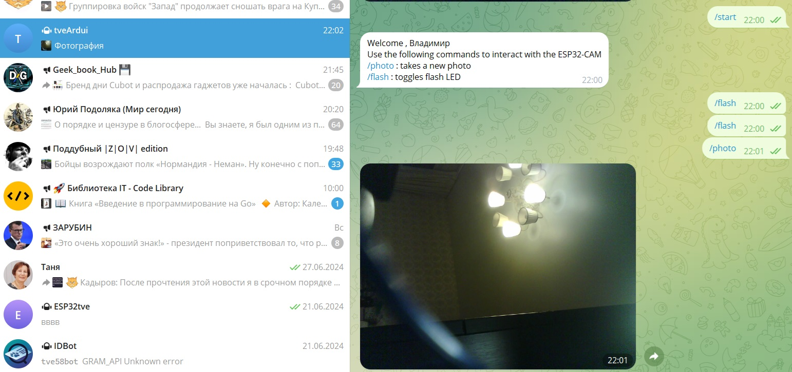
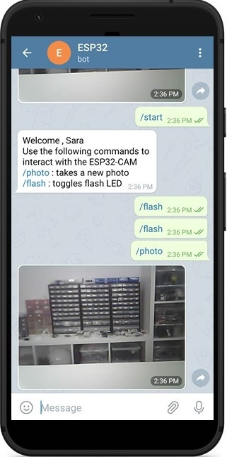
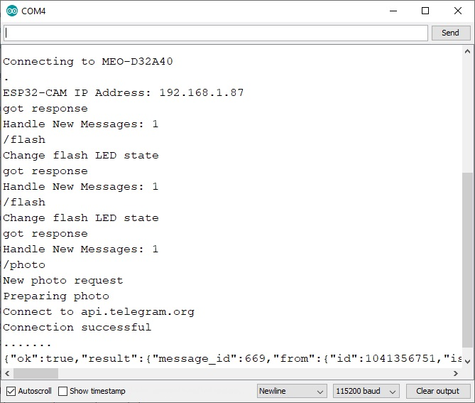
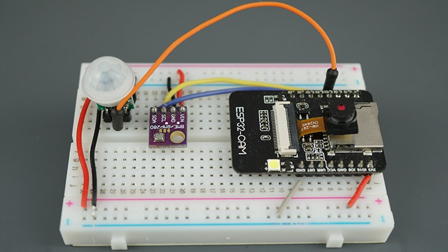
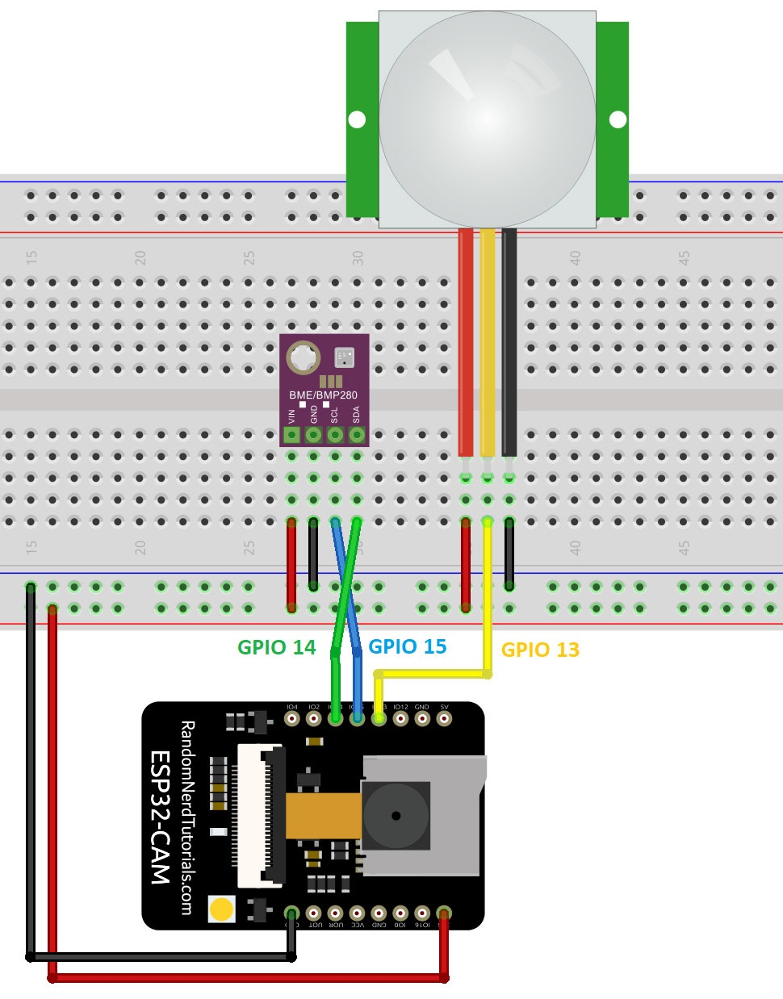
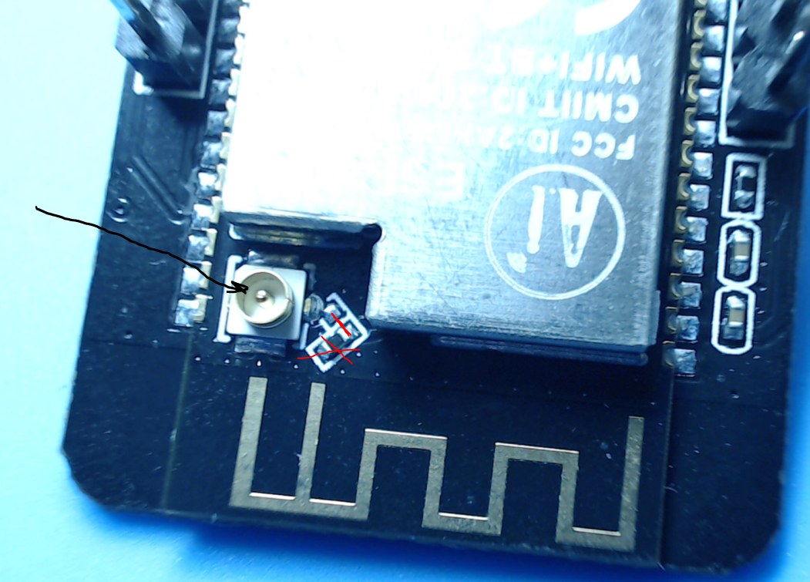
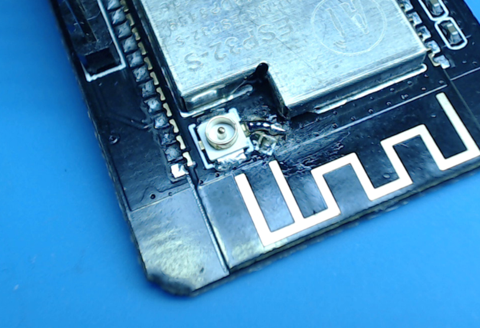

## [Доступ и контроль дачи через telegram](#)

---

### [Telegram: ESP32-CAM Take and Send Photo (Arduino IDE)](#esp32-cam-take-and-send-photo-telegram)

### [Пoдключение внешней антенны](#%D0%BF%D0%BE%D0%B4%D0%BA%D0%BB%D1%8E%D1%87%D0%B5%D0%BD%D0%B8%D0%B5-%D0%B2%D0%BD%D0%B5%D1%88%D0%BD%D0%B5%D0%B9-%D0%B0%D0%BD%D1%82%D0%B5%D0%BD%D0%BD%D1%8B)

### [Система фoто-наблюдения на ESP32-CAM с управлением через мессенджер Telegram](#%D1%81%D0%B8%D1%81%D1%82%D0%B5%D0%BC%D0%B0-%D1%84%D0%BE%D1%82%D0%BE-%D0%BD%D0%B0%D0%B1%D0%BB%D1%8E%D0%B4%D0%B5%D0%BD%D0%B8%D1%8F-%D0%BD%D0%B0-esp32-cam-%D1%81-%D1%83%D0%BF%D1%80%D0%B0%D0%B2%D0%BB%D0%B5%D0%BD%D0%B8%D0%B5%D0%BC-%D1%87%D0%B5%D1%80%D0%B5%D0%B7-%D0%BC%D0%B5%D1%81%D1%81%D0%B5%D0%BD%D0%B4%D0%B6%D0%B5%D1%80-telegram)

### [Рабoта над ошибками](#%D1%80%D0%B0%D0%B1%D0%BE%D1%82%D0%B0-%D0%BD%D0%B0%D0%B4-%D0%BE%D1%88%D0%B8%D0%B1%D0%BA%D0%B0%D0%BC%D0%B8)

---

### [ESP32-CAM Take and Send Photo Telegram](https://randomnerdtutorials.com/telegram-esp32-cam-photo-arduino/)

#### [Представляем Telegram](#)

Telegram Messenger - это облачный сервис обмена мгновенными сообщениями и передачи голоса по IP. Вы можете легко установить его на свой смартфон (Android и iPhone) или компьютер (ПК, Mac и Linux). Это бесплатно и без рекламы. Telegram позволяет создавать ботов, с которыми вы можете взаимодействовать.

“Боты - это сторонние приложения, которые запускаются внутри Telegram. Пользователи могут взаимодействовать с ботами, отправляя им сообщения, команды и встроенные запросы. Вы управляете своими ботами с помощью HTTPS-запросов к Telegram Bot API”.

ESP32-CAM будет взаимодействовать с Telegram-ботом для получения и обработки сообщений, а также отправки ответов. В этом уроке вы узнаете, как использовать Telegram для отправки сообщений вашему боту с запросом новой фотографии, сделанной с помощью ESP32-CAM. Вы можете получить фото, где бы вы ни находились (вам просто нужен Telegram и доступ в Интернет).

#### [Обзор проекта](#)

```
Вы создадите Telegram-бот для своей ESP32-CAM;
Вы можете начать разговор с ботом ESP32-CAM;
Когда вы отправляете сообщение / фотографию боту ESP32-CAM, плата ESP32-CAM получает сообщение, делает новое фото и отвечает этим фото;
Вы можете отправить сообщение / flash, чтобы переключить светодиодную вспышку ESP32-CAM;
Вы можете отправить сообщение / start, чтобы получить приветственное сообщение с командами для управления платой;
ESP32-CAM будет отвечать только на сообщения, поступающие от вашего идентификатора учетной записи Telegram.
```

У нас также есть специальный проект для ESP32-CAM с Telegram, который охватывает более продвинутые функции: [делайте фотографии, управляйте выходами, запрашивайте показания датчиков и уведомления о движении](https://randomnerdtutorials.com/esp32-cam-shield-pcb-telegram/).

Материал статьи реализован в приложении [Esp32TelegramByRuiSantos.ino, 2024-06-19](Esp32TelegramByRuiSantos/Esp32TelegramByRuiSantos.ino)

#### [2024.07.29 Проверка работы приложения](#)

1. Подключить обязательно ***внешнее питание 5В (до 2А)*** и последовательный порт (~COM5)
2. Открыть последовательный порт
3. Сделать принудительный сброс для запуска приложения и проконтроллировать через COM-порт подключение к WiFi-сети и присвоение устройству ip-адреса:

```
ets Jun  8 2016 00:22:57

rst:0x1 (POWERON_RESET),boot:0x13 (SPI_FAST_FLASH_BOOT)
configsip: 0, SPIWP:0xee
clk_drv:0x00,q_drv:0x00,d_drv:0x00,cs0_drv:0x00,hd_drv:0x00,wp_drv:0x00
mode:DIO, clock div:1
load:0x3fff0030,len:1448
load:0x40078000,len:14844
ho 0 tail 12 room 4
load:0x40080400,len:4
load:0x40080404,len:3356
entry 0x4008059c

Connecting to OPPO A9 2020
.
ESP32-CAM IP Address: 192.168.64.35
```

4. Подключить компьютер к сети ("OPPO A9 2020")
5. Выбрать телеграм-бот: "tveArdui"


6. Запустить диалог в боте "/Start"
7. Отработать включение-выключение вспышки и фотографирование



#### [Контрольные боты telegram, снятые 2024-06-17](#)

> Вся информация датирована 2023-10-13, когда был создан чат-бот ESP32tve.
> 

***BotFather***:

BotFather is the one bot to rule them all. Use it to create new bot accounts and manage your existing bots.

[About Telegram bots](https://core.telegram.org/bots)

[Bot API manual](https://core.telegram.org/bots/api)

Contact ***@BotSupport*** if you have questions about the Bot API.

/start

```
I can help you create and manage Telegram bots. If you're new to the Bot API, please see the manual (https://core.telegram.org/bots).

You can control me by sending these commands:

/newbot - create a new bot
/mybots - edit your bots

Edit Bots
/setname - change a bot's name
/setdescription - change bot description
/setabouttext - change bot about info
/setuserpic - change bot profile photo
/setcommands - change the list of commands
/deletebot - delete a bot

Bot Settings
/token - generate authorization token
/revoke - revoke bot access token
/setinline - toggle inline mode (https://core.telegram.org/bots/inline)
/setinlinegeo - toggle inline location requests (https://core.telegram.org/bots/inline#location-based-results)
/setinlinefeedback - change inline feedback (https://core.telegram.org/bots/inline#collecting-feedback) settings
/setjoingroups - can your bot be added to groups?
/setprivacy - toggle privacy mode (https://core.telegram.org/bots/features#privacy-mode) in groups

Web Apps
/myapps - edit your web apps (https://core.telegram.org/bots/webapps)
/newapp - create a new web app (https://core.telegram.org/bots/webapps)
/listapps - get a list of your web apps
/editapp - edit a web app
/deleteapp - delete an existing web app

Games
/mygames - edit your games (https://core.telegram.org/bots/games)
/newgame - create a new game (https://core.telegram.org/bots/games)
/listgames - get a list of your games
/editgame - edit a game
/deletegame - delete an existing game
```
/newbot

Alright, a new bot. How are we going to call it? Please choose a name for your bot.

ESP32tve

Good. Now let's choose a username for your bot. It must end in `bot`. Like this, for example: TetrisBot or tetris_bot.

tve58bot

> Done! Congratulations on your new bot. You will find it at t.me/tve58bot. You can now add a description, about section and profile picture for your bot, see /help for a list of commands. By the way, when you've finished creating your cool bot, ping our Bot Support if you want a better username for it. Just make sure the bot is fully operational before you do this.
> 
> Use this token to access the HTTP API:
> 6610230475:AAHSLATpcFDQF6sS9UycZoYK_vjIcAaegDg
> Keep your token secure and store it safely, it can be used by anyone to control your bot.
> 
> For a description of the Bot API, see this page: https://core.telegram.org/bots/api
> 

Сделано! Поздравляем вас с новым ботом. Вы найдете его по ссылке ***t.me/tve58bot***. Теперь вы можете добавить описание, раздел "О программе" и фотографию профиля для своего бота, список команд смотрите в разделе ***/help***. Кстати, когда вы закончите создавать своего крутого бота, свяжитесь с нашей службой поддержки, если вам нужно более подходящее имя пользователя для него. Просто убедитесь, что бот полностью работоспособен, прежде чем делать это.

Используйте этот токен для доступа к HTTP API:

***6610230475:AAHSLATpcFDQF6sS9UycZoYK_vjIcAaegDg***

Берегите свой токен и храните его в надежном месте, он может быть использован кем угодно для управления вашим ботом.

Описание API для ботов приведено на этой странице: ***https://core.telegram.org/bots/api***

***Telegram***:

Код для входа в Telegram: 33599. Не давайте код никому, даже если его требуют от имени Telegram!

Этот код используется для входа в Ваш аккаунт в Telegram. Он не может быть использован для чего-либо ещё. 

Если Вы не запрашивали код для входа, проигнорируйте это сообщение.

***IDBot***:

Send me username or joinchat-link, forward a message to me or add me to a group or channel. Напиши username или ссылку-приглашение (для чатов и каналов). Также можно переслать чужое сообщение или добавить бота в группу или канал.

/start

Привет! Добро пожаловать в @username_to_id_bot! Справка: /help. Канал с обновлениями: @idbotnews. P.S. Твой ID: 5302818460

/getid

tve58bot

```
Пользователь
@tve58bot
ESP32tve
id: 6610230475
```

🛫🛫🛫🛫🛫🛫🛫🛫🛫🛫

Новости и информация о боте: @idbotnews. Подпишись ;)

***ESP32tve***:

/start

/getid

#### [Универсальная библиотека Telegram-ботов - witnessmenow/Universal-Arduino-Telegram-Bot](https://github.com/witnessmenow/Universal-Arduino-Telegram-Bot)

Библиотека Arduino IDE для использования Telegram Bot API. Он разработан для использования с несколькими архитектурами Arduino.

Присоединяйтесь к [групповому чату библиотеки Arduino Telegram](https://t.me/arduino_telegram_library), если у вас есть какие-либо вопросы / отзывы или вы просто хотели бы быть в курсе прогресса библиотеки.

Эта библиотека предоставляет интерфейс для [Telegram Bot API](https://core.telegram.org/bots/api).

Telegram - это служба обмена мгновенными сообщениями, которая позволяет создавать ботов. Ботов можно настроить для отправки и получения сообщений. Это полезно для проектов Arduino, поскольку вы можете получать обновления из своего проекта или отправлять ему команды через свое приложение Telegram из любого места.

Это библиотека, созданная на основе [одной библиотеки](https://github.com/Gianbacchio/ESP8266-TelegramBot) и вдохновленная [другой](https://github.com/CasaJasmina/TelegramBot-Library).

Каждая библиотека поддерживала только один тип Arduino и имела разные реализованные функции. Единственное, что должно отличаться для каждой платы, - это фактическая отправка запросов в Telegram, поэтому я подумал, что библиотека, для которой можно легко настроить дополнительные архитектуры или платы, была бы полезна, хотя это приходит на ум:


***Установка***

Загруженный код можно включить в IDE в качестве новой библиотеки, выбрав меню:
```
 Sketch / include Library / Add .Zip library
 ```
 
Вам также необходимо установить библиотеку ArduinoJson, написанную [Бенуа Бланшоном](https://github.com/bblanchon). Найдите его в диспетчере библиотек Arduino или получите [здесь](https://github.com/bblanchon/ArduinoJson).

> ***Установил ArduinoJson 7.0.4  -->  2024-06-18***

***Несколько предварительных простых шагов для разговора с ботом***

[Поговорите с BotFather](https://core.telegram.org/bots#botfather).

***Демонстрация***

Загрузите код на свою плату ESP32-CAM. Не забудьте перейти в Инструменты> Плата и выбрать используемую плату. Перейдите в Инструменты> Порт и выберите COM-порт, к которому подключена ваша плата.

После загрузки кода нажмите встроенную кнопку ESP32-CAM RST, чтобы запустить код. Затем вы можете открыть последовательный монитор, чтобы проверить, что происходит в фоновом режиме.

Зайдите в свою учетную запись Telegram и начните переписку с вашим ботом.

Отправьте следующие команды и увидите, как бот ответит:

```
/start показывает приветственное сообщение с действительными командами;
/flash инвертирует состояние светодиодной вспышки;
/photo сделайте новое фото и отправьте его в вашу учетную запись Telegram.
```


В то же время на последовательном мониторе вы должны увидеть, что ESP32-CAM получает сообщения.



#### [Делаем telegram-bot](https://smmplanner.com/blog/gaid-kak-sozdat-i-nastroit-bota-v-tielieghramie/)

```
BotFather 
------------
                                       start
                                       /newbot
                                              
Alright, a new bot. How are we going to call it? Please choose a name for your bot.
Итак, новый бот. Как мы будем его называть? Пожалуйста, выберите имя для своего бота.

                                       tveArdui - имя бота
                                              
Good. Now let's choose a username for your bot. It must end in `bot`. Like this, for example: TetrisBot or tetris_bot.
Хорошо. Теперь давайте выберем имя пользователя (никнейм – это будет ссылка на нового робота в Телеграмме) для вашего бота. Оно должно заканчиваться на `bot`. Например, так: Tetris Bot или tetris_bot. 

                                       tveEsp_bot - никнейм бота

Сделано! Поздравляем вас с новым ботом. Вы найдете его по ссылке t.me/tveEsp_bot. Теперь вы можете добавить описание, раздел "О программе" и фотографию профиля для своего бота, список команд смотрите в разделе /help. Кстати, когда вы закончите создавать своего крутого бота, свяжитесь с нашей службой поддержки, если вам нужно более подходящее имя пользователя для него. Просто убедитесь, что бот полностью работоспособен, прежде чем делать это.

Используйте этот токен для доступа к HTTP API:

7348764883:AAER1MlELtB7H2bn6sJyAG1q3eE2ypoVzlk
7348764883:AAER1MlELtB7H2bn6sJyAG1q3eE2ypoVzlk

Берегите свой токен и храните его в надежном месте, он может быть использован кем угодно для управления вашим ботом.

Описание API для ботов приведено на этой странице: https://core.telegram.org/bots/api                                       

                                       /mybots
Choose a bot from the list below:
@tveEsp_bot      :      @tve58bot             
                          
```

#### Разрешение вопроса по идентификатору чата

Долго не мог понять, почему наш скетч выдает ошибку в телеграмм боте, пока решил не посмотреть, какой приходит идентификатор чата - оказалось, что это мой. (Телеграм это говорил, но я не поверил).

```
chat_id:          5302818460
P.S. Твой ID:     5302818460
```

Делаем проверку бота запросом к API:
```
https://api.telegram.org/bot7348764883:AAER1MlELtB7H2bn6sJyAG1q3eE2ypoVzlk/getMe
```

Получаем ответ:
```
{"ok":true,"result":
  {
  "id":7348764883,
  "is_bot":true,
  "first_name":"tveArdui",
  "username":"tveEsp_bot",
  "can_join_groups":true,
  "can_read_all_group_messages":false,
  "supports_inline_queries":false,
  "can_connect_to_business":false
  }
}
```


###### [в начало](#%D0%B4%D0%BE%D1%81%D1%82%D1%83%D0%BF-%D0%B8-%D0%BA%D0%BE%D0%BD%D1%82%D1%80%D0%BE%D0%BB%D1%8C-%D0%B4%D0%B0%D1%87%D0%B8-%D1%87%D0%B5%D1%80%D0%B5%D0%B7-telegram)

---

### Работа над ошибками

#### 1.1 'struct camera_config_t' has no member named 'grab_mode' - В 'struct camera_config_t' нет элемента с именем 'grab_mode'

```
C:\ittve-ESP32-CAM\98-Система фото-наблюдения на ESP32-CAM с управлением через мессенджер Telegram\Esp32TelegramByRuiSantos\Esp32TelegramByRuiSantos.ino: In function 'void configInitCamera()':

-----------------------------------------
108 строка:
config.grab_mode = CAMERA_GRAB_LATEST;
-----------------------------------------

Esp32TelegramByRuiSantos:108:10: error: 'struct camera_config_t' has no member named 'grab_mode'
Esp32TelegramByRuiSantos:108:22: error: 'CAMERA_GRAB_LATEST' was not declared in this scope

Несколько библиотек найдено для "WiFi.h"

Используется: C:\Users\Евгеньевич\AppData\Local\Arduino15\packages\esp32\hardware\esp32\1.0.2\libraries\WiFi

Не используется: C:\Program Files (x86)\Arduino\libraries\WiFi

exit status 1
'struct camera_config_t' has no member named 'grab_mode'

```

#### 1.2 Мои действия:

1.2.1 ***https://dl.espressif.com/dl/package_esp32_index.json*** 
заменил на
***https://espressif.github.io/arduino-esp32/package_esp32_dev_index.json
***
и перезагрузил скетч.

> Не помогло, та же ошибка.

1.2.2 Поставил  Esp32 от Espressif Systems версии 1.0.4. 

> Не помогло!

1.2.3 Установил из менеджера плат  Esp32 от Espressif Systems версии 3.0.1 (последнюю!). Совсем убрал ссылку в prefererces

> Ошибка устранена!


#### 2.1 A fatal error occurred: Could not open COM5, the port doesn't exist

```
Скетч использует 1072401 байт (54%) памяти устройства. Всего доступно 1966080 байт.
Глобальные переменные используют 47304 байт (14%) динамической памяти, оставляя 280376 байт для локальных переменных. Максимум: 327680 байт.
esptool.py v4.6
Serial port COM5

A fatal error occurred: Could not open COM5, the port doesn't exist
```

#### 2.2 Мои действия:

2.2.1 USB-UART не был подключен. Подключил программатор и сделал ***сброс*** платы при замкнутых ***GND-IO0*** 

> Ошибка устранена!


###### [в начало](#%D0%B4%D0%BE%D1%81%D1%82%D1%83%D0%BF-%D0%B8-%D0%BA%D0%BE%D0%BD%D1%82%D1%80%D0%BE%D0%BB%D1%8C-%D0%B4%D0%B0%D1%87%D0%B8-%D1%87%D0%B5%D1%80%D0%B5%D0%B7-telegram)

---

### [Система фото-наблюдения на ESP32-CAM с управлением через мессенджер Telegram](https://dzen.ru/a/Yr1MFCHCYGuW_akT)

[Исходный код системы фото-наблюдения с управлением через Telegram](Telegram_Full_v3_dzen/Telegram_Full_v3_dzen.ino)

### [ESP32-CAM with Telegram: Take Photos, Control Outputs, Request Sensor Readings and Motion Notifications](https://randomnerdtutorials.com/esp32-cam-shield-pcb-telegram/)

[Исходный код проекта](ESP32_CAM_Shield_PCB_Telegram/ESP32_CAM_Shield_PCB_Telegram.ino)






###### [в начало](#%D0%B4%D0%BE%D1%81%D1%82%D1%83%D0%BF-%D0%B8-%D0%BA%D0%BE%D0%BD%D1%82%D1%80%D0%BE%D0%BB%D1%8C-%D0%B4%D0%B0%D1%87%D0%B8-%D1%87%D0%B5%D1%80%D0%B5%D0%B7-telegram)

---

### [Подключение внешней антенны](https://dzen.ru/a/X_iqa7sU1U_7kgTl)

Для эффективной работы c Wi-Fi в плате ESP32 предусмотрена возможность подключения внешней антенны.



Для переключения платы ESP32 CAM необходимо перепаять резистор (показан красной линий - или просто капнуть каплю припоя).



Cкорость передачи фотографий даже с маленькой внешней антенной значительно возрастет. С использованием внутренней антенны полноценно поработать с платой ESP32 CAM не получится (объемы передаваемых данных тут значительно больше чем у часов или метеостанций).

###### [в начало](#%D0%B4%D0%BE%D1%81%D1%82%D1%83%D0%BF-%D0%B8-%D0%BA%D0%BE%D0%BD%D1%82%D1%80%D0%BE%D0%BB%D1%8C-%D0%B4%D0%B0%D1%87%D0%B8-%D1%87%D0%B5%D1%80%D0%B5%D0%B7-telegram)

---

### Библиография:

#### [Отправка изображений в Telegram с ESP32 без использования сторонних библиотек](https://kotyara12.ru/iot/esp32_telegram_photo/)

#### [Руководство по распиновке ESP32-CAM AI-Thinker: объясняется использование GPIOs](https://randomnerdtutorials.com/esp32-cam-ai-thinker-pinout/)

#### [Как программировать / загрузить код в ESP32-CAM AI-Thinker (Arduino IDE)](https://randomnerdtutorials.com/program-upload-code-esp32-cam/)

#### [Установка платы ESP32 в Arduino IDE 2 (Windows, Mac OS X, Linux)](https://randomnerdtutorials.com/installing-esp32-arduino-ide-2-0/)

#### [ESP32-CAM с Telegram: делайте фотографии, управляйте выходами, запрашивайте показания датчика и уведомления о движении](https://randomnerdtutorials.com/esp32-cam-shield-pcb-telegram/)

#### [Инструкция: Как создавать ботов в Telegram](https://habr.com/ru/articles/262247/)

#### [Гайд: как создать и настроить бота в Телеграме](https://smmplanner.com/blog/gaid-kak-sozdat-i-nastroit-bota-v-tielieghramie/)

###### [в начало](#%D0%B4%D0%BE%D1%81%D1%82%D1%83%D0%BF-%D0%B8-%D0%BA%D0%BE%D0%BD%D1%82%D1%80%D0%BE%D0%BB%D1%8C-%D0%B4%D0%B0%D1%87%D0%B8-%D1%87%D0%B5%D1%80%D0%B5%D0%B7-telegram)
