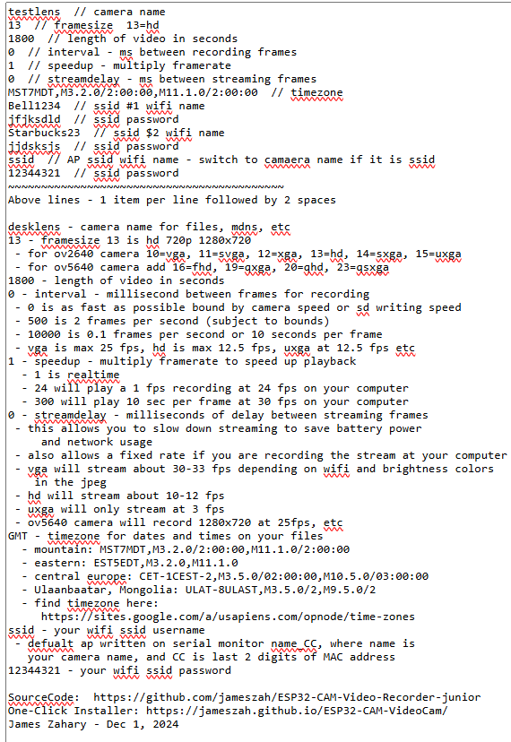

## ESP32-CAM-Video-Recorder


### [ESP32-CAM-Video-Recorder](https://github.com/jameszah/ESP32-CAM-Video-Recorder)

Обновление от 12 января 2022 года — ***esp32-arduino 2.0.2*** и замена ftp на http для передачи файлов

Далее ссылка на более новую и быстрая версия (с меньшим количеством функций) 

### [ESP32-CAM-Video-Recorder-junior](https://github.com/jameszah/ESP32-CAM-Video-Recorder-junior)

### VideoRecorderESP32-CAM

Для версии ***junior 57x***, которая у tve называется ***VideoRecorderESP32-CAM***, проверена и работает в IDE Arduino ESP32 v2.0.2 следующая информация:

Нужно:  [https://github.com/tzapu/WiFiManager](https://github.com/tzapu/WiFiManager)

```
Using library ESP32       at version 2.0.2 in folder: C:\ArduinoPortable\arduino-1.8.19\portable\packages\esp32\hardware\esp32\2.0.2\libraries\ESP32 
Using library EEPROM      at version 2.0.2 in folder: C:\ArduinoPortable\arduino-1.8.19\portable\packages\esp32\hardware\esp32\2.0.2\libraries\EEPROM 
Using library WiFi        at version 2.0.2 in folder: C:\ArduinoPortable\arduino-1.8.19\portable\packages\esp32\hardware\esp32\2.0.2\libraries\WiFi 
Using library Update      at version 2.0.2 in folder: C:\ArduinoPortable\arduino-1.8.19\portable\packages\esp32\hardware\esp32\2.0.2\libraries\Update 
Using library WebServer   at version 2.0.2 in folder: C:\ArduinoPortable\arduino-1.8.19\portable\packages\esp32\hardware\esp32\2.0.2\libraries\WebServer 
Using library DNSServer   at version 2.0.2 in folder: C:\ArduinoPortable\arduino-1.8.19\portable\packages\esp32\hardware\esp32\2.0.2\libraries\DNSServer 
Using library ESPmDNS     at version 2.0.2 in folder: C:\ArduinoPortable\arduino-1.8.19\portable\packages\esp32\hardware\esp32\2.0.2\libraries\ESPmDNS 
Using library WiFiClientSecure ..... 2.0.2 in folder: C:\ArduinoPortable\arduino-1.8.19\portable\packages\esp32\hardware\esp32\2.0.2\libraries\WiFiClientSecure 
Using library FS          at version 2.0.2 in folder: C:\ArduinoPortable\arduino-1.8.19\portable\packages\esp32\hardware\esp32\2.0.2\libraries\FS 
Using library SD_MMC      at version 2.0.2 in folder: C:\ArduinoPortable\arduino-1.8.19\portable\packages\esp32\hardware\esp32\2.0.2\libraries\SD_MMC 
Using library HTTPClient  at version 2.0.2 in folder: C:\ArduinoPortable\arduino-1.8.19\portable\packages\esp32\hardware\esp32\2.0.2\libraries\HTTPClient 

Using library ArduinoJson at version 6.18.5     in folder: C:\ArduinoPortable\arduino-1.8.19\portable\sketchbook\libraries\ArduinoJson 
Using library WiFiManager at version 2.0.5-beta in folder: C:\ArduinoPortable\arduino-1.8.19\portable\sketchbook\libraries\WiFiManager 


"C:\\ArduinoPortable\\arduino-1.8.19\\portable\\packages\\esp32\\tools\\xtensa-esp32-elf-gcc\\gcc8_4_0-esp-2021r2/bin/xtensa-esp32-elf-size" -A "C:\\Users\\James\\AppData\\Local\\Temp\\arduino_build_546686/TimeLapseAviA1.5.ino.elf"
Sketch uses 1193637 bytes (37%) of program storage space. Maximum is 3145728 bytes.
Global variables use 52980 bytes (16%) of dynamic memory, leaving 274700 bytes for local variables. Maximum is 327680 bytes.
```

### VideoRecorderESP32-CAM-junior62

Версия ***junior62*** проверена и работает в ***Arduino IDE 2.3.7 - Espressif ESP32 3.3.5***.

#### Обновление от 25 февраля 2025 года

- позволяет настроить 2 маршрутизатора, и выберется лучший (настройте его на рабочем месте и доведите до точки установки без перенастройки);
- поддерживает работу точки доступа AP, поэтому вы можете использовать ее без маршрутизатора и получать доступ с телефона;
- файлы доступны для загрузки, лучше отсортированы и организованы;
- позволяет просматривать видео внутри и нажимать на различные точки, чтобы убедиться, что это именно то видео, которое вы хотите загрузить;
- позволяет повторно проиндексировать видео на SD-карте, чтобы вы могли просмотреть его и загрузить проиндексированную версию (в случае разряда батареи или другой проблемы, из-за которой файл не был закрыт должным образом);
- имеет ota конечную точку 192.168.1.100/ota и т.д. с паролем "mrpeanut";
- имеет конечную точку 192.168.1.100/capture для настройки сетевой камеры motioneye независимо от локальной записи;
- устраняет требование иметь 4 МБ esp32-cam, поскольку в некоторых стандартных версиях их всего 2 МБ;
- конечные точки 192.168.1.100:81/stream и 192.168.1.100:82/stream для 2 потоковых каналов;
- конечные точки 192.168.1.100 /stop и 192.168.1.100/start для остановки запуска записи из Интернета (начинает запись при перезагрузке);
- заземленный / незаземленный gpio 12 для остановки / запуска записи с помощью переключателя или pir и т.д.;
- "остановка" gpio 12 заменяет веб-остановку, описанную выше;
- множество улучшений эффективности;
- программа установки в один клик здесь https://jameszah.github.io/ESP32-CAM-VideoCam /;
- запустите на чистой SD-карте, и она создаст файл по умолчанию config.txt и запустите точку доступа в "desklens", введите пароль "12344321", затем 192.168.4.1 и нажмите "редактировать config.txt " чтобы указать ваш собственный ssid, часовой пояс, параметры записи;
- установите тип платы как AI-Thinker ESP32-CAM с минимальным объемом памяти 1,9 МБ с ota.

Параметры config2.txt — описаны в нижней части файла конфигурации по умолчанию — отредактируйте их, оставив 2 пробела для // и комментариев (***сид и пароль диезом "#" от tve***).




#### Обновление от 7 января 2022 года

- может работать без подключения к интернету, а также записывать в стандартном формате HD; 
- можно отредактировать файл config.txt и поместить его на SD-карту, после включения Wi-Fi можно смотреть потоковое видео и загружать его в браузер и на компьютер/телефон.

#### Обновление от 2 января 2022 года - обновления для Arduino 1.8.19 и esp32-arduino 2.0.2

Требуются все файлы из папки v58:
https://github.com/jameszah/ESP32-CAM-Video-Recorder-junior/tree/master/v58

В esp32-arduino 2.0.2 сломалось несколько вещей (мьютексы, некоторые вызовы sd_mmc). Очевидно, что для всех этих функций Wi-Fi вам понадобится работающий Wi-Fi, но вы можете выполнять простую запись с управлением переключателем и без Wi-Fi.

Главный экран такой же, за исключением ссылки на ***esp32_sd_file_manager*** для загрузки или редактирования avi и config.txt.


Затем идёт экран потоковой передачи (не показан) и экран с фотографиями внизу — вы можете делать 10 фотографий с интервалом в 3 секунды.


Далее экран ***esp32_sd_file_manager***, показано место на SD-карте и используемое пространство.

Перейдите в корневой каталог,  папки белого цвета - щелкните по любой, чтобы войти в эту папку.

Файлы синего / оранжевого цвета - щелкните по любому файлу, чтобы загрузить его в свой браузер / компьютер. "D", "R" и "E" для удаления, переименования или редактирования файлов - редактируйте только текстовые файлы.

Загрузите все файлы, чтобы отобразить всю папку (не вложенные папки).

Вы также можете загружать файлы в "Зоне удаления файлов", Подробнее об этом читайте здесь [https://github.com/jameszah/ESPxWebFlMgr/tree/master/esp32_sd_file_manager](https://github.com/jameszah/ESPxWebFlMgr/tree/master/esp32_sd_file_manager).

Эта версия доступна для загрузки на Windows и Android, а также, предположительно, на других платформах.

При загрузке Android в браузер на телефоне Samsumg возникает проблема: файл .avi сохраняется с типом файла .phps. Вы можете удалить его, но он распознаётся как файл .avi и воспроизводится нормально. 

> (12 января 2022 г. — добавьте дату и время в файлы)


Вот диалоговое окно загрузки файла в Windows.


Вы также можете завершить запись и перезагрузить устройство с веб-страницы.


При благоприятных условиях вы можете загружать файлы со скоростью около 2 Мбит/с во время записи и 3 Мбит/с в перерывах между записями, при этом максимальная скорость esp32 составляет около 3,5 Мбит/с.


#### Обновление от 28 декабря 2021 года — новая версия с передачей файлов через http-браузер для загрузки фильмов

Вам понадобятся все файлы из папки v57:
[https://github.com/jameszah/ESP32-CAM-Video-Recorder-junior/tree/master/v57](https://github.com/jameszah/ESP32-CAM-Video-Recorder-junior/tree/master/v57)

Здесь использовуется следующая библиотека для передачи файлов на компьютер или телефон:
[https://github.com/jameszah/ESPxWebFlMgr/tree/master/esp32_sd_file_manager](https://github.com/jameszah/ESPxWebFlMgr/tree/master/esp32_sd_file_manager)

Следите за обновлениями, чтобы получить инструкции.

Вот пример таймлапса, записанный и загруженный на Youtube. Настройки: размер кадра UXGA (13), качество 15, 1 кадр в секунду, продолжительность 1800 секунд, ускорение в 30 раз. 


Вот сэмпл в реальном времени, записанный и загруженный на Youtube. 

Были установлены следующие настройки: 

- размер кадра HD (11), качество 14, максимальная частота кадров в секунду или нулевой интервал, продолжительность 30 секунд, ускорение в 1 раз. 

Он вышел примерно с частотой 12,4 кадра в секунду. Небольшое снижение качества - более высокое число кадров в секунду - уменьшит количество байтов на кадр и сохранит максимальную скорость камеры на уровне 12,5 кадра в секунду для HD. 


#### Обновление от 10 июня 2021 года — новая программа

Записывает видео и отправляет его в ваш аккаунт в Telegram — без SD-карты!

[https://github.com/jameszah/ESP32-CAM-Video-Telegram](https://github.com/jameszah/ESP32-CAM-Video-Telegram).

#### Обновление от 13 мая 2021 года — v50lpmod для Arduino 1.8.13 и ядра esp32-arduino 1.06 

Это та же версия, что и предыдущая, с небольшим модом для устранения проблемы с неработающим jpeg. Критическая строка находится здесь:

```
esp_err_t set_ps = esp_wifi_set_ps(WIFI_PS_NONE);
```

Этот фрагмент отключает режим энергосбережения модема. Из-за режима энергосбережения модем на какое-то время переходил в спящий режим, а когда он просыпался, это вызывало сбой в системе i2s (моя теория), из-за чего камера i2s сбивалась и создавала некачественные JPEG-изображения.

Подробнее о том, как я пришёл к этому решению (думаю, на это ушло 2–3 месяца!)

[espressif/esp32-camera#244 (комментарий)](https://github.com/espressif/esp32-camera/issues/244#issuecomment-831561336)

#### Обновление от 19 апреля 2021 года — версия 50 для Arduino 1.8.13 и ядра esp32-arduino 1.06

Использует текущую версию Arduino IDE 1.8.13 и текущую версию ядра esp32-arduino 1.06, которое поддерживает камеру ov5640 в дополнение к обычной ov2640.

Частота кадров улучшилась — ov2640 будет записывать со скоростью 12,5 кадров в секунду в обычном HD-разрешении 1280x720.

Также вы можете поместить на SD-карту файл конфигурации под названием config.txt, в котором будут заданы все параметры записи. См. прилагаемый файл config.txt. Таким образом, вы можете скомпилировать и установить версию, представленную здесь, а затем управлять всем, редактируя файл config.txt на SD-карте. Это намного проще, даже если вы работаете на компьютере разработчика.

Вы можете снимать на полной скорости с любым размером кадра и качеством, в режиме замедленной съёмки, а также вести или не вести трансляцию по своему усмотрению.

Проблема связана с камерой esp32 и Wi-Fi, которые взаимодействуют друг с другом. Поэтому, когда Wi-Fi включен, время от времени будет появляться «сломанный» кадр — один кадр видео, который будет выглядеть странно. Если отключить Wi-Fi, всё будет работать идеально.

В файле config.txt есть параметры для запуска без Wi-Fi, для запуска Wi-Fi с целью получения текущего времени с последующим отключением, для использования Wi-Fi-Man с потоковой передачей, а также для использования SSID Wi-Fi из файла конфигурации и управления им с помощью переключателя на контакте 13: включите его, чтобы посмотреть в видоискатель, а затем выключите, чтобы получить идеальную запись.

Заземление контакта 12, поэтому запись прекращается. И заземление контакта 13 для включения/отключения Wi-Fi с использованием того же оборудования, которое описано ниже.

Включен код для удаления файлов, поэтому старые видео будут удаляться, пока камера работает.

Кроме того, здесь есть задачи, мьютексы и приоритеты, вопреки первоначальному замыслу. Всё это гарантирует, что камера, SD-карта и Wi-Fi будут работать на полной скорости, не мешая друг другу. При желании вы можете записывать потоковое видео с помощью VLC на своём компьютере.

#### Обновление от 4 января 2021 года — потоковая передача GOPRO с помощью WiFiManager

v10x-wifiman — добавлен WiFiManager для настройки имени сети и пароля Wi-Fi с помощью телефона

используйте обычную процедуру WiFiManager для настройки ssid с адресом 192.168.4.1 и т. д. [https://github.com/tzapu/WiFiManager](https://github.com/tzapu/WiFiManager)

Вы должны использовать последнюю версию кода WiFiManager, поддерживающую ESP32. На данный момент это версия 2.0.3-alpha, которую можно установить в Arduino IDE — «Управление библиотеками». После установки SSID необходимо перезагрузить ESP32.

В комментариях есть ещё кое-что новое: версия, в которой снова добавлен FTP, и версия, в которой запись замедляется для таймлапса или просто снижается частота кадров для экономии места на SD-карте.

#### Обновление от 28 сентября 2020 года — ESP32-CAM «GOPRO»

v10 — быстрая и единственная версия

- по умолчанию интернета нет, и выполняется запись в формате SVGA со скоростью 25 кадров в секунду, качеством 10 и серией из 30-минутных видеороликов.
- добавьте значение IncludeInternet к 1 и введите свой ssid и пароль, чтобы получать прямую трансляцию.
- добавьте переключатели к контактам 12 и 13, если вы хотите остановить запись, или переключитесь на другую конфигурацию - никаких изменений программного обеспечения не требуется
- если вы заземлите контакт 12, запись прекратится
- если вы заземлите вывод 13, следующее видео будет с разрешением UXGA 6 кадров в секунду, качеством 10, продолжительностью 30 минут - или измените код, если хотите
- старые файлы в папке /old

#### Обновление от 24 сентября 2020 года — ESP32-CAM «gopro»

v09 — более быстрая версия — управляется с помощью переключателей

- интернет по умолчанию отключен, поэтому вы #определяете значение IncludeInternet равным 1 и вводите свой ssid и пароль
- если у вас нет переключателей, подключенных к gpio12 и gpio13, то они не будут заземлены, и он будет "записывать" и "svga 25 кадров в секунду".
- при SVGA 25 кадров в секунду, качестве 12 in the sunshine вы получаете файлы объемом 1,5 ГБ за 30 минут 
- поэтому уменьшите качество, переключитесь на меньший размер кадра или перейдите к системе таймлапса со скоростью 1 кадр в секунду или 10 кадров в секунду и т.д., чтобы получить файлы меньшего размера (это файлы mjpeg avi, поэтому каждый кадр представляет собой независимый формат jpeg, поэтому вы можете извлечь их все, но вы не получите преимуществ в размере, как у h264 или xvid, и т.д)
- на рисунках ниже показано, как просмотреть потоковое видео или серию кадров в вашем браузере
- имена файлов теперь "desklens10.003.avi", поэтому с ними легко работать. «desklens» — это название вашего устройства, 10 — это 10-я загрузка вашего устройства, а 003 — это 3-й файл, созданный во время этой загрузки.


#### Обновление от 20 сентября 2020 года — очень быстро

v07 — более быстрая версия — должна работать на полной скорости камеры

- по умолчанию интернет отключен — измените значение на 1, затем введите SSID и пароль
- по умолчанию используется VGA, качество 10, видео продолжительностью 5 минут - 25 кадров в секунду и в реальном времени, это позволяет создавать файлы размером около 80 МБ в минуту, то есть 200 минут для чипа на 16 ГБ
снижайте качество, чтобы получать файлы меньшего размера! (чем ниже качество, тем больше число).

#### Обновление от 13 сентября 2020 года — добавление сложностей

v02 — базовая версия

v04 — добавлены Wi-Fi, отображение времени, трансляция со скоростью 5 кадров в секунду и фотографии со скоростью 1 кадр в секунду

- вам нужно указать ниже свой SSID и пароль от Wi-Fi
- если вы отойдете от Wi-Fi, он перестанет работать, но запись продолжится
- если вы отойдете от Wi-Fi во время загрузки, он перестанет работать, но вы будете записывать события января 1970 года
- на главной веб-странице отображается только доступное дисковое пространство и уровень сигнала Wi-Fi, а большая часть статистики из другой версии удалена
- функция потоковой передачи отображает движущееся изображение в одном окне, которое вы можете смотреть или записывать на своем компьютере с помощью VLC и т. д. При плохом Wi-Fi вы можете замедлить скорость с 5 кадров в секунду до 1 или 2 кадров в секунду, заменив задержку (200) на более длительную задержку
- функция "Фотографии" показывает серию фотографий с интервалом в 1 секунду в течение 15 секунд, которые вы можете прокрутить в своем веб-браузере и сохранить в формате jpg или обновить еще на 15 секунд.
- и в потоковой передаче, и в фотографиях используются одни и те же изображения, которые хранятся в файле avi, поэтому это не должно влиять на частоту кадров записи на SD, но вы можете увидеть частичные изображения, если у вас медленный Wi-Fi и устройство записи на sd удаляет изображение во время передачи. Сообщайте о проблемах в комментариях. 😃

v04a — исправление ошибок при потоковой передаче в условиях плохого Wi-Fi-соединения, а также добавление статистики на веб-страницу для отслеживания частоты кадров в секунду.


#### Оригинал от 12 сентября 2020 года

***Джеймс Захари, 12 сентября 2020 г. jamzah.plc@gmail.com***

[https://github.com/jameszah/ESP32-CAM-Video-Recorder-junior](https://github.com/jameszah/ESP32-CAM-Video-Recorder-junior)

[https://github.com/jameszah/ESP32-CAM-Video-Recorder](https://github.com/jameszah/ESP32-CAM-Video-Recorder)

```
jameszah/ESP32-CAM-Video-Recorder is licensed under the
GNU General Public License v3.0

jameszah/ESP32-CAM-Video-Recorder-junior is licensed under the
GNU General Public License v3.0
```

Это код для Arduino со стандартной настройкой для ESP32-CAM - Плата ESP32 Wrover Module - Схема разбиения на разделы Huge APP (3 МБ без OTA)

Упрощённая версия обладает 100 другими функциями, такими как Wi-Fi, потоковое видео, управление по HTTP, обновления в Telegram, управление с помощью пиратских ключей, сенсорное управление, загрузка по FTP и т. д. Всё это делает её очень большой и сложной.

Этот код написан на простом языке Arduino без каких-либо семафоров, задач, приоритетов, RTOS и прочего...

Просто задайте 4 параметра, скомпилируйте и загрузите программу, и она будет вести запись при включении питания до тех пор, пока не заполнится SD-карта или не выключится питание. Затем извлеките SD-карту и перенесите её на свой компьютер, и вы увидите все файлы, кроме последнего avi-файла, который был удалён при отключении питания.

Обновление: я добавил немного сложностей. Подключите контакт 12 к заземлению, чтобы остановить видео — без «мёртвых» видео — и предотвратить запись. Отсоедините контакт 12, и запись будет продолжаться бесконечно.

Параметры для компиляции:

- размер кадра: 10, 9, 7, 6, 5:

```
10 - UXGA (1600x1200 @ 6 fps), 
9 - SXGA (1280x1024 @ 6 fps), 
7 - SVGA(800x600 @ 24 fps), 
6 - VGA(640x480 @ 24 fps), 
5 - CIF(400x296 @ 50 fps)
```
- качество — от 1 до 63; 10 — хорошее начало, увеличьте до 20, чтобы получить больше кадров в секунду — должно быть выше, чем jpeg_quality ниже
- avi_length — количество секунд для каждого avi — по истечении этого времени файлы закрываются и начинается запись следующего файла — например, 60 или 1800
- devname — текстовое имя вашей камеры, когда файлы находятся на вашем компьютере
- 
Обратите внимание, что при большом размере кадра и высоком качестве будет генерироваться много байтов, которые необходимо записать на SD-карту. Указанные выше частоты кадров предназначены для камеры OV2640, и ваша SD-карта должна быть способна обработать все эти данные до того, как будет сформирован следующий кадр. 

Если SD-карта не может обработать все эти данные, камера будет простаивать в ожидании SD-карты. Уменьшите размер кадра (UXGA -> SVGA) и снизьте качество (10 -> 15 -> 20, большее число означает более низкое качество), чтобы увеличить частоту кадров до пределов камеры. 

Если у вас достаточно быстрая SD-карта, она будет записывать на полной скорости камеры.

При использовании SD-карты Lexar 633x circle10, U3, V30 с качеством 20 запись будет вестись на полной скорости камеры при тусклом освещении в помещении. При ярком освещении на улице — например, при взгляде на солнце — скорость записи снизится вдвое — примерно до 12 кадров в секунду в формате SVGA. Если вы настаиваете на том, чтобы смотреть на солнце, можно снизить качество, чтобы сохранить высокую частоту кадров.

Если использовать SD-карту из долларового магазина — EAGET circle10, U1 — она будет записывать примерно половину объёма памяти камеры при тусклом освещении в помещении.

Чтобы узнать скорость записи, можно посмотреть на мигающий красный светодиод на задней панели чипа. SD-чипы для видео более предсказуемы.

Файлы будут называться, например, так:

```
desklens 10.3 + 120s.avi

"desklens" is your devname
10 - is a number stored in eprom that will increase everytime your device boots
3 - is the 3rd file created during the current boot
+120s - is an indictation of how long since we started recording on this boot
      - this is the 3rd file, and started 120 seconds after the boot, so the files must be 60 seconds long
```

Маленький красный светодиод на задней панели мигает при каждом кадре.


