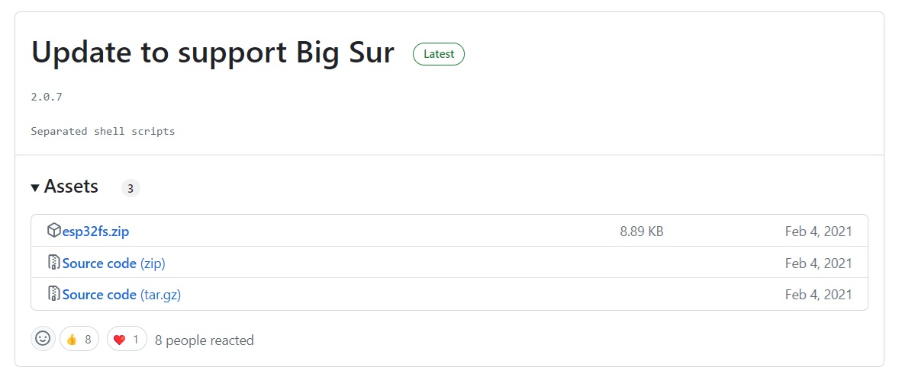

## [Загрузить файлы в файловую систему ESP32](https://randomnerdtutorials.com/arduino-ide-2-install-esp32-littlefs/)

### [Arduino IDE2 - установка загрузчика ESP32 LittleFS для загрузки файлов в файловую систему](https://randomnerdtutorials.com/arduino-ide-2-install-esp32-littlefs/)

### [Arduino IDE1.8 - установка загрузчика ESP32 LittleFS для загрузки файлов в файловую систему](https://randomnerdtutorials.com/esp32-littlefs-arduino-ide/)

***LittleFS*** - это облегченная файловая система, созданная для микроконтроллеров, которая позволяет вам обращаться к флэш-памяти так же, как вы это делали бы в стандартной файловой системе вашего компьютера, но более простая и ограниченная. Плагин, который мы установим, позволяет использовать три разные файловые системы: LittleFS, SPIFFS или FatFs.

LittleFS позволяет обращаться к флэш-памяти так же, как вы это делали бы в стандартной файловой системе вашего компьютера, но она проще и ограниченнее. Вы можете читать, записывать, закрывать и удалять файлы.

Есть несколько преимуществ использования LittleFS по сравнению с SPIFFS:

```
LittleFS оптимизирован для низкого использования ресурсов и использует алгоритм выравнивания износа, который равномерно распределяет записи по флэш-памяти, продлевая срок ее службы.
LittleFS обеспечивает более быстрое монтирование и доступ к файлам за счет использования структуры индексации каталогов.
LittleFS сводит к минимуму риск повреждения данных при отключении питания или системных сбоях.
LittleFS находится в активной разработке.
```

#### Установка загрузчика файловой системы LittleFS для Windows:

- перейдите на [страницу выпусков](https://github.com/lorol/arduino-esp32fs-plugin/releases) и загрузите последнюю версию ***esp32fs.zip***.



- Распакуйте загруженный файл. У вас должна быть папка с именем esp32fs с файлом под названием ***esp32fs.jar*** внутри.

- Найдите расположение папки для скетчей - в Arduino IDE перейдите в ***Файл> Настройки*** и проверьте местоположение вашего Sketchbook. В моем случае это по следующему пути: ***C:\Users\Евгеньевич\Documents\Arduino***.

- Перейдите в папку sketchbook и создайте папку ***tools***, если у вас ее еще нет (убедитесь, что приложение Arduino IDE закрыто).

- Внутри папки ***tools*** создайте другую папку с именем ***ESP32FS***, если вы еще этого не сделали.

- Внутри папки ***ESP32FS*** создайте папку с именем ***tool***.

-  Скопируйте ***esp32fs.jar*** файл в папку ***tool*** (если у вас уже есть esp32fs.jar файл из предыдущего плагина, удалите его и замените новым). Итак, структура каталогов будет выглядеть следующим образом:

```
<home_dir>/Arduino/tools/ESP32FS/tool/esp32fs.jar
```

- Теперь вы можете открыть Arduino IDE.

Чтобы проверить, успешно ли установлен плагин, откройте Arduino IDE и выберите свою плату ESP32. В меню Инструменты убедитесь, что у вас есть опция “Загрузка данных эскиза ESP32“. Нажмите на эту опцию. Появится окно, в котором вы сможете выбрать файловую систему, которую вы хотите использовать.

Загрузчик файловой системы ESP32 Arduino IDE выбирает файловую систему
Как вы можете видеть, у вас есть возможность выбрать из LittleFS, SPIFFS или FatFs, и у вас даже может быть возможность стереть flash, если это необходимо.

Поздравляем! Вы успешно установили плагин Filesystem uploader для ESP32 в Arduino IDE.

#### Загрузка файлов с помощью загрузчика файловой системы

Чтобы загрузить файлы в файловую систему ESP32 LittleFS, следуйте следующим инструкциям.

1) Создайте эскиз Arduino и сохраните его. Для демонстрации вы можете сохранить пустой эскиз.

2) Затем откройте папку sketch. Вы можете перейти в ***Sketch > Показать папку Sketch***. Должна открыться папка, в которой сохранен ваш эскиз.

3) Внутри этой папки создайте новую папку с именем ***data***.

4) Внутри папки data находятся файлы, которые вы хотите сохранить в файловой системе ESP32. В качестве примера создайте .txt файл с некоторым текстом под названием test_example.

5) Затем, чтобы загрузить файлы, в Arduino IDE вам просто нужно перейти в ***Инструменты > Загрузка данных эскиза ESP32***.

6. Выберите опцию ***LittleFS*** и нажмите ***OK***.

> Убедитесь, что последовательный монитор закрыт перед загрузкой файлов, в противном случае вы получите сообщение об ошибке, связанной с последовательной связью, и файлы не будут загружаться.
> 
> Программа загрузки перезапишет все, что вы уже сохранили в файловой системе.
> 
> Примечание: в некоторых платах разработки ESP32 вам нужно нажать встроенную кнопку ЗАГРУЗКИ примерно на две секунды, чтобы загрузить файлы.

Файлы будут успешно загружены в файловую систему ESP32, когда вы увидите сообщение “Изображение LittleFS загружено“.

2024-08-06: Загрузил ***test_example.txt*** в файловую систему со второй попытки. Вначале была ошибка, потом нажал Reset микросхемы с замкнутым GND и IO0, и запись была успешной:

```
LittleFS Image Uploaded
-----------------------
Chip : esp32
Using partition scheme from Arduino IDE.
Start: 0x3d0000
Size : 0x20000
mklittlefs : C:\Users\Евгеньевич\AppData\Local\Arduino15\packages\esp32\tools\mklittlefs\3.0.0-gnu12-dc7f933\mklittlefs.exe

esptool : C:\Users\Евгеньевич\AppData\Local\Arduino15\packages\esp32\tools\esptool_py\4.6\esptool.exe

[LittleFS] data   : C:\ittve-ESP32-CAM\15-otpravit-ehlektronnoe-pismo-s-pomoshchyu-smtp-servera\ESP32-Send-Email-HTML-and-raw-text\data
[LittleFS] offset : 0
[LittleFS] start  : 3997696
[LittleFS] size   : 128
[LittleFS] page   : 256
[LittleFS] block  : 4096
->/test_example.txt
[LittleFS] upload : C:\Users\615A~1\AppData\Local\Temp\arduino_build_740153/ESP32-Send-Email-HTML-and-raw-text.littlefs.bin
[LittleFS] address: 3997696
[LittleFS] port   : COM5
[LittleFS] speed  : 460800
[LittleFS] mode   : dio
[LittleFS] freq   : 80m

->esptool.py v4.6
->Serial port COM5
->Connecting....
->Chip is ESP32-D0WD (revision v1.0)
->Features: WiFi, BT, Dual Core, 240MHz, VRef calibration in efuse, Coding Scheme None
->Crystal is 40MHz
->MAC: a4:e5:7c:db:b3:90
->Uploading stub...
->Running stub...
->Stub running...
->Changing baud rate to 460800
->Changed.
->Configuring flash size...
->Auto-detected Flash size: 4MB
->Flash will be erased from 0x003d0000 to 0x003effff...
->Compressed 131072 bytes to 466...
->Writing at 0x003d0000... (100 %)
->Wrote 131072 bytes (466 compressed) at 0x003d0000 in 0.7 seconds (effective 1418.2 kbit/s)...
->Hash of data verified.
->
->Leaving...
->Hard resetting via RTS pin...
```

#### Тестирование плагина для загрузки файловой системы


```
ets Jun  8 2016 00:22:57

rst:0x1 (POWERON_RESET),boot:0x13 (SPI_FAST_FLASH_BOOT)
configsip: 0, SPIWP:0xee
clk_drv:0x00,q_drv:0x00,d_drv:0x00,cs0_drv:0x00,hd_drv:0x00,wp_drv:0x00
mode:DIO, clock div:1
load:0x3fff0030,len:1448
load:0x40078000,len:14844
ho 0 tail 12 room 4
load:0x40080400,len:4
load:0x40080404,len:3356
entry 0x4008059c
E (456) esp_littlefs: ./managed_components/joltwallet__littlefs/src/littlefs/lfs.c:1369:error: Corrupted dir pair at {0x0, 0x1}

E (456) esp_littlefs: mount failed,  (-84)
E (460) esp_littlefs: Failed to initialize LittleFS
An Error has occurred while mounting SPIFFS


```

```
ets Jun  8 2016 00:22:57

rst:0x1 (POWERON_RESET),boot:0x13 (SPI_FAST_FLASH_BOOT)
configsip: 0, SPIWP:0xee
clk_drv:0x00,q_drv:0x00,d_drv:0x00,cs0_drv:0x00,hd_drv:0x00,wp_drv:0x00
mode:DIO, clock div:1
load:0x3fff0030,len:1288
load:0x40078000,len:13872
load:0x40080400,len:4
ho 8 tail 4 room 4
load:0x40080404,len:3048
entry 0x40080590
E (459) esp_littlefs: ./managed_components/joltwallet__littlefs/src/littlefs/lfs.c:1369:error: Corrupted dir pair at {0x0, 0x1}

E (460) esp_littlefs: mount failed,  (-84)
E (463) esp_littlefs: Failed to initialize LittleFS
An Error has occurred while mounting SPIFFS

```

Наконец !!!

```
ets Jun  8 2016 00:22:57

rst:0x1 (POWERON_RESET),boot:0x13 (SPI_FAST_FLASH_BOOT)
configsip: 0, SPIWP:0xee
clk_drv:0x00,q_drv:0x00,d_drv:0x00,cs0_drv:0x00,hd_drv:0x00,wp_drv:0x00
mode:DIO, clock div:1
load:0x3fff0030,len:1288
load:0x40078000,len:13872
load:0x40080400,len:4
ho 8 tail 4 room 4
load:0x40080404,len:3048
entry 0x40080590

File Content:

Пример файла для загрузки в файловую систему LittleFS микросхемы ESP32-CAM.
```
