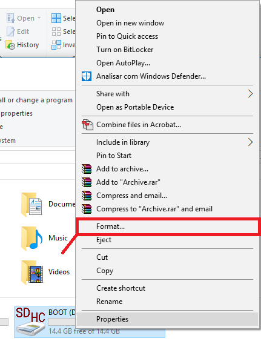
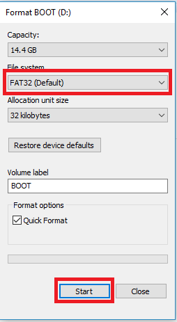

## [ESP32-CAM - сделать снимок и сохранить на карту microSD](https://randomnerdtutorials.com/esp32-cam-take-photo-save-microsd-card/)

#### Обзор проекта

- ESP32-CAM находится в режиме глубокого сна
- Нажмите кнопку сброса, чтобы активировать плату
- Камера делает снимок
- Фотография сохраняется на карте microSD с именем: pictureX.jpg, где X соответствует номеру снимка
- Номер снимка будет сохранен во флэш-памяти ESP32, чтобы он не стирался при сбросе и мы могли отслеживать количество сделанных фотографий.

#### Форматирование карты microSD

Первое, что мы рекомендуем сделать, это отформатировать вашу карту microSD. Вы можете использовать Windows formatter tool или любое другое программное обеспечение для форматирования microSD.

1. Вставьте карту microSD в свой компьютер. Перейдите на страницу Мой компьютер и щелкните правой кнопкой мыши на SD-карте. Выберите формат, как показано на рисунке ниже.

2. Появится новое окно. Выберите FAT32, нажмите Пуск, чтобы инициализировать процесс форматирования, и следуйте инструкциям на экране.

> Примечание: согласно спецификациям продукта, ESP32-CAM должна поддерживать только SD-карты объемом 4 ГБ. Однако мы тестировали с SD-картой объемом 16 ГБ, и она работает хорошо.

#### [Скетч: сделать снимок и сохранить на карту microSD](esp32-cam-take-photo-save-microsd-card.ino)

