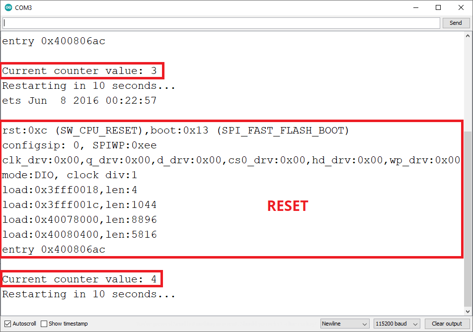

## [Постоянное хранение данных с помощью библиотеки настроек](https://randomnerdtutorials.com/esp32-save-data-permanently-preferences/)

В этом руководстве показано, как постоянно сохранять данные во флэш-памяти ESP32 с помощью библиотеки Preferences.h. Данные, хранящиеся во флэш-памяти, сохраняются при сбросах настроек или сбоях питания. Использование библиотеки Preferences.h полезно для сохранения таких данных, как сетевые учетные данные, ключи API, пороговые значения или даже последнее состояние GPIO. 

> ***Обычно используется библиотека EEPROM для сохранения данных во флэш-памяти. Однако библиотека EEPROM устарела в пользу библиотеки Preferences.h. Эта библиотека “устанавливается” автоматически при установке плат ESP32 в Arduino IDE.***

> ***Библиотека Preferences.h предпочтительно используется для хранения значений переменных с помощью пар ключ: значение.*** 

#### [Удалить пространство имен](udalit-prostranstvo-imen/udalit-prostranstvo-imen.ino)

#### [Запомнить, изменить и прочитать значение счетчика в настройках](StartCounter/StartCounter.ino)

#### [Сохранить сетевые учетные данные с помощью Preferences.h](ESP32_Save_Credentials/ESP32_Save_Credentials.ino)

#### [Подключиться к Wi-Fi с сохранением сетевых учетных данных в настройках](ESP32_Connect_WiFi_Preferences/ESP32_Connect_WiFi_Preferences.ino)
