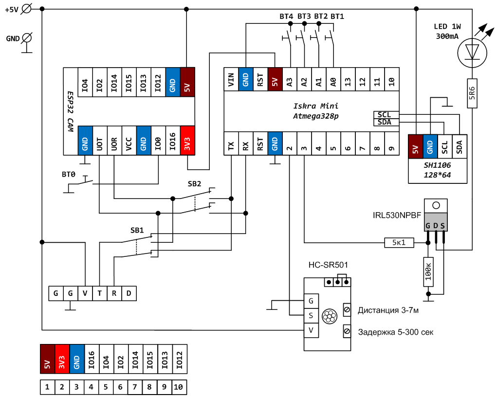

## [Фото ловушка на ESP32 CAM](https://zen.yandex.ru/media/esp32/foto-lovushka-na-esp32-cam-svoimi-rukami-60db589d7403af22afc89a33)

**Как это работает?**

- датчик движения подключенный к Arduino Mini обнаружив около миски кота зажигает светодиод, который используется в качестве вспышки и отправляет через интерфейс UART плате ESP32 CAM символ # , после чего переходит в ожидание от платы ESP32 CAM символа @

- плата ESP32 CAM получив через последовательный порт символ # делает фотографию и сохраняет её на SD карту. (в качестве имени файла фотографии используется текущая дата-время /например p20210622_045715.jpg/, которую ESP32 получает из сети Интернет - таким образом фотки легко сортировать и не будет повторяющихся имен)

- плата ESP32 Cam отправляет последнюю записанную фотографию с карты памяти по электронной почте

- пауза 15 сек (чтобы не заспамить собственный почтовый ящик, например если вдруг коты надумают под камерой "выяснить отношения")

- плата ESP32 Cam отправляет по UART символ @ после чего ждет новой команды от Arduino - символ #

Таким образом все фотографии которые были сняты при обнаружении движения сохраняются и локально на карте памяти и отправляются на e-mail.

Размер одной фотографии всего около 100 кб, так что 16Гб флеш карты хватит на долго, и принять такой объем данных даже если в поездке будет плохой Интернет тоже не проблема.

> Имейте ввиду что большинство примеров, которыми завален Интернет по работе с ESP32 CAM, используют для работы с SD картой аппаратную шину SDMMC, а библиотека почтового клиента от mobizt общается с карточкой с использованием шины SPI так что объединить 2 скетча "в лоб" не получится. В свой код я вносил поправки и сохраняю данные с камеры используя шину SPI, а не SDMMC.

**an549**

Ваша статья заинтересовала меня и я повторил ваше устройство. Правда вместо ИК датчика движений использовал микроволновый RCWL-0516 (фиксирует движение даже через стену), а также Ардуино Про Мини на Atmega328, что в принципе сути не меняет. Все питается от 5В, кроме светодиода. В его цепи поставил стабилизатор AMS1117 3,3 без всяких сопротивлений. Он как раз выдает ток на диод 300 мА.