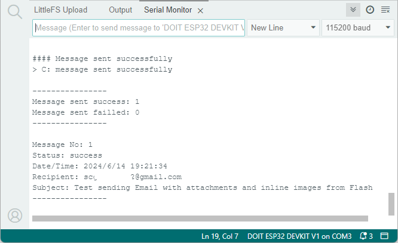

## [ESP32 Отправка электронных писем с помощью SMTP-сервера](https://randomnerdtutorials.com/esp32-send-email-smtp-server-arduino-ide/)

### [ESP32 Sеnd Email (HTML and raw text)](#esp32-send-email-html-and-raw-text)

### [ESP32 Send Emails with Attachments (image and .txt file)](#esp32-send-emails-with-attachments-image-and-txt-file)

SMTP означает простой протокол передачи почты и является интернет-стандартом для передачи электронной почты. Чтобы отправлять электронные письма с помощью ESP32, вам необходимо подключить его к SMTP-серверу.

Для отправки электронных писем с помощью ESP32 мы будем использовать [библиотеку ESP-почтового клиента](https://github.com/mobizt/ESP-Mail-Client). Эта библиотека позволяет ESP32 отправлять и получать электронные письма с вложениями или без них через SMTP-и IMAP-серверы. Актуальную версию библиотеки можно установить из Arduino IDE.

#### Электронная почта отправителя (новая учетная запись)

Мы рекомендуем создать новую учетную запись электронной почты для отправки электронных писем на ваш основной личный адрес электронной почты. Не используйте свой основной личный адрес электронной почты для отправки электронных писем через ESP32. Если что-то пойдет не так в вашем коде или если по ошибке вы сделаете слишком много запросов, вы можете быть забанены или ваша учетная запись будет временно отключена.

Мы будем использовать недавно созданную учетную запись Gmail.com для отправки электронных писем, но вы можете использовать любого другого почтового провайдера. Адрес электронной почты получателя может быть вашим личным письмом без каких-либо проблем.

#### Настройки SMTP-сервера Gmail

Если вы используете учетную запись Gmail, вот сведения о SMTP-сервере:

```
SMTP-сервер: smtp.gmail.com
Имя пользователя SMTP: полный адрес Gmail
Пароль SMTP: ваш пароль Gmail
Порт SMTP (TLS): 587
SMTP-порт (SSL): 465
Требуется SMTP TLS / SSL: да
```
### [ESP32 Send Email HTML and raw text](https://randomnerdtutorials.com/esp32-send-email-smtp-server-arduino-ide/#send-email)

Следующий код отправляет электронное письмо через SMTP-сервер с HTML или необработанным текстом. В демонстрационных целях ESP32 отправляет электронное письмо один раз при загрузке. Затем вы должны иметь возможность изменять код и интегрировать его в свои собственные проекты.

#### [Отправить электронное письмо с HTML или необработанным текстом с помощью ESP32 (Arduino IDE)](ESP32-Send-Email-HTML-and-raw-text/ESP32-Send-Email-HTML-and-raw-text.ino)

**Протокол запуска приложения и отправки необработанного сообщения**

```
ets Jun  8 2016 00:22:57

rst:0x1 (POWERON_RESET),boot:0x13 (SPI_FAST_FLASH_BOOT)
configsip: 0, SPIWP:0xee
clk_drv:0x00,q_drv:0x00,d_drv:0x00,cs0_drv:0x00,hd_drv:0x00,wp_drv:0x00
mode:DIO, clock div:1
load:0x3fff0030,len:1448
load:0x40078000,len:14844
ho 0 tail 12 room 4
load:0x40080400,len:4
load:0x40080404,len:3356
entry 0x4008059c

Connecting to Wi-Fi....
Connected with IP: 192.168.0.104

#### Connecting to SMTP server...
> C: ESP Mail Client v3.4.21
> C: Reading time from NTP server...........................................................
E (24750) esp_littlefs: ./managed_components/joltwallet__littlefs/src/littlefs/lfs.c:1369:error: Corrupted dir pair at {0x0, 0x1}

E (24751) esp_littlefs: mount failed,  (-84)
E (24755) esp_littlefs: Failed to initialize LittleFS
E (31897) task_wdt: esp_task_wdt_reset(763): task not found
E (31986) task_wdt: esp_task_wdt_reset(763): task not found
> C: connecting to SMTP server
> C: Host > smtp.gmail.com
> C: Port > 465

#### SMTP server connected
> C: SMTP server connected, wait for greeting...
< S: 220 smtp.gmail.com ESMTP 2adb3069b0e04-530bba1100asm1393398e87.90 - gsmtp

#### Sending greeting response...
> C: send SMTP command, EHLO
< S: 250-smtp.gmail.com at your service, [185.90.100.110]
< S: 250-SIZE 35882577
< S: 250-8BITMIME
< S: 250-AUTH LOGIN PLAIN XOAUTH2 PLAIN-CLIENTTOKEN OAUTHBEARER XOAUTH
< S: 250-ENHANCEDSTATUSCODES
< S: 250-PIPELINING
< S: 250-CHUNKING
< S: 250 SMTPUTF8

#### Logging in...
> C: send SMTP command, AUTH PLAIN
> C: tvegoo@gmail.com
> C: ****************
< S: 235 2.7.0 Accepted

Successfully logged in.

#### Sending Email...
> C: send Email

#### Sending message header...
> C: send message header
< S: 250 2.1.0 OK 2adb3069b0e04-530bba1100asm1393398e87.90 - gsmtp
< S: 250 2.1.5 OK 2adb3069b0e04-530bba1100asm1393398e87.90 - gsmtp

#### Sending message body...
> C: send message body
< S: 354  Go ahead 2adb3069b0e04-530bba1100asm1393398e87.90 - gsmtp

#### Finishing the message sending...
> C: finishing the message sending
< S: 250 2.0.0 OK  1722933305 2adb3069b0e04-530bba1100asm1393398e87.90 - gsmtp

#### Closing the session...
> C: terminate the SMTP session
< S: 221 2.0.0 closing connection 2adb3069b0e04-530bba1100asm1393398e87.90 - gsmtp

#### Message sent successfully
> C: message sent successfully

----------------
Message sent success: 1
Message sent failed: 0
----------------

Message No: 1
Status: success
Date/Time: August 06, 2024 11:35:05
Recipient: tve58@inbox.ru
Subject: ESP Test Email
----------------
```

### [ESP32 Send Emails with Attachments-image and txt file](https://randomnerdtutorials.com/esp32-send-email-smtp-server-arduino-ide/#attachment)

#### [Отправить вложения по электронной почте с помощью ESP32 (Arduino IDE)](ESP_Email_Attachments/ESP_Email_Attachments.ino)

После перемещения файлов в папку ***data*** вам необходимо загрузить их на свою плату. В Arduino IDE 2 нажмите ***[Ctrl] + [Shift] + [P]*** в Windows, чтобы открыть палитру команд. Найдите команду Загрузить LittleFS в Pico / ESP8266 / ESP32 и нажмите на нее.

После загрузки кода откройте последовательный монитор со скоростью передачи 115200 бод и нажмите встроенную кнопку EN / RESET. Если все пройдет гладко, вы должны получить аналогичное сообщение на последовательном мониторе.



Проверьте адрес электронной почты получателя. У вас должно быть новое электронное письмо с двумя вложениями.


