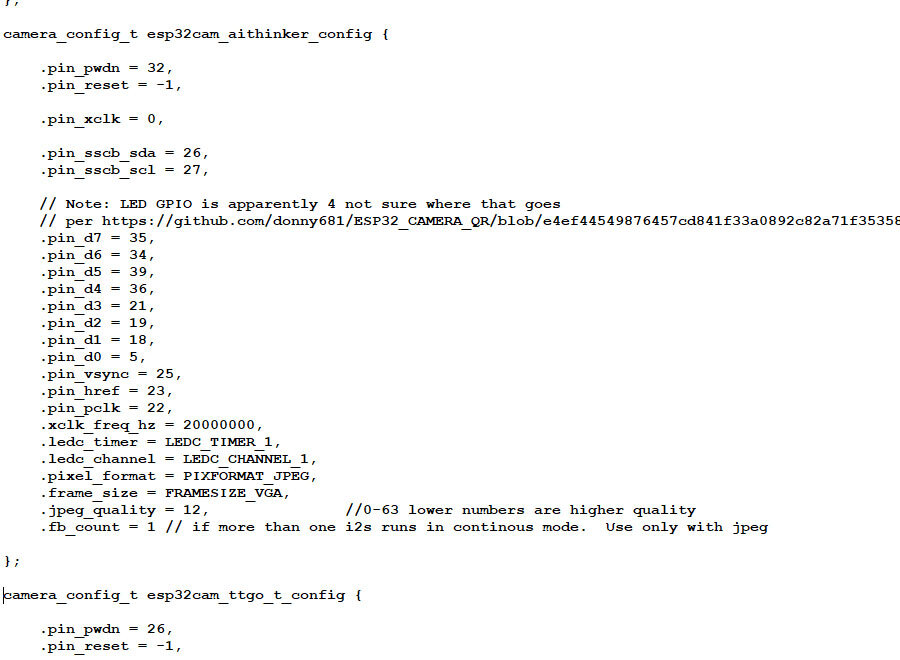

## [Потоковая передача видео через браузер и RTSP](https://dzen.ru/a/ZVSZf0qQD2rlCNrK)

***Micro-RTSP*** - это небольшая библиотека, которую можно использовать для обслуживания потоков RTSP из микроконтроллеров с ограниченными ресурсами. Это позволяет вам тривиально создать камеру RTSP-видеопотока с открытым исходным кодом.

### Что делал:

1. Скачал библиотеку для RTSP с [github https://github.com/geeksville/Micro-RTSP](https://github.com/geeksville/Micro-RTSP) и разархивировал.

2. Скопировал пример ***ESP32-devcam.ino*** из папки ***examples*** библиотеки.

3. (***2024-06-03***) Скетч -> Подключить библиотеку -> Добавить .Zip библиотеку… - подключил из каталога архив ***MicroRTSP.zip***.

(***2024-07-10*** просто скопировал все файлы из каталога ***Micro-RTSP/src*** в текущий ***ESP32-devcam-tve*** c одноименным скетчем и внес в файлы необходимые - описанные далее изменения)

4. Правил код примера следующим образом: 

- поменял инициализацию на текущую плату, то есть нашел строчку ***cam.init(esp32cam_config);*** и заменил на ***cam.init(esp32cam_aithinker_config); ***
- отключил (закомментировал) внешний OLED экран. На нашей плате его нет. 
```
// #define ENABLE_OLED
```
- выбрал куда транслировать изображение:
```
#define ENABLE_WEBSERVER      // через браузер
// #define ENABLE_RTSPSERVER  // через RTSP
```
- (***2024-06-03***) настроил подключение к WiFi точке - нашел файл ***wifikeys.h*** и изменил его:

```
const char *ssid     = "YOURNETHERE";      // здесь название WiFi сети
const char *password = "YOURPASSWORDHERE"; // здесь пароль
```
(***2024-07-10*** просто отключил ***wifikeys.h*** и перенес настройку на точку доступа смартфона) :

```
const char* ssid     = "OPPO A9 2020";
const char* password = "b277a4ee84e8";
```

- настроил качество изображения в файле ***OV2640.cpp***  (он находится в директории Arduino IDE в папке \libraries\Micro-RTSP\src)

Нашел структуру

```
camera_config_t esp32cam_aithinker_config {}
```

Установил параметр:
```
.frame_size = FRAMESIZE_VGA,  // Это разрешение 640x480
```

Бывают еще:

```
FRAMESIZE_SVGA   // 800x600
FRAMESIZE_XGA    // 1024x768
FRAMESIZE_HD     // 1280x720
FRAMESIZE_SXGA   // 1280x1024
FRAMESIZE_UXGA   // 1600x1200
```

Так как разрешение не очень большое то поменял   ***.fb_count = 1***

Сохранил. Получилось примерно так:




### Тестирование

Прошиваем модуль. После прошивки нажимаем кнопку Reset на коммуникационной плате. Открываем Монитор порта. Где находим ip адрес нашей камеры.

Открываем веб браузер. Переходим по ссылке на ip-адрес, чтобы посмотреть видео
```
http://<ip>/
```

или текущий кадр

```
http://<ip>/jpg
```


### Проблемы

1. Поддерживается одна сессия. Т.е открыть видео можно только с одного приложения.

2. Скорость передачи потока через RTSP очень маленькая. Через браузер все отлично. Пока не разобрался в чем проблема. Может кто подскажет в комментариях.

3. Для стабильной работы должна быть внешняя антенна на модуле.

### VideoStream

> **Запросы:**
> 
> **"как показать video от esp32 в браузере";**
> 
> **"как открыть rtsp поток в браузере".**


#### VideoStream1 2025-01-31

---

#### [ESP32-CAM with RTSP video streaming](https://learn.circuit.rocks/esp32-cam-with-rtsp-video-streaming)


***Плата ESP32-CAM требует много энергии! Вам понадобится источник питания 5 В с силой тока не менее 2 А, иначе плата не загрузится.***

#### Учетные данные

Приведённый здесь код основан на примере Кевина Хестнерса Micro-RTSP. Вы можете найти библиотеку и исходный пример кода в его репозитории на Github.

Для функций кнопок используется библиотека OneButton, предоставленная Маттиасом Хертелем.

#### Источники:

#### [Исходный код на Github - https://github.com/circuitrocks/ESP32-RTSP](https://github.com/circuitrocks/ESP32-RTSP)

#### [Библиотека OneButton - https://github.com/mathertel/OneButton](https://github.com/mathertel/OneButton)

#### [Источники Micro-RTSP - https://github.com/geeksville/Micro-RTSP](https://github.com/geeksville/Micro-RTSP)

#### [ESP32-CAM - https://circuit.rocks/product:2659](https://circuit.rocks/product:2659)

---

#### [flashphoner: Raise STREAM_EVENT with UNMUTE_REQUIRED type if video is muted on playbalck startup](https://github.com/flashphoner/flashphoner_client/tree/wcs_api-2.0/examples/demo/streaming/player)

#### [flashphoner: 7 способов отобразить видео с RTSP IP-камеры на веб-странице и 2 в мобильном приложении](https://habr.com/ru/companies/flashphoner/articles/329108/)

#### [ESP32 MJPEG Streaming Server](https://github.com/arkhipenko/esp32-cam-mjpeg)

Guys, I have been working on this issue and was able to successfully stream to VLC and browsers.
Also implemented multi-client streaming.
Please check these repos:
[https://github.com/arkhipenko/esp32-cam-mjpeg (single client)](https://github.com/arkhipenko/esp32-cam-mjpeg)
https://github.com/arkhipenko/esp32-cam-mjpeg-multiclient (up to 10 clients)
https://github.com/arkhipenko/esp32-mjpeg-multiclient-espcam-drivers (up to 10 clients using latest ESP32-cam drivers from espressif).

Ребята, я работал над этой проблемой и смог успешно транслировать в VLC и браузеры.
Также реализована мультиклиентская потоковая передача.
Пожалуйста, проверьте эти репозитории:
https://github.com/arkhipenko/esp32-cam-mjpeg (один клиент)
https://github.com/arkhipenko/esp32-cam-mjpeg-multiclient (до 10 клиентов)
https://github.com/arkhipenko/esp32-mjpeg-multiclient-espcam-drivers (до 10 клиентов используют новейшие драйверы ESP32-cam от espressif).

#### [Как Открыть RTSP Поток в Браузере: Полное Руководство](https://telegra.ph/Kak-Otkryt-RTSP-Potok-v-Brauzere-Polnoe-Rukovodstvo-06-12)


