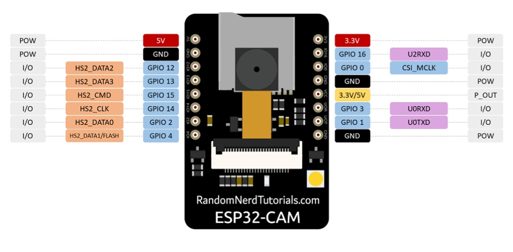
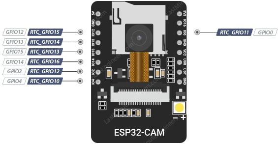
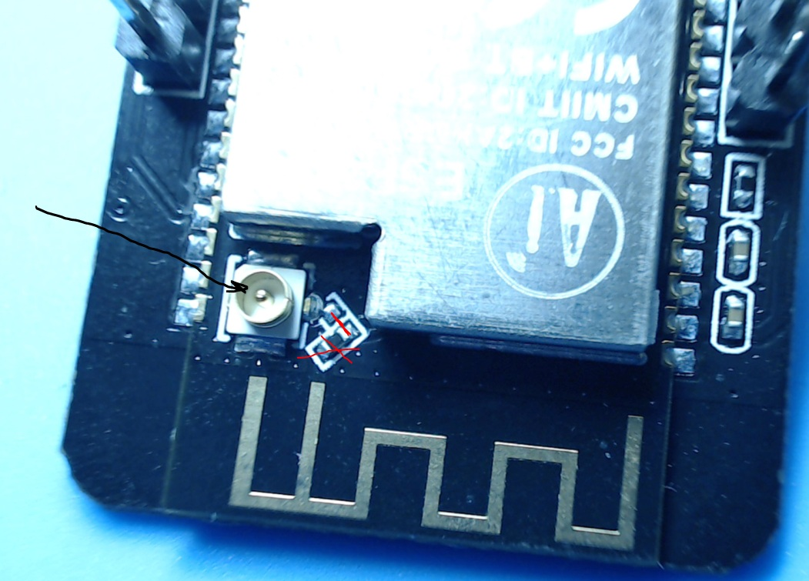
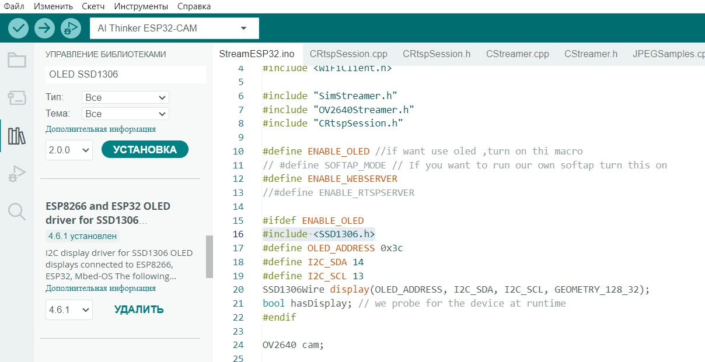

## [Потоковая передача видео через браузер](https://dzen.ru/a/ZVSZf0qQD2rlCNrK)

ESP32-CAM. ESP32-CAM основан на одноядерном процессоре Xtensa LX7 с тактовой частотой до 240 МГц. Распиновка ESP32-CAM состоит из 16 контактов.

#### [Распиновка ESP32-CAM AI-Thinker](https://arduino-tex.ru/news/34/raspinovka-esp32-cam-ai-thinker-naznachenie-gpio.html?ysclid=m75s57u01w420985442)



#### Источник питания

ESP32-CAM поставляется с тремя контактами GND и двумя контактами питания: 3,3 В и 5 В. Однако многие сообщали об ошибках при питании ESP32-CAM от 3,3 В, поэтому мы всегда рекомендуем питать ESP32-CAM от контакта 5 В.

#### Вывод выходной мощности

На плате также есть контакт, обозначенный как VCC. Не используйте этот контакт для питания ESP32-CAM. Это выходной контакт питания. Он может выдавать 5 В или 3,3 В.

По умолчанию ESP32-CAM выдаёт 3,3 В независимо от того, питается ли он от 5 В или от 3,3 В. Рядом с выводом VCC есть две площадки. Одна обозначена как 3,3 В, а другая — как 5 В. Если присмотреться, то на площадках 3,3 В должна быть перемычка. Если вы хотите, чтобы на выводе VCC было 5 В, вам нужно отпаять эту перемычку и припаять к площадке 5 В.


#### GPIO0 - прошивка контроллера

GPIO0 определяет, находится ли ESP32 в режиме прошивки или нет. Этот GPIO имеет внутреннее подключение к подтягивающему резистору 10 кОм.

Когда GPIO0 подключен к GND, ESP32 переходит в режим прошивки, и вы можете загружать код на плату.

После загрузки кода, для того чтобы ESP32 работала «нормально», вам просто нужно отключить GPIO0 от GND.

#### Вспышка (GPIO4)

ESP32-CAM имеет очень яркий встроенный светодиод, который может работать как вспышка при съемке, этот светодиод внутренне подключен к GPIO 4.

Контакт вспышки также подключен к слоту для карты microSD, поэтому могут возникнуть проблемы при попытке использовать оба устройства одновременно - фонарик загорится при использовании карты microSD.

Примечание: этой проблемы может не быть, если инициализироват карту microSD следующим образом:

```
SD_MMC.begin("/sdcard", true)
```
* однако, в этом случае, светодиод может гореть с низкой яркостью.

#### GPIO33 - встроенный красный светодиод

Рядом с кнопкой RST есть встроенный красный светодиод. Этот светодиод внутренне подключен к GPIO33. Вы можете использовать этот светодиод, чтобы указать, что что-то происходит. Например, если Wi-Fi подключен, светодиод горит красным или наоборот.

Cветодиод  GPIO33 работает с перевернутой логикой, поэтому следует отправлять LOW сигнал на включение и HIGH сигнал на выключение светодиода.

```
void setup() 
{
   pinMode(33, OUTPUT);
}

void loop()
{
   digitalWrite(33, LOW);
   delay(500);
   digitalWrite(33, HIGH);
   delay(500);
}
```

#### Аналого-цифровое преобразование

ESP32-CAM имеет 7 входных каналов АЦП по ***12 бит***. Это GPIO, которые можно использовать в качестве АЦП.

ADC2_CH0 (GPIO 4)
ADC2_CH1 (GPIO 0)
ADC2_CH2 (GPIO 2)
ADC2_CH3 (GPIO 15)
ADC2_CH4 (GPIO 13)
ADC2_CH5 (GPIO 12)
ADC2_CH6 (GPIO 14)

***Примечание: контакты ADC2 нельзя использовать при работе Wi-Fi.***

Входные каналы АЦП имеют разрешение 12 бит. Это означает, что вы можете получать аналоговые показания в диапазоне от 0 до 4095, где 0 соответствует 0 В, а 4095 — 3,3 В. Вы также можете настроить разрешение каналов в коде, а также диапазон АЦП.

Выводы АЦП ESP32 не обладают линейным поведением. Скорее всего, вы не сможете отличить 0 В от 0,1 В или 3,2 В от 3,3 В. Это нужно учитывать при использовании выводов АЦП.

#### Цифровые контакты

Все контакты ESP32-CAM служат для цифрового ввода/вывода.

***Примечание: каждый вывод может обеспечивать максимальный ток до 40 мА. Но рекомендуемый ток составляет 20 мА. Максимальный ток, обеспечиваемый (или потребляемый) всеми выводами вместе, составляет 200 мА.***

Цифровое — это способ представления напряжения в виде 1 бита: 0 или 1. Эти контакты на ESP32-CAM предназначены для настройки в качестве входов или выходов в соответствии с потребностями пользователя. Цифровые контакты могут быть включены или выключены. В режиме ВКЛ они находятся в состоянии ВЫСОКОГО напряжения 3,3 В, а в режиме ВЫКЛ — в состоянии НИЗКОГО напряжения 0 В. Когда цифровые контакты настроены как выходы, они устанавливаются на 0 или 3,3 В.

Между 0-3,3 вольтами, которое преобразуется в цифровое представление (0 или 1). Чтобы определить это, существует 2 пороговых значения: ниже 0,8 В – считается равным 0. Выше 2 В – считается равным 1. При подключении компонента к цифровому контакту убедитесь, что логические уровни совпадают. Если напряжение находится между пороговыми значениями, возвращаемое значение не будет определено.

#### Последовательная связь

Последовательная связь используется для обмена данными между платой Arduino и другим последовательным устройством, таким как компьютер, дисплей, датчик и т. д.

Каждая плата ESP32 имеет как минимум один последовательный порт. Последовательная связь осуществляется через цифровые контакты 0 (RX) и 1 (TX), а также через USB. ESP32 поддерживает последовательную связь через цифровые контакты с помощью библиотеки ***SoftwareSeria***l. Это позволяет пользователю подключать несколько устройств с последовательной связью и оставлять основной последовательный порт доступным для USB.

#### Контакты для карт microSD

Следующие контакты используются для подключения карты microSD. 

```
MicroSD card	    ESP32-CAM
-----------------------------
CLK	                  GPIO 14
CMD	                  GPIO 15
DATA0                 GPIO 2
DATA1 / Flashlight	  GPIO 4
DATA2	              GPIO 12
DATA3	              GPIO 13
```
Если вы не используете карту microSD, вы можете использовать эти контакты как обычные входы и выходы.

#### Подключение камеры

Соединения между камерой и ESP32-CAM AI-Thinker показаны в следующей таблице:

```
OV2640 CAMERA   ESP32-CAM       Variable name in code
-----------------------------------------------------
D0	            GPIO 5	        Y2_GPIO_NUM
D1	            GPIO 18	        Y3_GPIO_NUM
D2	            GPIO 19	        Y4_GPIO_NUM
D3	            GPIO 21	        Y5_GPIO_NUM
D4	            GPIO 36	        Y6_GPIO_NUM
D5	            GPIO 39	        Y7_GPIO_NUM
D6	            GPIO 34	        Y8_GPIO_NUM
D7	            GPIO 35	        Y9_GPIO_NUM
XCLK	        GPIO 0	        XCLK_GPIO_NUM
PCLK	        GPIO 22	        PCLK_GPIO_NUM
VSYNC	        GPIO 25	        VSYNC_GPIO_NUM
HREF	        GPIO 23	        HREF_GPIO_NUM
SDA	            GPIO 26	        SIOD_GPIO_NUM
SCL	            GPIO 27	        SIOC_GPIO_NUM
POWER PIN       GPIO 32	        PWDN_GPIO_NUM
```

Итак, определение контактов для ESP32-CAM AI-Thinker в среде Arduino IDE должно быть следующим:

```
#define PWDN_GPIO_NUM   32
#define RESET_GPIO_NUM  -1
#define XCLK_GPIO_NUM   0
#define SIOD_GPIO_NUM   26
#define SIOC_GPIO_NUM   27
#define Y9_GPIO_NUM     35
#define Y8_GPIO_NUM     34
#define Y7_GPIO_NUM     39
#define Y6_GPIO_NUM     36
#define Y5_GPIO_NUM     21
#define Y4_GPIO_NUM     19
#define Y3_GPIO_NUM     18
#define Y2_GPIO_NUM     5
#define VSYNC_GPIO_NUM  25
#define HREF_GPIO_NUM   23
#define PCLK_GPIO_NUM   22
```

#### SPI

SPI - контакты SS / SCK / MISO / MOSI предназначены для связи по протоколу SPI.

Последовательный периферийный интерфейс (SPI) — это протокол передачи последовательных данных, используемый микроконтроллерами для связи с одним или несколькими внешними устройствами по принципу шины. SPI также можно использовать для подключения двух микроконтроллеров. На шине SPI всегда есть одно ведущее устройство, а все остальные являются ведомыми. В большинстве случаев микроконтроллер является ведущим устройством. Контакт SS (Slave Select) определяет, с каким устройством в данный момент взаимодействует ведущий.

Устройства с поддержкой SPI всегда имеют следующие контакты:

- MOSI (Master Out Slave In - выход ведущего, вход ведомого) cлужит для передачи данных от ведущего устройства ведомому, основная линия для отправки данных на периферийные устройства;
- MISO (Master In Slave Out - вход ведущего, выход ведомого) - cлужит для передачи данных от ведомого устройства ведущему, линия для отправки данных на ведущее устройство;
- SCLK или SCK (Serial Clock) - последовательный тактовый сигнал, генерируемый ведущим устройством для синхронизации передачи данных;
- CS или SS (Chip Select, Slave Select - выбор ведомого устройства) определяет к какому устройству относится ведущее.

Ведущий в этом интерфейсе всегда один, только он руководит всем процессом и только он может формировать тактовые импульсы.

```
Cопоставление pin-кодов для SPI:
--------------------------------------------
SPI	    MOSI	  MISO  	SCLK      CS
HSPI    GPIO13    GPIO12    GPIO14    GPIO15
```


#### Сенсорные GPIO

ESP32-CAM имеет 7 внутренних емкостных сенсорных датчиков. Они могут ощущать изменения во всем, что содержит электрический заряд, например, в коже человека. Таким образом, они могут обнаруживать изменения, возникающие при касании GPIO пальцем. Эти контакты можно легко интегрировать в емкостные панели и заменить механические кнопки. 

Можно создать тачпад, подключив к этим контактам проводящий материал, например алюминиевую фольгу или проводящую ткань. Благодаря высокой чувствительности схемы и низкому уровню шума даже небольшие тачпады будут эффективны.

Емкостные сенсорные контакты также можно использовать для пробуждения ESP32-CAM от глубокого сна.

Внутренние сенсорные датчики подключены к этим GPIO.

- T0 (GPIO 4)
- T1 (GPIO 0)
- T2 (GPIO 2)
- T3 (GPIO 15)
- T4 (GPIO 13)
- T5 (GPIO 12)
- T6 (GPIO 14)

#### Контакты RTC GPIO

GPIO, которые направляются в подсистему RTC с низким энергопотреблением, называются RTC GPIO. Эти контакты используются для вывода ESP32 из глубокого спящего режима при работе сопроцессора Ultra Low Power (ULP). Выделенные ниже GPIO могут использоваться в качестве внешних источников пробуждения:



- RTC_GPIO0 (GPIO36)
- RTC_GPIO3 (GPIO39)
- RTC_GPIO4 (GPIO34)
- RTC_GPIO12 (GPIO2)
- RTC_GPIO13 (GPIO15)
- RTC_GPIO14 (GPIO13)
- RTC_GPIO15 (GPIO12)
- RTC_GPIO16 (GPIO14)

#### Подключение внешней антенны

Модуль ESP32-CAM для приема/передачи данных по WiFi и Bluetooth имеет ***встроенную антенну мощностью 4db***. Если же зоны ее покрытия недостаточно, то есть возможность подключить внешнюю через стандартный ***IPEX*** разъем. Выбор типа используемой антенны осуществляется с помощью перемычки на плате возле разъема. По умолчанию она установлена в верхнее положение для использование внутренней антенны. Для использования внешней, перемычку следует выпаять и переместить в нижнее положение.




#### OLED SSD1306.jpg




### Библиография

#### [ESP32 – Автоматическое программирование и сброс настроек](https://www.studiopieters.nl/esp32-auto-program-reset/)

#### [Форматирование карты microSD, фотографирование с PIR или без и сохранение снимка на SD-карте](https://www.diyengineers.com/2023/04/13/esp32-cam-complete-guide/)

#### [Как назначить фиксированный IP-адрес вашему устройству ESP32](https://arduinokitproject.com/esp32-static-ip-tutorial/)

#### [Источник пробуждения ESP32-CAM, Таймер](https://lastminuteengineers.com/esp32-deep-sleep-wakeup-sources/)

#### [ThingPulse OLED SSD1306 (ESP8266/ESP32/Mbed-OS)](https://github.com/ThingPulse/esp8266-oled-ssd1306/tree/master)


### OLED дисплей на русском языке

#### [Описание команд - Adafruit_SSD1306 Class Reference](https://adafruit.github.io/Adafruit_SSD1306/html/class_adafruit___s_s_d1306.html)

#### [Дисплей SSD1306 подключаем к Arduino. Выводим текст, рисуем фигуры](https://portal-pk.ru/news/232-displei-ssd1306-podklyuchaem-k-arduino-vyvodim-tekst-risuem.html)

#### [ESP32-CAM With SSD1306 OLED Display](https://github.com/ClaudeMarais/ESP32-CAM_With_SSD1306)

#### [ESP32 и ESP8266 с выводом статуса на веб-страницу и на OLED дисплей](https://arduino-tex.ru/news/23/esp32-i-esp8266-s-vyvodom-statusa-na-veb-stranicu-i-na-oled.html?ysclid=m76l3hhe1l969660993)

#### [SSD1306 OLED-дисплей, вывод текста на русском языке в Arduino IDE](https://portal-pk.ru/news/233-ssd1306-oled-displei-vyvod-teksta-na-russkom-yazyke-v-arduino-ide.html)

#### [Файлы и библиотеки и другое для Arduino](https://iarduino.ru/file/)


