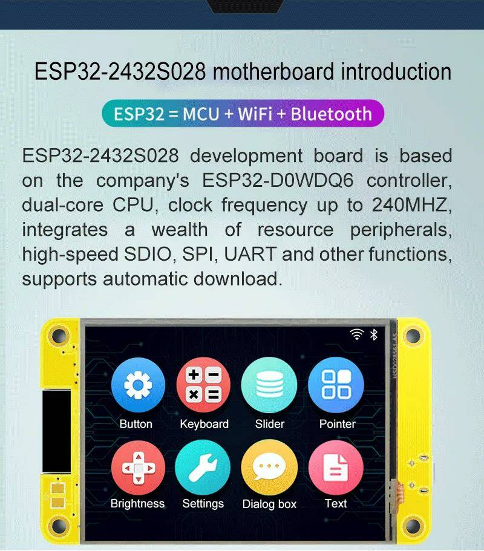
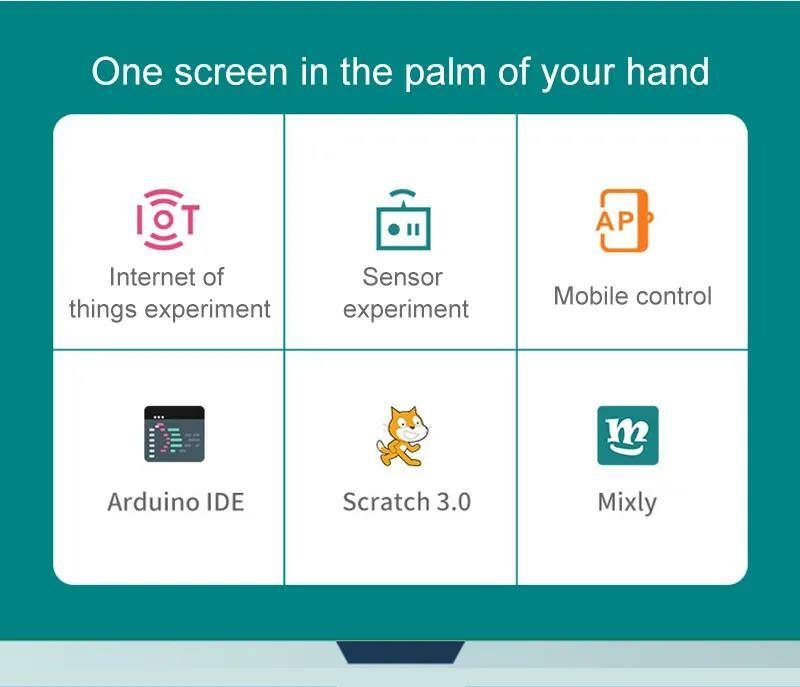
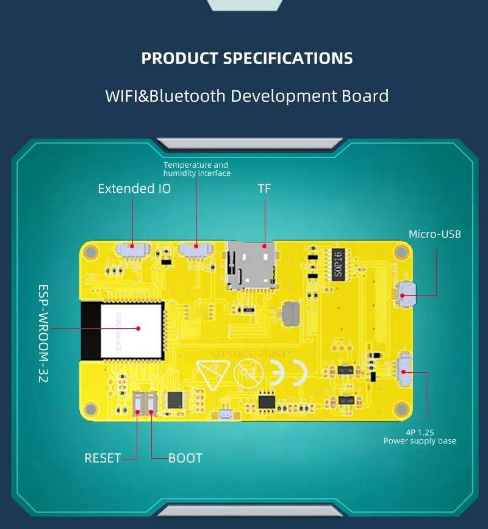
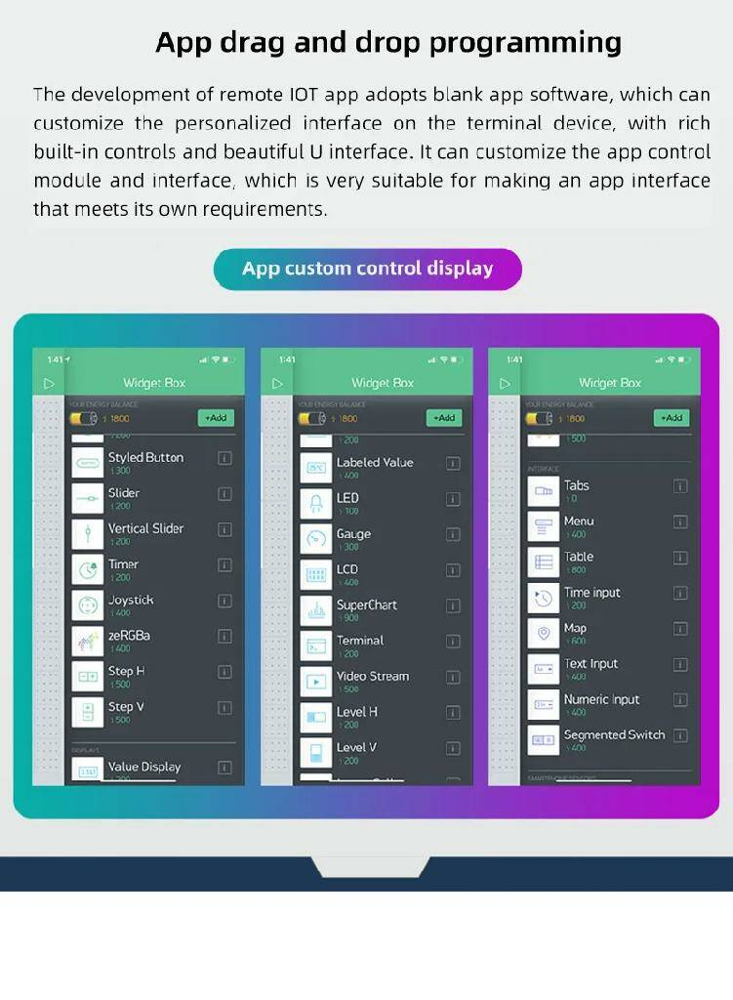
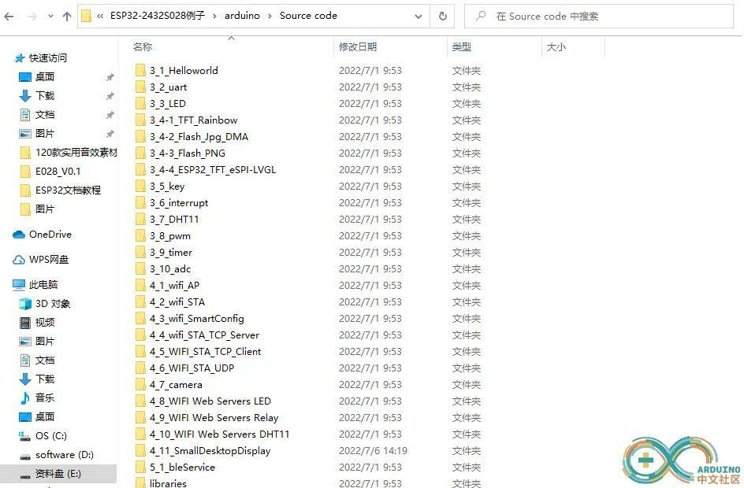

### [HMI дисплей 240x320 с резистивным сенсором - ESP32-2432S028R](https://aliexpress.ru/item/1005004502250619.html?spm=a2g2w.orderdetail.0.0.60f34aa6NNuXXh&sku_id=12000029387813500)

ESP32 макетная плата, стандартный 2,8-дюймовый TFT экран и резистор TP, поддержка автоматической загрузки одной кнопкой, предоставление LVGL demo и arduino примеры: [ссылка для скачивания](http://pan.jczn1688.com/directlink/1/ESP32%20module/2.8inch_ESP32-2432S028R.rar)

Плата разработки ESP32-2432S028 основана на фирменном контроллере ESP32-D0WDQ6, двухъядерном процессоре, тактовой частоте до 240 МГц, интегрирует множество периферийных устройств, высокоскоростные SDIO, SPI, UART и другие функции, поддерживает автоматическую загрузку.

ESP 32 = MCU + WiFi + Bluetooth



***Один экран у вас на ладони***: 

эксперименты с интернетом вещей, эксперименты с сенсорами, мобильное управление, Arduino IDE,  -  программирование для детей, Mixly - визуальное программирование Arduino.



Плата разработки ESP32-2432S032 в полной мере способствует развитию Интернета вещей, представляет собой настоящий инструмент разработки Интернета вещей с управляемым экраном дисплея, который можно использовать для удаленного управления приложениями, удаленного сбора данных об окружающей среде, удаленного объединения данных, удаленной настройки параметров и других приложений для разработки loT.



При разработке удаленного приложения IOT используется программное обеспечение blank app, которое позволяет настраивать персонализированный интерфейс на терминальном устройстве с богатыми встроенными элементами управления и красивым U-интерфейсом. Он может настраивать модуль управления приложением и интерфейс, что очень подходит для создания интерфейса приложения, соответствующего его собственным требованиям.





***Параметры:***
```
Двухъядерный 32-разрядный процессор малой мощности, который может использоваться в качестве прикладного процессора.

Основная частота составляет до 240 МГц, а вычислительная мощность-до 600 DMIPS

Встроенный 520 КБ SRAM

Поддержка UART/SPI/I2C/PWM/ADC/DAC и других интерфейсов

Поддержка камер OV2640 и OV7670, встроенная вспышка

Поддержка загрузки изображения WiFI

Поддержка tf-карты

Поддерживает несколько режимов сна.

Встроенные Lwip и FreeRTOS

Поддержка режима работы STA/AP/STA + AP

Поддержка Smart Config/AirKiss в один клик конфигурации сети

Поддержка вторичного развития
```

***Технические характеристики:***
```
Рабочее напряжение 4,75-5,25 в

По умолчанию SPIFlash 32 Мбит

Внутренняя Память RAM 520KB

Wi-Fi 802.11b/g/n/e/i

Bluetooth 4. Стандарт 2br/EDR и BLE

Поддержка интерфейса (2 Мбит/с) UART, SPI, I2C, PWM

Поддержка tf-карты, максимальная поддержка 4G

Порт IO 9

Скорость последовательного порта по умолчанию 115200bps

Диапазон спектра 2400 ~ 2483,5 МГц

Антенна формы бортовой PCB антенны, усиление 2dBi

Формат вывода изображения: JPEG (только поддержка OV2640), BMP, GRAYSCALE

Способ упаковки DIP-16

Мощность передачи 802.11b: 17 ± 2 дБм (@ 11 Мбит/с)

802,11 г: 14 ± 2 дБм (@ 54 Мбит/с)

802.11n: 13 ± 2 дБм (@ MCS7)

Чувствительность приема CCK, 1 Мбит/с: -90dBm

CCK, 11 Мбит/с: -85dBm

6 Мбит/с (1/2BPSK): -88dBm

54 Мбит/с (3/464-QAM): -70dBm

MCS7 (65 Мбит/с, 72,2 Мбит/с): -67dBm

Потребляемая мощность при выключённой вспышке: 180 мА @ 5 В

Включите вспышку и настройте яркость на максимум: 310mA @ 5V

Глубокий сон: низкое энергопотребление может достигать 6 мА при 5 В

Модерим-сон: самый низкий может достигать 20мА @ 5В

Светильник сна: самый низкий уровень может достигать 6,7 мА при 5 В

Безопасность WPA/WPA2/WPA2-Enterprise/WPS

Рабочая температура-20 ℃ ~ 70 ℃

Среда хранения-40 ℃ ~ 125 ℃, <90% RH
```

### [LVGL, Light and Versatile Graphics Library - легкая и универсальная графическая библиотека](https://github.com/lvgl/lvgl)

```
Поддерживает монохромные, ePaper, OLED или TFT дисплеи и даже мониторы. 

Распространяется по лицензии MIT, поэтому вы можете легко использовать его и в коммерческих проектах.

Требуется всего 32 КБ оперативной памяти и 128 кБ флэш-памяти, буфер кадров и буфер размером не менее 1/10 экрана для рендеринга.

30+ встроенных виджетов: кнопка, метка, слайдер, диаграмма, клавиатура, счетчик, дуга, таблица и многое другое.

Гибкая система стилей с ~ 100 свойствами стиля для настройки любой части виджетов в любом состоянии.

Тексты отображаются в кодировке UTF-8, поддерживающей CJK, тайскую, хинди, арабскую, персидскую системы письма.

Перенос слов, кернинг, прокрутка текста, субпиксельный рендеринг, эмодзи в текстах.

Поддерживается анимация, сглаживание, непрозрачность, плавная прокрутка, тени, преобразование изображений. 

Поддерживает мышь, тачпад, клавиатуру, внешние кнопки, кодировщик устройств ввода.
```

### [Библиотека LVGL для Arduino](https://github.com/lvgl/lvgl/archive/refs/heads/master.zip):

***[LVGL-документация для Arduino](https://docs.lvgl.io/master/integration/framework/arduino.html)***

[Обратите внимание, что вам нужно выбрать плату](https://docs.lvgl.io/master/intro/index.html#requirements), достаточно мощную для запуска LVL и вашего графического интерфейса. Ознакомьтесь с требованиями LVGL. Например, ASP 32 является хорошим кандидатом для создания модулей с LEGAL.

Вы можете загрузить последнюю версию LIGHT с [GitHub](https://github.com/lvgl/lvgl/archive/refs/heads/master.zip) и просто скопировать ее в папку библиотеки Arduino.

***Установка драйверов***

Для начала рекомендуется использовать библиотеку [TFT_eSPI](https://github.com/Bodmer/TFT_eSPI) в качестве TFT-драйвера для упрощения тестирования. Чтобы это заработало, настройте TFT_eSPI в соответствии с типом вашего TFT-дисплея с помощью:

```
User_Setup.h

или выбрав конфигурацию в User_Setup_Select.h
```

Оба файла расположены в папке библиотеки TFT_eSPI.

***Настройка LVGL***

У LVGL есть свой собственный конфигурационный файл с именем ***lv_conf.h***. Когда LVG будет установлен, выполните следующие действия по настройке:
```
1. Перейдите в каталог установленных библиотек Arduino.
2. Перейдите в lvgl и скопируйте lv_conf_template.h как lv_conf.h в каталог библиотек Arduino в папку  lvgl-библиотеки.
3. Откройте lv_conf.h и измените первый #if 0 на #if 1, чтобы включить содержимое файла
4. Установите глубину цвета вашего дисплея в LV_COLOR_DEPTH
5. Установите LV_TICK_CUSTOM
```
Finally the layout with ***lv_conf.h*** should look like this:
```
arduino
 |-libraries
   |-lvgl
   |-other_lib_1
   |-other_lib_2
   |-lv_conf.h
```
 
***Инициализация и запуск LVGL***

Взгляните на [LVGL_Arduino.ino](LVGL_Arduino/LVGL_Arduino.ino), чтобы узнать, как инициализировать LVGL. В качестве драйвера дисплея используется TFT_eSPI.

В файле INO вы можете увидеть, как зарегистрировать дисплей и сенсорную панель для LVGI, и посмотреть пример. 
 
***Использование примеров и демонстраций***

Обратите внимание, что для примеров нет выделенных ino-файлов. Вместо этого вы можете загрузить пример, вызвав функцию ***lv_example_...*** Например, ***lv_example_btn_1()***.

***Важно:***

***Из-за некоторых ограничений системы сборки Arduino вам необходимо скопировать lvgl/examples в lvgl/src/examples. Аналогично для демонстраций lvgl/demos в lvgl/src/demos.***


***Отладка и ведение журнала***

LVGL может отображать отладочную информацию в случае возникновения проблем. В примере ***LVGL_Arduino.ino*** есть метод ***my_print***, который отправляет эту отладочную информацию в последовательный интерфейс. Чтобы включить эту функцию, вам необходимо отредактировать файл ***lv_conf.h*** и включить ведение журнала в разделе настройки журнала ***log settings***:
```
/*Log settings*/
#define USE_LV_LOG      1   /*Enable/disable the log module*/
#if LV_USE_LOG
/* How important log should be added:
 * LV_LOG_LEVEL_TRACE       A lot of logs to give detailed information
 * LV_LOG_LEVEL_INFO        Log important events
 * LV_LOG_LEVEL_WARN        Log if something unwanted happened but didn't cause a problem
 * LV_LOG_LEVEL_ERROR       Only critical issue, when the system may fail
 * LV_LOG_LEVEL_NONE        Do not log anything
 */
#  define LV_LOG_LEVEL    LV_LOG_LEVEL_WARN
```
После включения лога ведения журнала и соответствующей настройки LV_LOG_LEVEL выходной журнал отправляется на последовательный порт со скоростью 115200 бит/с.