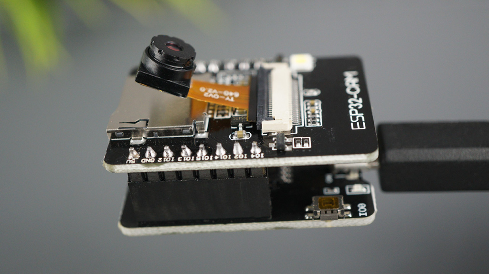
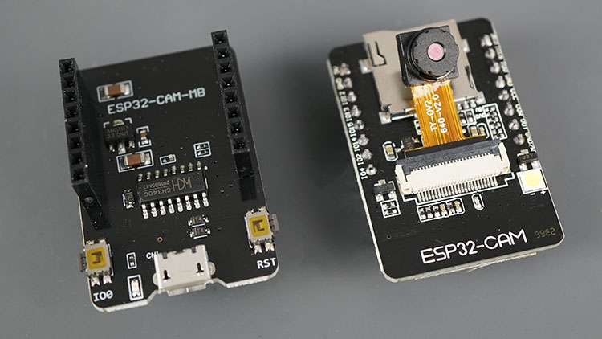
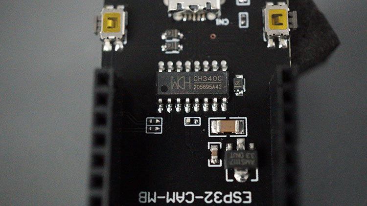
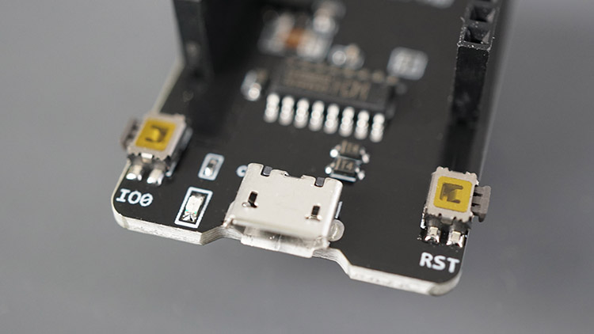
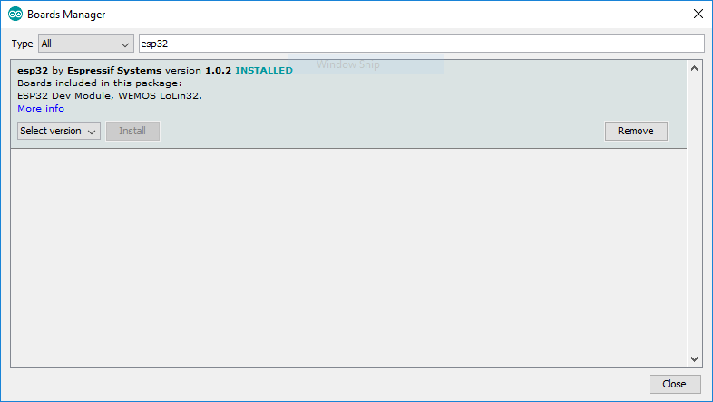
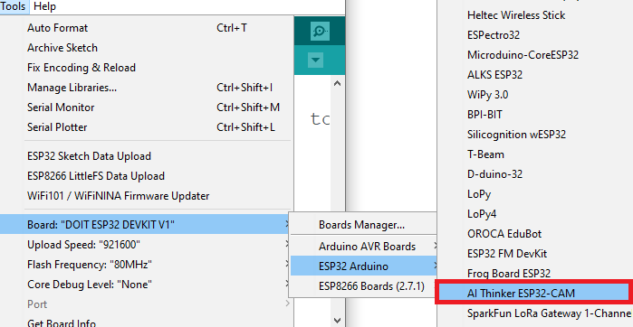

## [Изучение проблем с ESP32-CAM](#)

### [Поиск "как заменить загрузчик в esp32-cam"](https://yandex.ru/search/?text=%D0%BA%D0%B0%D0%BA+%D0%B7%D0%B0%D0%BC%D0%B5%D0%BD%D0%B8%D1%82%D1%8C+%D0%B7%D0%B0%D0%B3%D1%80%D1%83%D0%B7%D1%87%D0%B8%D0%BA+%D0%B2+esp32-cam&clid=2261451&banerid=6301000000%3ASW-694005a33c95&win=513&lr=18)

### [Esp32 Cam Factory Reset Recipes - Рецепты сброса настроек камеры Esp32 Cam](https://besteasycooking.com/esp32-cam-factory-reset/)

### Загрузка кода в ESP32-CAM AI-Thinker с помощью USB-программатора ESP32-COM-MB (самый простой способ)

#### [Upload Code to ESP32-CAM AI-Thinker using ESP32-CAM-MB USB Programmer (easiest way)](https://randomnerdtutorials.com/upload-code-esp32-cam-mb-usb/)

Этот программатор micro USB работает как экран, который вы прикрепляете к плате ESP32-CAM. Программатор поставляется с разъемом USB, который вы подключаете непосредственно к своему компьютеру.





Модуль [ESP32-CAM AI-Thinker](https://makeradvisor.com/esp32-cam-ov2640-camera/) представляет собой плату разработки ESP32 с камерой OV2640, поддержкой карт microSD, встроенной вспышкой и несколькими графическими процессорами для подключения периферийных устройств. И это стоит всего несколько долларов.

Однако одной из самых больших проблем при работе с модулем ESP32-CAM Ai-Thinker является загрузка кода на плату. Плата AI-Thinker не имеет встроенного USB-программатора. В предыдущих руководствах мы рекомендовали использовать программатор FTDI для подключения к плате через последовательные контакты.

Кроме того, вам также необходимо выполнить еще два или три шага до успешной загрузки кода. Но теперь вы можете просто использовать USB-программатор ESP32-CAM-MB и нажать кнопку Загрузки, чтобы успешно запрограммировать свою плату. Это так просто.

Программатор поставляется с чипом CH340C USB to serial.



Кроме того, экран также оснащен кнопками сброса и загрузки (IO0). Это может быть полезно для простого сброса ESP32-CAM или перевода его в режим перепрошивки.



#### Программирование ESP32-CAM с помощью MB Programmer (Arduino IDE)

1. [Установка платы ESP32 в Arduino IDE](https://randomnerdtutorials.com/installing-the-esp32-board-in-arduino-ide-windows-instructions/)

Какую версию Arduino IDE мы рекомендуем? На данный момент существуют некоторые плагины для ESP32 (например, плагин SPIFFS Filesystem Uploader), которые еще не поддерживаются в Arduino 2. Итак, если вы собираетесь использовать плагин SPIFFS в будущем, мы рекомендуем установить устаревшую версию 1.8.X. 

Чтобы установить плату ESP32 в Arduino IDE, в вашей Arduino IDE перейдите в ***Файл> Настройки***. Введите в поле “Дополнительные URL-адреса менеджера плат” следующую ссылку:

```
https://raw.githubusercontent.com/espressif/arduino-esp32/gh-pages/package_esp32_index.json
```
2024-06-16
```
Удалил из настроек ссылку:
https://dl.espressif.com/dl/package_esp32_index.json

Заменил "esp32 от Espressif Systems" версии 1.0.4 на более старую 1.0.2
```
При компиляции ошибка: 
***выбранный последовательный порт Failed to execute script esptool
 не существует или плата не подключена к нему***

```
Скетч использует 239604 байт (7%) памяти устройства. Всего доступно 3145728 байт.
Глобальные переменные используют 13396 байт (4%) динамической памяти, оставляя 314284 байт для локальных переменных. Максимум: 327680 байт.
Traceback (most recent call last):
esptool.py v2.6
  File "esptool.py", line 2959, in <module>
Serial port COM7
  File "esptool.py", line 2952, in _main
  File "esptool.py", line 2652, in main
  File "esptool.py", line 234, in __init__
  File "site-packages\serial\serialutil.py", line 372, in write_timeout
  File "site-packages\serial\serialwin32.py", line 222, in _reconfigure_port
serial.serialutil.SerialException: Cannot configure port, something went wrong. Original message: WindowsError(31, '\xcf\xf0\xe8\xf1\xee\xe5\xe4\xe8\xed\xe5\xed\xed\xee\xe5 \xea \xf1\xe8\xf1\xf2\xe5\xec\xe5 \xf3\xf1\xf2\xf0\xee\xe9\xf1\xf2\xe2\xee \xed\xe5 \xf0\xe0\xe1\xee\xf2\xe0\xe5\xf2.')
Failed to execute script esptool
выбранный последовательный порт Failed to execute script esptool
 не существует или плата не подключена к нему

```

Действия в диспетчере !!! команд:

```
Microsoft Windows [Version 10.0.22631.3737]
(c) Корпорация Майкрософт (Microsoft Corporation). Все права защищены.

C:\ittve-ESP32-CAM\99-Фото ловушка на ESP32 CAM\2024-05-29-esp32-cam-podklyuchenie-i-proshivka\BlinkOnCam32>python --versions
unknown option --versions
usage: python [option] ... [-c cmd | -m mod | file | -] [arg] ...
Try `python -h' for more information.

C:\ittve-ESP32-CAM\99-Фото ловушка на ESP32 CAM\2024-05-29-esp32-cam-podklyuchenie-i-proshivka\BlinkOnCam32>python --version
Python 3.10.6

C:\ittve-ESP32-CAM\99-Фото ловушка на ESP32 CAM\2024-05-29-esp32-cam-podklyuchenie-i-proshivka\BlinkOnCam32>pip --version
pip 22.2.1 from C:\Users\Евгеньевич\AppData\Local\Programs\Python\Python310\lib\site-packages\pip (python 3.10)

C:\ittve-ESP32-CAM\99-Фото ловушка на ESP32 CAM\2024-05-29-esp32-cam-podklyuchenie-i-proshivka\BlinkOnCam32>pip install esptool

C:\ittve-ESP32-CAM\99-Фото ловушка на ESP32 CAM\2024-05-29-esp32-cam-podklyuchenie-i-proshivka\BlinkOnCam32>pip install esptool
Collecting esptool
  Downloading esptool-4.7.0.tar.gz (285 kB)
     ━━━━━━━━━━━━━━━━━━━━━━━━━━━━━━━━━━━━━━━━ 285.5/285.5 kB 452.0 kB/s eta 0:00:00
  Preparing metadata (setup.py) ... done
Collecting bitstring>=3.1.6
  Downloading bitstring-4.2.3-py3-none-any.whl (71 kB)
     ━━━━━━━━━━━━━━━━━━━━━━━━━━━━━━━━━━━━━━━━ 71.7/71.7 kB 231.8 kB/s eta 0:00:00
Collecting cryptography>=2.1.4
  Downloading cryptography-42.0.8-cp39-abi3-win_amd64.whl (2.9 MB)
     ━━━━━━━━━━━━━━━━━━━━━━━━━━━━━━━━━━━━━━━━ 2.9/2.9 MB 591.7 kB/s eta 0:00:00
Collecting ecdsa>=0.16.0
  Downloading ecdsa-0.19.0-py2.py3-none-any.whl (149 kB)
     ━━━━━━━━━━━━━━━━━━━━━━━━━━━━━━━━━━━━━━━━ 149.3/149.3 kB 387.3 kB/s eta 0:00:00
Collecting pyserial>=3.0
  Downloading pyserial-3.5-py2.py3-none-any.whl (90 kB)
     ━━━━━━━━━━━━━━━━━━━━━━━━━━━━━━━━━━━━━━━━ 90.6/90.6 kB 730.4 kB/s eta 0:00:00
Collecting reedsolo<1.8,>=1.5.3
  Downloading reedsolo-1.7.0-py3-none-any.whl (32 kB)
Collecting PyYAML>=5.1
  Downloading PyYAML-6.0.1-cp310-cp310-win_amd64.whl (145 kB)
     ━━━━━━━━━━━━━━━━━━━━━━━━━━━━━━━━━━━━━━━━ 145.3/145.3 kB 722.4 kB/s eta 0:00:00
Collecting intelhex
  Downloading intelhex-2.3.0-py2.py3-none-any.whl (50 kB)
     ━━━━━━━━━━━━━━━━━━━━━━━━━━━━━━━━━━━━━━━━ 50.9/50.9 kB 1.3 MB/s eta 0:00:00
Collecting bitarray<3.0.0,>=2.9.0
  Downloading bitarray-2.9.2-cp310-cp310-win_amd64.whl (126 kB)
     ━━━━━━━━━━━━━━━━━━━━━━━━━━━━━━━━━━━━━━━━ 126.0/126.0 kB 926.3 kB/s eta 0:00:00
Collecting cffi>=1.12
  Downloading cffi-1.16.0-cp310-cp310-win_amd64.whl (181 kB)
     ━━━━━━━━━━━━━━━━━━━━━━━━━━━━━━━━━━━━━━━━ 181.6/181.6 kB 332.1 kB/s eta 0:00:00
Collecting six>=1.9.0
  Downloading six-1.16.0-py2.py3-none-any.whl (11 kB)
Collecting pycparser
  Downloading pycparser-2.22-py3-none-any.whl (117 kB)
     ━━━━━━━━━━━━━━━━━━━━━━━━━━━━━━━━━━━━━━━━ 117.6/117.6 kB 327.2 kB/s eta 0:00:00
Using legacy 'setup.py install' for esptool, since package 'wheel' is not installed.
Installing collected packages: reedsolo, pyserial, intelhex, bitarray, six, PyYAML, pycparser, bitstring, ecdsa, cffi, cryptography, esptool
  Running setup.py install for esptool ... done
Successfully installed PyYAML-6.0.1 bitarray-2.9.2 bitstring-4.2.3 cffi-1.16.0 cryptography-42.0.8 ecdsa-0.19.0 esptool-4.7.0 intelhex-2.3.0 pycparser-2.22 pyserial-3.5 reedsolo-1.7.0 six-1.16.0

[notice] A new release of pip available: 22.2.1 -> 24.0
[notice] To update, run: python.exe -m pip install --upgrade pip

C:\ittve-ESP32-CAM\99-Фото ловушка на ESP32 CAM\2024-05-29-esp32-cam-podklyuchenie-i-proshivka\BlinkOnCam32>

C:\ittve-ESP32-CAM\99-Фото ловушка на ESP32 CAM\2024-05-29-esp32-cam-podklyuchenie-i-proshivka\BlinkOnCam32>esptool
"esptool" не является внутренней или внешней
командой, исполняемой программой или пакетным файлом.


```


Откройте диспетчер плат. Перейдите в ***Инструменты> Плата > Диспетчер плат ...***. Ведите для поиска ***esp32*** и установите “***esp32 от Espressif Systems***“ (здесь, в статье версия 1.0.2).



. . .

2. Затем подсоедините MB-программатор к ESP32-CAM и подключите плату к компьютеру с помощью USB-кабеля. В вашей Arduino-IDE выполните следующие действия: перейдите в ***Инструменты > Плата*** и выберите ***AI-Thinker ESP32-CAM***. У вас должно быть установлено дополнение ESP32. В противном случае эта плата не будет отображаться в меню плат.



> Примечание: если плата не отображается, это означает, что на вашем компьютере, вероятно, не установлены драйверы CH340C. Зайдите в Google и найдите “Драйверы CH340C”, затем укажите вашу операционную систему и установите драйверы.
> 
В демонстрационных целях вы можете скопировать следующий blink эскиз:

```
/*********
  Rui Santos
  Complete instructions at https://RandomNerdTutorials.com/esp32-cam-projects-ebook/
  
  Permission is hereby granted, free of charge, to any person obtaining a copy of this software and associated documentation files.
  The above copyright notice and this permission notice shall be included in all copies or substantial portions of the Software.
*********/

// ledPin refers to ESP32-CAM GPIO 4 (flashlight)
const int ledPin = 4;

void setup() {
  // initialize digital pin ledPin as an output
  pinMode(ledPin, OUTPUT);
}

void loop() {
  digitalWrite(ledPin, HIGH);
  delay(2000);
  digitalWrite(ledPin, LOW);
  delay(2000);
}
```

Просмотр необработанного кода

На этом эскизе просто мигает светодиод встроенной вспышки.

4) Затем нажмите кнопку Загрузить в вашей Arduino IDE.

Запрограммируйте ESP32-CAM с Arduino IDE
И все!

Вы должны получить сообщение о том, что код был успешно загружен, и на вашей плате должна мигать светодиодная вспышка.
3.


