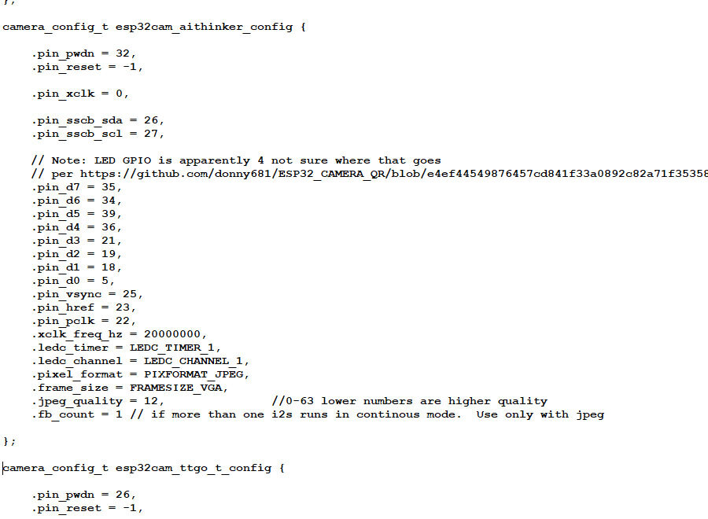

## [Потоковая передача видео через браузер и RTSP](https://dzen.ru/a/ZVSZf0qQD2rlCNrK)

Скачиваем библиотеку для RTSP с [github https://github.com/geeksville/Micro-RTSP](https://github.com/geeksville/Micro-RTSP).

***Micro-RTSP*** - это небольшая библиотека, которую можно использовать для обслуживания потоков RTSP из микроконтроллеров с ограниченными ресурсами. Это позволяет вам тривиально создать камеру RTSP-видеопотока с открытым исходным кодом.

### 2024-06-03 Что делал:

1. Скетч -> Подключить библиотеку -> Добавить .Zip библиотеку… - подключил из каталога архив ***MicroRTSP.zip***.

2. Открыл пример ***ESP32-devcam.ino*** из папки examples библиотеки.

3. Правил код примера следующим образом: 

- поменял инициализацию на текущую плату, то есть нашел строчку ***cam.init(esp32cam_config);*** и заменил на ***cam.init(esp32cam_aithinker_config); ***
- отключил (закомментировал) внешний OLED экран. На нашей плате его нет. 
```
// #define ENABLE_OLED
```
- выбрал куда транслировать изображение:
```
#define ENABLE_WEBSERVER      // через браузер
// #define ENABLE_RTSPSERVER  //через RTSP
```
- настроил подключение к WiFi точке - нашел файл ***wifikeys.h*** и изменил его:

```
const char *ssid     = "YOURNETHERE";      // здесь название WiFi сети
const char *password = "YOURPASSWORDHERE"; // здесь пароль
```
- настроил качество изображения в файле ***OV2640.cpp***  (он находится в директории Arduino IDE в папке \libraries\Micro-RTSP\src)

Нашел структуру

```
camera_config_t esp32cam_aithinker_config {}
```

Установил параметр:
```
.frame_size = FRAMESIZE_VGA  // Это разрешение 640x480
```

Бывают еще:

```
FRAMESIZE_SVGA   // 800x600
FRAMESIZE_XGA    // 1024x768
FRAMESIZE_HD     // 1280x720
FRAMESIZE_SXGA   // 1280x1024
FRAMESIZE_UXGA   // 1600x1200
```

Так как разрешение не очень большое то поменял   ***.fb_count = 1***

Сохранил. Получилось примерно так:




### Тестирование

Прошиваем модуль. После прошивки нажимаем кнопку Reset на коммуникационной плате. Открываем Монитор порта. Где находим ip адрес нашей камеры.

Открываем веб браузер. Переходим по ссылке на ip-адрес, чтобы посмотреть видео
```
http://<ip>/
```

или текущий кадр

```
http://<ip>/jpg
```


### Проблемы

1. Поддерживается одна сессия. Т.е открыть видео можно только с одного приложения.

2. Скорость передачи потока через RTSP очень маленькая. Через браузер все отлично. Пока не разобрался в чем проблема. Может кто подскажет в комментариях.

3. Для стабильной работы должна быть внешняя антенна на модуле.


