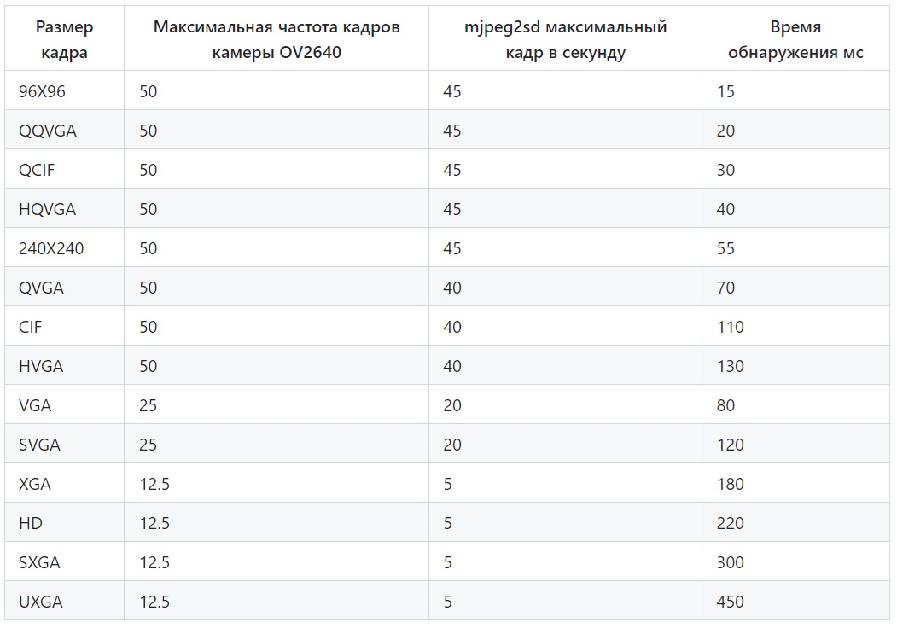
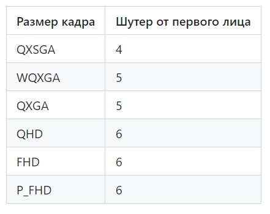

## [Как своими руками сделать WiFi камеру слежения](https://habr.com/ru/company/skillfactory/blog/645877/)

Чтобы запрограммировать модуль камеры, соединяем его с конвертером FTDI, работающим с USB и последовательным портом. Здесь подключаем пин GPIO 0 к GND, что позволяет программировать ESP. Нажимаем кнопку сброса на задней части платы модуля камеры, чтобы включить режим флеш-памяти перед загрузкой.

Прежде чем переходить к коду, добавим во вкладку Preferences («Предпочтения») в Arduino IDE [ссылку ESP32.json](https://raw.githubusercontent.com/espressif/arduino-esp32/gh-pages/package_esp32_dev_index.json), дающую доступ к примерам кода и библиотекам.

> Ссылка на ESP32.json:
> 
> https://raw.githubusercontent.com/espressif/arduino-esp32/gh-pages/package_esp32_dev_index.json
> 

Открываем загруженный код камеры слежения ESP32-CAM_MJPEG2SD и раскомментируем строку CAMERA_MODEL_AI_THINKER, если у вас эта плата.


### [ESP32-CAM_MJPEG2SD](https://github.com/s60sc/ESP32-CAM_MJPEG2SD) 

Приложение для ESP32 / ESP32S3 с камерой OV2640 / OV5640 для записи файлов JPEG на SD-карту в виде файлов AVI и воспроизведения в браузере в виде потока MJPEG. Формат AVI позволяет воспроизводить записи с правильной частотой кадров на медиаплеерах. Если установлен микрофон, то в файле AVI также создается и сохраняется файл WAV.

Приложение поддерживает:
```
Обнаружение движения камерой или PIR / радарным датчиком.
Замедленную запись.
Запись звука с микрофонов I2S или PDM
Сервоприводы поворота камеры и управление лампой
Запись телеметрии во время записи с камеры.
Дистанционное управление автомобилем с установленной камерой.
Оповещение с помощью Telegram или электронной почты.
Одновременную потоковую передачу в веб-браузер и удаленный видеорегистратор.
Передачу записи с помощью FTP, HTTPS, WebDAV или загрузку из браузера.
Управление MQTT.
Поддержку периферийных устройств: сервоприводов SG90, H-моста MX1508, джойстика HW-504, BMP280, MPU9250, светодиода WS2812.
Интерфейс для поддержки машинного обучения.
Функцию Camera Hub для доступа к другим устройствам ESP32-CAM_MJPEG2SD.
```

> ESP32 не может поддерживать все функции, поскольку ему не хватит места в куче. Для улучшения функциональности и производительности используйте одну из новых плат камеры ESP32S3, например Freenove ESP32S3 Cam, ESP32S3 XIAO Sense.
> 

Приложение позволяет осуществлять видеосъемку обнаружения движения или таймлапс-запись. Примеры включают камеры видеонаблюдения, наблюдение за дикой природой, мониторинг полета ракеты, управление транспортным средством FPV. Это доступно для обучения - [Make an ESP32 WiFi CCTV Camera (ESP32-CAM) DIY Wireless Security Cam](https://www.instructables.com/How-to-Make-a-WiFi-Security-Camera-ESP32-CAM-DIY-R/). Автор Max Imagination  показал, как создать WiFi-камеру безопасности, используя более раннюю версию этого кода, а также более позднее видео о том, как установить и использовать приложение.

Сохранение набора файлов JPEG в виде единого файла выполняется быстрее, чем в виде отдельных файлов, и им проще управлять, особенно для изображений небольшого размера. Фактическая скорость зависит от качества и размера SD-карты, а также сложности и качества изображений. Безымянный SDHC объемом 4 ГБ, помеченный как Class 6, работал в 3 раза медленнее, чем подлинный Sandisk SDHC объемом 4 ГБ Class 2.

***Проектирование***

Изначально приложение было основано на примере Arduino CameraWebServer, но теперь оно разработано независимо, включая материалы, внесенные @gemi254.

Модуль ESP32 Cam имеет 4 МБ PSRAM (8 МБ на ESP32S3), который используется для буферизации кадров камеры и построения файла AVI, чтобы минимизировать количество операций записи в SD-файл и оптимизировать операции записи, приведя их в соответствие с размером сектора SD-карты. 

Для воспроизведения AVI считывается с SD в буфер размером в несколько секторов и отправляется в браузер в виде отдельных кадров с синхронизацией. SD-карта используется в режиме MMC 1 line, поскольку это так же быстро, как режим MMC 4 line, и освобождает контакт 4 (подключенный к встроенной лампе) и контакт 12, который можно использовать, например, для PIR.

AVI-файлам присваиваются имена в формате даты и времени ГГГГ_МДД_ХМ ММСС с добавлением размера кадра, частоты кадров в секунду, длительности в секундах, например, 20200130_201015_VGA_15_60.avi, и хранятся в папке "За день" ГГГГ_МДД. Если включен звук, имя файла заканчивается на _S. Если доступна телеметрия, имя файла заканчивается на _M.

Время ESP32 устанавливается с NTP-сервера или подключенного клиента браузера.

***Установка***

Загрузите файлы github в папку Arduino IDE sketch, удалив -master из названия папки приложения. Выберите необходимую плату ESP-CAM с помощью CAMERA_MODEL_ in appGlobals.h, если не используется одно из значений по умолчанию:

Плата камеры ESP32 - CAMERA_MODEL_AI_THINKER
Плата камеры Freenove ESP32S3 - CAMERA_MODEL_ESP32S3_EYE

Выберите плату модуля разработки ESP32 или ESP32S3 и выполните компиляцию с включенной PSRAM и следующей схемой разделения:

ESP32 - Minimal SPIFFS (...)
ESP32S3 - 8M with spiffs (...)

ПРИМЕЧАНИЕ: Если вы получаете ошибки компиляции, вам необходимо обновить вашу arduino-esp32 библиотеку core в IDE до последней версии v2.0.14 (но еще не v3.0) с помощью Boards Manager

ПРИМЕЧАНИЕ: Если вы получаете сообщение об ошибке: Startup Failure: Check SD card inserted, или Camera init error 0x105 обычно это проблема с выбором платы камеры

ПРИМЕЧАНИЕ: Если вы получаете сообщение об ошибке: Camera init error 0xffffffff, это связано с тем, что некоторые платы cam продаются только с 2 МБ PSRAM, чего недостаточно для этого приложения. Предупреждение добавлено в версии 9.6.

При первой установке приложение запустится в режиме точки доступа Wi-Fi - подключитесь к SSID: ESP-CAM_MJPEG_ ..., чтобы разрешить ввод сведений о маршрутизаторе и пароле через веб-страницу на ***192.168.4.1***. Файл данных конфигурации (за исключением паролей) создается автоматически, а веб-страницы приложения автоматически загружаются с GitHub в папку SD-карты /data при наличии подключения к Интернету.

Последующие обновления приложения или файлов в папке /data можно выполнить с помощью вкладки "Загрузка OTA". Папку /data также можно перезагрузить с GitHub с помощью кнопки Reload /data на вкладке Edit Config или с помощью клиента WebDAV.

Альтернативный процесс установки от @ldijkman описан здесь.

Функции браузера протестированы только в Chrome.

***Основная функция***

Запись генерируется либо самой камерой, обнаруживающей движение, либо удерживанием заданного значения на высоком уровне (удерживается на низком уровне за счет внутреннего опускания при отпускании), например, с помощью активного датчика дальнего движения, такого как PIR или микроволновый радар RCWL-0516. Кроме того, запись можно запросить вручную, используя кнопку "***Начать запись***" на веб-странице.

Чтобы воспроизвести запись, выберите файл с помощью боковой кнопки "***Воспроизведение и передача файлов***", чтобы выбрать папку дня, а затем необходимый файл AVI. После выбора файла AVI нажмите кнопку "***Начать воспроизведение***", чтобы воспроизвести запись. Кнопка "***Начать трансляцию***" показывает трансляцию только видео в реальном времени с камеры.

Затем записи можно загрузить на сервер FTP или HTTPS или в браузер для воспроизведения в мультимедийном приложении, например VLC.

Также доступна функция замедленной съемки, которая может выполняться параллельно с захватом движения. Файлы ***Time lapse*** имеют формат ***20200130_201015_VGA_15_60_T.avi***.

***Другие функции и конфигурация***

Работу приложения можно динамически изменять с помощью главной веб-страницы, которая в основном должна быть понятна сама по себе.

Подключения:

Параметры FTP / HTTPS, Wifi, SMTP и часового пояса можно задать в кнопке на боковой панели "Настройки доступа". Для часового пояса используйте раскрывающийся список или вставьте значения из второго столбца. Чтобы сохранить изменения, нажмите кнопку "Сохранить" службы имен mdns для использования ***http://[Host Name]*** вместо ip-адреса.

Чтобы изменить параметры записи:

Resolution размер каждого кадра в пикселях, Frame Rate требуется ли частота кадров в секунду, Quality это уровень сжатия JPEG, который влияет на размер изображения.

Управление хранилищем SD:

Папки внутри папок можно удалить, выбрав необходимый файл или папку из выпадающего списка, затем нажав кнопку Удалить и подтвердив.

Папки или файлы внутри папок можно загрузить на удаленный сервер через FTP / HTTPS, выбрав необходимый файл или папку из выпадающего списка и нажав кнопку Загрузить файл. Может быть загружен в формате AVI.

Загрузите выбранный AVI-файл с SD-карты в браузер с помощью кнопки Загрузить.

Удалите или загрузите и удалите самую старую папку, когда на карте памяти заканчивается свободное место.

Просмотр журнала приложения через веб-страницу, отображаемую на вкладке "Показать журнал":

Выберите тип журнала для отображения:

RTC RAM: циклический журнал размером 7 КБ, сохраняемый в RTC RAM (по умолчанию);

Websocket: журнал динамически выводится через websocket;

SD-карта: журнал неограниченного размера, сохраняемый на SD-карту.

Используйте ползунок, чтобы включить запись в SD, но это может снизить скорость записи.

Используйте кнопки, чтобы обновить или очистить выбранный журнал.

***Веб-страница конфигурации***

Более подробная информация о конфигурации доступна на вкладке Редактировать конфигурацию, на которой отображаются дополнительные кнопки:

Wi-Fi: дополнительные настройки Wi-Fi и веб-сервера; движение: смотрите раздел обнаружение движения камерой.

Периферийные устройства, например:

выберите, следует ли использовать PIR-или радарный датчик (который также можно использовать параллельно с обнаружением движения камеры).

Автоматическое включение лампы для обнаружения PIR в ночное время.

Управляйте поворотной подставкой для камеры.

Подключите микрофон PDM или I2S.

Подключите датчик температуры DS18B20.

Контролируйте напряжение питания аккумулятора на выводе АЦП.

Пробуждение на LDR после глубокого сна ночью.

Обратите внимание, что в модуле камеры ESP32 недостаточно свободных контактов, чтобы можно было использовать все внешние датчики. Контакты, которые можно использовать (с некоторыми ограничениями), следующие: 3, 4, 12, 13, 33.

Pin 3: обозначен U0R. Используется только как входной PIN-код, а также используется для мигания.

Вывод 4: также используется для встроенной лампы. Лампу можно отключить, сняв с нее токоограничивающий резистор.

Pin 12: используется только в качестве выходного PINа.

Вывод 13: слабо поднят.

Вывод 33: используется встроенным красным светодиодом. Не сломан, но можно перепрофилировать бесполезный в остальном вывод VCC, удалив соседний резистор с маркировкой 3V3 и токоограничивающий резистор с красным светодиодом, затем проложив провод между выводом VCC и припоем для красного светодиодного резистора.

Также можно использовать репозиторий ESP32-IO_Extender.

Плата ESP32S3 Freenove может поддерживать все вышеупомянутые периферийные устройства с запасными выводами.

Плата ESP32S3 XIAO Sense имеет меньше свободных контактов, но больше, чем ESP32.

Встроенные светодиоды: 
```
ESP32:       Lamp 4, signal 33.
ESP32S3:
   Freenove: Lamp 48, signal 2.
   XIAO:     Lamp n/a, signal 21.
```

Когда функция включена или отключена, для сохранения изменений следует использовать кнопку Сохранить, а ESP следует перезагрузить с помощью кнопки Перезагрузить ESP.

***Обнаружение движения камерой***

Запись в формате AVI может быть сгенерирована самой камерой, обнаруживающей движение с помощью файла motionDetect.cpp . Изображения в формате JPEG любого размера извлекаются с камеры, и 1 из N изображений отбирается на лету для определения движения путем декодирования их в очень мелкие растровые изображения в оттенках серого, которые сравниваются с предыдущим образцом.

Небольшие размеры обеспечивают сглаживание для удаления артефактов и сокращения времени обработки.

Для обнаружения движения используется высокая частота дискретизации 1 к 2. При обнаружении движения частота проверки остановки движения снижается до 1 к 10, так что файлы JPEG могут быть захвачены с небольшими затратами. 

В таблице "Время обнаружения, мс" показано типичное время в миллисекундах для декодирования и анализа кадра, полученного с камеры OV2640.



Обнаружение движения камерой включено по умолчанию, чтобы отключить, нажмите выкл. Включить обнаружение движения в разделе Обнаружение движения и запись кнопка на боковой панели.

Дополнительные опции предоставлены на странице каталога камеры, где:

Motion Sensitivity устанавливает порог обнаружения движения, чем выше, тем чувствительнее;

Show Motion если включено и нажата кнопка Начать трансляцию, отображаются изображения того, как определяется движение, для целей калибровки. Изображения в оттенках серого отображаются с красными пикселями, показывающими движение.

Min Frames это минимальное количество кадров, которые необходимо захватить, иначе файл будет удален.

***Запись звука***

Микрофон I2S, например INMP441, поддерживается как ESP32, так и ESP32S3. Микрофон PDM, например MP34DT01, поддерживается только в ESP32S3. Запись звука отлично работает на ESP32S3, но нежизнеспособна на ESP32, поскольку это значительно замедляет частоту кадров.

Звук отформатирован как 16-битный одноканальный PCM с частотой дискретизации 16 кГц. Для микрофона I2S требуется 3 свободных контакта, для микрофона PDM - 2 свободных контакта (для вывода I2S SCK должно быть установлено значение -1). Значения контактов (предопределены для XIAO Sense) и Использовать микрофон выбор устанавливается в разделе Периферийные устройства кнопка на веб-странице конфигурации.

На веб-странице есть ползунок для настройки Усиления микрофона. Чем выше значение, тем выше усиление. Выбор 0 отключает микрофон.

***OV5640***

Распиновка OV5640 совместима с платами, разработанными для OV2640, но напряжение питания слишком велико для внутреннего регулятора 1,5 В, поэтому камера перегревается, если не установлен радиатор.

Для целей записи OV5640 следует использовать только с платой ESP32S3. Размеры кадров выше FHD размер кадра следует использовать только для неподвижных изображений из-за ограничений памяти.

Записываемая частота кадров для OV5460 с максимальными размерами кадров на ESP32S3 составляет:




