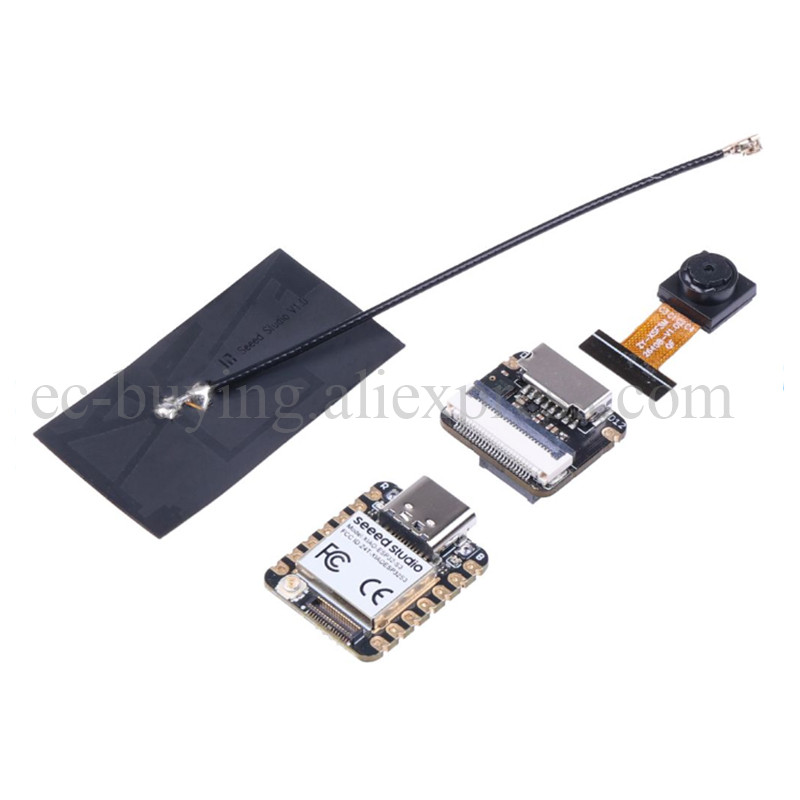
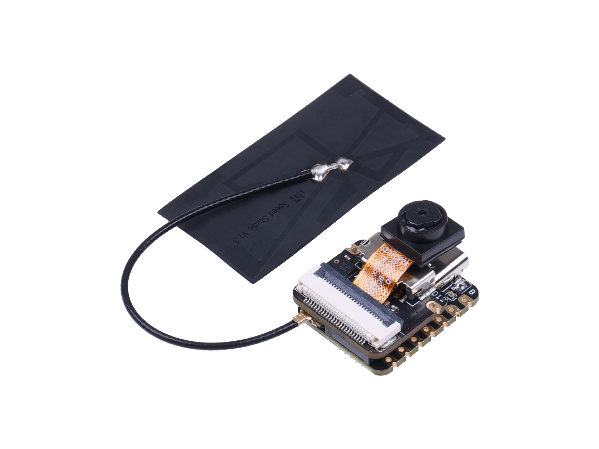
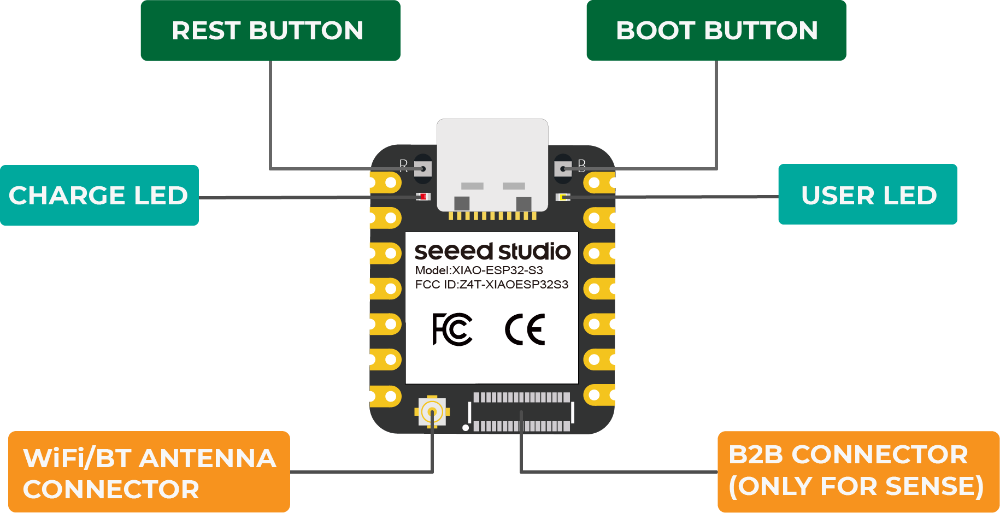
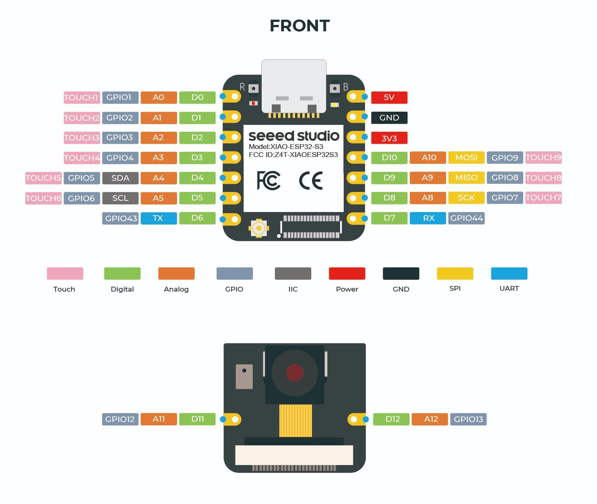
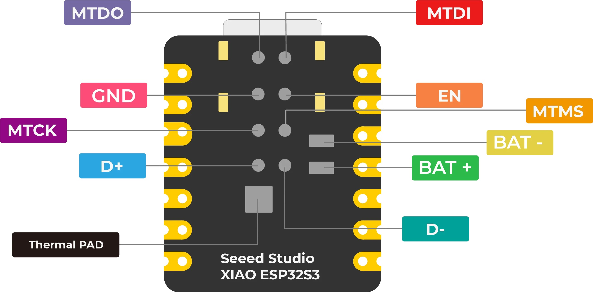

## [Seeeduino ESP32-S3](#)

### [Seeeduino ESP32-S3 Seeed Studio XIAO ESP32-S3 Sense 2,4G WiFi BLE Mesh 5,0 8 Мб OV2640, модуль камеры, макетная плата](https://aliexpress.ru/item/4000011805115.html?spm=a2g2w.orderdetail.0.0.7e264aa63mtyJf&sku_id=12000034382426540)



### [Getting Started with Seeed Studiо XIAO ESP32S3 Sense](#getting-started-with-seeed-studio-xiao-esp32s3-sense)





***Особенности***
```
-Мощная плата MCU: содержит 32-битный двухъядерный чип процессора 
 Xtensa ESP32S3, работающий с частотой до 240 МГц, установлено несколько 
 портов разработки, для поддержки Arduino / MicroPython;
 
-Расширенная функциональность: съемный датчик камеры OV2640 для разрешения 1600*1200, совместимый с датчиком камеры OV5640, интегрирован дополнительный цифровой микрофон;

-Отличная память для большего количества возможностей: предложение 8 МБ PSRAM и 8 МБ FLASH, поддержка слота SD-карты для внешней 32 ГБ FAT-памяти;

-Выдающиеся характеристики RF: поддержка двойной беспроводной связи Wi-Fi 2,4 ГГц и BLE, поддержка удаленной связи 100 м + при подключении к антенне U.FL;

-Компактный дизайн размером с большой палец: 21x17,5 мм, использование классического форм-фактора XIAO, подходит для проектов с ограниченным пространством, таких как носимые устройства.
```

***Описание***

Seeed Studio XIAO ESP32S3 Sense построен на высокоинтегрированном процессоре Xtensa ESP32-S3R8 SoC, который поддерживает Wi-Fi 2,4 ГГц и Bluetooth-совместимый с низким энергопотреблением. Двойной режим BLE 5,0 для нескольких беспроводных приложений. Он имеет возможность управления зарядом литиевой батареи.

Как и усовершенствованная версия Seeed Studio XIAO ESP32S3, эта плата поставляется с подключаемым датчиком камеры OV2640 для отображения полного разрешения 1600*1200. База его даже совместима с OV5640 для поддержки разрешения до 2592*1944. Цифровой микрофон также переносится с платой для распознавания голоса и распознавания звука.

Благодаря мощному SoC и встроенным датчикам эта плата для разработки имеет 8 МБ PSRAM и 8 МБ FLASH на чипе, дополнительный слот для SD-карты для поддержки до 32 ГБ FAT-памяти. Они позволяют плате больше пространства для программирования и приносят еще больше возможностей во встроенные сценарии ML.

Являясь частью семейства Seeed Studio XIAO, плата заслуженно сохраняет классический форм-фактор размером с большой палец и элегантную производительность одностороннего монтажа компонентов.

Стартовый набор с бесплатным курсом для всех неофитов и энтузиастов электроники
Seeed Studio предоставила Grove Starter Kit вместе с бесплатными и подробными курсами для быстрого начала работы с Микроконтроллерами и электроникой, касающимися всех плат Seeed Studio XIAO, обещая вам отличный опыт обучения.

Не только программирование, но и знание электроники не требуется, вы будете приняты шаг за шагом, от понимания основных концепций к осуществлению простых проектов индивидуально, наконец, будучи в состоянии строить сложные, интересные, носимые проекты самостоятельно, Благодаря практичному прототипу электронного продукта из курса.







***Параметры***
```
Пункт         Seeed Studio XIAO ESP32S3     Seeed Studio XIAO ESP32S3 Sense
------------  -------------------------     -------------------------------

Процессор     ESP32-S3R8 - Xtensa LX7 двухъядерный, 32-разрядный процессор,
              который работает на частоте до 240 МГц

Беспроводной  Полная подсистема Wi-Fi 2,4 ГГц; BLE: Bluetooth-совместимый 5.0,
              Bluetooth-совместимый Mesh

Встроенные датчики          /            Датчик камеры oV2640 для 1600*1200
                                         Цифровой микрофон

Память      встроенная (на чипе) 8M PSRAM,     На чипе 8M PSRAM, Flash 8MB,
            Flash 8MB                          встроенный слот SD-карты, поддержка FAT 32 ГБ

Интерфейс   1xUART, 1xIIC, 1xllS, 1xSPl, 11xGPIO (PWM), 9xADC, пользовательский
            светодиод, зарядный светодиод, кнопка сброса, кнопка загрузки

Доп. интерфейс              /          разъем B2B (с 2 дополнительными GPIO)

Размеры     21 х 17,5 мм               21x17,5x15 мм (с платой расширения)

Мощность    Входное напряжение (Type-C): 5В, входное напряжение (BAT): 4,2В

Рабочее напряжение цепи (готово к работе):
            - Тип-C: 5В @ 19 мА        - Тип-C: 5В  @ 38,3 мА
            - BAT: 3,8В @ 22 мА        - BAT: 3,8В  @ 43,2 мА (с платой расширения)

Веб-приложение Webcam (Тип-C):         средняя потребляемая мощность: 5В/138мА
                                       момент фото: 5В/341мА
                                       
Батарея:                    /          средняя потребляемая мощность: 3,8В/154мА
                                       момент фото: 3,8 В/304 мА
                                       
Запись микрофона                       cредняя потребляемая мощность: 5В/46,5мА
и запись на SD-карту (Type-C):         пиковая потребляемая мощность: 5В/89,6мА        

Батарея:                    /          средняя потребляемая мощность: 3,8В/54,4мА
                                       пиковая потребляемая мощность: 3,8В/108 мА

Ток зарядки аккумулятора:   50 мА      100 мА

Модель потребления низкой мощности (мощность питания: 3,8 В):
   - спящий модем:          ~  25 мА   ~ 44 мА
   - Light-Sleep:           ~  2 мА    ~ 5 мА
   - глубокий сон:          ~ 14 мкА   ~ 3 мА

Энергопотребление с поддержкой Wi-Fi (активная модель):
                            ~ 100 мА   ~ 110 мА (с платой расширения)

BLE, включено энергопотребление (активная модель):
                            ~ 85 мА    ~ 102 мА (с платой расширения)

Рабочая температура:        40° C ~ 65° C
```

### [Getting Started with Seeed Studio XIAO ESP32S3 Sense](https://wiki.seeedstudio.com/xiao_esp32s3_getting_started/)

### [Mjrovai XIAO-ESP32S3-Sense](https://github.com/Mjrovai/XIAO-ESP32S3-Sense)

### [Seeeduino XIAO ESP32S3 Sense Board – A Tiny ESP32 Camera](https://dronebotworkshop.com/xiao-esp32s3-sense/)

### [Getting Started with Xiao ESP32 S3 Sense](https://www.hackster.io/pradeeplogu0/getting-started-with-xiao-esp32-s3-sense-ad12a0)

### [XIAO ESP32S3 Board Review- Pinout, Specs & Projects](https://www.etechnophiles.com/xiao-esp32s3-review-pinout/)

### [XIAO ESP32S3 Sense & Edge Impulse Keywords Spotting](https://wiki.seeedstudio.com/xiao_esp32s3_keyword_spotting/)


###### [Вверх](#seeeduino-esp32-s3)
