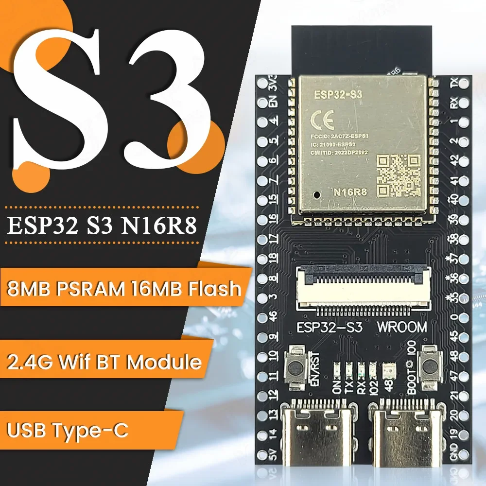
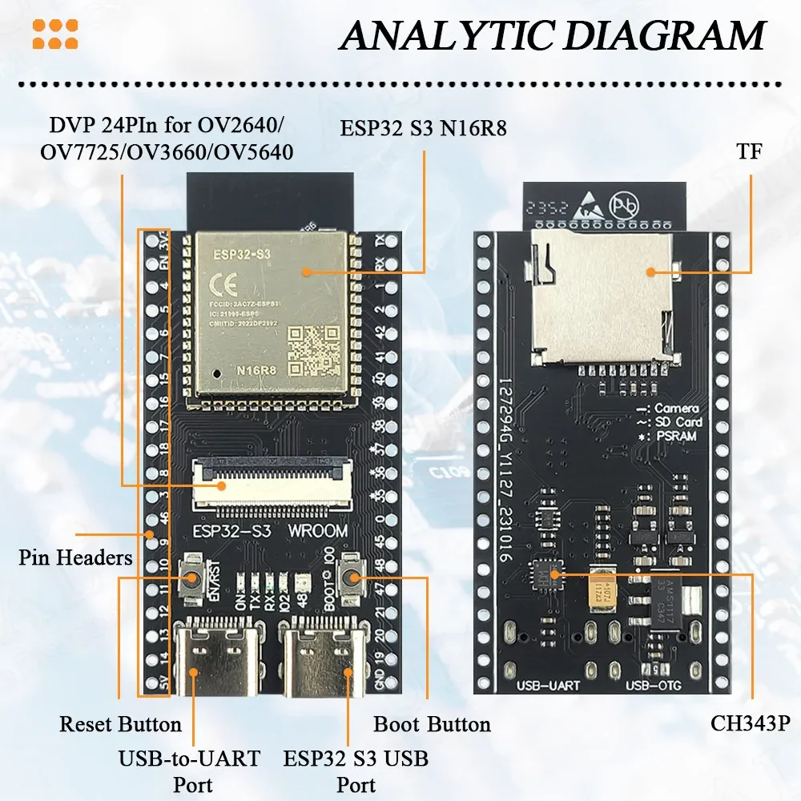
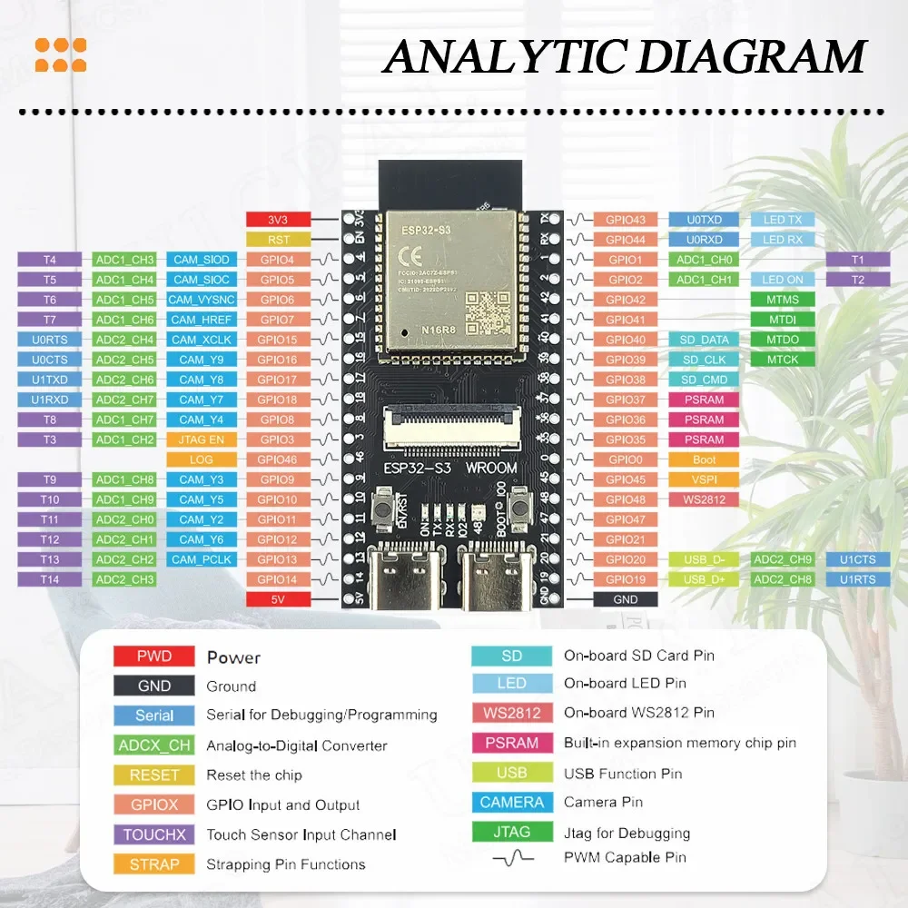
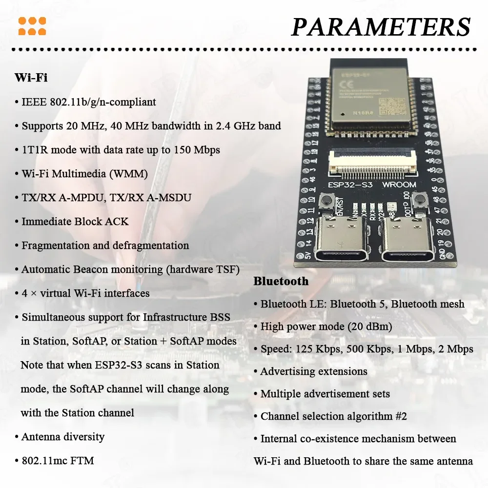

## [ESP32-S3 N16R8](#)

### [Макетная плата ESP32 S3 N16R8, модуль камеры 2,4G Wifi BT для OV2640 OV5640 8 Мб PSRAM 16 Мб, флэш-памяти, комнаты N16R8](https://aliexpress.ru/item/1005006698752647.html?spm=a2g2w.orderdetail.0.0.7d1b4aa6Flu5TQ&sku_id=12000038039164882&_ga=2.170858208.1370450607.1751301098-257156806.1703682747)

Рабочая температура
-20 to +70

###### [Вверх](#esp32---s3 n16r8)
