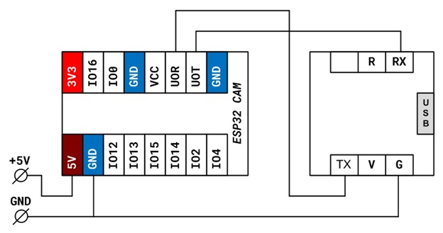
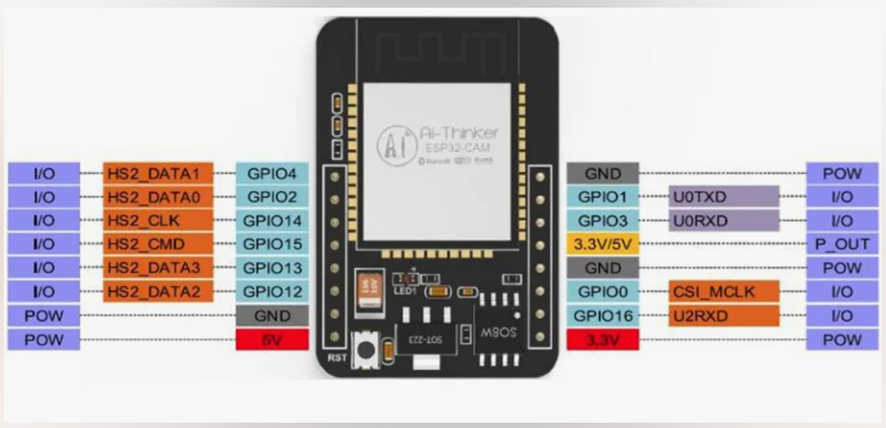
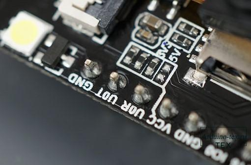

### [2024-05-29 ESP32-CAM - Подключение и прошивка](https://zen.yandex.ru/media/esp32/esp32-cam-podkliuchenie-i-proshivka-5fa1d5cf5dfc942ad78fda85)

ESP32-CAM - это плата с чипом ESP32-S и камерой OV2640. Также плата имеет на борту слот для карт microSD, которые могут быть полезны для сохранения изображений, снятых камерой.



> Важно! В момент инициализации платы и подключения к сети Wi-Fi плата потребляет большие токи. Во избежание глюков плату лучше сразу запитать от отдельного мощного стабилизированного источника питания с напряжением 5V (на разъеме USB может не хватить мощности) USB-UART преобразователь может питаться и от USB разъема.
> 
#### [Распиновка ESP32-CAM AI-Thinker. Назначение GPIO](https://arduino-tex.ru/news/34/raspinovka-esp32-cam-ai-thinker-naznachenie-gpio.html)



ESP32-CAM имеет три GND пина (окрашены серым цветом) и два контакта питания (окрашены в красный цвет): 3,3 В и 5 В.

> Вы можете подключить питание ESP32-CAM к 3,3 В или 5 В. Тем не менее, возникают ошибки в работе, при подключении питания ESP32-CAM к 3.3V, поэтому советую подключать ESP32-CAM к 5V pin питания.

Вывод питания имеет обозначение VCC (окрашен желтым прямоугольником). Вы не должны использовать этот вывод для питания ESP32-CAM. Это вывод предназначен для подключения внешних потребителей. Он может выводить 5 В или 3,3 В.

В нашем случае ESP32-CAM выдает 3,3 В независимо от того, питается он от 5 В или 3,3 В. Рядом с выводом VCC есть две контактные площадки. Одна обозначена как 3,3 В, а другая — как 5 В.



Если присмотреться, у вас должна быть перемычка на контактных площадках 3,3 В. Если вы хотите, чтобы на выводе VCC было выходное напряжение 5 В, вам необходимо распаять это соединение и запаять контактные площадки 5 В.

GPIO 1 и GPIO 3 — это последовательный интерфейс (контакты TX и RX). Эти контакты для загрузки кода и связи с платой.

GPIO 0 определяет, находится ли ESP32 в режиме прошивки или нет. Этот GPIO имеет внутреннее подключение к подтягивающему резистору 10 кОм.

Когда GPIO 0 подключен к GND, ESP32 переходит в режим прошивки, и вы можете загружать код на плату.

После загрузки кода, для того чтобы ESP32 работала «нормально», вам просто нужно отключить GPIO 0 от GND.

***Подключение карты MicroSD:*** следующие контакты используются для взаимодействия с картой памяти microSD, когда она установлена в соответствующий разъем на плате.

```
MicroSD card	       ESP32
------------------------------------------------
CLK                    GPIO 14
CMD	                   GPIO 15
DATA0	               GPIO 2
DATA1/flashlight	   GPIO 4
DATA2	               GPIO 12
DATA3	               GPIO 13
```

Если вы не используете карту microSD, вы можете использовать эти контакты как обычные входы / выходы. Все эти GPIO являются RTC и поддерживают ADC (то есть их можно использовать в качестве АЦП): GPIO ***2, 4, 12, 13, 14 и 15***.

> ***Функциональная возможность "RTC GPIO"***, при которой ножки GPIO маршрутизируются на блок RTC подсистемы пониженного потребления и аналоговых сигналов. Эти функции вывода могут использоваться:
> 
> - в режиме глубокого сна (Deep-sleep) выходы могут сохранять свое настроенное состояние;
> 
> - при работе сопроцессора сверхнизкого энергопотребления (Ultra Low Power, ULP);
> 
> - как контакт для аналоговых функций, таких как ADC, DAC и т. д. 
> 
Примечание (*): Если вы планируете использовать аппаратную функцию удержания для создания на выводах уровней по умолчанию при переходе в deep speep, то в качестве альтернативы рассмотрите внешние подтягивающие резисторы.

Фонарик (GPIO 4) - ESP32-CAM имеет очень яркий встроенный светодиод, который может работать как вспышка при съемке.

Этот GPIO также подключен к слоту для карты microSD, поэтому у вас могут возникнуть проблемы при попытке использовать оба устройства одновременно — фонарик загорится при использовании карты microSD.

Рядом с кнопкой RST есть встроенный красный светодиод. Этот светодиод внутренне подключен к GPIO 33. Вы можете использовать этот светодиод, чтобы указать, что что-то происходит. Например, если Wi-Fi подключен, светодиод горит красным или наоборот.

Этот светодиод работает с перевернутой логикой, поэтому вы отправляете LOW сигнал на включение и HIGH сигнал, чтобы выключить его.

***Подключения камеры***

Соединения между камерой и ESP32-CAM AI-Thinker показаны в следующей таблице.

```
OV2640 CAMERA	 ESP32	      Variable name in code
--------------------------------------------------------
D0	             GPIO 5	      Y2_GPIO_NUM
D1	             GPIO 18	  Y3_GPIO_NUM
D2	             GPIO 19	  Y4_GPIO_NUM
D3	             GPIO 21	  Y5_GPIO_NUM
D4	             GPIO 36	  Y6_GPIO_NUM
D5	             GPIO 39	  Y7_GPIO_NUM
D6	             GPIO 34      Y8_GPIO_NUM
D7	             GPIO 35	  Y9_GPIO_NUM
XCLK	         GPIO 0	      XCLK_GPIO_NUM
PCLK	         GPIO 22      PCLK_GPIO_NUM
VSYNC	         GPIO 25	  VSYNC_GPIO_NUM
HREF	         GPIO 23	  HREF_GPIO_NUM
SDA	             GPIO 26	  SIOD_GPIO_NUM
SCL	             GPIO 27	  SIOC_GPIO_NUM
POWER PIN	     GPIO 32      PWDN_GPIO_NUM
```
Определение контактов для ESP32-CAM AI-Thinker в среде Arduino IDE должно быть следующим:

```
#define PWDN_GPIO_NUM  32
#define RESET_GPIO_NUM -1
#define XCLK_GPIO_NUM  0
#define SIOD_GPIO_NUM  26
#define SIOC_GPIO_NUM  27
#define Y9_GPIO_NUM    35
#define Y8_GPIO_NUM    34
#define Y7_GPIO_NUM    39
#define Y6_GPIO_NUM    36
#define Y5_GPIO_NUM    21
#define Y4_GPIO_NUM    19
#define Y3_GPIO_NUM    18
#define Y2_GPIO_NUM    5
#define VSYNC_GPIO_NUM 25
#define HREF_GPIO_NUM  23
#define PCLK_GPIO_NUM  22

```

#### Заставляем ESP32-CAM мигать лампочками


```
```
